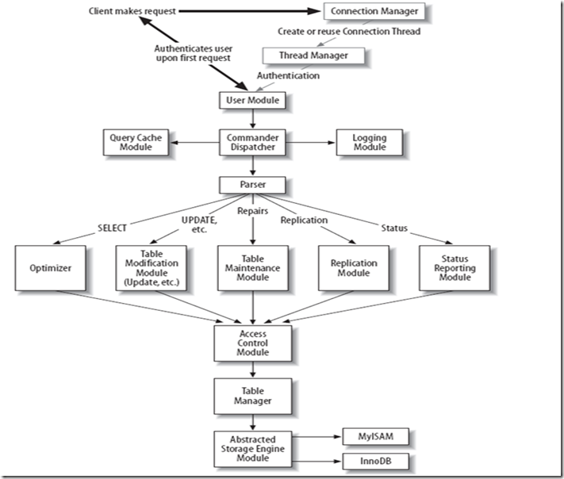

# Mysql源码学习——八度空间 - 心中无码 - 博客园

## [Mysql源码学习——八度空间](https://www.cnblogs.com/nocode/archive/2011/08/15/2139899.html)

2011-08-15 22:24  [心中无码](https://www.cnblogs.com/nocode/)  阅读(2366)  评论(4)  [编辑](https://i.cnblogs.com/EditPosts.aspx?postid=2139899)  [收藏](javascript:)

      学习完词法分析和语法分析后，开始进入Mysql源码的正式学习之旅了。这么多模块，肿么入手呢？！还好从网上搜到了一个模块划分，以后就尽可能根据这个模块划分一步一步的跟踪源码，揭开Mysql的面纱。

> 

      我们从上至下来看各个模块的划分，首先客户端发送请求与服务器连接，通过connection manager模块，连接管理模块会调用Thread Manager模块，即线程管理模块，这里会为一个连接创建一个新的线程，专门为这个连接服务，这就保证了每个连接都有一个独立的线程为之工作，当然连接数一般也会有个限制，不然无限制的创建新的线程，操作系统也顶不住啊。接着进入了User Module，用户模块，这个模块应该是身份识别认证阶段，说白了就是检查用户名密码，当然应该还包括权限检查(只有自主访问控制，Mysql不像Oracle，不支持role，更不用说label了。这就是简约而不简单吧，^_^)。

      上面的三个模块就是登录过程中必须经历的阶段。connection manager为客户端和服务器创建连接，thread manager为新建的连接分配一个独立的线程，user Module进行身份认证。oh yeah～～

      接着进入Commander Dispatcher模块，命令分发模块，大概就是一个switch case的过程，根据不同的命令，进行不同的操作。这个模块又会间接关联到Query Cache模块和Logging Module，即查询缓存模块和日志模块。Query Cache模块个人感觉至少包含结果集缓存模块，至于有木有执行计划缓存，这个就不清楚了，还需要进入源码慢慢看来。Logging Module就是传说中的日志了，日志包括redo和undo两方面吧，日志系统是一个database必备的，是实现事务特性的重要手段，而事务便是database和file system的根本区别，不要小瞧了Logging Module啊！！

      命令分发模块，根据命令的性质，将命令分给不同的子模块。SELECT分配给Optimizer即优化模块，一条select语句最重要的就是执行计划了，一个好的执行计划比一个坏的执行计划不知道要快多少倍，这就是为什么我们要建立索引，其实在经常查询的列上建立二级索引，就是为了改变执行计划，让执行计划可以选择二级索引，而抛弃聚簇索引(当然不是完全抛弃，聚簇索引是根本)。UPDATE、INSERT、DELETE交给Table Modification Module，不看也知道，这个模块主要是处理数据更新了（这里所说的更新是指数据的改变，即UID）。Repairs分配给了Table Maintenance Module，字面意义是说表维护模块，我OUT了，默认表坏了，支持修复？是何种坏了？不太了解啊…。Replication分配给了Replication Module，就是复制模块。最后一个是Status分配给了Status Reporting Module，这个我貌似接触过，是不是所谓的那些动态试图？比如查看系统当前状态下的锁资源的占用情况等，这个模块应该是性能分析者居家旅行必备的模块吧，通过这个模块可能很快找到系统性能的瓶颈。

      上面的模块又统一走到Access Control Module，访问控制模块啊，原来上面所说的User Module不包含访问控制…，这个访问控制就是简单的DAC,即检查用户是否对要访问的对象具有增、删、改、查的权限。接着进入Table Manager模块，因为Mysql支持不同的存储引擎，而这个模块是个统一的模块，个人感觉这个应该是表的字典对象管理模块，即表的一些元数据，比如这个表包含哪些列啊，各个列的类型，表的创建者，创建日期，表的存储引擎之类的信息。最下面是Abstract Storage Engine Module，即抽象存储引擎模块，Mysql的保持这么多存储引擎同时在服务器中，是通过一个handler抽象类实现的(不知道有木有抽象类的概念，小弟C++、JAVA丢了很久了…)，每个存储引擎按照规定的接口，实现一个具体的handler类，然后再调用的时候，根据上面的Table Manager模块中的存储引擎的信息，选择对应的handler类进行相应表的物理操作。

      看了这个模块图，感觉思路清晰了很多。下面就一步一步的学习每个模块，当然这些模块之间也是一个执行流程顺序执行的过程。今天就写到这了，下次开始学习第一个模块：Connection Manager

      PS. 貌似最近没这么忙了，加班加了好几个月终于算是稍微轻松了一点。以后把更多的业余时间放在读书学习上。

      PS again. 每天下班脑子都一锅粥了，回来写点博客权当放松啦，标题的八度空间是JAY的专辑名啦，借此来比喻Mysql的各个模块^_^

踏着落叶，追寻着我的梦想。转载请注明出处

[好文要顶](javascript:) [关注我](javascript:) [收藏该文](javascript:)  

[心中无码](https://home.cnblogs.com/u/nocode/)  
[关注 \- 2](https://home.cnblogs.com/u/nocode/followees/)  
[粉丝 \- 86](https://home.cnblogs.com/u/nocode/followers/)

[+加关注](javascript:)

1

0

[«](https://www.cnblogs.com/nocode/archive/2011/08/12/2135791.html) 上一篇： [Mysql源码学习——源码目录结构](https://www.cnblogs.com/nocode/archive/2011/08/12/2135791.html "发布于 2011-08-12 10:08")  
[»](https://www.cnblogs.com/nocode/archive/2011/08/19/2146079.html) 下一篇： [自旋锁SPIN LOCK的编程实现](https://www.cnblogs.com/nocode/archive/2011/08/19/2146079.html "发布于 2011-08-19 18:47")

*   分类 [MySQL Code Trace](https://www.cnblogs.com/nocode/category/293180.html)

---------------------------------------------------

原网址: [访问](https://www.cnblogs.com/nocode/archive/2011/08/15/2139899.html)

创建于: 2020-05-17 16:34:49

目录: default

标签: `www.cnblogs.com`

