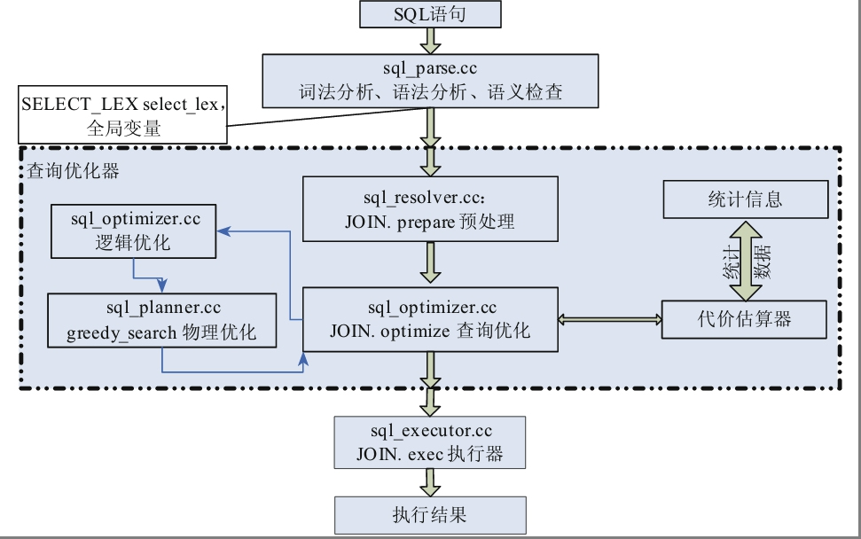
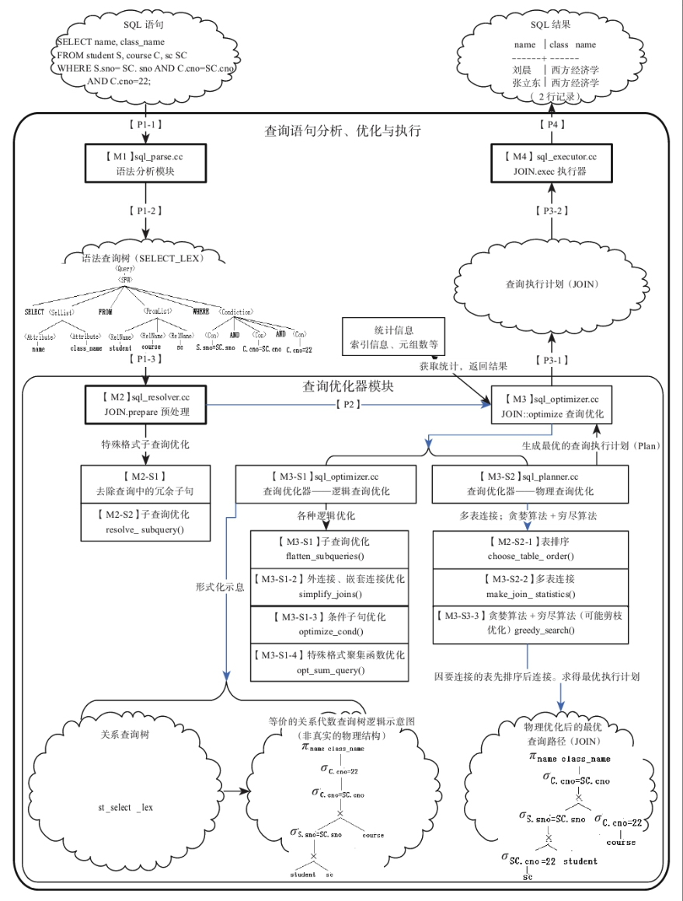
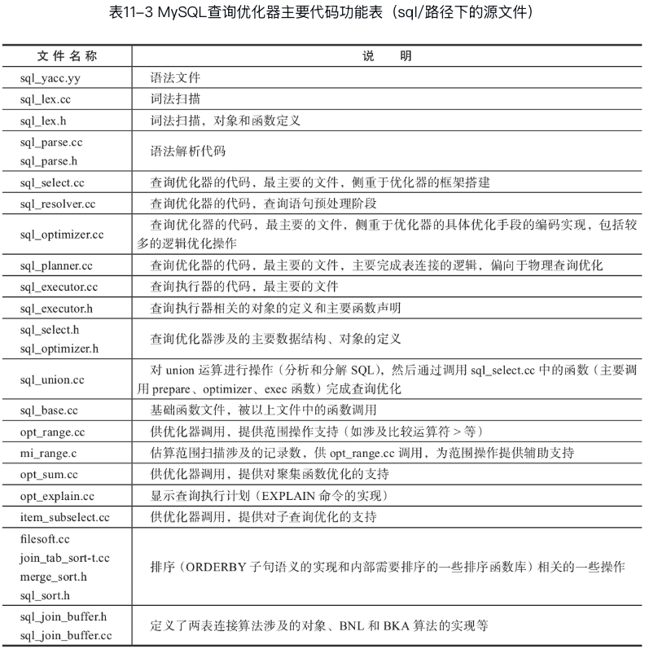
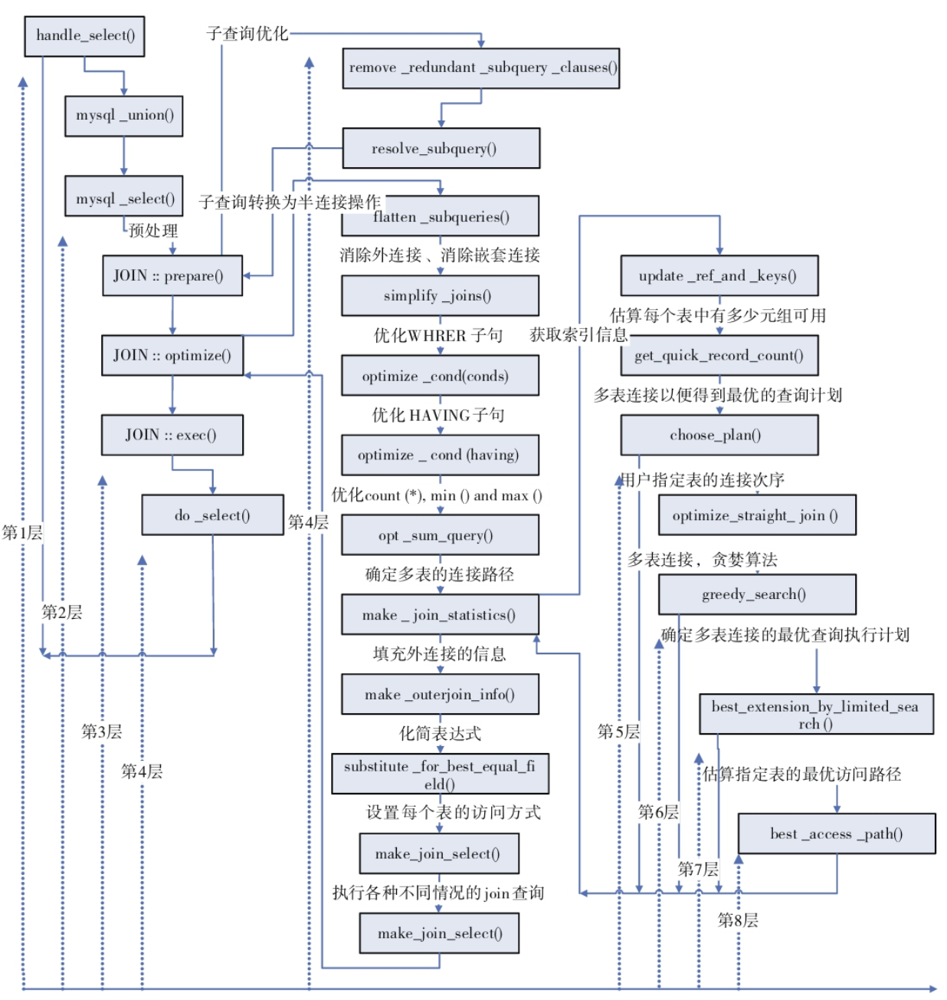
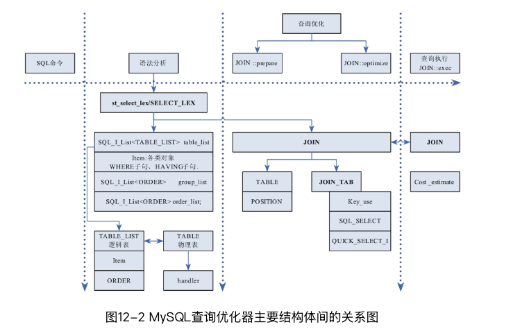

#0.架构图



-- ------华丽分割线------


#1.architecture details



#2.source code description



#3.function flow




#4.key data structs



#11.JOIN::optimize
```cpp
caller:
--mysql_execute_select

/**
  global select optimisation.

  @note
    error code saved in field 'error'

  @retval
    0   success
  @retval
    1   error
*/
JOIN::optimize
--JOIN::flatten_subqueries
----sj_subselects.empty()
--st_select_lex::handle_derived
--simplify_joins
--record_join_nest_info
--build_bitmap_for_nested_joins
--optimize_cond
--JOIN::optimize_fts_limit_query
--get_sort_by_table
--make_join_statistics
----TABLE_LIST::fetch_number_of_rows
------ha_innobase::info
--------ha_innobase::info_low
----------dict_table_stats_lock
----outer_join_nest
----Optimize_table_order
----JOIN::refine_best_rowcount
----JOIN::get_best_combination
--JOIN::set_access_methods
--make_join_select
----add_not_null_conds
----SQL_SELECT *sel= tab->select= new (thd->mem_root) SQL_SELECT;
----pushdown_on_conditions
--make_join_readinfo
----setup_join_buffering
--pick_table_access_method
```

#12.JOIN::optimize注释

```cpp
int
JOIN::optimize()
{
	...
       // IN子查询转换为半连接(半连接子查询消除,扁平化处理方式)
        
        if (flatten_subqueries())
                DBUG_RETURN(1);
        /* 对于查询语句中的关系(由连接得到的临时中间关系)或视图对象,使用mysql_derived_optimize函数,创建临时结果表或物化临时关系,便于后续使用 */
        if (select_lex-＞handle_derived(thd-＞lex, &mysql_derived_optimize))
                DBUG_RETURN(1);
...
        if (sel-＞first_cond_optimization)
        {...
                //调用simplify_joins函数,完成外连接向内连接的化简
                if (simplify_joins(this, join_list, conds, true, false, &conds)){...}
                //递归调用record_join_nest_info函数,记录连接的嵌套信息到查询块(st_select_lex *select)中：
                // - record the remaining semi-join structures in the enclosing query block.
                // - record transformed join conditions in TABLE_LIST objects.
                if (record_join_nest_info(select_lex, join_list)) {...}
                        build_bitmap_for_nested_joins(join_list, 0);
...
        } //if (sel-＞first_cond_optimization)结束
        //调用optimize_cond优化条件表达式(WHERE子句)
        conds= optimize_cond(thd, conds, &cond_equal, join_list, true, &select_lex-＞cond_value);
...
        { //如果having不能成功合并到where子句,则调用optimize_cond优化HAVING子句
                having= optimize_cond(thd, having, &cond_equal,
                        join_list, false, &select_lex-＞having_value);
        }
...
        optimize_fts_limit_query(); //全文检索的优化
...
        //对没有GROUP子句且调用了COUNT(*)、MIN()、MAX()函数的情况进行优化
        //通过调用opt_sum_query函数对每个叶子表(单表)上满足上述条件的情况进行优化
        if (tables_list && implicit_grouping) /* 有聚集函数但没有GROUPBY子句,则implicit_grouping在JOIN.prepare()方法中被赋值为TRUE(此种情况下,结果集应该是0行或一行数据) */
        {...
                if ((res=opt_sum_query(thd, select_lex-＞leaf_tables, all_fields, conds)))
                {...}
        }
...
        //调用make_join_statistics函数,完成多表连接,结果是构造出查询执行计划
        //多个表源自语法分析模块从SQL中分解出的表,存放在select_lex-＞leaf_tables上
        if (make_join_statistics(this, select_lex-＞leaf_tables, conds, &keyuse, first_optimization))
        {...}
...
        if (const_tables && !thd-＞locked_tables_mode &&
                !(select_options & SELECT_NO_UNLOCK)) //优化点：对常量表可以提前解锁
        {...mysql_unlock_some_tables(thd, ct, const_tables);  }
        //对DISTINCT优化。前提是DISTINCT存在于常量表上;优化方式是去除DISTINCT
...
        reset_nj_counters (join_list); //重置嵌套连接信息
        make_outerjoin_info (this); //为外连接填充信息
...
        //调用substitute_for_best_equal_field函数化简条件中冗余的等式
        if (conds)
        {  conds= substitute_for_best_equal_field (conds, cond_equal, map2table);  ...}
        //调用substitute_for_best_equal_field函数化简每个表上条件中冗余的等式
        for (JOIN_TAB *tab= join_tab + const_tables; tab ＜ join_tab + tables ; tab++)
        {
                if (*tab-＞on_expr_ref)
                {
                        *tab-＞on_expr_ref= substitute_for_best_equal_field(*tab-＞on_expr_ref,
                                                          tab-＞cond_equal, map2table);
                        (*tab-＞on_expr_ref)-＞update_used_tables();
                }
        }
...
        //对于每一个被物化操作驱动的表、视图,去掉其上不再被使用的索引信息
        drop_unused_derived_keys();
        if (set_access_methods()){...} //为每个表设置扫描访问方式(尽量利用索引)
...
        //对条件尽量求值,并下推约束条件到表中
        if (make_join_select(this, select, conds)){...}
...
                { //排序优化：消除排序条件中的常数(如去掉重复的排序操作)
                ORDER *org_order= order;
                order= ORDER_with_src(remove_const(this, order, conds, 1,
                                  &simple_order, “ORDER BY”), order.src);
...
                if (!order && org_order) //如果ORDERBY子句后是NULL或常量表达式,则禁止排序
                        skip_sort_order = 1;
        }
        //优化GROUPBY/DISTINCT子句,前提是不存在聚集函数
        {
                //优化点有：
                // 1) 如果ORDERBY子句被GROUPBY子句包括,则依据GROUPBY指定的列排序
                // 2) 如果有唯一索引存在,则消除DISTINCT操作​​                // 3) 如果DISTINCT和聚集函数都存在,则DISTINCT可以消除
                // 4) 只有一个表,表的查询列是排序列,且这样的列上有索引,则DISTINCT可以被ORDERBY消除
                // 5) 如果输出结果只有一行,则GROUPBY操作可以消除
                // 6)如果排序子句是分组子句的子集,则可以去掉排序子句
        }
...
        /* 为各种类型的表的数据获取做准备工作(如获取读取数据的标识,确定怎么获取第一条数据、怎么获取其他数据等;代码实现是通过函数指针为TABLE-＞status、TABLE-＞read_first_record等赋值完成的)*/
        make_join_readinfo(...);
...
        /* 简化IN子查询,前提是没有GROUPBY和ORDERBY子句,且顶层FROM子句只有一个表 */
        if (!group_list && !order &&
                unit-＞item && unit-＞item-＞substype() == Item_subselect::IN_SUBS &&
                primary_tables == 1 && conds &&
         !  unit-＞is_union())
        {...}
...
        /* 如果要了解“依据索引如何读取数据”的实现方式,从pick_table_access_method函数入手查各指针函数即可(如对于JT_REF类型可以通过join_read_always_key函数(被pick_table_access_method调用)掌握数据获取方式) */
        for (uint i= const_tables; i ＜ tables; i++)
        {
                pick_table_access_method (&join_tab[i]);
        }
        if (make_tmp_tables_info()) //初始化临时表
                DBUG_RETURN(1);
...
}​​ 
```

#13.JOIN::exec

```cpp
caller:
--mysql_execute_select

/**
  Execute select, executor entry point.

  @todo
    When can we have here thd->net.report_error not zero?
*/
JOIN::exec
--JOIN::prepare_result
----st_select_lex::handle_derived
----select_result::prepare2
--select_send::send_result_set_metadata
----Protocol::send_result_set_metadata
--do_select
```


