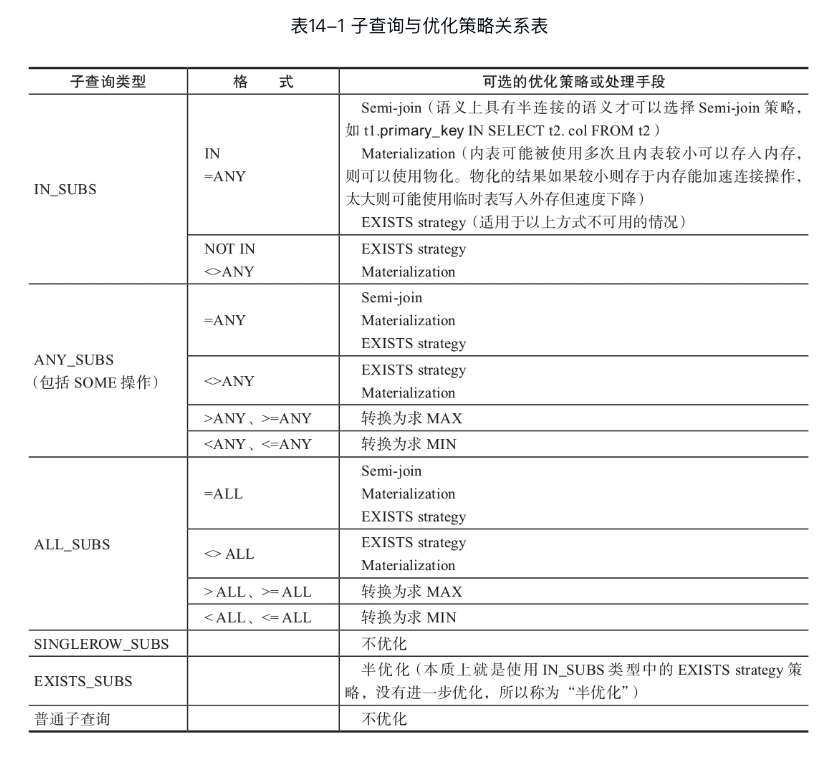

#1.subquery



#2.code flow


```cpp
JOIN::prepare //1）查询优化器准备阶段
        remove_redundant_subquery_clauses //去掉子查询中冗余子句
        resolve_subquery  /* 简单IN/=ANY格式子查询优先用半连接优化子查询;否则,调用select_transformer进行子查询优化 */
        select_transforme  //进行其他类型的子查询优化
                Item_singlerow_subselect::select_transformer  //单行子查询优化
                Item_in_subselect::select_transformer //IN子查询优
                        select_in_like_transformer //IN子查询优化
                                single_value_transformer //对单列IN/ALL/ANY子查询优化
                                        single_value_in_to_exists_transformer //单列IN转换为EXISTS子查询
                                row_value_transformer //对多列子查询优化
                                        row_value_in_to_exists_transformer //特殊情况IN向EXISTS转换
                Item_allany_subselect::select_transformer //对ALL/ANY子查询优化
                Item_exists_subselect::select_transformer //对EXISTS子查询优化
JOIN::optimize //2）查询优化器优化阶段
        flatten_subqueries / * 上拉IN_SUBS类型子查询(尽量把子查询转换为半连接;否则使用EXISTS 策略优化);主要的子查询优化方式 */
                replace_subcondition
                convert_subquery_to_semijoin /*把IN_SUBS类型的子查询转换为半连接(先于decide_subquery_strategy函数执行,表明子查询的半连接优化策略优先使用)*/
//以上完成子查询的优化工作，主要包括：
//1)主要优化方式 －＞IN_SUBS类型的子查询转换为半连接(否则采用ESISTS策略)
//2)其他优化手段 －＞ALL、ANY等类型特殊优化(MIN、MAX最值优化)
        make_join_statistics //完成多表连接
                optimize_semijoin_nests_for_materialization //对半连接的嵌套形式进行半连接子句的物化优化
                        semijoin_types_allow_materialization
                        calculate_materialization_costs
                choose_table_order //确定多表连接次序(确定半连接的优化策略)
                        fix_semijoin_strategies //确定半连接的优化策略
                decide_subquery_strategy //确定子查询的优化策略(确定materialization或EXISTS strategy)
                        compare_costs_of_subquery_strategies //计算子查询优化策略的花费,选择最优
                                subquery_allows_materialization //子查询是否允许物化
                                calculate_materialization_costs //计算物化的花费(子查询被物化)
                                optimize_semijoin_nests_for_materialization
                                        calculate_materialization_costs
                        finalize_exists_transform //收尾子查询EXISTS化后的工作,如子查询目标列的表达式化简等
                        finalize_materialization_transform //收尾子查询物化的工作
        //以下完成“半连接”的5种“消重策略”的选择
        make_join_readinfo //为每个表构造连接需要的信息(把逻辑运算符转化为物理运算符)
                setup_semijoin_dups_elimination //半连接“消重”工作​​
                
```