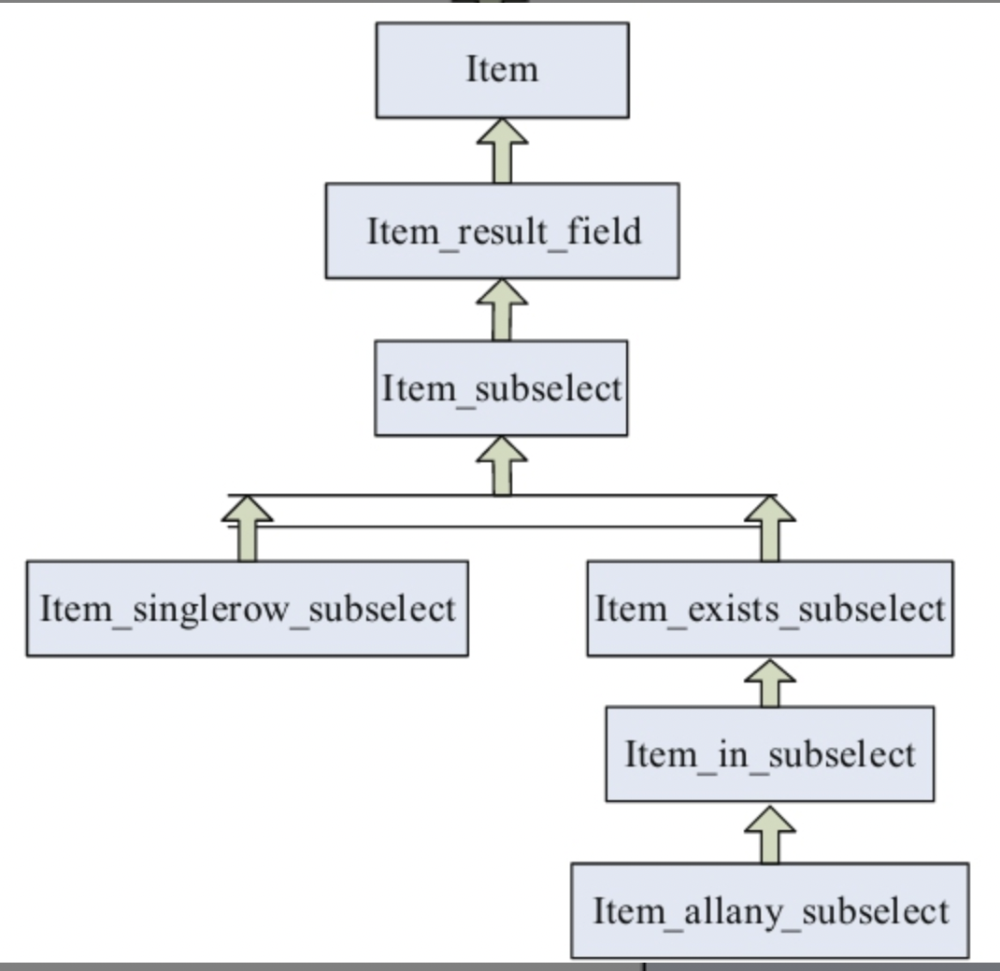

#1.select_transformer

```
select_transforme函数通过调用select_in_like_transformer等函数，完成子查询的优化。处理的子查询类型如下：

❏普通的子查询（不带有IN/ALL/ANY/SOME谓词的子查询）。
❏带有IN/ALL/ANY/SOME谓词的子查询。

MySQL子查询处理代码位于item_subselect.cc、item_subselect.h文件中，
item_subselect类负责子查询优化，有两个子类Item_singlerow_subselect、Item_exists_subselect。

❏Item_singlerow_subselect：对于返回值是单行的子查询进行处理，
此类子查询不包括FROM子句中的子查询，也不是UNION谓词的子查询
（如select2UNION select8就不属于本子类处理范围），通常它是一个标量子查询。

❏Item_exists_subselect：形式上看，处理带有EXISTS谓词的子查询，
但因带有EXISTS谓词的子查询的结果是一个布尔值，而IN谓词可转换为EXISTS，
所以处理这些子查询在方式上有共同之处。

MySQL支持的子查询优化类型如下：

❏Scalar IN Subquery，标量IN子查询。
❏Row IN Subquery，行子查询。
❏Item_allany_subselect谓词为ALL、ANY、SOME类型的子查询。
❏Item_singlerow_subselect[插图]，单行子查询，相当于标量子查询。

```
