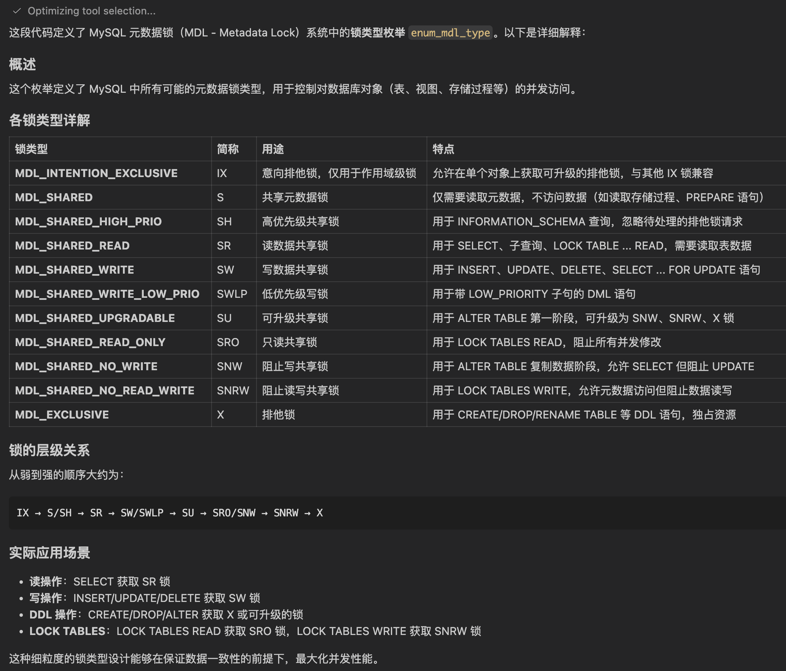
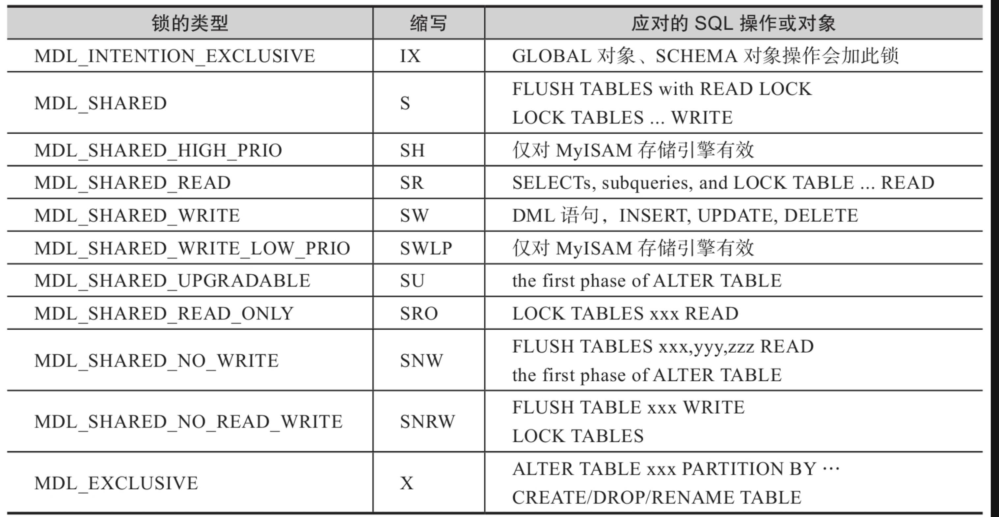

#1.代码解释



```cpp
这段代码定义了 MySQL 元数据锁（MDL - Metadata Lock）系统中的锁类型枚举 enum_mdl_type。以下是详细解释：

概述
这个枚举定义了 MySQL 中所有可能的元数据锁类型，用于控制对数据库对象（表、视图、存储过程等）的并发访问。

各锁类型详解
锁类型	简称	用途	特点
MDL_INTENTION_EXCLUSIVE	IX	意向排他锁，仅用于作用域级锁	允许在单个对象上获取可升级的排他锁，与其他 IX 锁兼容
MDL_SHARED	S	共享元数据锁	仅需要读取元数据，不访问数据（如读取存储过程、PREPARE 语句）
MDL_SHARED_HIGH_PRIO	SH	高优先级共享锁	用于 INFORMATION_SCHEMA 查询，忽略待处理的排他锁请求
MDL_SHARED_READ	SR	读数据共享锁	用于 SELECT、子查询、LOCK TABLE ... READ，需要读取表数据
MDL_SHARED_WRITE	SW	写数据共享锁	用于 INSERT、UPDATE、DELETE、SELECT ... FOR UPDATE 语句
MDL_SHARED_WRITE_LOW_PRIO	SWLP	低优先级写锁	用于带 LOW_PRIORITY 子句的 DML 语句
MDL_SHARED_UPGRADABLE	SU	可升级共享锁	用于 ALTER TABLE 第一阶段，可升级为 SNW、SNRW、X 锁
MDL_SHARED_READ_ONLY	SRO	只读共享锁	用于 LOCK TABLES READ，阻止所有并发修改
MDL_SHARED_NO_WRITE	SNW	阻止写共享锁	用于 ALTER TABLE 复制数据阶段，允许 SELECT 但阻止 UPDATE
MDL_SHARED_NO_READ_WRITE	SNRW	阻止读写共享锁	用于 LOCK TABLES WRITE，允许元数据访问但阻止数据读写
MDL_EXCLUSIVE	X	排他锁	用于 CREATE/DROP/RENAME TABLE 等 DDL 语句，独占资源
锁的层级关系
从弱到强的顺序大约为：

实际应用场景
读操作：SELECT 获取 SR 锁
写操作：INSERT/UPDATE/DELETE 获取 SW 锁
DDL 操作：CREATE/DROP/ALTER 获取 X 或可升级的锁
LOCK TABLES：LOCK TABLES READ 获取 SRO 锁，LOCK TABLES WRITE 获取 SNRW 锁
这种细粒度的锁类型设计能够在保证数据一致性的前提下，最大化并发性能。
```


#2.notes

```cpp
/**
    Type of metadata lock request.
    @sa Comments for MDL_object_lock::can_grant_lock() andMDL_scoped_lock::can_
    grant_lock() for details.
*/
enum enum_mdl_type {  //元数据锁的粒度定义，但属于MySQL Server层的元数据锁。如下的注释写
得很好，仔细阅读理解为好
    /*An intention exclusive metadata lock. Used only for scoped locks.
    //scoped locks,范围类型的锁，参见“本节11.相容性”小节
        Owner of this type of lock can acquire upgradable exclusive locks
        onindividual objects.//可升级的排它锁，从意向升级到非意向的排它
        Compatible with other IX locks, but is incompatible with scoped S andX locks.*/
MDL_INTENTION_EXCLUSIVE= 0, //意向排它锁，缩写为IX。与其他的IX是兼容的，但是与范围类型的S
和X锁不兼容
                                //此锁用于GLOBAL/COMMIT/TABLESPACE/SCHEMA/EVENT/
                                  PROCEDURE/TABLE这些元数据对象上
    /*A shared metadata lock.  //共享锁，元数据共享锁，即表级的共享锁
        To be used in cases when we are interested in object metadata onlyand
        there is no intention to //读操作“元数据”获取S锁
        access object data (e.g. for storedroutines or during preparing prepared
        statements).//例如存储过程等
        We also mis-use this type of lock for open HANDLERs, since lockacquired
        by this statement has to be compatible with
        lock acquired by LOCK TABLES ... WRITE statement, i.e.//
        “HANDLER tbl_name OPEN/READ...”操作不能获得S锁
        SNRW (We can't get by acquiring S lock at HANDLER ... OPEN time and
        upgrading it to SRlock for HANDLER ... READ
        as it doesn't solve problem with needto abort DML statements which wait
        on table level lock while having
        open HANDLER in the same connection).
        To avoid deadlock which may occur when SNRW lock is being upgraded toX
        lock for table  //升级到X锁避免死锁
        on which there is an active S lock which is owned bythread which waits in
        its turn for table-level lock owned by thread
        performing upgrade we have to use thr_abort_locks_for_thread()facility in such situation.
        This problem does not arise for locks on stored routines as we don'tuse
        SNRW locks for them.
        It also does not arise when S locks are usedduring PREPARE calls as
         table-level locks are not acquired in thiscase.*/
MDL_SHARED, //共享锁，缩写为S。需要对元数据进行读操作
       /*A high priority shared metadata lock.  //高优先级的共享锁，高优先级的元数据共
        享锁，即高优先级的S锁
        Used for cases when there is no intention to access object data (i.e.data
        in the table). //用于不需要意向锁的情况下
        "High priority" means that, unlike other shared locks, it is
         grantedignoring pending requests for exclusive locks.
        Intended for use incases when we only need to access metadata and not
        data, e.g. whenfilling an INFORMATION_SCHEMA table.
        //如上是在说，高优先级是在在表级操作但不会影响数据（如修改列的数据类型则会影响数据，修
        改表名则不会影响数据）
        Since SH lock is compatible with SNRW lock, the connection thatholds SH
        lock lock should not try to
        acquire any kind of table-levelor row-level lock, as this can lead to a deadlock.
         //持有SH锁则不应该在请求表级或行级锁
        Moreover, afteracquiring SH lock, the connection should not wait for any otherresource,
        as it might cause starvation for X locks and a potentialdeadlock during
         upgrade of SNW or SNRW to X lock
        (e.g. if theupgrading connection holds the resource that is being waited for).*/
MDL_SHARED_HIGH_PRIO, //高优先级的共享锁，缩写为SH。用于操作INFORMATION_SCHEMA中的表，如
执行SHOW CREATE TABLE t1或DESC t1等
       /*A shared metadata lock for cases when there is an intention to read
        datafrom table.//存在读数据意向的锁
        A connection holding this kind of lock can read table metadata and read
         table data//先在元数据上加此锁
        (after acquiring appropriate table and row-level locks).//之后才会获取表锁和行级锁
        This means that one can only acquire TL_READ, TL_READ_NO_INSERT,
         andsimilar table-level locks on table
        if one holds SR MDL lock on it.
        To be used for tables in SELECTs, subqueries, and LOCK TABLE ... READstatements.*/
MDL_SHARED_READ, //意向读锁，缩写为SR。也许会读表的元数据（表级元数据锁）和表的数据（行级锁）
        //另外还有通过mysql_admin_table()函数访问表的ANALYZE/CHECK TABLE/OPTIMIZE
           TABLE/REPAIR TABLE等操作可获取此锁
        /*A shared metadata lock for cases when there is an intention to
          modify(and not just read) data in the table.
        A connection holding SW lock can read table metadata and modify or
         readtable data//存在修改数据意向的锁
        (after acquiring appropriate table and row-level locks).//之后才会获取表锁和行级锁
        To be used for tables to be modified by INSERT, UPDATE, DELETEstatements,
         but not LOCK TABLE ... WRITE or DDL).
        Also taken bySELECT ... FOR UPDATE.*/
MDL_SHARED_WRITE,//意向写锁，缩写为SW。INSERT, UPDATE, DELETE statements
        /*A version of MDL_SHARED_WRITE lock which has lower priority thanMDL_
        SHARED_READ_ONLY locks.
        Used by DML statements modifyingtables and using the LOW_PRIORITY
        clause.*/ //SQL语句中带有“LOW_PRIORITY”子句
MDL_SHARED_WRITE_LOW_PRIO,  //低优先级的共享写锁，缩写为SWLP。
       /*An upgradable shared metadata lock which allows concurrent updates and
        reads of table data.//允许并发更新和读同一个表
        A connection holding this kind of lock can read table metadata and readtable data.
        It should not modify data as this lock is compatible withSRO locks.
        Can be upgraded to SNW, SNRW and X locks.
        Once SU lock is upgraded to X or SNRW lock data modification can happen freely.
        To be used for the first phase of ALTER TABLE.*/
MDL_SHARED_UPGRADABLE,  //共享可升级锁，缩写为SU。ALTER TABLE命令早期阶段使用本锁
        /*   A shared metadata lock for cases when we need to read data from
         tableand block all concurrent modifications to it
        (for both data and metadata).Used by LOCK TABLES READ statement.*/
MDL_SHARED_READ_ONLY,  //共享只读锁，缩写为SRO。阻塞所有的并发修改
       /*  An upgradable shared metadata lock which blocks all attempts to
      updatetable data, allowing reads.//阻塞锁更新表数据的操作
        A connection holding this kind of lock can read table metadata and
         readtable data.//允许读元数据和表数据
        Can be upgraded to X metadata lock.
        Note, that since this type of lock is not compatible with SNRW or SWlock types,
        acquiring appropriate engine-level locks for reading(TL_READ* for MyISAM,
        shared row locks in InnoDB) should be contention-free.
        To be used for the first phase of ALTER TABLE, when copying data betweentables,
        to allow concurrent SELECTs from the table, but not UPDATEs.*/
MDL_SHARED_NO_WRITE,  //共享非写锁，缩写为SNW。
        /*  An upgradable shared metadata lock which allows other connectionsto
           access table metadata, but not data.
            It blocks all attempts to read or update table data, while allowing
             INFORMATION_SCHEMA and SHOW queries.
        //允许其他会话访问表的元数据。但不允许访问表的数据
        A connection holding this kind of lock can read table metadata modify
        andread table data.//持锁者可读表的元数据和表数据
        Can be upgraded to X metadata lock.
        To be used for LOCK TABLESWRITE statement.
        Not compatible with any other lock type except S and SH. */
MDL_SHARED_NO_READ_WRITE,  //共享非读写锁，缩写为SNRW。用于LOCK TABLES...WRITE
        /*  An exclusive metadata lock.
        A connection holding this lock can modify both table's metadata and data.
        No other type of metadata lock can be granted while this lock is held.
        To be used for CREATE/DROP/RENAME TABLE statements and for execution
        ofcertain phases of other DDL statements. */
MDL_EXCLUSIVE,  //排它锁，缩写为X。ALTER TABLE等一些操作也要用到此锁，如本地更新时调用
mysql_inplace_alter_table()函数
       /* This should be the last !!! */
    MDL_TYPE_END};
```


#2.enum enum_mdl_type

```cpp
/**
  Type of metadata lock request.

  @sa Comments for MDL_object_lock::can_grant_lock() and
      MDL_scoped_lock::can_grant_lock() for details.
*/

enum enum_mdl_type {
  /*
    An intention exclusive metadata lock. Used only for scoped locks.
    Owner of this type of lock can acquire upgradable exclusive locks on
    individual objects.
    Compatible with other IX locks, but is incompatible with scoped S and
    X locks.
  */
  MDL_INTENTION_EXCLUSIVE= 0,
  /*
    A shared metadata lock.
    To be used in cases when we are interested in object metadata only
    and there is no intention to access object data (e.g. for stored
    routines or during preparing prepared statements).
    We also mis-use this type of lock for open HANDLERs, since lock
    acquired by this statement has to be compatible with lock acquired
    by LOCK TABLES ... WRITE statement, i.e. SNRW (We can't get by by
    acquiring S lock at HANDLER ... OPEN time and upgrading it to SR
    lock for HANDLER ... READ as it doesn't solve problem with need
    to abort DML statements which wait on table level lock while having
    open HANDLER in the same connection).
    To avoid deadlock which may occur when SNRW lock is being upgraded to
    X lock for table on which there is an active S lock which is owned by
    thread which waits in its turn for table-level lock owned by thread
    performing upgrade we have to use thr_abort_locks_for_thread()
    facility in such situation.
    This problem does not arise for locks on stored routines as we don't
    use SNRW locks for them. It also does not arise when S locks are used
    during PREPARE calls as table-level locks are not acquired in this
    case.
  */
  MDL_SHARED,
  /*
    A high priority shared metadata lock.
    Used for cases when there is no intention to access object data (i.e.
    data in the table).
    "High priority" means that, unlike other shared locks, it is granted
    ignoring pending requests for exclusive locks. Intended for use in
    cases when we only need to access metadata and not data, e.g. when
    filling an INFORMATION_SCHEMA table.
    Since SH lock is compatible with SNRW lock, the connection that
    holds SH lock lock should not try to acquire any kind of table-level
    or row-level lock, as this can lead to a deadlock. Moreover, after
    acquiring SH lock, the connection should not wait for any other
    resource, as it might cause starvation for X locks and a potential
    deadlock during upgrade of SNW or SNRW to X lock (e.g. if the
    upgrading connection holds the resource that is being waited for).
  */
  MDL_SHARED_HIGH_PRIO,
  /*
    A shared metadata lock for cases when there is an intention to read data
    from table.
    A connection holding this kind of lock can read table metadata and read
    table data (after acquiring appropriate table and row-level locks).
    This means that one can only acquire TL_READ, TL_READ_NO_INSERT, and
    similar table-level locks on table if one holds SR MDL lock on it.
    To be used for tables in SELECTs, subqueries, and LOCK TABLE ...  READ
    statements.
  */
  MDL_SHARED_READ,
  /*
    A shared metadata lock for cases when there is an intention to modify
    (and not just read) data in the table.
    A connection holding SW lock can read table metadata and modify or read
    table data (after acquiring appropriate table and row-level locks).
    To be used for tables to be modified by INSERT, UPDATE, DELETE
    statements, but not LOCK TABLE ... WRITE or DDL). Also taken by
    SELECT ... FOR UPDATE.
  */
  MDL_SHARED_WRITE,
  /*
    An upgradable shared metadata lock for cases when there is an intention
    to modify (and not just read) data in the table.
    Can be upgraded to MDL_SHARED_NO_WRITE and MDL_EXCLUSIVE.
    A connection holding SU lock can read table metadata and modify or read
    table data (after acquiring appropriate table and row-level locks).
    To be used for the first phase of ALTER TABLE.
  */
  MDL_SHARED_UPGRADABLE,
  /*
    An upgradable shared metadata lock which blocks all attempts to update
    table data, allowing reads.
    A connection holding this kind of lock can read table metadata and read
    table data.
    Can be upgraded to X metadata lock.
    Note, that since this type of lock is not compatible with SNRW or SW
    lock types, acquiring appropriate engine-level locks for reading
    (TL_READ* for MyISAM, shared row locks in InnoDB) should be
    contention-free.
    To be used for the first phase of ALTER TABLE, when copying data between
    tables, to allow concurrent SELECTs from the table, but not UPDATEs.
  */
  MDL_SHARED_NO_WRITE,
  /*
    An upgradable shared metadata lock which allows other connections
    to access table metadata, but not data.
    It blocks all attempts to read or update table data, while allowing
    INFORMATION_SCHEMA and SHOW queries.
    A connection holding this kind of lock can read table metadata modify and
    read table data.
    Can be upgraded to X metadata lock.
    To be used for LOCK TABLES WRITE statement.
    Not compatible with any other lock type except S and SH.
  */
  MDL_SHARED_NO_READ_WRITE,
  /*
    An exclusive metadata lock.
    A connection holding this lock can modify both table's metadata and data.
    No other type of metadata lock can be granted while this lock is held.
    To be used for CREATE/DROP/RENAME TABLE statements and for execution of
    certain phases of other DDL statements.
  */
  MDL_EXCLUSIVE,
  /* This should be the last !!! */
  MDL_TYPE_END};


/** Duration of metadata lock. */

enum enum_mdl_duration {
  /**
    Locks with statement duration are automatically released at the end
    of statement or transaction.
  */
  MDL_STATEMENT= 0,
  /**
    Locks with transaction duration are automatically released at the end
    of transaction.
  */
  MDL_TRANSACTION,
  /**
    Locks with explicit duration survive the end of statement and transaction.
    They have to be released explicitly by calling MDL_context::release_lock().
  */
  MDL_EXPLICIT,
  /* This should be the last ! */
  MDL_DURATION_END 
};    
```
