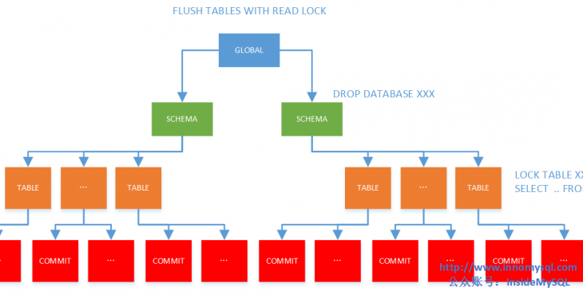

*   [1 前言](http://www.innomysql.com/article/25731.html#i)
*   [2 MDL锁与实现](http://www.innomysql.com/article/25731.html#MDL)
*   [3 MDL锁的性能与并发改进](http://www.innomysql.com/article/25731.html#MDL-2)
*   [4 MDL锁的诊断](http://www.innomysql.com/article/25731.html#MDL-3)

# 前言

好久没更新，主要是因为Inside君最近沉迷于一部动画片——《新葫芦娃兄弟》。终于抽得闲，完成了本篇关于MySQL MDL锁的深入分析与介绍。虽然之前有很多小伙伴分析过，但总感觉少了点什么，故花了点时间翻看了下源码。Inside君或许不是最牛掰的内核开发人员，但自认为应该是业界最会讲故事的码农，希望本篇能做到通俗易懂，因为MDL锁其实并不好理解。如果同学们还有问题，也可以直接看源码文件mdl.cc。

# MDL锁与实现

MySQL5.5版本引入了MDL锁（metadata lock），用于解决或者保证DDL操作与DML操作之间的一致性。例如下面的这种情形：

<table><tbody><tr><td width="575">会话1</td><td width="575">会话2</td></tr><tr><td width="575">BEGIN;</td><td width="575">&nbsp;</td></tr><tr><td width="575">SELECT * FROM XXX</td><td width="575">&nbsp;</td></tr><tr><td width="575">&nbsp;</td><td width="575">DROP TABLE XXX</td></tr><tr><td width="575">SELECT * FROM XXX</td><td width="575">&nbsp;</td></tr></tbody></table>

若没有MDL锁的保护，则事务2可以直接执行DDL操作，并且导致事务1出错，5.1版本即是如此。5.5版本加入MDL锁就在于保护这种情况的发生，由于事务1开启了查询，那么获得了MDL锁，锁的模式为SHARED_READ，事务2要执行DDL，则需获得EXCLUSIVE锁，两者互斥，所以事务2需要等待。

[InnoDB](http://www.innomysql.com/article/category/mysql/innodb)层已经有了IS、IX这样的意向锁，有同学觉得可以用来实现上述例子的并发控制。但由于MySQL是Server-Engine架构，所以MDL锁是在Server中实现。另外，MDL锁还能实现其他粒度级别的锁，比如全局锁、库级别的锁、表空间级别的锁，这是InnoDB存储引擎层不能直接实现的锁。

但与[InnoDB](http://www.innomysql.com/article/category/mysql/innodb)锁的实现一样，MDL锁也是类似对一颗树的各个对象从上至下进行加锁（对树进行加锁具体见：[《MySQL技术内幕：InnoDB存储引擎》](http://www.innomysql.com/article/97.html)）。但是MDL锁对象的层次更多，简单来看有如下的层次：



上图中显示了最常见的4种MDL锁的对象，并且注明了常见的SQL语句会触发的锁。与InnoDB层类似的是，某些类型的MDL锁会从上往下一层层进行加锁。比如LOCK TABLE … WRITE这样的SQL语句，其首先会对GLOBAL级别加INTENTION\_EXCLUSIVE锁，再对SCHEMA级别加INTENTION\_EXCLUSIVE锁，最后对TABLE级别加SHARED\_NO\_READ_WRITE锁。

这里最令人意外的是还有COMMIT对象层次的锁，其实这主要用于XA事务中。比如分布式事务已经PREPARE成功，但是在XA COMMIT之前有其他会话执行了FLUSH TABLES WITH READ LOCK这样的操作，那么分布式事务的提交就需要等待。

除了上图标注的对象，其实还有TABLESPACE、FUNCTION、PROCEDURE、EVENT等其他对象类型，其实都是为了进行并发控制。只是这些在MySQL数据库中都不常用，故不再赘述（当然也是为了偷懒）。

```plain
GLOBAL=0,TABLESPACE,SCHEMA,TABLE,FUNCTION,PROCEDURE,TRIGGER,EVENT,COMMIT,USER_LEVEL_LOCK,LOCKING_SERVICE,NAMESPACE_END 
```

目前MDL有如下锁模式，锁之间的兼容性可见源码mdl.cc：

<table><tbody><tr><td width="575">锁模式</td><td width="575">对应SQL</td></tr><tr><td width="575">MDL_INTENTION_EXCLUSIVE</td><td width="575">GLOBAL对象、SCHEMA对象操作会加此锁</td></tr><tr><td width="575">MDL_SHARED</td><td width="575">FLUSH TABLES with READ LOCK</td></tr><tr><td width="575">MDL_SHARED_HIGH_PRIO</td><td width="575">仅对MyISAM存储引擎有效</td></tr><tr><td width="575">MDL_SHARED_READ</td><td width="575">SELECT查询</td></tr><tr><td width="575">MDL_SHARED_WRITE</td><td width="575">DML语句</td></tr><tr><td width="575">MDL_SHARED_WRITE_LOW_PRIO</td><td width="575">仅对MyISAM存储引擎有效</td></tr><tr><td width="575">MDL_SHARED_UPGRADABLE</td><td width="575">ALTER TABLE</td></tr><tr><td width="575">MDL_SHARED_READ_ONLY</td><td width="575">LOCK xxx READ</td></tr><tr><td width="575">MDL_SHARED_NO_WRITE</td><td width="575">FLUSH TABLES xxx,yyy,zzz READ</td></tr><tr><td width="575">MDL_SHARED_NO_READ_WRITE</td><td width="575">FLUSH TABLE xxx WRITE</td></tr><tr><td width="575">MDL_EXCLUSIVE</td><td width="575">ALTER TABLE xxx PARTITION BY …</td></tr></tbody></table>

# MDL锁的性能与并发改进

讲到这同学们会发现MDL锁的开销并不比InnoDB层的行锁要小，而且这可能是一个更为密集的并发瓶颈。MySQL 5.6和5.5版本通常通过调整如下两个参数来进行并发调优:

*   metadata\_locks\_cache_size: MDL锁的缓存大小
*   metadata\_locks\_hash_instances：通过分片来提高并发度，与InnoDB AHI类似

[MySQL 5.7](http://www.innomysql.com/article/25689.html) MDL锁的最大改进之处在于将MDL锁的机制通过lock free算法来实现，从而提高了在多核并发下数据库的整体性能提升。

# MDL锁的诊断

MySQL 5.7版本之前并没有提供一个方便的途径来查看MDL锁，[github](https://github.com/)上有一名为mysql-plugin-mdl-info的项目，通过插件的方式来查看，非常有想法的实现，大赞。好在官方也意识到了这个问题，于是在MySQL 5.7中的performance\_schea库下新增了一张表metadata\_locks，用其来查看MDL锁那是相当的方便:

不过默认PS并没有打开此功能，需要手工将wait/lock/metadata/sql/mdl监控给打开:

```plain
SELECT * FROM performance_schema.setup_instruments;
```

```plain
  UPDATE performance_schema.setup_consumers SET ENABLED = 'YES' WHERE NAME ='global_instrumentation';
  UPDATE performance_schema.setup_instruments SET ENABLED = 'YES' WHERE NAME ='wait/lock/metadata/sql/mdl';
  select * from performance_schema.metadata_locks\G
```

会话1

```plain
mysql> lock table xx read;
Query OK, 0 rows affected (0.21 sec)
```

会话2：

```plain
SELECT * FROM performance_schema.metadata_locks;
```

[](javascript: "复制代码")

```plain
mysql> SELECT * FROM performance_schema.metadata_locks\G;
*************************** 1. row ***************************
          OBJECT_TYPE: TABLE
        OBJECT_SCHEMA: performance_schema
          OBJECT_NAME: metadata_locks
OBJECT_INSTANCE_BEGIN: 240554768
            LOCK_TYPE: SHARED_READ
        LOCK_DURATION: TRANSACTION
          LOCK_STATUS: GRANTED
               SOURCE: sql_parse.cc:5927
      OWNER_THREAD_ID: 38
       OWNER_EVENT_ID: 10
1 row in set (0.00 sec)

ERROR:
No query specified
```

[](javascript: "复制代码")

[](javascript: "复制代码")

```plain
enum enum_mdl_type {
  /*
    An intention exclusive metadata lock. Used only for scoped locks.
    Owner of this type of lock can acquire upgradable exclusive locks on
    individual objects.
    Compatible with other IX locks, but is incompatible with scoped S and
    X locks.
  */
  MDL_INTENTION_EXCLUSIVE= 0,
  /*
    A shared metadata lock.
    To be used in cases when we are interested in object metadata only
    and there is no intention to access object data (e.g. for stored
    routines or during preparing prepared statements).
    We also mis-use this type of lock for open HANDLERs, since lock
    acquired by this statement has to be compatible with lock acquired
    by LOCK TABLES ... WRITE statement, i.e. SNRW (We can't get by by
    acquiring S lock at HANDLER ... OPEN time and upgrading it to SR
    lock for HANDLER ... READ as it doesn't solve problem with need
    to abort DML statements which wait on table level lock while having
    open HANDLER in the same connection).
    To avoid deadlock which may occur when SNRW lock is being upgraded to
    X lock for table on which there is an active S lock which is owned by
    thread which waits in its turn for table-level lock owned by thread
    performing upgrade we have to use thr_abort_locks_for_thread()
    facility in such situation.
    This problem does not arise for locks on stored routines as we don't
    use SNRW locks for them. It also does not arise when S locks are used
    during PREPARE calls as table-level locks are not acquired in this
    case.
  */
  MDL_SHARED,
  /*
    A high priority shared metadata lock.
    Used for cases when there is no intention to access object data (i.e.
    data in the table).
    "High priority" means that, unlike other shared locks, it is granted
    ignoring pending requests for exclusive locks. Intended for use in
    cases when we only need to access metadata and not data, e.g. when
    filling an INFORMATION_SCHEMA table.
    Since SH lock is compatible with SNRW lock, the connection that
    holds SH lock lock should not try to acquire any kind of table-level
    or row-level lock, as this can lead to a deadlock. Moreover, after
    acquiring SH lock, the connection should not wait for any other
    resource, as it might cause starvation for X locks and a potential
    deadlock during upgrade of SNW or SNRW to X lock (e.g. if the
    upgrading connection holds the resource that is being waited for).
  */
  MDL_SHARED_HIGH_PRIO,
  /*
    A shared metadata lock for cases when there is an intention to read data
    from table.
    A connection holding this kind of lock can read table metadata and read
    table data (after acquiring appropriate table and row-level locks).
    This means that one can only acquire TL_READ, TL_READ_NO_INSERT, and
    similar table-level locks on table if one holds SR MDL lock on it.
    To be used for tables in SELECTs, subqueries, and LOCK TABLE ...  READ
    statements.
  */
  MDL_SHARED_READ,
  /*
    A shared metadata lock for cases when there is an intention to modify
    (and not just read) data in the table.
    A connection holding SW lock can read table metadata and modify or read
    table data (after acquiring appropriate table and row-level locks).
    To be used for tables to be modified by INSERT, UPDATE, DELETE
    statements, but not LOCK TABLE ... WRITE or DDL). Also taken by
    SELECT ... FOR UPDATE.
  */
  MDL_SHARED_WRITE,
  /*
    A version of MDL_SHARED_WRITE lock which has lower priority than
    MDL_SHARED_READ_ONLY locks. Used by DML statements modifying
    tables and using the LOW_PRIORITY clause.
  */
  MDL_SHARED_WRITE_LOW_PRIO,
  /*
    An upgradable shared metadata lock which allows concurrent updates and
    reads of table data.
    A connection holding this kind of lock can read table metadata and read
    table data. It should not modify data as this lock is compatible with
    SRO locks.
    Can be upgraded to SNW, SNRW and X locks. Once SU lock is upgraded to X
    or SNRW lock data modification can happen freely.
    To be used for the first phase of ALTER TABLE.
  */
  MDL_SHARED_UPGRADABLE,
  /*
    A shared metadata lock for cases when we need to read data from table
    and block all concurrent modifications to it (for both data and metadata).
    Used by LOCK TABLES READ statement.
  */
  MDL_SHARED_READ_ONLY,
  /*
    An upgradable shared metadata lock which blocks all attempts to update
    table data, allowing reads.
    A connection holding this kind of lock can read table metadata and read
    table data.
    Can be upgraded to X metadata lock.
    Note, that since this type of lock is not compatible with SNRW or SW
    lock types, acquiring appropriate engine-level locks for reading
    (TL_READ* for MyISAM, shared row locks in InnoDB) should be
    contention-free.
    To be used for the first phase of ALTER TABLE, when copying data between
    tables, to allow concurrent SELECTs from the table, but not UPDATEs.
  */
  MDL_SHARED_NO_WRITE,
  /*
    An upgradable shared metadata lock which allows other connections
    to access table metadata, but not data.
    It blocks all attempts to read or update table data, while allowing
    INFORMATION_SCHEMA and SHOW queries.
    A connection holding this kind of lock can read table metadata modify and
    read table data.
    Can be upgraded to X metadata lock.
    To be used for LOCK TABLES WRITE statement.
    Not compatible with any other lock type except S and SH.
  */
  MDL_SHARED_NO_READ_WRITE,
  /*
    An exclusive metadata lock.
    A connection holding this lock can modify both table's metadata and data.
    No other type of metadata lock can be granted while this lock is held.
    To be used for CREATE/DROP/RENAME TABLE statements and for execution of
    certain phases of other DDL statements.
  */
  MDL_EXCLUSIVE,
  /* This should be the last !!! */
  MDL_TYPE_END};


/** Duration of metadata lock. */

enum enum_mdl_duration {
  /**
    Locks with statement duration are automatically released at the end
    of statement or transaction.
  */
  MDL_STATEMENT= 0,
  /**
    Locks with transaction duration are automatically released at the end
    of transaction.
  */
  MDL_TRANSACTION,
  /**
    Locks with explicit duration survive the end of statement and transaction.
    They have to be released explicitly by calling MDL_context::release_lock().
  */
  MDL_EXPLICIT,
  /* This should be the last ! */
  MDL_DURATION_END };


/** Maximal length of key for metadata locking subsystem. */
#define MAX_MDLKEY_LENGTH (1 + NAME_LEN + 1 + NAME_LEN + 1)


/**
  Metadata lock object key.

  A lock is requested or granted based on a fully qualified name and type.
  E.g. They key for a table consists of  <0 (=table)> + <database> + <table name>.
  Elsewhere in the comments this triple will be referred to simply as "key"
  or "name".
*/

struct MDL_key
{
public:
#ifdef HAVE_PSI_INTERFACE
  static void init_psi_keys();
#endif

  /**
    Object namespaces.
    Sic: when adding a new member to this enum make sure to
    update m_namespace_to_wait_state_name array in mdl.cc!

    Different types of objects exist in different namespaces
     - GLOBAL is used for the global read lock.
     - TABLESPACE is for tablespaces.
     - SCHEMA is for schemas (aka databases).
     - TABLE is for tables and views.
     - FUNCTION is for stored functions.
     - PROCEDURE is for stored procedures.
     - TRIGGER is for triggers.
     - EVENT is for event scheduler events.
     - COMMIT is for enabling the global read lock to block commits.
     - USER_LEVEL_LOCK is for user-level locks.
     - LOCKING_SERVICE is for the name plugin RW-lock service
    Note that although there isn't metadata locking on triggers,
    it's necessary to have a separate namespace for them since
    MDL_key is also used outside of the MDL subsystem.
    Also note that requests waiting for user-level locks get special
    treatment - waiting is aborted if connection to client is lost.
  */
  enum enum_mdl_namespace { GLOBAL=0,
                            TABLESPACE,
                            SCHEMA,
                            TABLE,
                            FUNCTION,
                            PROCEDURE,
                            TRIGGER,
                            EVENT,
                            COMMIT,
                            USER_LEVEL_LOCK,
                            LOCKING_SERVICE,
                            /* This should be the last ! */
                            NAMESPACE_END 
};
 。。。
```

[](javascript: "复制代码")

```plain
 if (!MY_TEST(table_options & TL_OPTION_ALIAS))
  {
    MDL_REQUEST_INIT(& ptr->mdl_request,
                     MDL_key::TABLE, ptr->db, ptr->table_name, mdl_type,
                     MDL_TRANSACTION);
```

```plain
 TABLE_LIST *ptr;
```

[MySQL 5.7](http://www.innomysql.com/article/25689.html)对于MDL的最后一个改进在mysqldump，有同学能知道是在哪嘛？第一个答对的同学可获Inside君签名的《MySQL内核：InnoDB存储引擎 卷1》书籍一本。

---------------------------------------------------


原网址: [访问](https://www.cnblogs.com/zengkefu/p/5690385.html)

创建于: 2020-05-18 20:20:51

目录: default

标签: `www.cnblogs.com`

