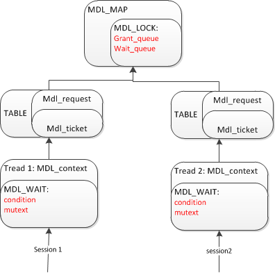

# MySQL锁系列3 MDL锁 - xpchild - 博客园

MySQL为了保护数据字典元数据，使用了metadata lock，即MDL锁，保证在并发的情况下，结构变更的一致性。

MDL锁的加锁模式和源码上的组织上和上一篇blog中MySQL表锁的实现方式一致，都采用了【mutex+condition+queue】来实现并发，阻塞，唤醒的控制。

下面就来看看MDL锁：

## 1\. 重要的数据结构：

　　   

1. MDL_map

　　mdl\_map使用hash表，保存了MySQL所有的mdl\_lock，全局共享，使用MDL\_KEY作为key来表，key=【db\_name+table_name】唯一定位一个表。

2. mdl_context

　　mdl_context在MySQL为每一个connection创建thd时，初始化一个mdl上下文，保存了当前session请求的mdl信息。

3. MDL_lock

　　mdl\_lock表示系统的一个mdl锁，所有的mdl request都请求对应的mdl\_lock，这个mdl\_lock结构保存了两个queue，一个是grant\_queue表示拿到lock的请求队列。

　　一个是wait\_queue表示请求这个mdl\_lock的阻塞队列。

4. MDL_wait

　　mdl_wait包装了一个mutex和一个condition，提供了所有的加锁，wait，notify操作。

5. MDL_request

　　在open table的时候，会init一个request，包含了请求的enum\_mdl\_type，enum\_mdl\_duration，MDL\_ticket，MDL\_key。

下面再看看三个重要的枚举类型：

[](javascript: "复制代码")

```plain
  enum enum_mdl_namespace { GLOBAL=0,
                            SCHEMA,
                            TABLE,
                            FUNCTION,
                            PROCEDURE,
                            TRIGGER,
                            EVENT,
                            COMMIT,
                            /* This should be the last ! */
                            NAMESPACE_END };
```

[](javascript: "复制代码")

[](javascript: "复制代码")

```plain
enum enum_mdl_duration {
  /**
    Locks with statement duration are automatically released at the end
    of statement or transaction.
  */
  MDL_STATEMENT= 0,
  /**
    Locks with transaction duration are automatically released at the end
    of transaction.
  */
  MDL_TRANSACTION,
  /**
    Locks with explicit duration survive the end of statement and transaction.
    They have to be released explicitly by calling MDL_context::release_lock().
  */
  MDL_EXPLICIT,
  /* This should be the last ! */
  MDL_DURATION_END };
```

[](javascript: "复制代码")

[](javascript: "复制代码")

```plain
enum enum_mdl_type {
  MDL_INTENTION_EXCLUSIVE= 0,
  MDL_SHARED,
  MDL_SHARED_HIGH_PRIO,
  MDL_SHARED_READ,
  MDL_SHARED_WRITE,
  MDL_SHARED_NO_WRITE,
  MDL_SHARED_NO_READ_WRITE,
  MDL_EXCLUSIVE,
  MDL_TYPE_END};
```

[](javascript: "复制代码")

首先：enum\_mdl\_namespace 表示mdl_request的作用域，比如alter table操作，需要获取TABLE作用域。

然后：enum\_mdl\_duration 表示mdl\_request的持久类型，比如alter table操作，类型是MDL\_STATEMENT，即语句结束，就释放mdl锁。又比如autocommit=0；select 操作，类型是MDL_TRANSACTION，必须在显示的commit，才释放mdl锁。

最后：enum\_mdl\_type 表示mdl_request的lock类型，根据这个枚举类型，来判断是否兼容和互斥。

## 2\. 测试

    下面根据一个测试，看一下加锁，释放，阻塞的过程，已经主要的函数调用栈：

　　session1：　　　　　　　　　　　　session2:

　　　　set autocommit=0;　　　　　　　　alter table pp add name varchar(100):

　　　　select * from pp;

### 2.1 创建connection过程中，初始化mdl_context.

　　函数调用：

　　　　handle\_connections\_sockets

　　　　　　MDL\_context::init： 每一个connection对应一个mdl\_context

### 2.2 初始化mdl_request

　　函数调用：

　　　　parse_sql

　　　　　　st\_select\_lex::add\_table\_to_list  
　　　　　　　　MDL_request::init

　　说明： 在session1的过程中，创建的mdl_request: 

_　　　　　　mdl\_namespace=MDL\_key::TABLE,_

_　　　　　　db_arg=0x8c7047c8 "xpchild",_

_　　　　　　name_arg=0x8c7047d0 "pp",_  
_　　　　　　mdl\_type\_arg=MDL\_SHARED\_READ,_

_　　　　　　mdl\_duration\_arg=MDL_TRANSACTION_

### 2.3 加锁

     acquire_lock:

[](javascript: "复制代码")

```plain
if (lock->can_grant_lock(mdl_request->type, this))
 {
    lock->m_granted.add_ticket(ticket);
    mysql_prlock_unlock(&lock->m_rwlock);
    m_tickets[mdl_request->duration].push_front(ticket);
    mdl_request->ticket= ticket;
  }
```

[](javascript: "复制代码")

说明：首先进行兼容性判断，如果兼容，那么就把ticket加入到队列中，加锁成功。

　　函数调用栈

　　 open\_and\_lock_tables

　　　　open_table

1\. 排他锁使用  
　　lock\_table\_names  
　　MDL\_context::acquire\_locks  
2\. 共享锁使用  
　　open\_table\_get\_mdl\_lock  
　　MDL\_context::try\_acquire_lock

### 2.4 阻塞

　　下面进入session2. 因为session1拿到了pp表的share读锁，但session2的alter操作的mdl\_request类型是：MDL\_INTENTION_EXCLUSIVE，兼容性判断是互斥，所以ddl被阻塞。

```plain
while (!m_wait_status && !thd_killed(thd) &&
         wait_result != ETIMEDOUT && wait_result != ETIME)
  {
    wait_result= mysql_cond_timedwait(&m_COND_wait_status, &m_LOCK_wait_status,abs_timeout);
  }
```

说明：上面的这段代码，session2进入阻塞状态，等待超时或者mdl_wait中的条件变量。

### 2.5 唤醒

      session1进行提交动作，commit。 然后session1 release mdl_lock，最后wake up session2.  session 2完成alte操作。

[](javascript: "复制代码")

```plain
    MDL_context::release_lock();
        lock->remove_ticket();    
            reschedule_waiters();
            while ((ticket= it++))
  　　　　　　{
    　　　　　　if (can_grant_lock(ticket->get_type(), ticket->get_ctx()))
    　　　　　　　{
      　　　　　　　　if (! ticket->get_ctx()->m_wait.set_status(MDL_wait::GRANTED))

    MDL_wait::set_status();
        mysql_cond_signal(&m_COND_wait_status);
```

[](javascript: "复制代码")

说明： commit操作，释放session 1持有的mdl事务锁，然后遍历wait队列，判断兼容性测试，最后wakeup session2.

总结： 根据上面的测试，我们看到，mdl的机制和表锁的机制基本一致性，但从上面的测试和源码的设计上，也看到MySQL表锁，mdl锁令人蛋疼的地方。

### **3\. 蛋疼的锁**

下面简单介绍下MySQL锁令人蛋疼的两个地方:

1\. 事务开始begin transaction的位置

*   　　**MySQL的设计：**在设置的autocommit=0；read_commited的时候，无论session的第一条语句是select还是dml，都开始一个事务，然后直到commit，所持有的MDL锁也一直维持到commit结束。
*   **　　Oracle的设计：在**session的第一条更新语句发起时，才创建transaction，在读多的系统上，减少了阻塞的发生可能性。特别是在开发人员发起select语句时，认为没有更新，就不再commit。但在MySQL上，发起select语句，而忘记commit，是非常危险的。

2\. ddl语句阻塞

*   　　**MySQL的设计：**ddl语句发起时，如果无法获取排他锁，那么ddl将进入阻塞状态，但由于是queue的设计，就阻塞了后续所有的dml和selec操作，在高并发系统上，可能会引起雪崩。
*   **      Oracle的设计：**在oracle 11g之前，ddl语句是fast fail的，不进入阻塞状态，所以繁忙的表进行ddl操作时，经常遇到的错误：ORA-00054： resource busy。但在11g之后虽然可以进行阻塞，并提供了ddl\_time\_out这样的参数进行控制，但在高并发的系统上，运维的操作依然不采用，而是fast fail。

**后话：**

　　这里可以参照oracle的设计进行改良，ddl语句阻塞相对改源码来说，比较简单。而事务开始的位置，牵涉到mvcc和事务隔离级别，改动会比较大。

下一篇blog介绍下innodb的锁。

---------------------------------------------------


原网址: [访问](https://www.cnblogs.com/xpchild/p/3790139.html)

创建于: 2020-05-19 10:11:11

目录: default

标签: `www.cnblogs.com`

