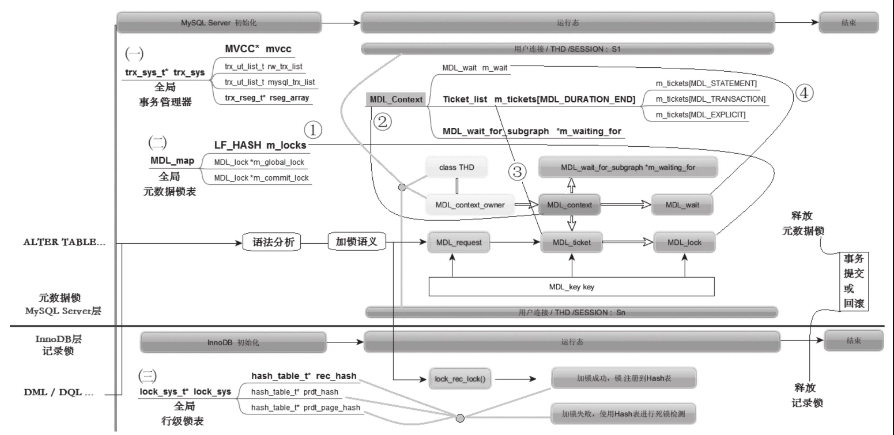

#1.MDL_lock vs rec lock

##· MDL_request：
来自SQL语句语义的加锁请求，不同的SQL语句暗含着不同的加锁语义，语法解析阶段即把加锁的语义分析获得。· 
##MDL_context：
每个会话即用户连接（一个物理的线程）上存在一个元数据锁的上下文，用以表示本会话生命期内（实则是本会话的当前事务生命期内）的各种锁的施加、获得等情况。· 
##MDL_ticket：
表示接收到加锁申请，加锁者买到一张入场券，但需要准备接受安检。安检的结果是：一个加锁请求即MDL_request对象来临后，锁可以被授予也可以被拒绝（被拒绝则发出加锁请求的会话处于等待故设置其MDL_context上的“m_wait”​）​。如果被授予，则生成一个MDL_lock对象，绑定在MDL_ticket对象上，此时加锁请求成功完成。
##· 最后，
图11-1中的带有圆圈的数字1到4，表明了上述逻辑的对应关系。如带有圆圈的数字1表明：MDL_lock对象全部要注册到全局的Hash表“m_locks”里，以便进行锁的查找。

