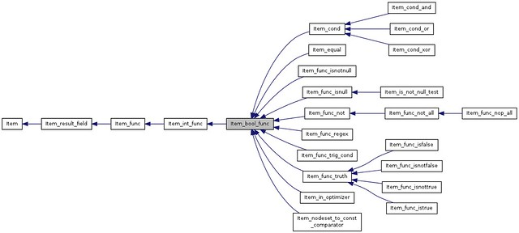

# MySQL源代码：从SQL语句到MySQL内部对象-云栖社区-阿里云

## MySQL源代码：从SQL语句到MySQL内部对象

[orczhou](https://yq.aliyun.com/users/sdivfwknof2zo) 2016-03-28 15:27:47 浏览2165

*   [云数据库RDS](https://yq.aliyun.com/tags/type_blog-tagid_13730/)

### 0 写在前面

本文解决了什么问题：希望通过这些文章能够帮你更加顺畅的理解MySQL优化器的行为；在你阅读MySQL源代码之前了解更多的背后思路。

本文**不解决**什么问题：教你如何读懂源代码；

这个系列很长,大概按这样的思路进行下去: 基本的数据结构、语法解析、JOIN的主要算法、JOIN顺序和单表访问。数据结构(以及他们的关系)和算法流程总是相互穿插介绍。

建议阅读：参考文献中的文章和书籍，都建议在阅读本文之前阅读。

### 1 SQL语句解析基础

#### 1.1 语法解析基础/Flex与Bison

MySQL语法解析封装在函数MYSQLparser中完成。跟其他的语法解析器一样，它包含两个模块：词法分析(Lexical scanner)和语法规则(Grammar rule module)。词法分析将整个SQL语句打碎成一个个单词(Token)，而语法规则模块则根据MySQL定义的语法规则生成对应的数据结构，并存储在对象THD->LEX结构当中。最后优化器，根据这里的数据，生成执行计划，再调用存储引擎接口执行。

词法分析和语法规则模块有两个较成熟的开源工具Flex和Bison分别用来解决这两个问题。MySQL处于性能和灵活考虑，选择了自己完成词法解析部分，语法规则部分使用Bison。词法解析和Bison沟通的核心函数是由词法解析器提供的函数接口yylex()，在Bison中，必要的时候调用yylex()获得词法解析的数据，完成自己的语法解析。Bison的入口时yyparse()，在MySQL中是，MYSQLParse。

如果对词法分析和语法规则模块感到陌生，建议阅读参考文献\[4\]\[5\]\[6\]先注1，否则很难理解整个架构，或者至少会有很强的断层感。而且，根据Bison的Action追踪MySQL数据的存储结构是很有效的。

#### 1.2 MySQL语法解析Sample与示意图

简单的解析过程可以使用下面的示意图说明：

[](https://yq.aliyun.com/go/articleRenderRedirect?url=http%3A%2F%2Fwww.flickr.com%2Fphotos%2F26825745%40N06%2F8137677062%2F "MySQL语法解析说明--1 by orczhou, on Flickr")

具体的解析一个SQL语句的WHERE部分:

[](https://yq.aliyun.com/go/articleRenderRedirect?url=http%3A%2F%2Fwww.flickr.com%2Fphotos%2F26825745%40N06%2F8138271359%2F "MySQL语法解析说明--2 by orczhou, on Flickr")

### 2 SQL语句到MySQL的内部对象

Bison在做语法解析后，会将解析结果（一颗解析树/AST）存储在THD::LEX中。这里将通过考察存储WHERE的数据结构来查看语法解析的结果。

#### 2.1 著名的Item对象

在了解MySQL的解析树之前，我们需要先来认识一个重要的数据结构Item。这是一个基础对象，在优化器部分代码，满地都是。在MySQL Internal Manual中也单独介绍：[The Item Class](https://yq.aliyun.com/go/articleRenderRedirect?url=http%3A%2F%2Fdev.mysql.com%2Fdoc%2Finternals%2Fen%2Fitem-class.html)。

Item是一个基础类，在他的基础上派生了很多子孙。**这些子类基本描述所有SQL语句中的对象**，他们包括：

一个文本字符串/数值对象 一个数据表的某一列（例如，select c1,c2 from dual...中的c1，c2） 一个比较动作，例如c1>10 一个WHERE子句的所有信息 ......

可以看到，Item基本上代码SQL语句中的所有对象。在语法解析树中，这些Item以一颗树的形式存在。示意图如下：

[](https://yq.aliyun.com/go/articleRenderRedirect?url=http%3A%2F%2Fwww.flickr.com%2Fphotos%2F26825745%40N06%2F8137802908%2F "WHERE语法树 by orczhou, on Flickr")

#### 2.2 Bison语法中的WHERE

从SELECT子句开始，我们看到对应的where\_clause就是我们关注的WHERE：

[](https://yq.aliyun.com/go/articleRenderRedirect?url=http%3A%2F%2Fwww.flickr.com%2Fphotos%2F26825745%40N06%2F8137782297%2F "bison_where by orczhou, on Flickr")

我们来看看Bison中的几个重要的Action参考注1：  

```none
where_clause:
        /* empty */ {}
      | WHERE expr
      {
        THD->lex->current_select->where = $2
      }

expr:
      ...
      | expr and expr 
       {
         $$ = new (YYTHD->mem_root) Item_cond_and($1, $3)
       } 
      |ident comp_op NUM   /*这一行并不是源码的一部分，便于理解简化如此*/
      {
         $$ = new Item_func_ge(a, b); /*这一行并不是源码的一部分，便于理解简化如此*/
      }
```

  

根据这里的Bison语法，就可以生产上面的WHERE语法树了。如果你是和我一样刚刚了解Flex/Bison/AST，一定也会决定很巧妙！

#### 2.3 WHERE的数据结构和他们之间的关系

绘制了下面的关系图用来描述WHERE和WHERE解析树的各个分支：

[](https://yq.aliyun.com/go/articleRenderRedirect?url=http%3A%2F%2Fwww.flickr.com%2Fphotos%2F26825745%40N06%2F8137822435%2F "theclassofwhere by orczhou, on Flickr")

例如WHERE条件**WHERE c1="orczhou" and c2 > 10**，WHERE本身(lex->select->where)就是一个Item\_cond\_and对象，这个对象中有一个Item List，将List中每一个Item的值做AND运输，也就是这个WHERE的取值了。

这里，WHERE的List中有两个Item对象，分别代表了c1="orczhou"和c2 > 10。具体的，这两个对象的类型分别是Item\_func\_eq和Item\_func\_gt。

再单独看看Item\_func\_gt(代表c2 > 10)对象，这个对象由Item\_func派生而来（当然追根朔源都是Item的孩儿们），这个对象有成员：Item \*\*args。args则存放了比较操作需要使用的Item。

对于c2 > 10，这个不等式中有两个Item，分别代表字段c2和整数10，存储这两个对象的类型分别是：Item\_field和Item\_int。

#### 2.4 通过GDB打印WHERE对象

WHERE条件是：WHERE id = 531389273 AND reg\_date > '2012-02-12 09';

**打印WHERE中的List**

```none
(gdb) p ((Item_cond *)select_lex->where)->list
$13 = {
  <base_list> = {
    <Sql_alloc> = {<No data fields>}, 
    members of base_list: 
    first = 0x7f5bbc005860, 
    last = 0x7f5bbc005870, 
    elements = 2
  }
```

因为WHERE有两个判断，所以这里list中有两个元素。

**打印list中的第一个判断（id = 531389273）**

```none
(gdb) p *(Item_func *)((Item_cond *)select_lex->where)->list->first->info
$69 = {
  <Item_result_field> = {
    <Item> = {
      ......
      next = 0x7f2134005320, 
      ......
    }, 
    ......
  }, 
  members of Item_func: 
  args = 0x7f2134005420, 
  tmp_arg = {0x7f2134005228, 0x7f2134005320},
  arg_count = 2, 
  .......
}
```

这里等于操作有两个操作元素（arg\_count=2），并以数组的形式存储在args中

**打印上面等式的第一个对象（也就是id）**

>   
> 
> ```none
> 打印第一个Item的类型
> p ((Item_func *)((Item_cond *)select_lex->where)->list->first->info)->args[0]->type()
> $74 = Item::FIELD_ITEM
> 将第一个Item转换成正确的类型再打印
> p *(Item_field *)((Item_func *)((Item_cond *)select_lex->where)->list->first->info)->args[0]
> $78 = {
>   <Item_ident> = {
>     <Item> = {
>       .......
>       name = 0x7f2134005208 "id", 
>       ......
>     }, 
>     ......
>     members of Item_ident: 
>     orig_field_name = 0x7f2134005208 "id", 
>     field_name = 0x7f2134005208 "id",
>     ....... 
>   }, 
>   members of Item_field: 
>   field = 0x0, 
>   result_field = 0x0,
>   ....... 
> }
> ```
> 
>   

可以看到这里的id对象的类型是Item::FIELD\_ITEM，也就是Item\_field类型。

### 3 关于Item对象

继续从存储WHERE的Item\_cond\_and对象开始：

[](https://yq.aliyun.com/go/articleRenderRedirect?url=http%3A%2F%2Fwww.flickr.com%2Fphotos%2F26825745%40N06%2F8138322215%2F "classItem__bool__func__inherit__graph by orczhou, on Flickr")

([点击可以查看大图](https://yq.aliyun.com/go/articleRenderRedirect?url=http%3A%2F%2Fwww.flickr.com%2Fphotos%2F26825745%40N06%2F8138322215%2Fsizes%2Fl%2Fin%2Fphotostream%2F))

看到Item\_cond\_and的继承关系：Item\_cond->Item\_bool\_func->......->Item\_result\_filed->Item

Item一个很重要的成员函数就是type，所以在gdb的时候如果不清楚Item的类型，可以调用该方法确定：  

```none
(gdb) p ((*(Item_func *)thd->lex->current_select->where)->tmp_arg[0])->type()
$42 = Item::FIELD_ITEM
```

  

这篇文章就到这吧，希望能够继续下去。

版权声明：本文内容由互联网用户自发贡献，版权归作者所有，本社区不拥有所有权，也不承担相关法律责任。如果您发现本社区中有涉嫌抄袭的内容，欢迎发送邮件至：[yqgroup@service.aliyun.com](mailto:yqgroup@service.aliyun.com) 进行举报，并提供相关证据，一经查实，本社区将立刻删除涉嫌侵权内容。

---------------------------------------------------


原网址: [访问](https://yq.aliyun.com/articles/11255?type=2)

创建于: 2020-05-24 16:46:07

目录: default

标签: `yq.aliyun.com`

