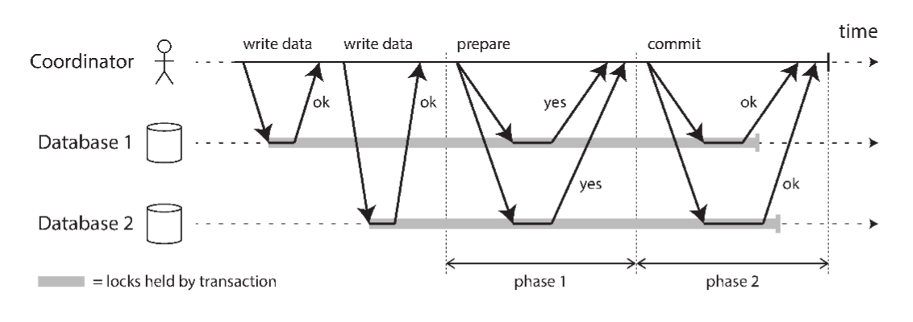
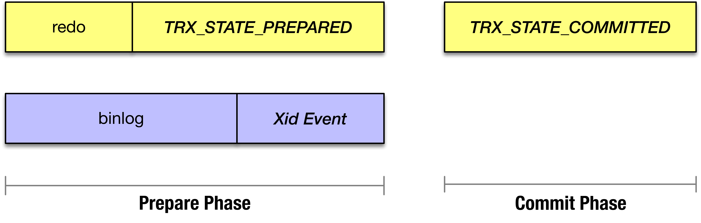

# [MySQL 5.6：事务模型]

## 两阶段提交

在讲述MySQL的事务模型之前，有必要介绍一下两阶段提交，参考《Designing Data-Intensive Application》



*   【STEP 1】应用程序通知协调者开始事务，并告知协调者事务的内容
*   【STEP 2】协调者给每个参与者发送单节点的读/写事务（对应于图中两个write data）
*   【STEP 3】协调者给每个参与者发送Prepare请求
*   【STEP 4】如果参与者回复“Yes”，意味着参与者放弃自身中止事务的权力，无论出现何种状况也必须自身提交事务
*   【STEP 5】协调者收到所有参与者的回复后，做出最终决定（只有所有回复都是“Yes”，最终决定才是“Commit”），并将决定**持久化**
*   【STEP 6】如果协调者最终决定是“Commit”，意味着无论发生何种状况，协调者也要保证所有参与者都提交成功

两阶段提交的原子性由【4】和【6】保证，称作**“Two Points of No Return”**

注意：在【2】【3】间，协调者没必要再去询问每一位参与者“【1】中的读/写事务有没有执行成功？”，因为如果有参与者在执行失败的话，可以在收到Prepare请求时回复“No”

*   称【1】为**事务开始阶段**
*   称【2】为**事务执行阶段**
*   称【3】-【6】为**事务提交阶段**
    *   【3】【4】也叫Prepare阶段
    *   【5】【6】也叫Commit阶段

## MySQL的事务模型

#### 事务开始

注意，下面的列表由上至下表示由先到后的执行顺序

```plain
BEGIN;
```

*   检查是否有活跃的事务还未提交，如果有的话则调用`ha_commit_trans`提交之前的事务，并释放之前事务持有的MDL锁
*   开启一个事务，事务状态为**ACTIVE**

#### 事务执行

```plain
INSERT INTO t VALUES (1);
```

*   【InnoDB】
    *   产生Undo（内存）日志，产生“修改Undo日志行为”的Redo（内存）日志
    *   **MTR**：修改内存中的数据页，产生“修改数据页行为”的Redo（内存）日志
    *   将修改的数据页（脏页）加入Flush List中（Cleaner线程异步地刷脏页到磁盘的数据文件中）
    *   将线程产生的私有的Redo日志提交到公共的Redo Log Buffer
*   【Server】
    *   产生Binlog（内存）日志
*   【语句提交】
    *   【Binlog Prepare】binlog\_prepare：什么都不做
    *   【InnoDB Prepare】innobase\_xa\_prepare：释放可能持有的自增键锁
    *   【Binlog Commit】binlog\_commit：什么都不做
    *   【InnoDB Commit】innobase\_commit：同【InnoDB Prepare】

可以看到，在事务执行阶段，MySQL加入了“语句提交”这一两阶段提交过程，但是Binlog在Prepare和Commit阶段的内容都为空，因此实质上只是InnoDB的单节点提交

#### 事务提交

```plain
COMMIT;
```

*   【Binlog Prepare】binlog\_prepare：什么都不做
*   【InnoDB Prepare】innobase\_xa\_prepare：
    *   【1】将事务状态置为**PREPARED**
    *   【2】将Redo日志写入磁盘
*   【Commit】  
    *   【0】**在Binlog中产生Xid\_log\_event**
    *   【1】Flush Stage：   将Binlog内容写入Binlog日志文件（操作系统的Page Cache中，尚未落盘）
    *   【2】Sync Stage：    将Binlog文件落盘
    *   【3】Commit Stage：存储引擎提交（此处以InnoDB为例）  
         **注意：以下所有动作产生的Redo日志在一个MTR内（MTR能保证其包含的所有日志如果只有部分落盘**  
         **在Crash Recovery时会被丢弃）**  
        *   清理insert\_undo日志
        *   将update\_undo日志加入回滚段的History-List（Purge线程定期清理）
        *   释放事务持有的所有锁（比如，修改同一行记录的事务需要有互斥锁）
        *   清理（如果有的话）Savepoint列表
        *   内存中事务结构体的状态置为**COMMITTED（准确的是TRX\_STATE\_COMMITTED\_IN\_MEMORY****）**
        *   Undo日志中事务的状态**TRX\_UNDO\_CACHED** / **TRX\_UNDO\_TO\_FREE** / **TRX\_UNDO\_TO\_PURGE**（在Crash Recovery时，读到这三种状态都会将事务内存结构置为**TRX\_STATE\_COMMITTED\_IN\_MEMORY**）

```plain
--- 代码调用路径
mysql_execute_command
  |-trans_commit
    |-ha_commit_trans // MySQL Server和存储引擎做两阶段提交
      |-MYSQL_BIN_LOG::prepare(tc_log->prepare) // TC_LOG就是Transaction Coordinator Log，MYSQL_BIN_LOG是TC_LOG的一个继承类
      // 以下是因为Binlog的使用，导致Binlog和存储引擎必须做的二阶段提交，MMAP_LOG没有Prepare阶段
        |-ha_prepare_low
          |-binlog_prepare
          |-innobase_xa_prepare
      |-MYSQL_BIN_LOG::commit(tc_log->commit)
        |-ordered_commit:
          |-Flush Stage
          |-Sync Stage
          |-Commit Stage
          |-finish_commit
        |-ha_commit_low
          |-binlog_commit
          |-innobase_commit
```

## MySQL的两阶段提交

MySQL为什么需要两阶段提交？

```plain
-- handler.cc
 
Transaction handling in the server
==================================
...
Since MySQL supports PSEA (pluggable storage engine
architecture), more than one transactional engine can be
active at a time. Hence transactions, from the server
point of view, are always distributed. In particular,
transactional state is maintained independently for each
engine. In order to commit a transaction the two phase
commit protocol is employed.
...
```

因为MySQL支持PSEA（插件式存储引擎结构），所有的事务在MySQL Server的观点来看，都是_**分布式的。**_因此，MySQL的事务提交需要原子提交协议，即两阶段提交：

*   MySQL Server是协调者（Coordinator），也作为一个参与者（Parpicipant）
*   事务中的所有存储引擎都是参与者（Parpicipant）

在[WL#5223: Group Commit of Binary Log](https://dev.mysql.com/worklog/task/?id=5223) 里特提到了这一点

```plain
5. The binary log works as both a storage engine and a transaction
   coordinator making it difficult to maintain and evolve.
```

### MySQL 5.6之前

  



  

MySQL 5.6之前还没有（Binlog）Group Commit，MySQL的二阶段提交实现（注意事务在MySQL Server和InnoDB中提交成功的语义不同。MySQL Server中，事务提交成功即“写入Binlog”）

Prepare阶段（**有顺序**）：

1.  InnoDB：将事务的Redo写盘
2.  MySQL Server：将事务的Binlog写盘，包括（Xid Event）

（**如果Coordinator决策提交，复用Xid Event作为其COMMIT记录**）

Commit阶段：

*   MySQL Server：无
*   InnoDB：释放事务占用的锁（2 Phase Locking），写入InnoDB COMMIT记录（表明在该参与者中提交）

需要注意：**事务是否在MySQL中提交，是以Coordinator的COMMIT记录为准（Xid Event）**

### MySQL 5.6之后

我们考虑Group Commit出现之后（MySQL 5.6+）

Prepare阶段动作无，Commit阶段的行为是

Flush & Sync Stage：

1.  事务修改数据页产生的Redo
2.  事务的Binlog写盘，包括Xid Event（Binlog Commit Record）

Commit Stage：

1.  TRX\_STATE\_COMMITED（Redo Commit Record）

发现与MySQL 5.6之前的动作顺序没有任何区别，只是将Prepre / Commit直接混淆为Commit阶段了

### MySQL的两阶段提交是否标准？

MySQL的实现与标准的两阶段提交区别主要在于两点：

*   MySQL Server协调者是其中一个参与者（主要的，导致MySQL Server复用Xid Event即作为协调者的COMMIT记录，也作为参与者的COMMIT记录）
*   事务在MySQL Server中提交的语义是Binlog写盘（而典型的应该是InnoDB中事务的ACID特性）

### MySQL（两阶段提交）的故障恢复

考虑故障（简单的，只考虑OS / DB Crash）发生的时间点：

#### Xid Event之前发生

事务（在两个参与者中）被回滚：

*   MySQL Server：截断Binlog中该未提交事务的部分（PART3 PART4）
*   InnoDB：使用Undo日志回滚该事务

#### Xid Event之后，TRX\_STATE\_COMMITTED之前发生

即在MySQL Server中已经提交，在InnoDB中未提交。我们通常认为事务提交之后便不可撤销（ACID中的D），因此使用在InnoDB中重新提交该事物

*   InnoDB：重新提交该事务，即产生Commit Record（TRX\_STATE\_COMMITED）

#### TRX\_STATE\_COMMITTED之后发生

即在MySQL Server和InnoDB中均已提交，无任何动作

### 事务提交的顺序一致性？

在MySQL 5.5中臭名昭著的prepare\_commit\_mutex就是为了保护事务提交的顺序一致性：

*   在MySQL Server和InnoDB中，事务的提交顺序一致

即Binlog里记录的事务提交（Xid Event）顺序与InnoDB中记录的事务提交（TRX\_STATE\_COMMITED）顺序一致。在MySQL 5.5.40中存在注释

```plain
/* For ibbackup to work the order of transactions in binlog
   and InnoDB must be the same. Consider the situation
 
      thread1> prepare; write to binlog; ...
        <context switch>
      thread2> prepare; write to binlog; commit
      thread1>           ... commit
 
   To ensure this will not happen we're taking the mutex on
   prepare, and releasing it on commit.
   ...
*/
mysql_mutex_lock(&prepare_commit_mutex);
```

主要是为了保证InnoDB热备份（Xtrabackup）的正确性，考虑如下场景：

1.  Thread 1：prepare; write to binlog; ...
2.  Thread 2：prepare; write to binlog; commit
3.  **（Xtrabackup备份结束）**
4.  Thread 2： ... commit

在Xtrabackup执行崩溃恢复时（–prepare），Thread 1的事务会被回滚。但在MySQL中，Thread 1的事务提交。而此时InnoDB记录的Binlog位置会包含Thread 1和Thread 2的Binlog

 

