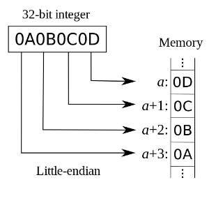
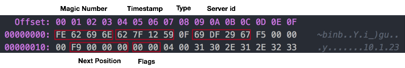

*   [F收藏](# "收藏 (f)")
*   [关注](# "关注(w)")
*   [S分享](# "Share this page with others (s或 k)")
*   [空间管理员](# "查看空间管理员")

1.  [页面](http://wiki.baidu.com/collector/pages.action?key=MySQLNotes&src=breadcrumbs-collector)
2.  [MySQL Notes](http://wiki.baidu.com/display/MySQLNotes/MySQL+Notes?src=breadcrumbs)
3.  [MySQL](http://wiki.baidu.com/display/MySQLNotes/MySQL?src=breadcrumbs-parent)

[跳到banner的尾部](#page-banner-end)

[回到标题开始](#page-banner-start)

# [Percona & MariaDB & MySQL Binlog 格式对比](http://wiki.baidu.com/pages/viewpage.action?pageId=327226075)

[转至元数据结尾](#page-metadata-end)

*   由 [吴昊](http://wiki.baidu.com/display/~wuhao27)创建, 最后修改于[2017-05-25](http://wiki.baidu.com/pages/diffpagesbyversion.action?pageId=327226075&selectedPageVersions=29&selectedPageVersions=30 "查看变更")

[转至元数据起始](#page-metadata-start)

## 概念

*   binlog的记录方式有statement、row、mixed三种，这里不细致分析三种记录方式，而重点说明binlog的存储格式
*   binlog的存储格式至今演变了4个版本，从MySQL 5.0至今使用的是binlog v4，以下介绍也是**v4版本**
*   每一个binlog都由**Magic Number + Log Event**组成

###  Magic Number

4字节常量（在log\_event.h中定义）

```plain
-- MySQL 5.6.23 log_event.h
/* 4 bytes which all binlogs should begin with */
#define BINLOG_MAGIC        "\xfe\x62\x69\x6e"
```

### Log Event

每一个log event包含header和data两部分

*   **header**
    
    header部分提供的是event的公共的类型信息，包括event的类型、创建时间等等，其中x由**LOG\_EVENT\_HEADER\_LEN**定义为19，因此extra\_headers目前为空
    
*   **data**
    
    提供的是针对该event的具体信息，如具体数据的修改
    

```plain
+=====================================+
| event  | timestamp         0 : 4    |
| header +----------------------------+
|        | type_code         4 : 1    |
|        +----------------------------+
|        | server_id         5 : 4    |
|        +----------------------------+
|        | event_length      9 : 4    |
|        +----------------------------+
|        | next_position    13 : 4    |
|        +----------------------------+
|        | flags            17 : 2    |
|        +----------------------------+
|        | extra_headers    19 : x-19 |
+=====================================+
| event  | fixed part        x : y    |
| data   +----------------------------+
|        | variable part              |
+=====================================+
```

具体实现方式为在log\_event.h中由class Log\_event作为基类，其余类型的event继承自Log\_event（比如class Query\_log\_event），然后添加各自的特有的成员变量

*   所有Event的header size相同（v4目前为19个字节）
*   同一个Event Type（例如Query Event）的所有Event的fixed part size相同
*   同一个Event Type的所有Event的variable part size可能不同

## 详细说明

Binlog记录的是二进制日志，采用的是**[小端序](https://zh.wikipedia.org/wiki/%E5%AD%97%E8%8A%82%E5%BA%8F)**

### 小端序

在几乎所有的机器上，多字节对象都被存储为连续的字节序列。例如在[C语言](https://zh.wikipedia.org/wiki/C%E8%AF%AD%E8%A8%80 "C语言")中，一个类型为`int`的变量`x`地址为`0x100`，那么其对应地址表达式`&x`的值为`0x100`。且`x`的四个字节将被存储在[存储器](https://zh.wikipedia.org/wiki/%E5%AD%98%E5%82%A8%E5%99%A8 "存储器")的`0x100, 0x101, 0x102, 0x103`位置。而存储地址内的排列则有两个通用规则：一个多位的整数将按照其存储地址的最低或最高字节排列：

*   如果最低有效位在最高有效位的后面，则称**大端序**
*   如果最低有效位在最高有效位的前面，则称**小端序。**小端序如下图所示：



而地址的显示按照由低至高的顺序后，即Memory\[a\]-Memory\[a+1\]-Memory\[a+2\]-Memory\[a+3\]，显示结果为**0D0C0B0A**

### 举例

以下是format description event的十六进制码

  

那么，因为是小端序，所以Server id就应该是6729df69。注意：因为字节是计算机寻址的[最小单位](https://zh.wikipedia.org/wiki/%E6%9C%80%E5%B0%8F%E5%AF%BB%E5%9D%80%E5%8D%95%E4%BD%8D)，所以只需要将字节序倒序即可

## 对比

针对**Percona 5.6.36-82.0**，**MySQL 5.6.23**和**MariaDB 10.1.22**在binlog存储格式上做详细对比（以下说明均为此版本基础上，不再具体指明）

### MariaDB & MySQL

MariaDB和MySQL binlog存储格式中header部分的event类型（event type）存在区别，event type标识了事件的类型，如Query\_log\_event用于标识修改数据库的操作（update、delete等）

event type由枚举类型**Log\_event\_type**定义

```plain
-- MariaDB 10.1.22 log_event.h
enum Log_event_type
{
  /*
    Every time you update this enum (when you add a type), you have to
    fix Format_description_log_event::Format_description_log_event().
  */
  UNKNOWN_EVENT= 0,
  START_EVENT_V3= 1,
  QUERY_EVENT= 2,
  ...
}
```

**区别主要在于一些EVENT：**

| 
Event Type

 | 

枚举常量

 | 

类别

 | 

说明

 | 

MariaDB 10.1.22

 | 

MySQL 5.6.23

 |
| --- | --- | --- | --- | --- | --- |
| 

**WRITE\_ROWS\_EVENT\_V1**

**UPDATE\_ROWS\_EVENT\_V1**

**DELETE\_ROWS\_EVENT\_V1**


 | 

23

24

25


 |   | 

 | 不支持 | 

不支持

（只在5.1.16 - 5.6.6支持）

 |
| 

**IGNORABLE\_LOG\_EVENT**

**ROWS\_QUERY\_LOG\_EVENT**

 | 

28

29

 |   | 

向Slave发送可的被Slave忽略的Event，其中**ROWS\_QUERY\_LOG\_EVENT**在MariaDB中由**ANNOTATE\_ROWS\_EVENT**替代

(In some situations, it is necessary to send over ignorable

data to the slave: data that a slave can handle in case there

is code for handling it, but which can be ignored if it is not

recognized.)


 | 不支持（忽略） | 支持 |
| 

**GTID\_LOG\_EVENT**

**ANONYMOUS\_GTID\_LOG\_EVENT**

**PREVIOUS\_GTIDS\_LOG\_EVENT**


 | 

33

34

35


 | 事务 |   | 不支持（忽略） | 支持 |
| 

**MYSQL\_EVENTS\_END**

**MARIA\_EVENTS\_BEGIN**

 | 

39

160

 |   | 

标识MySQL Event的结束，MariaDB Event的开始

 | 支持 | 无 |
| **ANNOTATE\_ROWS\_EVENT** | 160 |   | 

在行模式下设置为ON后，在Table\_map\_log\_events的事件组之前，会加入**ANNOTATE\_ROWS\_EVENT**，包含着引起行变化的语句

 | 支持 | 无 |
| **BINLOG\_CHECKPOINT\_EVENT** | 161 | 事务 | 在主库上的XA事物崩溃后的恢复，不用于从库 | 支持 | 无 |
| **GTID\_EVENT** | 162 | 事务 | 为MariaDB增加的Event | 支持 | 无 |
| **GTID\_LIST\_EVENT** | 163 | 事务 | 为MariaDB增加的Event | 支持 | 无 |
| **START\_ENCRYPTION\_EVENT** | 164 | 加密 | 

为MariaDB增加的Event

标识了加密数据的起始点

 | 支持 | 无 |

### Percona & MySQL

Percona和MySQL在binlog的Log\_event\_type没有任何区别

  

  

  

赞成为第一个赞同者

*   无标签
*   [编辑标签](# "编辑标签 (l)")

[](http://wiki.baidu.com/users/profile/editmyprofilepicture.action)

编写评论...

---------------------------------------------------


原网址: [访问](http://wiki.baidu.com/pages/viewpage.action?pageId=327226075)

创建于: 2020-06-07 20:47:22

目录: default

标签: `wiki.baidu.com`

