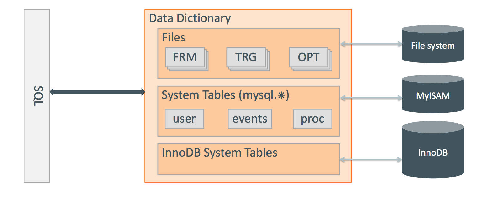
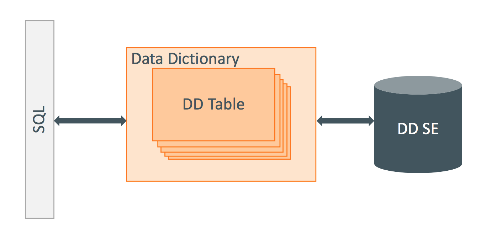
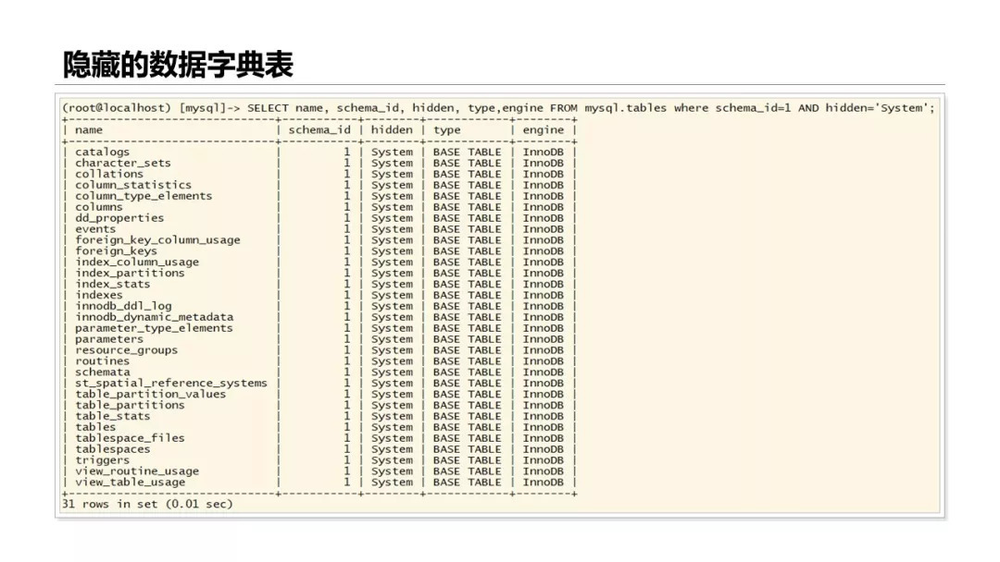

# [GaiaDB: MySQL 8.0 Atomic DDL]


# 一、Transactional Data Dictionary 

## 0\. DDL 概述

MySQL 8.0 对 DD 系统表也就是元数据系统表做了重新设计，使得 DDL 以及 Information\_schecma获得了新的特性，

DDL可以是原子执行的，即可 RollForward 或者 RollBack。

在 Mysql 8.0 之前，系统元数据信息存在于各个物理文件中：FRM / PAR / TRN / TRG / DB.OPT / ISL 文件等。独立

于Innodb引擎，所以DDL无法做到DDL原子性，可能会出现表不可用的情况。

所以 Mysql 8.0 独立了系统元数据，将之称为 DDSE，系统元数据引擎。DDSE 给SQL层和InnoDB层(支持原子DDL

的引擎)提供了调用接口，确保DDL要么全做完，要么完全没有做。实现的主要思想就是：将DDL涉及到的元数据修改

以及引擎层的物理文件修改都使用一个**事务**去完成，利用事务的原子性去完成DDL的原子性。

## 1\. DD 引入前后对比

Mysql Data Dictionary before MySQL 8.0



8.0之前Data Dictionary存在于 文件系统支持的FRM TRG OPT文件、非事务性存储引擎MyISAM(事件、存储过程等)

以及InnODB系统表中(表定义，列定义，外键约束等)。

这就导致了在DDL执行过程中的两次提交问题，InnoDB提交了，但是SQL层还未提交就Crash，重启后上下两层的定义

不一致(FRM文件未更新，新定义的FRM还没有Rename)，就导致DDL失败。

  

Mysql Data Dictionary In MySQL 8.0



8.0中依靠Innodb事务引擎实现了DD SE，一套专门为DDL设计的元数据信息管理引擎(元数据引擎，不是存储引擎)，对

每个DDL(parser后)先记录其日志(此DDL会如何执行，DDL Log)，并开启一个事务向元数据引擎(表mysql.innodb\_ddl\_log)

中插入一个entry(row)，执行DDL操作，执行成功，提交事务，删除日志。如果执行失败事务没有提交，那么rollback，如

果执行成功只是事务没有提交则前滚提交。可以开启[`innodb_print_ddl_logs`](https://dev.mysql.com/doc/refman/8.0/en/innodb-parameters.html#sysvar_innodb_print_ddl_logs) 参数，查看ddl log.

## 2\. DD 系统表

  

8.0中的数据字典表默认对用户不可见，是系统表，包含列，索引，表空间，表文件，触发器，函数等系统元数据。



## 3\. DDL 原子性原理

实现DDL原子性的关键在于：元数据修改，引擎层物理文件修改，BINLOG写入，这三个步骤都是一个事务去完成，要么

全部完成，要么全部都不做。

1.  元数据，由于是Innodb的表，可以支持事务的原子性，事务不提交，可以回滚，也可以CrashSafe
2.  Binlog写入，标志这个事务有没有真正成功，CrashRecovery的时候，如果对元数据的修改这个事务在Binlog中，就是成功。  
    否则就是失败，需要回滚。
3.  InnoDB对物理文件的修改如何做到可回滚？这就需要对DDL操作记录对应的日志：DDL LOG，将一个物理操作的逆操作记录  
    到DDL LOG中，实现可回滚。这些日志也会记录redo log，和正常的row一样。

DDL LOG记录了对物理文件的操作，类型如下：

| 
DDL Log\_Type 8 种

 | 

释义

 |
| --- | --- |
| 

DELETE\_SPACE\_LOG

 | 删除 Space file |
| 

FREE\_TREE\_LOG

 | 释放一个Btree |
| 

RENAME\_TABLE\_LOG

 | 

rename table in dict cache

 |
| 

RENAME\_SPACE\_LOG

 | 

rename space file

 |
| 

DROP\_LOG

 | 某个table id的元数据要删除。 |
| 

REMOVE\_CACHE\_LOG

 | 从Dict Cache中移除一个table |
| 

ALTER\_ENCRYPT\_TABLESPACE\_LOG

 | 

Alter Encrypt

 |

## 3\. DDL 执行过程 & Crash Recovery

DDL 的执行分为：Execute 和 Post 两个阶段。

1.  Execute阶段就是DDL的正常的执行：prepare + perform + commit，只不过执行过程中不断产生 DDL LOG，不断删除DDL LOG  
    被删除的DDL LOG在COMMIT后就生效了。
2.  POST DDL阶段就是：REPALY DDL LOG + DELETE DDL LOG，post ddl log在事务提交或者回滚后就被删除了。

DDL 的Crash Recovery：元数据中没有提交，或者提交了但是Binlog中没有，则按照DDL LOG回滚。如果元数据的事务提交了则查看

有没有剩余的DDL LOG，有则回放并删除DDL LOG，没有就是已经提交完成。

#   
二、 Atomic DDL USE CASE

## 1 . CREATE TABLE

<table class="relative-table wrapped confluenceTable" style="width: 47.337%;"><colgroup><col style="width: 96.6667%;"><col style="width: 3.33333%;"></colgroup><tbody><tr><td colspan="1" class="confluenceTd"><p>[InnoDB] InnoDB: DDL log insert : [DDL record: DELETE SPACE, id=201, thread_id=11, space_id=39, old_file_path=./test001/t1.ibd]</p><p>[InnoDB] InnoDB: DDL log delete : by id 201</p><p>[InnoDB] InnoDB: DDL log insert : [DDL record: REMOVE CACHE, id=202, thread_id=11, table_id=1096, new_file_path=test001/t1]<br>[InnoDB] InnoDB: DDL log delete : by id 202</p><p>[InnoDB] InnoDB: DDL log insert : [DDL record: FREE, id=203, thread_id=11, space_id=39, index_id=201, page_no=4]<br>[InnoDB] InnoDB: DDL log delete : by id 203</p></td><td colspan="1" class="confluenceTd"><p>DDL</p><p>Execute&amp;Commit</p></td></tr><tr><td colspan="1" class="confluenceTd"><p>Post_DDL:</p><p>[InnoDB] InnoDB: DDL log post ddl : begin for thread id : 11</p><p>// replay nothing here<br>[InnoDB] InnoDB: DDL log post ddl : end for thread id : 11</p></td><td colspan="1" class="confluenceTd">DDL Post</td></tr></tbody></table>

Create Table 调用栈：

**Create table**

```plain
Sql_cmd_create_table::execute
-->mysql_create_table
  -->mysql_create_table_no_lock
     -->create_table_impl
        -->rea_create_base_table
           -->ha_create_table
              -->ha_create
                 -->ha_innobase::create
                    -->innobase_basic_ddl::create_impl
                       -->create_table_info_t::create_table
                       {
                          ......
                       }
  
  -->trans_commit_implicit
     -->ha_commit_trans
        -->MYSQL_BIN_LOG::prepare
           -->ha_prepare_low  //所有事务引擎prepare
              {
                binlog_prepare
                innobase_xa_prepare
              }
        -->MYSQL_BIN_LOG::commit
           -->MYSQL_BIN_LOG::ordered_commit
              -->MYSQL_BIN_LOG::process_flush_stage_queue
                 -->MYSQL_BIN_LOG::flush_thread_caches
                    -->binlog_cache_mngr::flush
                       -->binlog_cache_data::flush
                          -->MYSQL_BIN_LOG::write_gtid
                             -->Log_event::write
                                -->MYSQL_BIN_LOG::Binlog_ofile::write  //写binlog-gtid
  
                          -->MYSQL_BIN_LOG::write_cache
                             --> MYSQL_BIN_LOG::do_write_cache
                                 -->Binlog_cache_storage::copy_to
                                    -->stream_copy
                                       -->Binlog_event_writer::write
                                          -->MYSQL_BIN_LOG::Binlog_ofile::write //写binlog-ddl语句
              -->MYSQL_BIN_LOG::sync_binlog_file
              -->MYSQL_BIN_LOG::process_commit_stage_queue
                 -->ha_commit_low
                    {
                       binlog_commit
                       innobase_commit
                       -->trx_commit_for_mysql
                          -->trx_commit
                              -->trx_commit_low
                                 -->trx_commit_in_memory
                                    -->trx_undo_insert_cleanup
                    }
  
  -->innobase_post_ddl(ht->post_ddl(thd))
     -->Log_DDL::post_ddl
        -->replay_by_thread_id
```

  

## 2 . 加列 (instant) 

  

| 
【Prepare + perform + commit】 + 【post DDL】

 | 

  


 |
| --- | --- |
| 

InnoDB: DDL log insert : \[DDL record: DELETE SPACE, id=204, thread\_id=11, space\_id=40, old\_file\_path=./test001/#sql-ib1096-2677297517.ibd\]

InnoDB: DDL log delete : by id 204

InnoDB: DDL log insert : \[DDL record: REMOVE CACHE, id=205, thread\_id=11, table\_id=1097, new\_file\_path=test001/#sql-ib1096-2677297517\]

InnoDB: DDL log delete : by id 205

InnoDB: DDL log insert : \[DDL record: FREE, id=206, thread\_id=11, space\_id=40, index\_id=202, page\_no=4\]

InnoDB: DDL log delete : by id 206

InnoDB: DDL log insert : \[DDL record: RENAME SPACE, id=208, thread\_id=11, space\_id=39, old\_file\_path=./test001/#sql-ib1097-2677297518.ibd, new\_file\_path=./test001/t1.ibd\]

InnoDB: DDL log delete : by id 208

InnoDB: DDL log insert : \[DDL record: RENAME TABLE, id=209, thread\_id=11, table\_id=1096, old\_file\_path=test001/#sql-ib1097-2677297518, new\_file\_path=test001/t1\]

InnoDB: DDL log delete : by id 209

InnoDB: DDL log insert : \[DDL record: RENAME SPACE, id=210, thread\_id=11, space\_id=40, old\_file\_path=./test001/t1.ibd, new\_file\_path=./test001/#sql-ib1096-2677297517.ibd\]

InnoDB: DDL log delete : by id 210

DDL log insert : \[DDL record: RENAME TABLE, id=211, thread\_id=11, table\_id=1097, old\_file\_path=test001/t1, new\_file\_path=test001/#sql-ib1096-2677297517\]

InnoDB: DDL log delete : by id 211

InnoDB: DDL log insert : \[DDL record: DROP, id=212, thread\_id=11, table\_id=1096\]  
InnoDB: DDL log insert : \[DDL record: DELETE SPACE, id=213, thread\_id=11, space\_id=39, old\_file\_path=./test001/#sql-ib1097-2677297518.ibd\]

 | 

DDL

Execute

  

NOTE：末尾

两条ddl log未删除。

 |
| 

DDL log post ddl : begin for thread id : 11  
InnoDB: DDL log replay : \[DDL record: DELETE SPACE, id=213, thread\_id=11, space\_id=39, old\_file\_path=./test001/#sql-ib1097-2677297518.ibd\]

InnoDB: DDL log replay : \[DDL record: DROP, id=212, thread\_id=11, table\_id=1096\]  
InnoDB: DDL log replay : \[DDL record: DROP, id=207, thread\_id=11, table\_id=1096\]

InnoDB: DDL log post ddl : end for thread id : 11

 | Post DDL |

## 3.  加列 (INPLACE)

| 
  


 | 

  


 |
| --- | --- |
| 

PREPARE：

2019-10-21T09:07:40.248237Z 15 \[Note\] \[MY-012473\] \[InnoDB\] InnoDB: DDL log insert : \[DDL record: DELETE SPACE, id=254, thread\_id=15, space\_id=46, old\_file\_path=./test001/#sql-ib1102-2677297525.ibd\]

2019-10-21T09:07:40.248333Z 15 \[Note\] \[MY-012478\] \[InnoDB\] InnoDB: DDL log delete : by id 254

2019-10-21T09:07:40.249915Z 15 \[Note\] \[MY-012477\] \[InnoDB\] InnoDB: DDL log insert : \[DDL record: REMOVE CACHE, id=255, thread\_id=15, table\_id=1103, new\_file\_path=test001/#sql-ib1102-2677297525\]  
2019-10-21T09:07:40.249956Z 15 \[Note\] \[MY-012478\] \[InnoDB\] InnoDB: DDL log delete : by id 255  
  

2019-10-21T09:07:40.250367Z 15 \[Note\] \[MY-012472\] \[InnoDB\] InnoDB: DDL log insert : \[DDL record: FREE, id=256, thread\_id=15, space\_id=46, index\_id=208, page\_no=4\]  
2019-10-21T09:07:40.250392Z 15 \[Note\] \[MY-012478\] \[InnoDB\] InnoDB: DDL log delete : by id 256

EXECUTE：无DDL LOG

COMMIT：

1.  
2019-10-21T09:07:40.251158Z 15 \[Note\] \[MY-012475\] \[InnoDB\] InnoDB: DDL log insert : \[DDL record: DROP, id=257, thread\_id=15, table\_id=1102\]

2.

2019-10-21T09:07:40.251559Z 15 \[Note\] \[MY-012474\] \[InnoDB\] InnoDB: DDL log insert : \[DDL record: RENAME SPACE, id=258, thread\_id=15, space\_id=45, old\_file\_path=./test001/#sql-ib1103-2677297526.ibd, new\_file\_path=./test001/t1.ibd\]  
2019-10-21T09:07:40.251585Z 15 \[Note\] \[MY-012478\] \[InnoDB\] InnoDB: DDL log delete : by id 258

2019-10-21T09:07:40.252045Z 15 \[Note\] \[MY-012476\] \[InnoDB\] InnoDB: DDL log insert : \[DDL record: RENAME TABLE, id=259, thread\_id=15, table\_id=1102, old\_file\_path=test001/#sql-ib1103-2677297526, new\_file\_path=test001/t1\]  
2019-10-21T09:07:40.252067Z 15 \[Note\] \[MY-012478\] \[InnoDB\] InnoDB: DDL log delete : by id 259

3.

2019-10-21T09:07:40.252420Z 15 \[Note\] \[MY-012474\] \[InnoDB\] InnoDB: DDL log insert : \[DDL record: RENAME SPACE, id=260, thread\_id=15, space\_id=46, old\_file\_path=./test001/t1.ibd, new\_file\_path=./test001/#sql-ib1102-2677297525.ibd\]  
2019-10-21T09:07:40.252443Z 15 \[Note\] \[MY-012478\] \[InnoDB\] InnoDB: DDL log delete : by id 260

2019-10-21T09:07:40.252841Z 15 \[Note\] \[MY-012476\] \[InnoDB\] InnoDB: DDL log insert : \[DDL record: RENAME TABLE, id=261, thread\_id=15, table\_id=1103, old\_file\_path=test001/t1, new\_file\_path=test001/#sql-ib1102-2677297525\]  
2019-10-21T09:07:40.252864Z 15 \[Note\] \[MY-012478\] \[InnoDB\] InnoDB: DDL log delete : by id 261  
4.

2019-10-21T09:07:40.253680Z 15 \[Note\] \[MY-012475\] \[InnoDB\] InnoDB: DDL log insert : \[DDL record: DROP, id=262, thread\_id=15, table\_id=1102\]  
2019-10-21T09:07:40.253708Z 15 \[Note\] \[MY-012473\] \[InnoDB\] InnoDB: DDL log insert : \[DDL record: DELETE SPACE, id=263, thread\_id=15, space\_id=45, old\_file\_path=./test001/#sql-ib1103-2677297526.ibd\]

5\. post ddl：replay

2019-10-21T09:07:40.256512Z 15 \[Note\] \[MY-012485\] \[InnoDB\] InnoDB: DDL log post ddl : begin for thread id : 15  
2019-10-21T09:07:40.256551Z 15 \[Note\] \[MY-012479\] \[InnoDB\] InnoDB: DDL log replay : \[DDL record: DELETE SPACE, id=263, thread\_id=15, space\_id=45, old\_file\_path=./test001/#sql-ib1103-2677297526.ibd\]

2019-10-21T09:07:40.257019Z 15 \[Note\] \[MY-012479\] \[InnoDB\] InnoDB: DDL log replay : \[DDL record: DROP, id=262, thread\_id=15, table\_id=1102\]  
2019-10-21T09:07:40.257042Z 15 \[Note\] \[MY-012479\] \[InnoDB\] InnoDB: DDL log replay : \[DDL record: DROP, id=257, thread\_id=15, table\_id=1102\]

2019-10-21T09:07:40.258180Z 15 \[Note\] \[MY-012486\] \[InnoDB\] InnoDB: DDL log post ddl : end for thread id : 15

 | 

Prepare 阶段：

1\. create space：

./test001/#sql-ib1102-2677297525.ibd

2\. add to table cache id 1103：新表

3\. build tree on space

  

EXECUTE: ...

  

COMMIT:

1\. post ddl log ：drop table entry id 1102 (1)

2\. 1102 → tmp1

3\. 1103 → 1102

4\. post ddl log：drop table 1102 (2)

(1) + (2) 为

  


 |

  

  

# 三、参考文档

[https://dev.mysql.com/worklog/task/?id=9045](https://dev.mysql.com/worklog/task/?id=9045)

[https://dev.mysql.com/worklog/task/?id=9173](https://dev.mysql.com/worklog/task/?id=9173)

[https://dev.mysql.com/worklog/task/?id=9175](https://dev.mysql.com/worklog/task/?id=9175)

[https://dev.mysql.com/worklog/task/?id=9525](https://dev.mysql.com/worklog/task/?id=9525)

[https://dev.mysql.com/worklog/task/?id=9536](https://dev.mysql.com/worklog/task/?id=9536)

  

 

