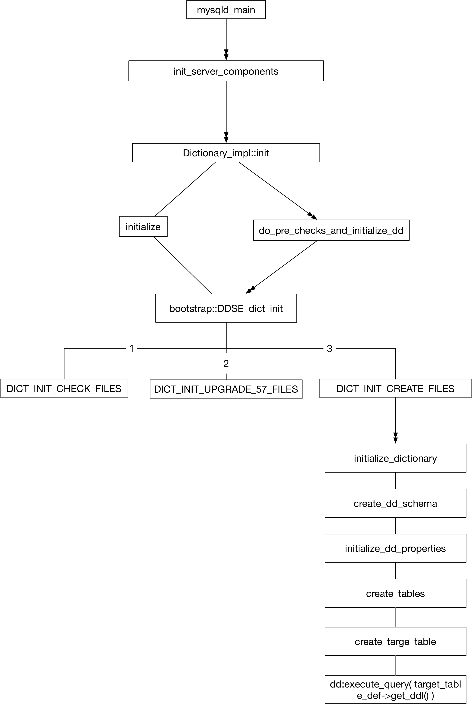
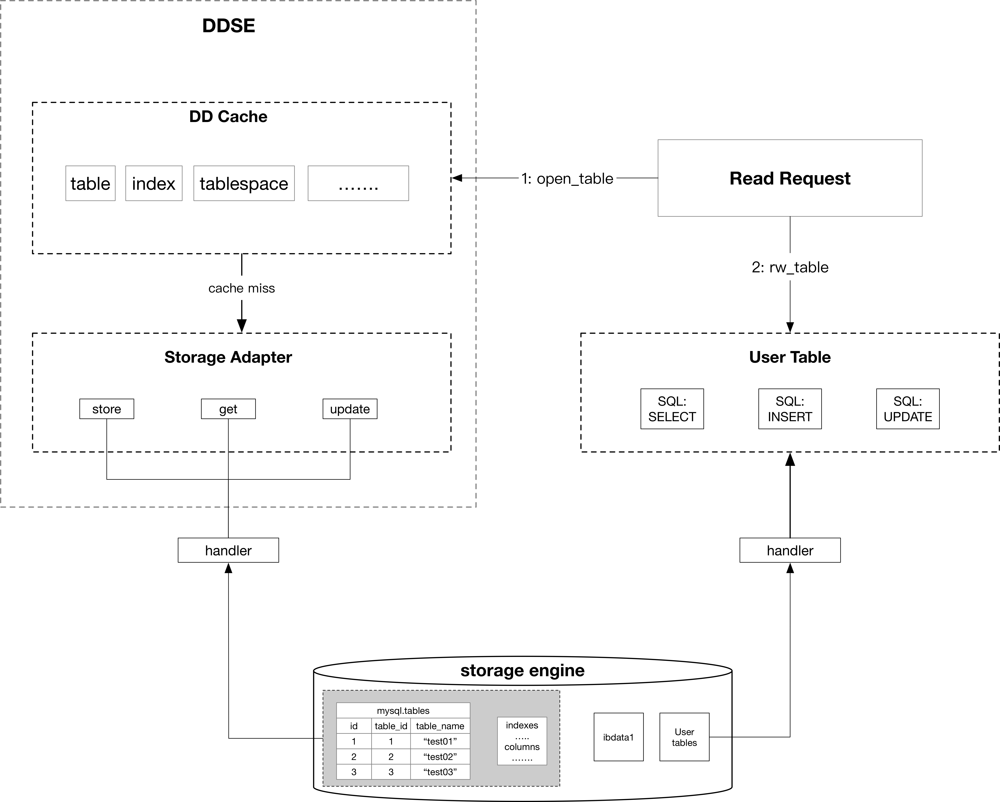
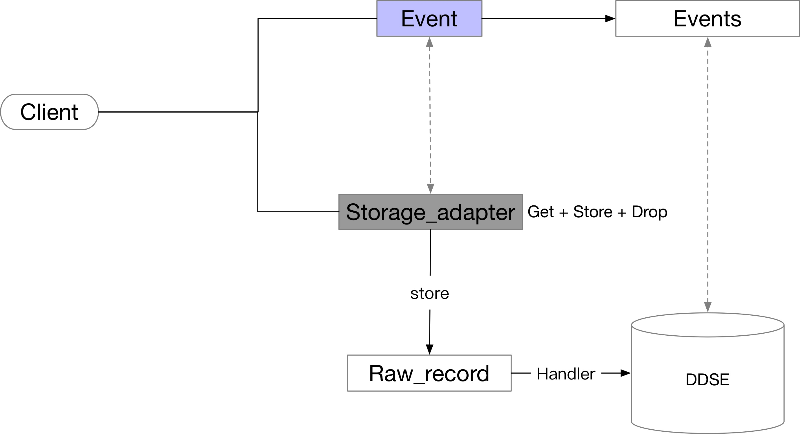

# [GaiaDB: MySQL 8.0 DDL 实现]


# 一、元数据

## 1\. 元数据组织


官方文档： [https://dev.mysql.com/doc/refman/8.0/en/system-schema.html#system-schema-data-dictionary-tables](https://dev.mysql.com/doc/refman/8.0/en/system-schema.html#system-schema-data-dictionary-tables)

元数据就是多个 InnoDB 表的集合：

数据字典(描述用户数据的元数据) + 授权元数据 + 对象信息系统元数据 + 日志系统 元数据 + server help 元数据 +

Time Zone 元数据 + Binlog 复制元数据 + 优化器系统元数据 + 其他

<table class="wrapped confluenceTable"><colgroup><col><col><col></colgroup><tbody><tr><th class="confluenceTh">元数据种类</th><th class="confluenceTh">系统表</th><th colspan="1" class="confluenceTh">释义</th></tr><tr><td rowspan="30" class="confluenceTd"><p><br></p><p><br></p><p><br></p><p><br></p><p><br></p><p><br></p><p><br></p><p><br></p><p><br></p><p>数据字典</p></td><td class="confluenceTd"><span style="color: rgb(0,0,0);">catalogs</span></td><td colspan="1" class="confluenceTd"><p>定义：mysql&gt; SHOW CREATE TABLE mysql.catalogs\G</p><p>*************************** 1. row ***************************<br>Table: catalogs<br>Create Table: CREATE TABLE `catalogs` (<br>`id` bigint(20) unsigned NOT NULL AUTO_INCREMENT,<br>`name` varchar(64) CHARACTER SET utf8 COLLATE utf8_bin NOT NULL,<br>`created` timestamp NOT NULL,<br>`last_altered` timestamp NOT NULL,<br>`options` mediumtext COLLATE utf8_bin,<br>PRIMARY KEY (`id`),<br>UNIQUE KEY `name` (`name`)<br>) /*!50100 TABLESPACE `mysql` */ ENGINE=InnoDB AUTO_INCREMENT=2 DEFAULT CHARSET=utf8 COLLATE=utf8_bin STATS_PERSISTENT=0 ROW_FORMAT=DYNAMIC<br>1 row in set (0.00 sec)</p><p>mysql&gt; select * from mysql.catalogs\G<br>*************************** 1. row ***************************<br>id: 1<br>name: def<br>created: 2019-11-07 18:36:48<br>last_altered: 2019-11-07 18:36:48<br>options: NULL<br>1 row in set (0.00 sec)</p></td></tr><tr><td class="confluenceTd"><span style="color: rgb(0,0,0);">character_sets</span></td><td colspan="1" class="confluenceTd">字符集</td></tr><tr><td class="confluenceTd"><span style="color: rgb(0,0,0);">check_constraints</span></td><td colspan="1" class="confluenceTd"><br></td></tr><tr><td colspan="1" class="confluenceTd"><span style="color: rgb(0,0,0);">collations</span></td><td colspan="1" class="confluenceTd"><br></td></tr><tr><td colspan="1" class="confluenceTd"><span style="color: rgb(0,0,0);">column_statistics</span></td><td colspan="1" class="confluenceTd">直方图统计</td></tr><tr><td colspan="1" class="confluenceTd"><span style="color: rgb(0,0,0);">column_type_elements</span></td><td colspan="1" class="confluenceTd"><br></td></tr><tr><td colspan="1" class="confluenceTd"><span style="color: rgb(0,0,0);">columns</span></td><td colspan="1" class="confluenceTd">所有Table的列信息</td></tr><tr><td colspan="1" class="confluenceTd"><span style="color: rgb(0,0,0);">dd_properties</span></td><td colspan="1" class="confluenceTd">数据字典的属性信息，例如版本，是否需要从低版本升级到高版本 5.7 upgrade to 8.0</td></tr><tr><td colspan="1" class="confluenceTd"><span style="color: rgb(0,0,0);">events</span></td><td colspan="1" class="confluenceTd">事件</td></tr><tr><td colspan="1" class="confluenceTd"><span style="color: rgb(0,0,0);">foreign_keys</span></td><td colspan="1" class="confluenceTd">外键</td></tr><tr><td colspan="1" class="confluenceTd"><span style="color: rgb(0,0,0);">index_column_usage</span></td><td colspan="1" class="confluenceTd">index 使用 clumn 的信息</td></tr><tr><td colspan="1" class="confluenceTd"><span style="color: rgb(0,0,0);">index_partitions</span></td><td colspan="1" class="confluenceTd">index 使用的partition的信息</td></tr><tr><td colspan="1" class="confluenceTd"><span style="color: rgb(0,0,0);">index_stats</span></td><td colspan="1" class="confluenceTd"><a class="external-link" href="https://dev.mysql.com/doc/refman/8.0/en/analyze-table.html" rel="noopener noreferrer" target="_blank" referrerpolicy="no-referrer"><code class="literal">ANALYZE TABLE</code></a><span style="color: rgb(85,85,85);">&nbsp; 执行后，保存的index的信息</span></td></tr><tr><td colspan="1" class="confluenceTd"><span style="color: rgb(0,0,0);">indexes</span></td><td colspan="1" class="confluenceTd">所有的索引</td></tr><tr><td colspan="1" class="confluenceTd"><span style="color: rgb(0,0,0);">innodb_ddl_log</span></td><td colspan="1" class="confluenceTd">aomic ddl 的关键组件：ddl_log</td></tr><tr><td colspan="1" class="confluenceTd"><span style="color: rgb(0,0,0);">parameter_type_elements</span></td><td colspan="1" class="confluenceTd"><br></td></tr><tr><td colspan="1" class="confluenceTd"><span style="color: rgb(0,0,0);">parameters</span></td><td colspan="1" class="confluenceTd"><br></td></tr><tr><td colspan="1" class="confluenceTd"><span style="color: rgb(0,0,0);">resource_groups</span></td><td colspan="1" class="confluenceTd"><br></td></tr><tr><td colspan="1" class="confluenceTd"><span style="color: rgb(0,0,0);">routines</span></td><td colspan="1" class="confluenceTd">存储过程</td></tr><tr><td colspan="1" class="confluenceTd"><span style="color: rgb(0,0,0);">schemata</span></td><td colspan="1" class="confluenceTd">schema就是database，也就是database的信息</td></tr><tr><td colspan="1" class="confluenceTd"><span style="color: rgb(0,0,0);">st_spatial_reference_systems</span></td><td colspan="1" class="confluenceTd"><br></td></tr><tr><td colspan="1" class="confluenceTd"><span style="color: rgb(0,0,0);">table_partition_values</span></td><td colspan="1" class="confluenceTd"><span style="color: rgb(85,85,85);">Information about values used by table partitions.</span></td></tr><tr><td colspan="1" class="confluenceTd"><span style="color: rgb(0,0,0);">table_partitions</span></td><td colspan="1" class="confluenceTd"><span style="color: rgb(85,85,85);">Information about partitions used by tables.</span></td></tr><tr><td colspan="1" class="confluenceTd"><span style="color: rgb(0,0,0);">table_stats</span></td><td colspan="1" class="confluenceTd"><span style="color: rgb(85,85,85);">&nbsp;</span><code class="literal"><a class="external-link" href="https://dev.mysql.com/doc/refman/8.0/en/analyze-table.html" rel="noopener noreferrer" target="_blank" referrerpolicy="no-referrer">ANALYZE TABL</a>E 执行后的统计信息</code></td></tr><tr><td colspan="1" class="confluenceTd"><span style="color: rgb(0,0,0);">tables</span></td><td colspan="1" class="confluenceTd">所有的表：包括系统表</td></tr><tr><td colspan="1" class="confluenceTd"><span style="color: rgb(0,0,0);">tablespace_files</span></td><td colspan="1" class="confluenceTd">tablespace使用的file</td></tr><tr><td colspan="1" class="confluenceTd"><span style="color: rgb(0,0,0);">tablespaces</span></td><td colspan="1" class="confluenceTd">所有的tablespace: system tablespace,general table space, undo tablespace , file per table tablespace</td></tr><tr><td colspan="1" class="confluenceTd"><span style="color: rgb(0,0,0);">triggers</span></td><td colspan="1" class="confluenceTd">触发器</td></tr><tr><td colspan="1" class="confluenceTd"><span style="color: rgb(0,0,0);">view_routine_usage</span></td><td colspan="1" class="confluenceTd"><span style="color: rgb(85,85,85);">Information about dependencies between views and stored functions used by them.</span></td></tr><tr><td colspan="1" class="confluenceTd"><span style="color: rgb(0,0,0);">view_table_usage</span></td><td colspan="1" class="confluenceTd"><span style="color: rgb(85,85,85);">Used to track dependencies between views and their underlying tables.</span></td></tr><tr><td rowspan="10" class="confluenceTd"><p><br><br><br></p><p><br></p><p><br></p><p>授权信息</p></td><td colspan="1" class="confluenceTd"><span style="color: rgb(0,0,0);">user</span></td><td colspan="1" class="confluenceTd">用户信息</td></tr><tr><td colspan="1" class="confluenceTd"><span style="color: rgb(0,0,0);">global_grants</span></td><td colspan="1" class="confluenceTd">全局授权信息</td></tr><tr><td colspan="1" class="confluenceTd"><span style="color: rgb(0,0,0);">db</span></td><td colspan="1" class="confluenceTd">数据库级别的权限信息</td></tr><tr><td colspan="1" class="confluenceTd"><span style="color: rgb(0,0,0);">tables_priv</span></td><td colspan="1" class="confluenceTd">table级别的权限</td></tr><tr><td colspan="1" class="confluenceTd"><span style="color: rgb(0,0,0);">columns_priv</span></td><td colspan="1" class="confluenceTd">列权限</td></tr><tr><td colspan="1" class="confluenceTd"><span style="color: rgb(0,0,0);">procs_priv</span></td><td colspan="1" class="confluenceTd">存储过程的权限</td></tr><tr><td colspan="1" class="confluenceTd"><span style="color: rgb(0,0,0);">proxies_priv</span></td><td colspan="1" class="confluenceTd"><span style="color: rgb(85,85,85);">Proxy-user privileges.</span></td></tr><tr><td colspan="1" class="confluenceTd"><span style="color: rgb(0,0,0);">default_roles</span></td><td colspan="1" class="confluenceTd"><span style="color: rgb(85,85,85);">This table lists default roles to be activated after a user connects and authenticates, or executes&nbsp;</span><a class="external-link" href="https://dev.mysql.com/doc/refman/8.0/en/set-role.html" rel="noopener noreferrer" target="_blank" referrerpolicy="no-referrer"><code class="literal">SET ROLE DEFAULT</code></a><span style="color: rgb(85,85,85);">.</span></td></tr><tr><td colspan="1" class="confluenceTd"><span style="color: rgb(0,0,0);">role_edges</span></td><td colspan="1" class="confluenceTd"><span style="color: rgb(85,85,85);">This table lists edges for role subgraphs.</span></td></tr><tr><td colspan="1" class="confluenceTd"><span style="color: rgb(0,0,0);">password_history</span></td><td colspan="1" class="confluenceTd"><span style="color: rgb(85,85,85);">Information about password changes.</span></td></tr><tr><td rowspan="3" class="confluenceTd">对象信息系统</td><td colspan="1" class="confluenceTd"><span style="color: rgb(0,0,0);">component</span></td><td colspan="1" class="confluenceTd">server启动的时候此表中所有的组件都要启动 插件区别？</td></tr><tr><td colspan="1" class="confluenceTd"><span style="color: rgb(0,0,0);">func</span></td><td colspan="1" class="confluenceTd">UDF，启动的时候load func中的udf</td></tr><tr><td colspan="1" class="confluenceTd"><span style="color: rgb(0,0,0);">plugin</span></td><td colspan="1" class="confluenceTd">同上插件load</td></tr><tr><td rowspan="2" class="confluenceTd">log系统</td><td colspan="1" class="confluenceTd"><span style="color: rgb(0,0,0);">general_log</span></td><td colspan="1" class="confluenceTd">general query log</td></tr><tr><td colspan="1" class="confluenceTd"><span style="color: rgb(0,0,0);">slow_log</span></td><td colspan="1" class="confluenceTd">slow log</td></tr><tr><td rowspan="4" class="confluenceTd">help系统</td><td colspan="1" class="confluenceTd"><span style="color: rgb(0,0,0);">help_category</span></td><td colspan="1" class="confluenceTd"><br></td></tr><tr><td colspan="1" class="confluenceTd"><span style="color: rgb(0,0,0);">help_keyword</span></td><td colspan="1" class="confluenceTd"><br></td></tr><tr><td colspan="1" class="confluenceTd"><span style="color: rgb(0,0,0);">help_relation</span></td><td colspan="1" class="confluenceTd"><br></td></tr><tr><td colspan="1" class="confluenceTd"><span style="color: rgb(0,0,0);">help_topic</span></td><td colspan="1" class="confluenceTd"><br></td></tr><tr><td rowspan="5" class="confluenceTd">time系统</td><td colspan="1" class="confluenceTd"><span style="color: rgb(0,0,0);">time_zone</span></td><td colspan="1" class="confluenceTd">时区信息</td></tr><tr><td colspan="1" class="confluenceTd"><span style="color: rgb(0,0,0);">time_zone_leap_second</span></td><td colspan="1" class="confluenceTd"><br></td></tr><tr><td colspan="1" class="confluenceTd"><span style="color: rgb(0,0,0);">time_zone_name</span></td><td colspan="1" class="confluenceTd"><span style="color: rgb(85,85,85);">Mappings between time zone IDs and names.</span></td></tr><tr><td colspan="1" class="confluenceTd"><span style="color: rgb(0,0,0);">time_zone_transition</span></td><td colspan="1" class="confluenceTd"><br></td></tr><tr><td colspan="1" class="confluenceTd"><span style="color: rgb(0,0,0);">time_zone_transition_type</span></td><td colspan="1" class="confluenceTd"><br></td></tr><tr><td rowspan="5" class="confluenceTd">binlog 复制信息</td><td colspan="1" class="confluenceTd"><span style="color: rgb(0,0,0);">gtid_executed</span></td><td colspan="1" class="confluenceTd"><br></td></tr><tr><td colspan="1" class="confluenceTd"><span style="color: rgb(0,0,0);">ndb_binlog_index</span></td><td colspan="1" class="confluenceTd"><br></td></tr><tr><td colspan="1" class="confluenceTd"><span style="color: rgb(0,0,0);">slave_master_info</span></td><td colspan="1" class="confluenceTd"><br></td></tr><tr><td colspan="1" class="confluenceTd"><span style="color: rgb(0,0,0);">slave_relay_log_info</span></td><td colspan="1" class="confluenceTd"><br></td></tr><tr><td colspan="1" class="confluenceTd"><span style="color: rgb(0,0,0);">slave_worker_info</span></td><td colspan="1" class="confluenceTd"><br></td></tr><tr><td rowspan="4" class="confluenceTd">优化器信息</td><td colspan="1" class="confluenceTd"><span style="color: rgb(0,0,0);">innodb_index_stats</span></td><td colspan="1" class="confluenceTd"><span style="color: rgb(85,85,85);">Used for&nbsp;</span><code class="literal">InnoDB</code><span style="color: rgb(85,85,85);">&nbsp;persistent optimizer statistics IO代价 估计</span></td></tr><tr><td colspan="1" class="confluenceTd"><span style="color: rgb(0,0,0);">innodb_table_stats</span></td><td colspan="1" class="confluenceTd"><span style="color: rgb(85,85,85);">Used for&nbsp;</span><code class="literal">InnoDB</code><span style="color: rgb(85,85,85);">&nbsp;persistent optimizer statistics</span></td></tr><tr><td colspan="1" class="confluenceTd"><span style="color: rgb(0,0,0);">server_cost</span></td><td colspan="1" class="confluenceTd"><span style="color: rgb(85,85,85);">The optimizer cost model uses tables that contain cost estimate information about operations that occur during query execution. 代价模型中的代价估计</span></td></tr><tr><td colspan="1" class="confluenceTd"><span style="color: rgb(0,0,0);">engine_cost</span></td><td colspan="1" class="confluenceTd"><span style="color: rgb(85,85,85);">The optimizer cost model uses tables that contain cost estimate information about operations that occur during query execution.</span></td></tr><tr><td rowspan="6" class="confluenceTd"><p><br></p><p>其他</p></td><td colspan="1" class="confluenceTd"><span style="color: rgb(0,0,0);">audit_log_filter</span></td><td colspan="1" class="confluenceTd">企业版插件</td></tr><tr><td colspan="1" class="confluenceTd"><span style="color: rgb(0,0,0);">audit_log_user</span></td><td colspan="1" class="confluenceTd"><br></td></tr><tr><td colspan="1" class="confluenceTd"><span style="color: rgb(0,0,0);">firewall_users</span></td><td colspan="1" class="confluenceTd">企业版插件</td></tr><tr><td colspan="1" class="confluenceTd"><span style="color: rgb(0,0,0);">firewall_whitelist</span></td><td colspan="1" class="confluenceTd"><br></td></tr><tr><td colspan="1" class="confluenceTd"><span style="color: rgb(0,0,0);">servers</span></td><td colspan="1" class="confluenceTd"><span style="color: rgb(0,0,0);">FEDERATED 引擎使用</span></td></tr><tr><td colspan="1" class="confluenceTd"><span style="color: rgb(0,0,0);">innodb_dynamic_metadata</span></td><td colspan="1" class="confluenceTd"><p><span style="color: rgb(85,85,85);">Used by the&nbsp;</span><code class="literal">InnoDB</code><span style="color: rgb(85,85,85);">&nbsp;storage engine to store fast-changing table metadata such as auto-increment counter values and index tree corruption flags. Replaces the data dictionary buffer table that resided in the&nbsp;</span><code class="literal">InnoDB</code><span style="color: rgb(85,85,85);">&nbsp;system tablespace.</span></p><p>INNODB 引擎使用此表存储 变化较快的的表元数据信息：自动增长的counter, index tree 崩溃的flag，取代系统表空间的元数据buffer table</p></td></tr></tbody></table>

  

## 2\. 元数据初始化

元数据表创建过程：

<table class="wrapped confluenceTable"><colgroup><col></colgroup><tbody><tr><th class="confluenceTh"><div class="content-wrapper"><p><span class="confluence-embedded-file-wrapper confluence-embedded-manual-size"></span></p></div></th></tr></tbody></table>

支持从5.7升级。初始化元数据表其实就是执行 create table 命令。

 折叠源码

```plain
static bool innobase_ddse_dict_init(
    dict_init_mode_t dict_init_mode, uint version,
    List<const dd::Object_table> *tables,
    List<const Plugin_tablespace> *tablespaces) {
  DBUG_TRACE;
 
 
  DBUG_ASSERT(tables && tables->is_empty());
  DBUG_ASSERT(tablespaces && tablespaces->is_empty());
 
  if (innobase_init_files(dict_init_mode, tablespaces)) {
    return true;
  }
 
  /* Instantiate table defs only if we are successful so far. */
  dd::Object_table *innodb_dynamic_metadata =
      dd::Object_table::create_object_table();
  innodb_dynamic_metadata->set_hidden(true);
  dd::Object_table_definition *def =
      innodb_dynamic_metadata->target_table_definition();
  def->set_table_name("innodb_dynamic_metadata");
  def->add_field(0, "table_id", "table_id BIGINT UNSIGNED NOT NULL");
  def->add_field(1, "version", "version BIGINT UNSIGNED NOT NULL");
  def->add_field(2, "metadata", "metadata BLOB NOT NULL");
  def->add_index(0, "index_pk", "PRIMARY KEY (table_id)");
  /* Options and tablespace are set at the SQL layer. */
 
  dd::Object_table *innodb_table_stats =
      dd::Object_table::create_object_table();
  innodb_table_stats->set_hidden(false);
  def = innodb_table_stats->target_table_definition();
  def->set_table_name("innodb_table_stats");
  def->add_field(0, "database_name", "database_name VARCHAR(64) NOT NULL");
  def->add_field(1, "table_name",
                 "table_name VARCHAR(" NAME_CHAR_LEN_PARTITIONS_STR
                 ") NOT NULL");
  def->add_field(2, "last_update",
                 "last_update TIMESTAMP NOT NULL \n"
                 "  DEFAULT CURRENT_TIMESTAMP \n"
                 "  ON UPDATE CURRENT_TIMESTAMP");
  def->add_field(3, "n_rows", "n_rows BIGINT UNSIGNED NOT NULL");
  def->add_field(4, "clustered_index_size",
                 "clustered_index_size BIGINT UNSIGNED NOT NULL");
  def->add_field(5, "sum_of_other_index_sizes",
                 "sum_of_other_index_sizes BIGINT UNSIGNED NOT NULL");
  def->add_index(0, "index_pk", "PRIMARY KEY (database_name, table_name)");
  /* Options and tablespace are set at the SQL layer. */
 
  dd::Object_table *innodb_index_stats =
      dd::Object_table::create_object_table();
  innodb_index_stats->set_hidden(false);
  def = innodb_index_stats->target_table_definition();
  def->set_table_name("innodb_index_stats");
  def->add_field(0, "database_name", "database_name VARCHAR(64) NOT NULL");
  def->add_field(1, "table_name",
                 "table_name VARCHAR(" NAME_CHAR_LEN_PARTITIONS_STR
                 ") NOT NULL");
  def->add_field(2, "index_name", "index_name VARCHAR(64) NOT NULL");
  def->add_field(3, "last_update",
                 "last_update TIMESTAMP NOT NULL"
                 "  DEFAULT CURRENT_TIMESTAMP"
                 "  ON UPDATE CURRENT_TIMESTAMP");
  /*
          There are at least: stat_name='size'
                  stat_name='n_leaf_pages'
                  stat_name='n_diff_pfx%'
  */
  def->add_field(4, "stat_name", "stat_name VARCHAR(64) NOT NULL");
  def->add_field(5, "stat_value", "stat_value BIGINT UNSIGNED NOT NULL");
  def->add_field(6, "sample_size", "sample_size BIGINT UNSIGNED");
  def->add_field(7, "stat_description",
                 "stat_description VARCHAR(1024) NOT NULL");
  def->add_index(0, "index_pk",
                 "PRIMARY KEY (database_name, table_name, "
                 "index_name, stat_name)");
  /* Options and tablespace are set at the SQL layer. */
 
  dd::Object_table *innodb_ddl_log = dd::Object_table::create_object_table();
  innodb_ddl_log->set_hidden(true);
  def = innodb_ddl_log->target_table_definition();
  def->set_table_name("innodb_ddl_log");
  def->add_field(0, "id", "id BIGINT UNSIGNED NOT NULL AUTO_INCREMENT");
  def->add_field(1, "thread_id", "thread_id BIGINT UNSIGNED NOT NULL");
  def->add_field(2, "type", "type INT UNSIGNED NOT NULL");
  def->add_field(3, "space_id", "space_id INT UNSIGNED");
  def->add_field(4, "page_no", "page_no INT UNSIGNED");
  def->add_field(5, "index_id", "index_id BIGINT UNSIGNED");
  def->add_field(6, "table_id", "table_id BIGINT UNSIGNED");
  def->add_field(7, "old_file_path",
                 "old_file_path VARCHAR(512) COLLATE UTF8_BIN");
  def->add_field(8, "new_file_path",
                 "new_file_path VARCHAR(512) COLLATE UTF8_BIN");
  def->add_index(0, "index_pk", "PRIMARY KEY(id)");
  def->add_index(1, "index_k_thread_id", "KEY(thread_id)");
  /* Options and tablespace are set at the SQL layer. */
 
  tables->push_back(innodb_dynamic_metadata);
  tables->push_back(innodb_table_stats);
  tables->push_back(innodb_index_stats);
  tables->push_back(innodb_ddl_log);
 
  return false;
}
void System_tables::add_remaining_dd_tables() {
  // Se header file for explanation of table categories.
  dd::System_tables::Types core = dd::System_tables::Types::CORE;
  dd::System_tables::Types second = dd::System_tables::Types::SECOND;
  dd::System_tables::Types system = dd::System_tables::Types::SYSTEM;
 
 
  register_table<Catalogs>(core);
  register_table<Character_sets>(core);
  register_table<Check_constraints>(core);
  register_table<Collations>(core);
  register_table<dd::tables::Column_statistics>(core);
  register_table<Column_type_elements>(core);
  register_table<Columns>(core);
  register_table<Events>(second);
  register_table<Foreign_key_column_usage>(core);
  register_table<Foreign_keys>(core);
  register_table<Index_column_usage>(core);
  register_table<Index_partitions>(core);
  register_table<Index_stats>(second);
  register_table<Indexes>(core);
  register_table<Parameter_type_elements>(second);
  register_table<Parameters>(second);
  register_table<Resource_groups>(core);
  register_table<Routines>(second);
  register_table<Schemata>(core);
  register_table<Spatial_reference_systems>(second);
  register_table<Table_partition_values>(core);
  register_table<Table_partitions>(core);
  register_table<Table_stats>(second);
  register_table<Tables>(core);
  register_table<Tablespace_files>(core);
  register_table<Tablespaces>(core);
  register_table<Triggers>(core);
  register_table<View_routine_usage>(core);
  register_table<View_table_usage>(core);
 
  /*
    Mark abandoned tables. E.g., if done as shown below, note that when
    the last version becomes unsupported, we will get a build error here
    that makes sure the abandoned table will not be left unnoticed. When
    that happens, the source code for the table can be removed:
 
    Collations::instance().set_abandoned(bootstrap::DD_VERSION_80004);
  */
  register_table("backup_history", system);
  register_table("backup_progress", system);
  register_table("columns_priv", system);
  register_table("component", system);
  register_table("db", system);
  register_table("default_roles", system);
  register_table("engine_cost", system);
  register_table("func", system);
  register_table("global_grants", system);
  register_table("gtid_executed", system);
  register_table("help_category", system);
  register_table("help_keyword", system);
  register_table("help_relation", system);
  register_table("help_topic", system);
  register_table("host", system);
  register_table("ndb_binlog_index", system);
  register_table("plugin", system);
  register_table("password_history", system);
  register_table("procs_priv", system);
  register_table("proxies_priv", system);
  register_table("role_edges", system);
  register_table("servers", system);
  register_table("server_cost", system);
  register_table("slave_master_info", system);
  register_table("slave_master_info_backup", system);
  register_table("slave_worker_info", system);
  register_table("slave_relay_log_info", system);
  register_table("tables_priv", system);
  register_table("temp_user", system);
  register_table("tmp_user", system);
  register_table("time_zone", system);
  register_table("time_zone_name", system);
  register_table("time_zone_leap_second", system);
  register_table("time_zone_transition", system);
  register_table("time_zone_transition_type", system);
  register_table("user", system);
  register_table("user_backup", system);
}
```

以上创建 table 和元数据表一一对应。

## 3\. 元数据系统实现

<table class="confluenceTable"><colgroup><col></colgroup><tbody><tr><th class="confluenceTh"><div class="content-wrapper"><p><span class="confluence-embedded-file-wrapper confluence-embedded-manual-size"></span></p></div></th></tr></tbody></table>

  

元数据表更新过程。

<table class="wrapped confluenceTable"><colgroup><col></colgroup><tbody><tr><th class="confluenceTh"><div class="content-wrapper"><p><span class="confluence-embedded-file-wrapper confluence-embedded-manual-size"></span></p></div></th></tr></tbody></table>

handler 接口：

<table class="wrapped confluenceTable"><colgroup><col><col><col><col></colgroup><tbody><tr><th colspan="1" class="confluenceTh"><br></th><th class="confluenceTh">接口</th><th class="confluenceTh">功能</th><th colspan="1" class="confluenceTh">对应DDL操作</th></tr><tr><td rowspan="3" class="confluenceTd"><p><br></p><p>写</p></td><td class="confluenceTd"><p><span style="color: rgb(121,94,38);">ha_write_row</span></p></td><td class="confluenceTd">Insert</td><td colspan="1" class="confluenceTd">Create，Alter table</td></tr><tr><td class="confluenceTd"><p><span style="color: rgb(121,94,38);">ha_delete_row</span></p></td><td class="confluenceTd">Delete</td><td colspan="1" class="confluenceTd">Drop， Truncate</td></tr><tr><td class="confluenceTd"><p><span style="color: rgb(121,94,38);">ha_update_row</span></p></td><td class="confluenceTd">Update</td><td colspan="1" class="confluenceTd">Rename，Alter (event ，func，etc)</td></tr><tr><td rowspan="3" class="confluenceTd"><p><br></p><p>读</p></td><td colspan="1" class="confluenceTd"><p><span style="color: rgb(121,94,38);">ha_index_init</span></p></td><td colspan="1" class="confluenceTd"><br></td><td colspan="1" class="confluenceTd"><br></td></tr><tr><td colspan="1" class="confluenceTd"><p><span style="color: rgb(121,94,38);">ha_index_read_idx_map</span></p></td><td colspan="1" class="confluenceTd"><span>Get</span></td><td colspan="1" class="confluenceTd"><span>cache miss read (read commited级别)</span></td></tr><tr><td colspan="1" class="confluenceTd"><p><span style="color: rgb(121,94,38);">ha_index_end</span></p></td><td colspan="1" class="confluenceTd"><br></td><td colspan="1" class="confluenceTd"><br></td></tr></tbody></table>

  


