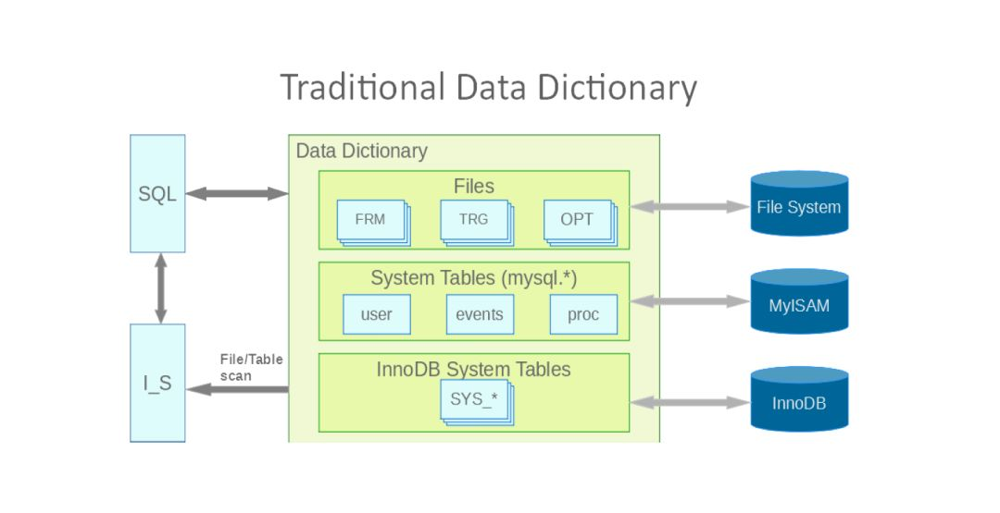
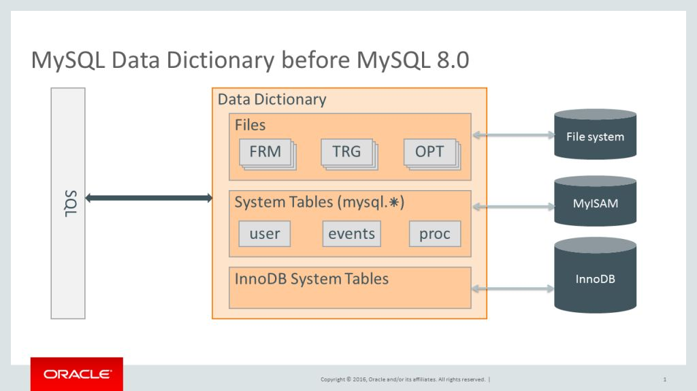
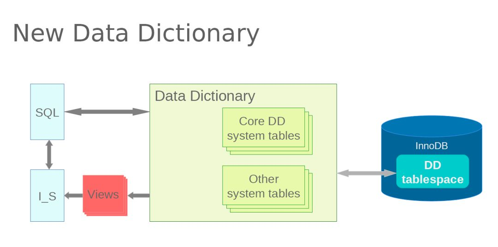
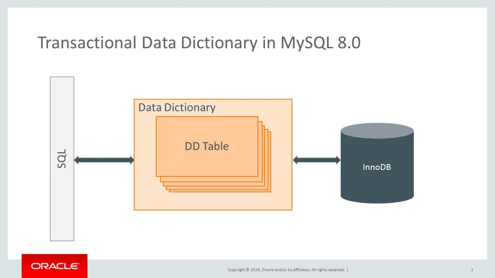

# 【MySQL】 8.0 对数据字典的改进 - 墨天轮

**摘要：**十分钟就能看完的新特性

> 以前，InnoDB引擎层和MySQL server层是两个开发团队。  
> 所以一直以来，MySQL数据字典有两套，这导致了各种运维问题。  
> 在8.0之后，官方对这块做了大的改进，对于DBA而言，是个超棒的消息。

### 在8.0之前：

比如，偶尔会遇到这样的情况：删掉一张超大表，删除过程中暴力干掉mysqld进程，再拉起，虽然看不到这张表，但是创建同名表会说已经存在。

老的数据字典结构中，存在.frm文件和InnoDB两份数据字典。.frm文件和InnoDB的元数据不匹配的情况时有发生（.frm文件变更非原子性），并且无法crash后验证。

在frm文件中存储表的元数据时，文件命名取决于文件系统的特征，如有大小写敏感和不敏感之分所带来的问题，存储在InnoDB表中将会消除这些问题。

#### 传统的数据字典

**（有两张图，都是来自官方，随便挑一张看就完事了）**

包含了三个部分：  
**① OS层面****：**一些文件，如frm、trg/trn、db.opt  
**② 系统表****：**mysql schema下的一些如user、events、events、plugins、privileges等表  
**③ InnoDB系统表****：**SYS\_\*  

### 在8.0之后：

在字典表空间中的系统表只有一个真实可信的来源。

有了这个基础，MySQL研发团队实现了原子DDL————不再会有.frm与InnoDB数据字典不匹配的情况，利用InnoDB的特性保证系统表更新是原子性的。

通过server层面的MDL，来限制对数据字典表的并发访问，所以对原有的数据字典锁可以优化掉，只需要MDL即可，不需要加InnoDB内部的锁，把更多的InnoDB处理的东西推给Server层（如外键），未来如果需要开发或变更新的存储引擎，就可以做得更纯粹。（这段描述内容来自原厂InnoDB内核开发工程师苏斌老师）

#### 8.0新数据字典：

**（有两张图，都是来自官方，随便挑一张看就完事了）**

〇 新的结构，将数据字典表和系统表存储在InnoDB里，落地到一个额外的数据字典表空间里（即mysql.ibd）。  
〇 mysql.ibd文件只能放在datadir下，并且其名字不能被更改，或用于其他表空间。  
〇 I\_S相关查询会以view的形式来提供，性能较5.7有30倍的提升，（还一个官方博客说是100倍，看看就好）。  

### 带来的一点影响

① 在datadir下手动创建库将不被支持，如mkdir（8.0之前也别这么干）。  

② 由于写入存储，redo log，undo log而不是.frm，DDL需要更多的时间。

③ 开启**innodb\_read\_only**后，一些需要修改字典表的行为将不被允许，比如`ANALYZE TABLE`  
和 `ALTER TABLE tbl_name ENGINE=engine_name`  
，更多可以看一下8.0文档中的**innodb\_read\_only**参数  

④ 之前，可通过DDL或DML来访问mysql数据字典表，在8.0之后，数据字典表将变得不可见，但大多数情况下可查询相应I\_S下的表来达到检索目的。

⑤ **mysqldump**、**mysqlpump**的一些改变：  

**a）**之前，可以dump所有mysql系统数据库中的表，从MySQL 8.0开始，只能dump非数据字典表。  
**b）**之前，可以通过dump出mysql.event和mysql.proc表来实现dump出所需要的数据对象。但从MySQL 8.0开始，将不再使用mysql.event和mysql.proc表。相应数据对象的定义存储在数据字典表中，所以是无法通过dump这两张表来达到目的，如果需要dump出event和proc信息，需要明确在dump时指定--routines和--events。  
**c）**之前，选项--routines在dump时需要有对mysql.proc表的SELECT权限，从MySQL 8.0开始，--routines选项需要全局的SELECT权限。  
**d）**之前，通过dump出proc和evnet表，可以将stored rountine和event的定义与其创建和修改所记录的timestamp一起dump出来（如event表中的created和modified字段等），从MySQL 8.0开始，不再使用这些表，因此无法dump出对应的时间戳。

  

  

  

  

  

  

**\-- the end --**

**顺便祝节日快乐。**

  

  

* * *

  

  

戳阅读原文查看历史推送。

[mysql](https://www.modb.pro/tag/mysql?type=knowledge)

「喜欢文章，快来给作者赞赏墨值吧」

赞赏

文章转载自神谕的暗影长廊，如果涉嫌侵权，请发送邮件至：contact@modb.pro进行举报，并提供相关证据，一经查实，墨天轮将立刻删除相关内容。

### 评论

请[登录](https://www.modb.pro/login?redirect=%2Fdb%2F34038)后发表评论

---------------------------------------------------

原网址: [访问](https://www.modb.pro/db/34038)

创建于: 2020-11-12 15:56:03

目录: default

标签: `www.modb.pro`

