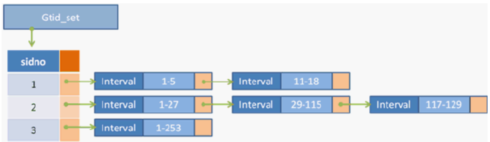
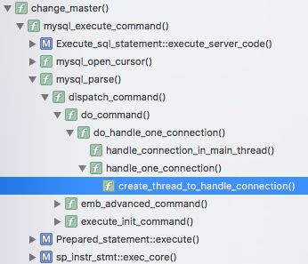
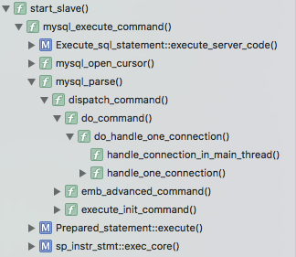

# [GTID（一）：Master/Slave的复制过程]

## Gtid\_set / Gtid\_state

### Gtid\_set

GTID的定义由Gtid\_set实现

Gtid\_set = array( sidno => link\_list(Interval) )

Interval = (start, end)

*   Gtid\_set的结构是一个以sidno为序号的数组，每个元素都指向一个Interval组成的链表，链表中的每个Interval用来存放一组GTID的区间
*   Gtid\_set使用int32 类型的sidno代替server\_uuid作为 Interval 链表的索引
*   Sid\_map建立128 位的server\_uuid与32位的sidno之间的映射



### Gtid\_state

GTID还会维护的三个变量，代码中由类Gtid\_state定义

**logged\_gtids**

【系统变量】gtid\_executed

已经执行过并记录到binlog的GTID集合系统变量

**lost\_gtids**

【系统变量】gtid\_purged

从binlog删除的GTID集合。当MySQL调用 purge\_logs删除binlog时，同时会更新lost\_gtids的内容

**owned\_gtids**

【系统变量】gtid\_owned

正由线程执行的GTID集合

还有一个SHOW SLAVE STATUS显示的变量**Retrieved\_Gtid\_Set：**Slave收到的GTID集合

【注1】

*   **不能保证最后的GTID事务是完整收到的（**Retrieved\_Gtid\_Set的最后一个GTID）****，可能由于连接中断，系统崩溃等原因导致只收到“部分”事务，在MySQL 5.7.2中由修复，详见[Relay log 中 GTID group 完整性检测](http://mysql.taobao.org/monthly/2015/04/07/)
*   **倒数第二个GTID事务肯定完整收到**，因为如果能进行最后一个事务的传输，说明倒数第二个GTID事务传输成功

#### GTID的生命周期

*   首先，执行数据库操作时，产生一个GTID，立即记录到全局和当前线程的 gtid\_owned （owned\_gtids）
*   其次，提交数据库事务时，新产生的GTID 被写入 binlog，接着记录到 gtid\_executed（logged\_gtids），然后从全局与线程区域的 [gtid\_owned](http://dev.mysql.com/doc/refman/5.6/en/replication-options-gtids.html#sysvar_gtid_owned) （owned\_gtids）状态中清除
*   最后，如果执行了purge操作删除binlog，被删除的GTID会记录到`gtid_purged`（lost\_gtids），这些GTID仍然包含在 [gtid\_executed](http://dev.mysql.com/doc/refman/5.6/en/replication-options-gtids.html#sysvar_gtid_executed)（logged\_gtids）全局状态里

## Log Event

先来看一下GTID模式下的binlog event

```sql
mysql> SHOW BINLOG EVENTS IN "mysql-bin.000001";
+------------------+-----+----------------+-----------+-------------+-------------------------------------------------------------------+
| Log_name         | Pos | Event_type     | Server_id | End_log_pos | Info                                                              |
+------------------+-----+----------------+-----------+-------------+-------------------------------------------------------------------+
| mysql-bin.000001 |   4 | Format_desc    |         1 |         120 | Server ver: 5.6.23-baidu-rds-0.1.6.0-log, Binlog ver: 4           |
| mysql-bin.000001 | 120 | Previous_gtids |         1 |         191 | 381cbe4b-1e84-11e7-9f2f-e41f136aba3e:1-2                          |
| mysql-bin.000001 | 191 | Gtid           |         1 |         239 | SET @@SESSION.GTID_NEXT= '381cbe4b-1e84-11e7-9f2f-e41f136aba3e:3' |
| mysql-bin.000001 | 239 | Query          |         1 |         335 | use `test`; create table t(id int)                                |
+------------------+-----+----------------+-----------+-------------+-------------------------------------------------------------------+
```

增加了Previous\_gtids\_log\_event，Gtid\_log\_event：

#### Previous\_gtids\_log\_event

在每个binlog的开始（Format\_description\_log\_event之后），包含在创建该binlog之前执行过的GTID集合

#### Gtid\_log\_event

在每个事务的开始，包含该事务的GTID

## Master/Slave复制

### Server/Client传输协议

传输过程为：

*   Client -> Server：执行命令消息（COM\_BINLOG\_DUMP\_GTID等）
*   Server -> Client：命令执行结果  
      
    

这里从源码上详细的分析GTID模式下Master/Slave的复制过程，交互过程为：

\-- Slave：

*   **STOP SLAVE（如果有必要）**
*   **CHANGE MASTER TO ...**
*   **START SLAVE**
*   **正常的Master/Slave复制**

### CHANGE MASTER TO ...

命令的请求格式为：

```plain
Request = { server_id, binlog_name, binlog_offset, gtids_executed }
```

  

如果设置MASTER\_AUTO\_POSITION方式连接Master，Slave发送的binlog\_name和binlog\_offset都为空，Master只使用gtids\_executed定位Slave需要执行的binlog event

【调用栈】



CHANGE MASTER TO ...为COM\_QUERY类型

【逻辑】

*   mysql\_execute\_command
    
    *   gtid\_pre\_statement\_checks：GTID\_STATEMENT\_EXECUTE / GTID\_STATEMENT\_CANCEL / GTID\_STATEMENT\_SKIP
        
        *   检查enforce\_gtid\_consistency
        *   读取gtid\_next
        *   检查是否包含隐式提交 && gtid\_next != AUTOMATIC，报错**ER\_CANT\_DO\_IMPLICIT\_COMMIT\_IN\_TRX\_WHEN\_GTID\_NEXT\_IS\_SET**
        *   如果gtid\_next为UNDEFINED\_GROUP类型，报错**ER\_GTID\_NEXT\_TYPE\_UNDEFINED\_GROUP**
        *   如果是以下类型，直接返回GTID\_STATEMENT\_EXECUTE
            *   SQLCOM\_COMMIT
            *   SQLCOM\_BEGIN
                
            *   SQLCOM\_ROLLBACK
                
            *   ......
                
        *   如果一个事务同时更新了事务表和非事务表，或者多个非事务表，必须停止事务，例如
            
            ```java
            -- master
              CREATE TABLE t1 (a INT) Engine=InnoDB;
              CREATE TABLE t2 (a INT) Engine=InnoDB;
            -- slave
              CREATE TABLE t1 (a INT) Engine=MyISAM;
              CREATE TABLE t2 (a INT) Engine=InnoDB;
            -- master
              BEGIN;
                INSERT INTO t1 VALUES (1);
                INSERT INTO t2 VALUES (1);
              COMMIT;
            ```
            
        *   检查当前事务（GTID）是否应该被跳过**is\_already\_logged\_transaction**  
            只有以下两种情况被认为应该跳过这个GTID
            *   gtid\_next类型为GTID\_GROUP & gtid\_next\_list为空时，owned\_gtid.sidno为0（owned\_gtid.sidno为0说明gtid\_next被执行过，见下面【解析】）
                
            *   gtid\_next类型为GTID\_GROUP & gtid\_next\_list非空时，gtid\_next\_list不包含gtid\_next->gtid
                
                【解析】开启GTID后
                
                *   事务的Event Group之前的Gtid\_Event会SET GTID\_NEXT
                    
                *   当前THD会调用**gtid\_acquire\_ownership\_single**，试图成为这个GTID的THD owner
                    
                *   如果gtid\_next被执行过，gtid\_state\->is\_logged()，break，**那么owned\_gtid.sidno为0**
                *   如果gtid\_next还没有owner（owner为0），当前THD成为owner（thd->owned\_gtid\= gtid\_next），**那么owned\_gtid.sidno就不为0了**
                *   如果gtid\_next已经有owner（owner非0），等待该GTID被执行完毕（写入binlog）或者owner THD被kill掉
    *   SQLCOM\_CHANGE\_MASTER
        
        *   active\_mi（Master\_info\*，保存Master的地址、端口、用户、密码、master\_uuid、master\_log\_name、master\_log\_pos、**auto\_position（true/false）**等信息）  
            
        *   change\_master
            
            *   如果任何Slave还在运行，报错**ER\_SLAVE\_MUST\_STOP**
                
            *   当MASTER\_AUTO\_POSITION=1时，无法设置MASTER\_LOG\_FILE, MASTER\_LOG\_POS, RELAY\_LOG\_FILE以及RELAY\_LOG\_POS，报错**ER\_BAD\_SLAVE\_AUTO\_POSITION**
            *   检查当MASTER\_AUTO\_POSITION=1时GTID是否开启，否则报错**ER\_AUTO\_POSITION\_REQUIRES\_GTID\_MODE\_ON**
            *   保存当前Master的信息
            *   将解析的LEX\_MASTER\_INFO\* lex\_mi保存到MASTER\_INFO\* mi
            *   健壮性检查及处理
                *   如果没有指定host/port/log\_name/log\_pos，只指定了user/password等，如何处理
            *   根据need\_relay\_log\_purge，是否purge relay log
            *   执行CHANGE MASTER TO
            *   将Master\_info\* mi刷入磁盘，如果等到执行START SLAVE才把Master\_info刷盘，防止在执行START SLAVE之前如果mysqld异常关闭
*   trans\_commit\_stmt：提交这个事务（CHANGE MASTER TO语句）
    

### START SLAVE

【调用栈】



【逻辑】

**\-- Slave**

start\_slave:

*   会向Master发送一系列packet
    
    *   SELECT UNIX\_TIMESTAMP()
    *   SELECT VARIABLES LIKE "SERVER\_ID"
    *   SET @master\_heartbeat\_period = ...
    *   SET @master\_binlog\_checksum = ...
    *   SELECT @master\_binlog\_checksum
    *   SELECT @@GLOABLE.GTID\_MODE
    *   ......
    *   COM\_BINLOG\_DUMP\_GTID:
        
        cli\_advanced\_command中net\_write\_command发送命令
        

**\-- Master**

com\_binlog\_dump\_gtid:

*   slave\_gtid\_executed如果不是Master的logged\_gtids的子集，报错**ER\_SLAVE\_HAS\_MORE\_GTIDS\_THAN\_MASTER**
*   Master的lost\_gitds如果不是slave\_gtid\_executed的子集，报错**ER\_MASTER\_HAS\_PURGED\_REQUIRED\_GTIDS**
    
*   根据slave\_gtid\_executed，寻找第一个不在slave\_gtid\_executed集合中的binlog
*   获取Master binlog列表（根据master-index.log）
*   倒序遍历Master binlog列表
*   如果binlog的Previous\_gtids\_log\_event中的GTID范围为slave\_gtid\_executed的子集，那么可以确定，该binlog之前的所有binlog都被Slave执行过
*   发送余下的binlog events给Slave  
    

### Data Replication

**\-- Master**

*   gtid\_next类型为AUTOMATIC\_GROUP

**\-- Slave**

*   gtid\_next类型为GTID\_GROUP


