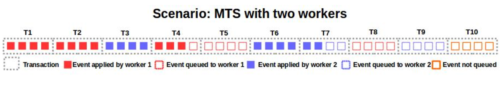
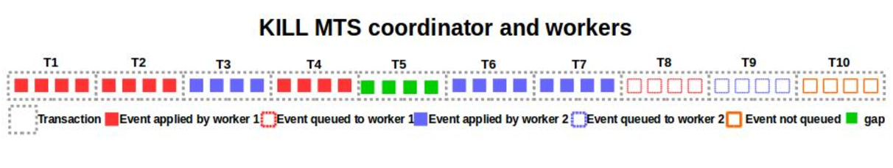
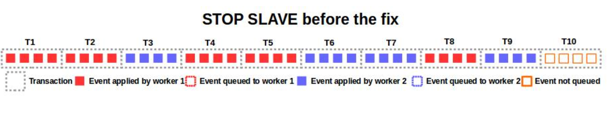
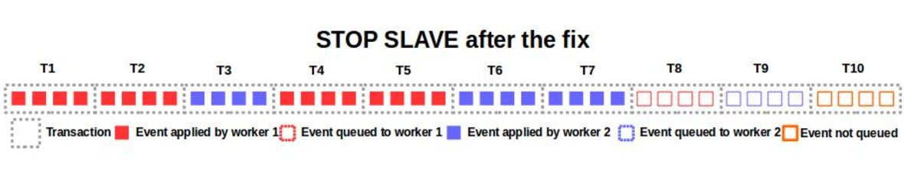

# [MySQL 5.6：并行复制时“STOP SLAVE”的优化]

在并行复制（Multi-Threaded Slave，MTS）模式下

*   **一个I/O线程**：接收自Master的events/transactions并按顺序写入relay log
*   **一个Coordinator线程**：将relay log中的events/transactions分发给一组Worker线程
*   **一组Worker线程**：执行events/transactions

## 问题

在MTS模式下，强制性的停止Worker线程可能导致事务流产生空洞（Gaps）

考虑存在如下的场景，有两个Worker线程（红色，蓝色），对于每个event：

*   可能已经执行完成（实心红色/蓝色矩形）
*   可能已经分配到Worker队列还未执行（空心红色/蓝色矩形）
*   可能还未分配到Worker队列（空心橙色矩形）

  

那么当执行**STOP SlAVE**时，如果两个Worker线程如果只保证正在执行的事务（**Worker1的T4，Worker2的T7**）执行完毕后就立即停止，会出现如下场景

未执行的事务T5被夹在已执行完毕的事务流中，产生了空洞（Gaps）

在MySQL 5.6.26之前，**STOP SLAVE**为了防止Gaps的产生（Gap-Less State），会保证所有Worker已分配到队列中events/transactions都执行完毕，Worker才会停止，会得到如下场景

**STOP SLAVE**会使Worker等待T8，T9都执行完毕才停止，但会导致STOP SLAVE的执行时间大大延长，尤其是当队列中由大量的events/transactions在排队并且等待执行的情况

## 优化

在MySQL 5.6.26以及更高版本，当执行**STOP SLAVE**时，所有Worker试着决议出一个 `max_group_index，使得max_group_index是STOP SLAVE后最大的**被执行完成**的group_index（T7）`

*   Worker的current\_group\_index <= max\_group\_index，执行当前队列中的events/transactions
*   Worker的current\_group\_index > max\_group\_index，只需要停止线程
*   Worker队列为空，只需要停止线程

那么，只需要保证group\_inde <= T7的events/transactions得到执行之后，Worker线程即可停止，场景如下：

相比优化之前，明显会缩短**STOP SLAVE**的执行时间

## 参考

1.  [https://mysqlhighavailability.com/stop-slave-improvements-for-multi-threaded-slaves/](https://mysqlhighavailability.com/stop-slave-improvements-for-multi-threaded-slaves/)  
    

