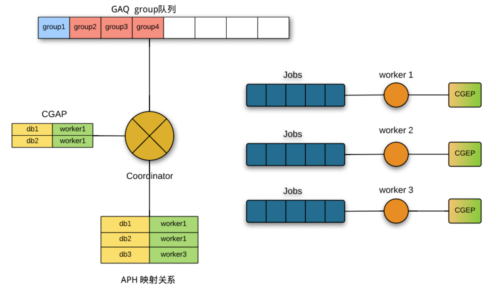

# [MySQL 5.6：并行复制]

## 概念

#### MTS

```text
Multi-Threaded Slave，并行复制（代码里常用的缩写）
```

```text
在Slave重现Relay Log时，由单线程分发event，由多线程并行执行event的特性
```

#### `Coordinator/`Worker

event的分发/执行线程

#### Group

group代表由一系列event组成的事务（在rpl\_rli.h的注释中），对其中event做如下分类（在log\_event.cc的注释中）：

*   **B-event**：起始event，Query\_log\_event的BEGIN事件
*   **g-event**：包含信息（db\_name，table\_name等）可以用来计算分发给哪个Worker，Table\_map、Query\_log\_event等
*   **p-event**：一般放在g-event前，如INTVAR\_EVENT、RAND\_EVENT、USER\_VAR\_EVENT、BEGIN\_LOAD\_QUERY\_EVENT、APPEND\_BLOCK\_EVENT
*   **r-event**： 一般放在g-event后，如Delete, Update等“regular” event
*   **T-event**：结束event，XID, COMMIT, ROLLBACK, auto-commit query

#### 约束

并行复制需要满足两个约束来保证Master/Slave上的数据一致性：

**\[约束1\]** 一个DB的不同事务分配给一个Worker线程

**\[约束2\]** 一个事务涉及到多个DB，则这些DB的操作都需要分配给同一个Worker线程

## 实现

并行复制的总体流程如图



聚焦于函数Log\_event::get\_slave\_worker，函数将event分发到Worker，返回这个Worker的指针

### 代码中的变量说明

*   curr\_group\_assigned\_parts（CGAP）：当前Group的映射关系
*   Assigned Partition Hash（APH）：_\[TO-DO\]_
*   GAQ：Master binlog的顺序执行序列

### 逻辑

#### **如果是B-event，p-event**

表明是事务的开始，将event加入curr\_group\_da，表明会在延迟分配，返回Worker为NULL

（curr\_group\_da：deferred array to hold partition-info-free events）

#### 如果是g-event

g-event中包含分发Worker的信息，由**map\_db\_to\_worker**实现：

\[参数\]

*   **dbname**，作为Hash的Key
*   **last\_worker**：当前Group上一次分配的Worker（给该event前的g-event分配过的Worker）
*   ...

\[步骤\]

*   当前的Group之前已经分配过相同的db\_name（在curr\_group\_assigned\_parts，CGAP中查找），直接返回last\_worker（**约束2**）
*   CGAP中没查找到，在APH中查找（在Relay Log之前Group中是否有该event的映射关系）：
    *   返回NULL：使用分配一个Worker，生成映射关系，并插入到APH中
    *   返回的Worker没有被Group使用（entry->usage == 0）：说明之前没有Group中的event映射过该event，直接将该event映射到last\_worker（如果last\_worker为NULL，使用get\_least\_occupied\_worker分配一个Worker）
    *   返回的Worker == last\_worker：直接使用last\_worker（**约束1**）
    *   返回的Worker != last\_worker：event映射冲突，需要等待引用该映射关系的Group执行结束，再将event映射为last\_worker（**约束1**）

#### 如果是r-event, T-event

 返回该Group已分配的Worker（last\_assigned\_worker）_\[TO-DO\]_ 

### 表级并行复制

```plain
map_db_to_worker函数的声明为：
```

```plain
Slave_worker *map_db_to_worker(const char *dbname, Relay_log_info *rli,
                               db_worker_hash_entry **ptr_entry,
                               bool need_temp_tables, Slave_worker *last_worker)
```

由以上的分析，函数中会将dbname作为Hash的Key来分配Worker，只需要将dbname修改为dbname（数据库名）+tablename（表名）就可实现表级并行复制


