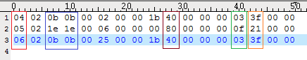
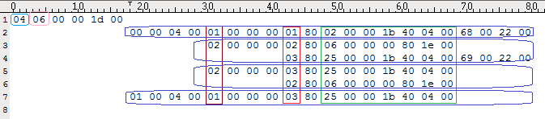

# 【MySQL】frm文件解析 - poorX - 博客园

_官网说明：[http://dev.mysql.com/doc/internals/en/frm-file-format.html](http://dev.mysql.com/doc/internals/en/frm-file-format.html)_

frm是MySQL表结构定义文件，通常frm文件是不会损坏的，但是如果出现特殊情况出现frm文件损坏也不要放弃希望，例如下面报错：

```plain
150821 16:31:27 [ERROR] /usr/local/mysql51/libexec/mysqld: Incorrect information in file: './t/test1.frm'
```

当修复MyISAM和InnoDB表时，MySQL服务会首先去调用frm文件，所以我们只能通过修复frm文件进行后面的数据恢复。

MySQL通过sql/table.cc的create\_frm()函数创建frm文件，创建出来的frm文件是二进制文件，需要通过hexdump解析成16进制来分析。

create\_frm()函数对frm文件头部定义的代码

 View Code

open\_binary\_frm()函数对对frm索引部分定义的代码

 View Code

hexdump是Linux下的一个二进制文件查看工具，可以将二进制文件转换为ASCII、10进制、16进制或8进制进行查看。

[](javascript: "复制代码")

```plain
hexdump 参数
-C 每一字节以16进制显示，一行共16个字节，显示十六进制存储的文本内容
-b 每一字节以八进制显示，一行共16个字节，一行开始以十六进制显示偏移值；
  0000000 177 105 114 106 002 001 001 000 000 000 000 000 000 000 000 000
-c 每一字节以ASCII字符显示，其余同上；
  0000000 177 E L F 002 001 001 \0 \0 \0 \0 \0 \0 \0 \0 \0
-n 只解释指定长度字节
  单位：默认十进制，0x或0X开头则为16进制，0开头则为8进制。默认为字节，b则为512字节，k则为1024字节，m则为1048576字节
-d 双字节十进制显示
-o 双字节八进制显示
-v 去除中间显示的“*”字符
-x 双字节十六进制显示
-e 格式化参数
```

[](javascript: "复制代码")

**实例版本与表字符集：**

_参考：[https://www.percona.com/blog/2015/07/09/obtain-mysql-version-frm-file/](https://www.percona.com/blog/2015/07/09/obtain-mysql-version-frm-file/)_

[](javascript: "复制代码")

```plain
建表的实例版本0x033语句hexdump -s 0x33 -n 2 -v -d table.frm [root@test1 ~]# hexdump -s 0x33 -n 2 -v -d /data/3308/test/test1.frm0000033   501530000035所以版本为5.1.53，因为5.1/5.5和5.6在字段类型定义上有不同，所以确定好建表实例版本很重要，字段类型定义见下面表字符集0x026 
21=utf808=latin11c=GBK
语句hexdump -s 0x26 -n 1 table.frm
```

[](javascript: "复制代码")

**frm列属性：**

[](javascript: "复制代码")

```plain
1、列序号（初始列序号为4）
2、字段长度，整形长度
3、字段长度，latin1字符集字符类型长度，GBK字符集字符类型varchar长度*2，varchar(30)相当于就是60字节长度，换成16进制是3c，utf8字符集字符类型varchar长度*3，varchar(30)相当于就是90字节长度，换成16进制是5a
4、
5、
6、
7、
8、Flags for zerofill, unsigned, etc.(int 1b)
9、Additional flags,and scale if decimal/numeric(DEFAULT NULL 80,NOT NULL 40,DEFAULT 'VALUE' 00)
10、代码定义unireg_type，AUTO_INCREMENT of
11、
12、代码定义interval_nr
13、字段类型
14、字符集
15、备注长度
16、备注长度
```

[](javascript: "复制代码")

**字段类型（注意5.6版本字段类型有不同，会影响数据恢复）：**

[](javascript: "复制代码")

```plain
Data type for v5.1&v5.5 (v5.6)
fe=char
fa=mediumtext
f6=decimal
fc=text
of=varchar
01=tinyint
02=smallint
03=int
04=float
05=real
07=timestamp (v5.6 11=timestamp)
08=bigint
09=mediumint
10=bit
ob=time (v5.6 13=time)
oc=datetime (v5.6 12=datetime)
0d=year
0e=date
```

[](javascript: "复制代码")

**表中所含索引：**

```plain
偏移量在0x1000之后的一段是frm索引部分，用hexdump -C打开后很容易找到
0x1000：有几个索引
0x1001：全部索引包含几个字段
索引名是明文，具体索引结构见示例。
```

表：

[](javascript: "复制代码")

```plain
CREATE TABLE `test3` (
  `a` int(11) NOT NULL,
  `b` varchar(10) DEFAULT NULL,
  `c` int(11) NOT NULL,
  PRIMARY KEY (`a`),
  UNIQUE KEY `uniq_1` (`b`,`c`),
  KEY `idx_1` (`c`,`b`),
  KEY `idx_2` (`c`)
) ENGINE=InnoDB DEFAULT CHARSET=utf8
```

[](javascript: "复制代码")

**十六进制文件打开：**

[](javascript: "复制代码")

```plain
[root@test1 ~]# hexdump -C /data/3308/test/test3.frm 
00000000  fe 01 0a 0c 03 00 00 10  01 00 00 30 00 00 74 05  |...........0..t.|
00000010  28 00 00 00 00 00 00 00  00 00 00 02 79 00 09 00  |(...........y...|
00000020  00 05 00 00 00 00 21 00  00 00 00 00 00 00 00 74  |......!........t| #表字符集
00000030  05 00 00 e9 c3 00 00 10  00 00 00 00 00 00 00 00  |................| #标红的是建表实例版本号
00000040  2f 2f 00 00 20 00 00 00  00 00 00 00 00 00 00 00  |//.. ...........|
00000050  00 00 00 00 00 00 00 00  00 00 00 00 00 00 00 00  |................|
*
00001000  04 06 00 00 1d 00 00 00  04 00 01 00 00 00 01 80  |................|
00001010  02 00 00 1b 40 04 00 68  00 22 00 02 00 00 00 02  |....@..h."......|
00001020  80 06 00 00 00 80 1e 00  03 80 25 00 00 1b 40 04  |..........%...@.|
00001030  00 69 00 22 00 02 00 00  00 03 80 25 00 00 1b 40  |.i.".......%...@|
00001040  04 00 02 80 06 00 00 00  80 1e 00 01 00 04 00 01  |................|
00001050  00 00 00 03 80 25 00 00  1b 40 04 00 ff 50 52 49  |.....%...@...PRI|
00001060  4d 41 52 59 ff 75 6e 69  71 5f 31 ff 69 64 78 5f  |MARY.uniq_1.idx_|
00001070  31 ff 69 64 78 5f 32 ff  00 00 00 00 00 00 00 00  |1.idx_2.........|
00001080  00 00 00 00 00 00 00 00  00 00 00 00 00 00 00 00  |................|
*
00001570  00 00 00 00 ff 00 00 00  00 00 00 00 00 00 00 00  |................|
00001580  00 00 00 00 00 00 00 00  00 00 00 00 00 00 00 00  |................|
00001590  00 00 00 00 00 00 00 00  00 00 00 00 00 00 06 00  |................|
000015a0  49 6e 6e 6f 44 42 00 00  00 00 00 00 00 00 00 00  |InnoDB..........|
000015b0  00 00 00 00 00 00 00 00  00 00 00 00 00 00 00 00  |................|
*
00002000  9a 01 00 10 00 00 00 00  00 00 00 00 00 00 00 00  |................|
00002010  00 00 00 00 00 00 00 00  00 00 00 00 00 00 00 00  |................|
*
00002100  01 00 03 00 3f 00 34 00  00 00 28 00 08 00 00 00  |....?.4...(.....|
00002110  00 00 00 00 00 00 50 00  16 00 01 00 00 00 00 00  |......P.........|
00002120  3f 00 04 03 02 14 29 20  20 20 20 20 20 20 20 20  |?.....)         |
00002130  20 20 20 20 20 20 20 20  20 20 20 20 20 20 20 20  |                |
00002140  20 20 20 20 20 20 20 20  20 20 20 20 20 20 20 00  |               .|
00002150  04 00 02 61 00 05 00 02  62 00 06 00 02 63 00 04  |...a....b....c..|
00002160  02 0b 0b 00 02 00 00 1b  40 00 00 00 03 3f 00 00  |........@....?..|
00002170  05 02 1e 1e 00 06 00 00  00 80 00 00 00 0f 21 00  |..............!.|
00002180  00 06 02 0b 0b 00 25 00  00 1b 40 00 00 00 03 3f  |......%...@....?|
00002190  00 00 ff 61 ff 62 ff 63  ff 00                    |...a.b.c..|
```

[](javascript: "复制代码")

通过上面的颜色区分，圈出的黄色部分是索引属性，下面红蓝绿三色是三列属性。

**列属性结构：**



红色部分：字段序号（4开始，4、5、6就是字段第一第二第三）

蓝色部分：字段长度

棕色部分：是否为空

绿色部分：字段类型

黄色部分：字符集

**索引属性结构：**



_索引头部：_

淡蓝色部分：索引统计数

粉色部分：索引总共有多少列

_索引主体：_

棕色部分：是否唯一索引

红色部分：表中列的序号

绿色部分：表中对应列的属性

**字段默认值：**

[](javascript: "复制代码")

```plain
字段默认值不保存在字段属性中，而是保存在描述表引擎的那段中
int类型默认值保存为十六进制需转换十进制，char类型默认值保存为十六进制文本可通过hexdump -C直接看到
如果没有索引段则默认值在，0x1011后，如果有索引段，则位置顺延
例如表
CREATE TABLE `test1` (
  `a` int(11) NOT NULL DEFAULT '2010',
  `b` varchar(10) NOT NULL DEFAULT '2011' ,
  `c` int(11) default '30',
  `d` varchar(10) NOT NULL DEFAULT 'Yes' 
)engine=innodb default charset=utf8;

*
00001000  00 00 00 00 02 00 ff 00  00 00 00 00 00 00 00 00  |................|
00001010  fe da 07 00 00 04 32 30  31 31 00 00 00 00 00 00  |......2011......|
00001020  00 00 00 00 00 00 00 00  00 00 00 00 00 00 00 00  |................|
00001030  00 00 00 00 1e 00 00 00  03 59 65 73 00 00 00 00  |.........Yes....|
00001040  00 00 00 00 00 00 00 00  00 00 00 00 00 00 00 00  |................|
00001050  00 00 00 00 00 00 00 00  00 06 00 49 6e 6e 6f 44  |...........InnoD|
00001060  42 00 00 00 00 00 00 00  00 00 00 00 00 00 00 00  |B...............|
00001070  00 00 00 00 00 00 00 00  00 00 00 00 00 00 00 00  |................|
*
column a:da 07 00 00
column b:04 32 30 31 31 00 00 00 00 00 00 00 00 00 00 00 00 00 00 00 00 00 00 00 00 00 00 00 00 00 00 
column c:1e 00 00 00 
column d:03 59 65 73 00 00 00 00 00 00 00 00 00 00 00 00 00 00 00 00 00 00 00 00 00 00 00 00 00 00 00

需要注意char字段的默认值是根据字段长度和字符集相关的，如上表varchar(10)，utf8是3bit，就是30个十六进制长度。
```

[](javascript: "复制代码")

---------------------------------------------------


原网址: [访问](https://www.cnblogs.com/jiangxu67/p/4755097.html)

创建于: 2020-06-21 17:14:39

目录: default

标签: `www.cnblogs.com`

