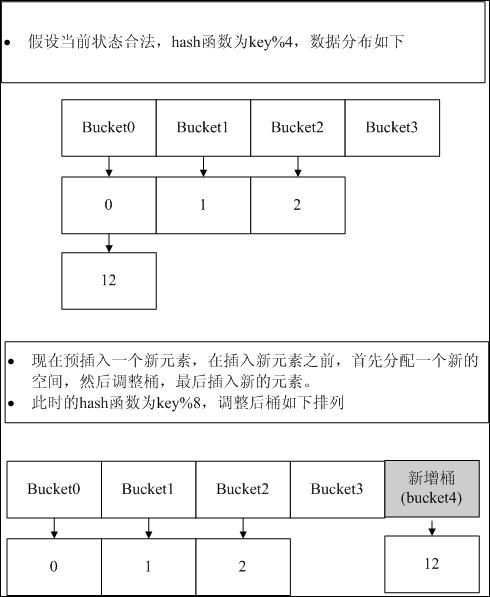

## [Mysql源码学习——没那么简单的Hash](https://www.cnblogs.com/nocode/archive/2011/10/14/2212586.html)

2011-10-14 21:08  [心中无码](https://www.cnblogs.com/nocode/)  阅读(2494)  评论(0)  [编辑](https://i.cnblogs.com/EditPosts.aspx?postid=2212586)  [收藏](javascript:)

> Hash链表的应用比较常见，其目的就是为了将不同的值映射到不同的位置，查找的时候直接找到相应的位置，而不需要传统的顺序遍历或是二分查找，从而达到减少查询时间的目的。常规的hash是预定义一定的桶(bucket)，规定一个hash函数，然后进行散列。然而Mysql中的hash没有固定的bucket，hash函数也是动态变化的，本文就进行非深入介绍。

*   **
    
    # **基本结构体**
    
    **

 Hash的结构体定义以及相关的函数接口定义在_**include/hash.h**_和_**mysys/hash.c**_两个文件中。下面是HASH结构体的定义。

```plain
typedef struct st_hash {
  size_t key_offset,key_length;		/* Length of key if const length */
  size_t blength;
  ulong records;
  uint flags;
  DYNAMIC_ARRAY array;				/* Place for hash_keys */
  my_hash_get_key get_key;
  void (*free)(void *);
  CHARSET_INFO *charset;
} HASH;
```

<table cellspacing="0" cellpadding="2" width="400" border="1"><tbody><tr><td align="center" width="199">成员名</td><td align="center" width="199">说明</td></tr><tr><td align="center" width="199">key_offset</td><td align="center" width="199">hash时key的offset，在不指定hash函数的情况下有意义</td></tr><tr><td align="center" width="199">key_length</td><td align="center" width="199">key的长度，用于计算key值</td></tr><tr><td align="center" width="199"><font color="#ff00ff">blength</font></td><td align="center" width="199"><font color="#ff00ff">非常重要的辅助结构，初始为1，动态变化，用于hash函数计算，这里理解为bucket length（其实不是真实的bucket数）</font></td></tr><tr><td align="center" width="199">records</td><td align="center" width="199">实际的记录数</td></tr><tr><td align="center" width="199">flags</td><td align="center" width="199">是否允许存在相同的元素，取值为HASH_UNIQUE(1)或者0</td></tr><tr><td align="center" width="199">array</td><td align="center" width="199">存储元素的数组</td></tr><tr><td align="center" width="199">get_key</td><td align="center" width="199">用户定义的hash函数，可以为NULL</td></tr><tr><td align="center" width="199">free</td><td align="center" width="199">析构函数，可以为NULL</td></tr><tr><td align="center" width="199">charset</td><td align="center" width="199">字符集</td></tr></tbody></table>

```plain
 
HASH结构体里面包含了一个动态数组结构体DYNAMIC_ARRAY，这里就一并介绍了。其定义在include/my_sys.h中。
```

```plain
typedef struct st_dynamic_array
{
  uchar *buffer;
  uint elements,max_element;
  uint alloc_increment;
  uint size_of_element;
} DYNAMIC_ARRAY;
```

<table cellspacing="0" cellpadding="2" width="400" border="1"><tbody><tr><td align="center" width="199">成员名</td><td align="center" width="199">说明</td></tr><tr><td align="center" width="199">buffer</td><td align="center" width="199">一块连续的地址空间，用于存储数据，可以看成一个数组空间</td></tr><tr><td align="center" width="199">elements</td><td align="center" width="199">元素个数</td></tr><tr><td align="center" width="199">max_element</td><td align="center" width="199">元素个数上限</td></tr><tr><td align="center" width="199">alloc_increment</td><td align="center" width="199">当元素达到上限时，即buffer满时，按照alloc_increment进行扩展</td></tr><tr><td align="center" width="199">size_of_element</td><td align="center" width="199">每个元素的长度</td></tr></tbody></table>

*   **
    
    # **初始化函数**
    
    **

   Hash初始化函数对外提供两个，my\_hash\_init和my\_hash\_init2，其区别即是否定义了growth\_size（用于设置DYNAMIC\_ARRAY的alloc\_increment）。代码在**_mysys/hash.c_**中。

```plain
#define my_hash_init(A,B,C,D,E,F,G,H) \
          _my_hash_init(A,0,B,C,D,E,F,G,H)
#define my_hash_init2(A,B,C,D,E,F,G,H,I) \
          _my_hash_init(A,B,C,D,E,F,G,H,I)

/**
  @brief Initialize the hash
  
  @details

  Initialize the hash, by defining and giving valid values for
  its elements. The failure to allocate memory for the
  hash->array element will not result in a fatal failure. The
  dynamic array that is part of the hash will allocate memory
  as required during insertion.

  @param[in,out] hash         The hash that is initialized
  @param[in]     charset      The charater set information
  @param[in]     size         The hash size
  @param[in]     key_offest   The key offset for the hash
  @param[in]     key_length   The length of the key used in
                              the hash
  @param[in]     get_key      get the key for the hash
  @param[in]     free_element pointer to the function that
                              does cleanup
  @return        inidicates success or failure of initialization
    @retval 0 success
    @retval 1 failure
*/
my_bool
_my_hash_init(HASH *hash, uint growth_size, CHARSET_INFO *charset,
              ulong size, size_t key_offset, size_t key_length,
              my_hash_get_key get_key,
              void (*free_element)(void*), uint flags)
{
  DBUG_ENTER("my_hash_init");
  DBUG_PRINT("enter",("hash: 0x%lx  size: %u", (long) hash, (uint) size));

  hash->records=0;
  hash->key_offset=key_offset;
  hash->key_length=key_length;
  hash->blength=1;
  hash->get_key=get_key;
  hash->free=free_element;
  hash->flags=flags;
  hash->charset=charset;
  DBUG_RETURN(my_init_dynamic_array_ci(&hash->array, 
                                       sizeof(HASH_LINK), size, growth_size));
}
```

```plain
   可以看到，_my_hash_init函数主要是初始化HASH结构体和hash->array（DYNAMIC_ARRAY结构体）。
```

*   # **动态HASH函数**
    

```plain
   我们首先来看下hash函数的定义：
```

```plain
static inline char*
my_hash_key(const HASH *hash, const uchar *record, size_t *length,
            my_bool first)
{
  if (hash->get_key)
    return (char*) (*hash->get_key)(record,length,first);
  *length=hash->key_length;
  return (char*) record+hash->key_offset;
}

static uint my_hash_mask(my_hash_value_type hashnr, size_t buffmax,
                         size_t maxlength)
{
  if ((hashnr & (buffmax-1)) < maxlength) return (hashnr & (buffmax-1));
  return (hashnr & ((buffmax >> 1) -1));
}
```

<table cellspacing="0" cellpadding="2" width="400" align="center" border="1"><tbody><tr><td align="center" width="199">my_hash_key参数</td><td align="center" width="199">说明</td></tr><tr><td align="center" width="199">hash</td><td align="center" width="199">HASH链表结构</td></tr><tr><td align="center" width="199">record</td><td align="center" width="199">带插入的元素的值</td></tr><tr><td align="center" width="199">length</td><td align="center" width="199">带插入元素的值长度</td></tr><tr><td align="center" width="199">first</td><td align="center" width="199">辅助参数</td></tr></tbody></table>

<table cellspacing="0" cellpadding="2" width="400" align="center" border="1"><tbody><tr><td align="center" width="199">my_hash_mask参数</td><td align="center" width="199">说明</td></tr><tr><td align="center" width="199">hashnr</td><td align="center" width="199">my_hash_key的计算结果</td></tr><tr><td align="center" width="199">buffmax</td><td align="center" width="199">hash结构体中的blength</td></tr><tr><td align="center" width="199">maxlength</td><td align="center" width="199">实际桶的个数</td></tr></tbody></table>

 你可能要问我怎么有两个？其实这和我们平时使用的差不多，第一个函数my\_hash\_key是根据我们的值进行Hash Key计算，一般我们在计算后，会对hash key进行一次模运算，以便计算结果在我们的bucket中。即my\_hash\_key的结果作为my\_hash\_mask的第一个输入参数。其实到这里都是非常好理解的，唯一让我蛋疼的是my\_hash\_mask的实现，其计算结果是和第二和第三个参数有关，即Hash结构体中的blength和records有关。动态变化的，我去..

 看到这里我迷惑了，我上网经过各种百度，谷歌，终于让我找到了一封Mysql Expert的回信：

```plain
Hi!
"Yan" == Yan Yu <yan2...@facebook.com> writes:

Yan> Dear MySQL experts:
Yan>      Thank you so much for your reply to my previous Qs, they are very  
Yan> helpful!
Yan>      Could someone please help me understand function my_hash_insert()  
Yan> in mysys/hash.cc?
Yan> what are lines 352 -429 trying to achieve?  Are they just some  
Yan> optimization to shuffle existing
Yan> hash entries in the table (since the existing hash entries may be in  
Yan> the wrong slot due to chaining
Yan> in the case of hash collision)?

The hash algorithm is based on dynamic hashing without empty slots.
This means that when you insert a new key, in some cases a small set
of old keys needs to be moved to other buckets.  This is what the code
does.

Regards,
Monty
```

 红色注释的地方是重点，dynamic hash，原来如此，动态hash，第一次听说，在网上下了个《Dynamic Hash Tables》的论文，下面图解下基本原理。

     动态Hash的本质是Hash函数的设计，图中给出的动态hash函数只是论文中提到的一个例子。下面就具体解读下Mysql中的hash插入——my\_hash\_insert

*   # **my\_hash\_insert非深入解析**
    

 首先给出my\_hash\_insert的源代码,代码在**_mysys/hash.c_**中。

```plain
my_bool my_hash_insert(HASH *info, const uchar *record)
{
    int flag;
    size_t idx,halfbuff,first_index;
    my_hash_value_type hash_nr;
    uchar *UNINIT_VAR(ptr_to_rec),*UNINIT_VAR(ptr_to_rec2);
    HASH_LINK *data,*empty,*UNINIT_VAR(gpos),*UNINIT_VAR(gpos2),*pos;

    if (HASH_UNIQUE & info->flags)
    {
        uchar *key= (uchar*) my_hash_key(info, record, &idx, 1);
        if (my_hash_search(info, key, idx))
            return(TRUE);				/* Duplicate entry */
    }

    flag=0;
    if (!(empty=(HASH_LINK*) alloc_dynamic(&info->array)))
        return(TRUE);				/* No more memory */

    data=dynamic_element(&info->array,0,HASH_LINK*);
    halfbuff= info->blength >> 1;

    idx=first_index=info->records-halfbuff;
    if (idx != info->records)				/* If some records */
    {
        do
        {
            pos=data+idx;
            hash_nr=rec_hashnr(info,pos->data);
            if (flag == 0)				/* First loop; Check if ok */
                if (my_hash_mask(hash_nr, info->blength, info->records) != first_index)
                    break;
            if (!(hash_nr & halfbuff))
            {						/* Key will not move */
                if (!(flag & LOWFIND))
                {
                    if (flag & HIGHFIND)
                    {
                        flag=LOWFIND | HIGHFIND;
                        /* key shall be moved to the current empty position */
                        gpos=empty;
                        ptr_to_rec=pos->data;
                        empty=pos;				/* This place is now free */
                    }
                    else
                    {
                        flag=LOWFIND | LOWUSED;		/* key isn't changed */
                        gpos=pos;
                        ptr_to_rec=pos->data;
                    }
                }
                else
                {
                    if (!(flag & LOWUSED))
                    {
                        /* Change link of previous LOW-key */
                        gpos->data=ptr_to_rec;
                        gpos->next= (uint) (pos-data);
                        flag= (flag & HIGHFIND) | (LOWFIND | LOWUSED);
                    }
                    gpos=pos;
                    ptr_to_rec=pos->data;
                }
            }
            else
            {						/* key will be moved */
                if (!(flag & HIGHFIND))
                {
                    flag= (flag & LOWFIND) | HIGHFIND;
                    /* key shall be moved to the last (empty) position */
                    gpos2 = empty; empty=pos;
                    ptr_to_rec2=pos->data;
                }
                else
                {
                    if (!(flag & HIGHUSED))
                    {
                        /* Change link of previous hash-key and save */
                        gpos2->data=ptr_to_rec2;
                        gpos2->next=(uint) (pos-data);
                        flag= (flag & LOWFIND) | (HIGHFIND | HIGHUSED);
                    }
                    gpos2=pos;
                    ptr_to_rec2=pos->data;
                }
            }
        }
        while ((idx=pos->next) != NO_RECORD);

        if ((flag & (LOWFIND | LOWUSED)) == LOWFIND)
        {
            gpos->data=ptr_to_rec;
            gpos->next=NO_RECORD;
        }
        if ((flag & (HIGHFIND | HIGHUSED)) == HIGHFIND)
        {
            gpos2->data=ptr_to_rec2;
            gpos2->next=NO_RECORD;
        }
    }
  /* Check if we are at the empty position */

  idx= my_hash_mask(rec_hashnr(info, record), info->blength, info->records + 1);
  pos=data+idx;
  if (pos == empty)
  {
    pos->data=(uchar*) record;
    pos->next=NO_RECORD;
  }
  else
  {
    /* Check if more records in same hash-nr family */
    empty[0]=pos[0];
    gpos= data + my_hash_rec_mask(info, pos, info->blength, info->records + 1);
    if (pos == gpos)
    {
      pos->data=(uchar*) record;
      pos->next=(uint) (empty - data);
    }
    else
    {
      pos->data=(uchar*) record;
      pos->next=NO_RECORD;
      movelink(data,(uint) (pos-data),(uint) (gpos-data),(uint) (empty-data));
    }
  }
  if (++info->records == info->blength)
    info->blength+= info->blength;
  return(0);
}
```

 同时给出动态hash函数如下：

```plain
static uint my_hash_mask(my_hash_value_type hashnr, size_t buffmax,
                         size_t maxlength)
{
  if ((hashnr & (buffmax-1)) < maxlength) return (hashnr & (buffmax-1));
  return (hashnr & ((buffmax >> 1) -1));
}
```

 可以看出，hash函数是hash key与buffmax的模运算，buffmax即HASH结构中的blength，由my\_hash\_insert中最后几行代码可知：info->blength+= info->blength; 其初始值为1，**即blength = 2^n**，而且blengh始终是大于records。这个动态hash函数的基本意思是**key%（2^n）。**依然用图解这个动态hash函数。

[](http://images.cnblogs.com/cnblogs_com/nocode/201110/201110142107218893.png)

    hash函数基本清楚了，但是mysql的具体实现还是比较值得探讨的。那封回信中也提到了without empty slots，是的，它这种实现方式是根据实际的数据量进行桶数的分配。我这里大概说下代码的流程（有兴趣的还需要大家自己仔细琢磨）。

1.  根据flag去判断是否是否唯一Hash，如果是唯一Hash，去查找Hash表中是否存在重复值(dupliacate entry)，存在则报错。
2.  进行桶分裂，对应代码中的if (idx != info->records)分支。这个分支有些费解，稍微提示下：gpos和ptr\_to\_rec指示了低位需要移动的数据，gpos2和ptr\_to\_rec2只是了高位需要移动的数据。LOWFIND表示低位存在值，LOWUSED表示低位是否进行了调整。HIGH的宏意义基本相同。if (!(hash\_nr & halfbuff)) 用于判断hash值存在高位还是低位。
3.  计算新值对应的bucket号，插入。如果此位置上存在元素(一般情况都存在，除非是empty，概率比较小)，调整原始元素的位置。

*   分类 [MySQL Code Trace](https://www.cnblogs.com/nocode/category/293180.html)