# MySQL的LF_HASH - 墨天轮

## MySQL的代码中实现了一个Lock Free的Hash结构，称作LF\_Hash。MySQL的不少模块使用了LF\_Hash，比如Metadata Lock就依赖于它。但由于使用的方法不正确，导致了bug#98911和bug#98624。理解LF\_Hash的实现细节，可以帮助我们用好LF\_Hash。

  

## LF\_HASH的基本特点

*   动态扩展
    

初始化时bucket的数量是1. 每个bucket平均拥有的元素(Element)是1个。因此当元素的总数量超过bucket的数量时，就会自动分裂。每次分裂增加一倍的buckets.

*   Lock Free
    
    lf\_hash采用Lock Free的方式实现，为了保证多线程操作的安全。lf\_hash实现了一个叫做pin的东西来保证多线程操作的安全性。lf\_hash的操作都需要通过pin来保护。因此lf\_hash提供了获取pin和释放pin的函数。lf\_hash自己维护了一个pin的动态数组。
    

*   内存管理
    
    lf\_hash元素的内存都是lf\_hash分配和管理的。用户的数据需要拷贝到lf\_hash创建的元素中。
    

## LF\_HASH的基本操作

### 插入元素

```plain
// 获取一个LF_PINS对象
LF_PINS *pins = lf_hash_get_pins();

// 给元素分配内存，并拷贝用户数据到元素中,并插入到Hash链表中
lf_hash_insert(lf_hash_object, pins, user_data);

// 释放LF_PINS对象
lf_hash_put_pins(pins);
```

### 删除元素

```plain
// 获取一个LF_PINS对象
LF_PINS *pins = lf_hash_get_pins();

// 删除指定key的元素
lf_hash_delete(lf_hash_object, pins, key, key_length);

// 释放LF_PINS对象
lf_hash_put_pins(pins);
```

### 查询元素

```plain
// 获取一个LF_PINS对象
LF_PINS *pins = lf_hash_get_pins();

// 返回指定key的第一个元素，这个元素对象会被pin住，使用完要unpin。
// 被pin住的元素不能被其他线程从hash链表中移除
el = lf_hash_search(lf_hash_object, pins, key， key_length);

// 使用查找到的元素。
...

// unpin当前元素

lf_hash_search_unpin(pins);
// 释放LF_PINS对象
lf_hash_put_pins(pins);                
```

## LF\_HASH的基本结构

lf\_hash的基本结构如下图所示：

*   所有的元素维护在一个全局排序链表里
    
*   同一个bucket的所有元素排在一起
    
*   每个bucket有一个指针，指向这个bucket的所有元素的Head
    

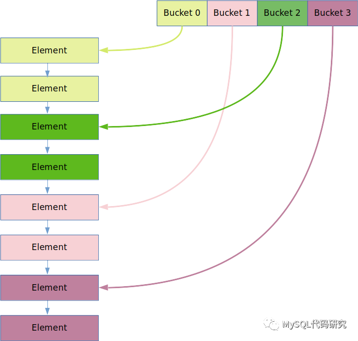

  

### 元素排序

为了能够做到将每个bucket的元素排列到一起，lf\_hash根据元素hash的反转值进行排序。并且要求bucket的数量必须是2的倍数。

  

#### 元素Hash的反转值

和其他Hash Table一样, LF\_HASH也是通过hash(key)得出一个32bits的整数值(hashnr)，这个值决定了元素属于哪一个bucket.

```plain
hashnr = hash(key);
// size是bucket的数量
bucket_id = hashnr % LF_HASH::size; 
bucket_id从0开始。
```

  

Hash的反转值是指将Hash的所有Bits的顺序颠倒过来。例如

```plain
// 为了表示方便，这里假设hashnr是8位的，按8位反转
// 实际使用是32位的，按32位反转
0 -> 00000000 -> 0000000
1 -> 00000001 -> 1000000
2 -> 00000010 -> 0100000
```

#### 排序特点

LF\_HASH的全局排序链表看起来是这样的:

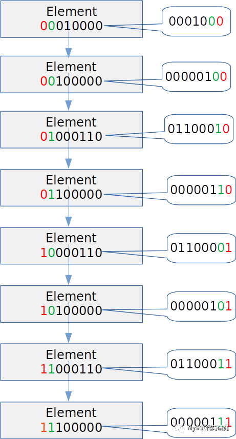 

为了书写方便，假设hash值的长度是8bit.

  

这个链表是按hash值的反向bit位排序的，因此

*   最低位为0的排在一起，为1的排在一起。
    
*   最低位相同的元素，又按第二低位排序。第二低位相同的，按第三低位排序。
    
*   hash值相同的按hash key排序（这个不是重点，这里可以忽略）。
    

  

### Bucket的数量必须是2的倍数

当bucket的数量是2的倍数时我们会发现

*   当bucket size是1时，所有元素会分到同一个bucket中。
    
*   当bucket size是2时，最低1位相同的元素会分到同一个bucket中。
    
*   当bucket size是4时，最低2位相同的元素会分到同一个bucket中。
    
*   bucket每扩展1倍，多1bit用来分bucket.
    

这个规律使得每个bucket的元素在全局链表中排列在一起。

  

如果将bucket id反转，我们会发现全局链表是按照元素的 bucket id的反转值分bucket的。bucket id的反转值就是当前bucket的里的最小值。

*   当bucket size是1时，所有的元素在bucket 0中。
    


*   当bucket size是2时，按照hash值的最低位（反转值的最高位)分bucket，0的分在bucket 0中，1分在bucket 中。排序规律符合要求，bucket 0和1的元素分别排列在一起。
    

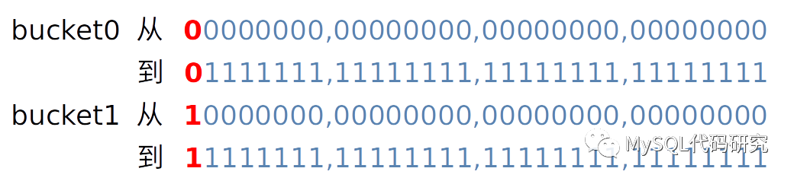

*   当bucket size是4时，按照最低2位的值分bucket，00的分在bucket 0, 01分在bucket 2中。10排在bucket 1中，11排在bucket 3中。排序规律要求，每个bucket的元素仍然是排列在一起的。
    

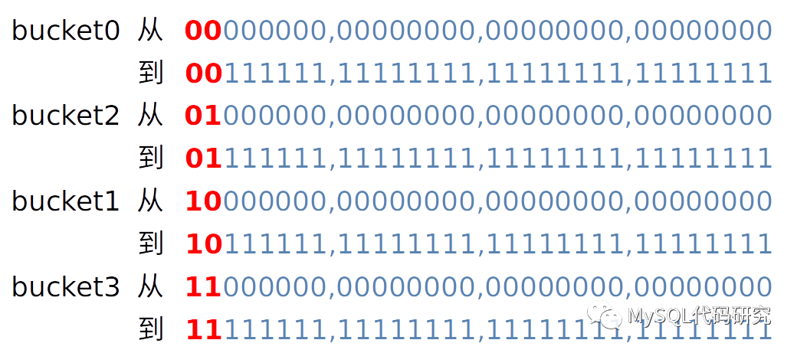

  

因此以2的倍数来扩展lf\_hash的bucket时

*   全局链表不需要任何变动
    
*   原有的buckets不需要变动
    
*   只需要将新的buckets指向自己的第一个元素。
    

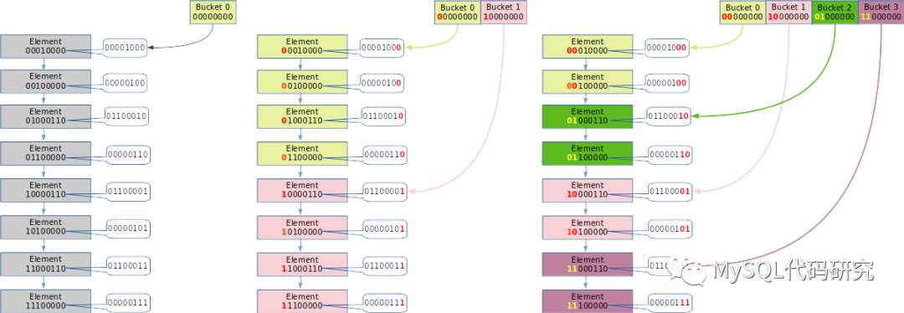

####   

#### Bucket Parent

你可能已经注意到了，按2的倍数扩展。实际上就是将原bucket能容纳的排序值的范围分成两半。前一半保留在原来的bucket中，后一半放到一个新bucket中。lf\_hash中称这个被分裂的bucket为parent。Parent bucket是固定的，根据bucket id可以算出parent. 对于bucket id的反转值来说，是将低位的1清零。

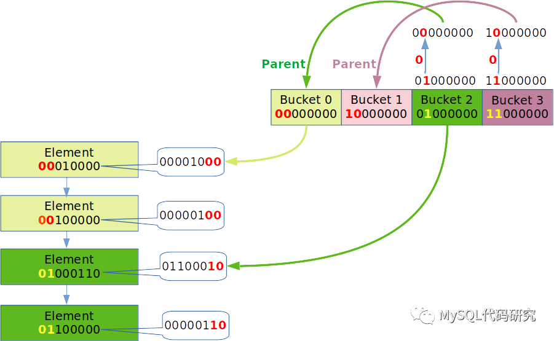

  

对bucket id来说，就是将高位的1清零。

```plain
  uint parent = my_clear_highest_bit(bucket);
```

### Dummy 元素

每个Bucket中都是一个指针，指向全局链表中这个bucket的最小元素，即head。为了避免这个指针随着head的变化而变化：

*   初始化一个bucket时会生成一个dummy元素，把dummy元素插入到全局链表中。
    
*   dummy元素的hash指定为bucket id。
    
*   bucket id的反转值是bucket中所有元素的最小值。所以dummy元素始终是这个bucket的链表的head。bucket的指针将始终指向这个dummy元素。
    

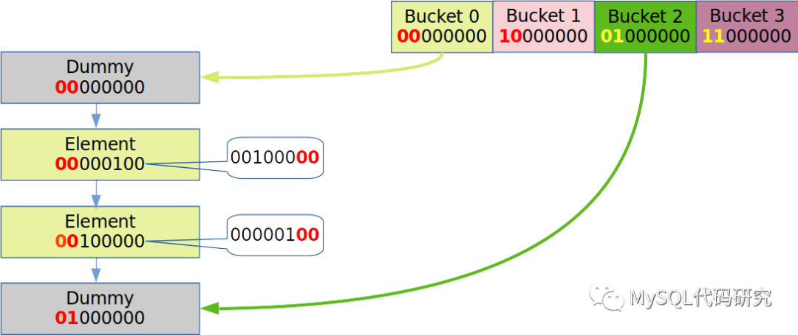

  

#### 区分用户元素和Dummy元素

用户元素的hash值可能会等于bucket id，为了避免将这个元素插到dummy元素的前面(lf\_hash中用的是前插)。lf\_hash会将用户元素的的hash反转值的最低位变为1。这样就保证了dummy元素的hash反转值最小且唯一。

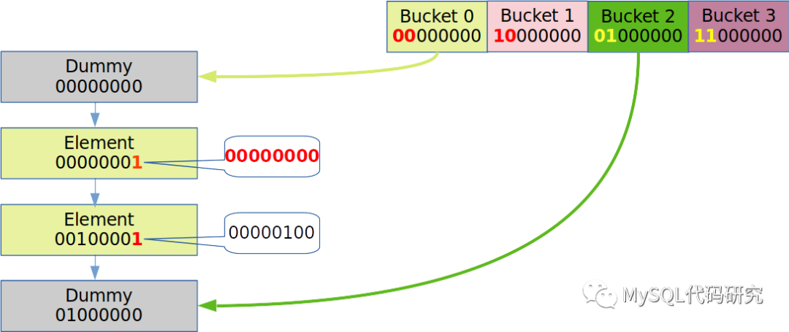

  

## 元素管理

为了Lock Free, lf\_hash自己管理元素的内存分配。

### 元素结构

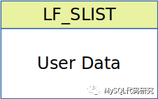

lf\_hash的元素使用一块连续的内存，包含两部分信息：

*   LF\_SLIST 链表和hash相关的信息
    
*   用户数据。放在LF\_SLIST之后，
    

#### LF\_SLIST

*   link:        指向链表中的下一个元素
    
*   hashnr    hash的反转值
    
*   key         指针指向key值
    

  

### LF\_ALLOCATOR

LF\_ALLOCATOR负责元素的管理。

  

#### LF\_ALLOCATOR::top 

Hash链表中的元素被删除后，并不会被释放(free)掉。它们会被放到一个链表中(lf\_hash中称作栈)，top指向链表中的第一个元素（栈顶）。当向Hash链表中插入一个元素时，会从这个链表中取一个元素使用。如果没有可供使用的元素，才会通过my\_malloc分配一个新的。

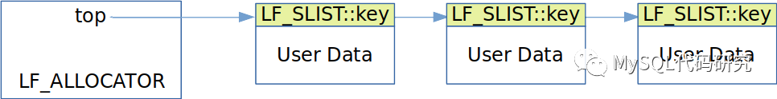

  

*   用LF\_SLIST::key指向下一个元素
    
    这里要注意的一点是，这个链表是使用LF\_SLIST::key连在一起的。为什么不使用LF\_SLIST::link呢？那是因为，是因为lf\_hash lock free的设计。
    

####   

#### 问题

除非Destroy整个Hash，LF\_ALLOCATOR中未使用的元素是不会释放的。如果这个HASH链表在某个时刻特别大，占用内存特别多。这些内存就会一直被占用，直到整个Hash被释放掉。

  

## PIN的机制

Lock Free意味着多个线程可能同时在使用一个元素。一个元素从全局链表中移除后，不能被立刻放入到LF\_ALLOCATOR::top 指向的Free元素链表中。别的线程可能正在使用这个元素。如果此时放到free链表中，又被别的线程重用了，就可能会造成错误。lf\_hash用LF\_PINS来保护一个正在使用的元素不被删除或者重用。我们可以将PIN想象成一个锁。

  

## LF\_PINS::pin

```plain
  std::atomic<void *> pin[LF_PINBOX_PINS];
```

pin包含4个指针，可以同时引用4个元素，看代码中最多用了3个。这是因为lf\_hash链表在操作的过程中最多可以使用到连续的三个元素previous, current, next。这3个元素要同时pin住。

  

线程在将一个元素放入Free元素链表之前，要检查所有的pin。如果有任何pin引用了这个元素，则要等待这个元素的引用被取消后才能继续操作。

  

### LF\_PINS::purgatory

如果并发的线程很多，遍历所有的pin就会消耗较长的时间。因此lf\_hash并不是每删除一个元素做一次遍历操作。而是对多个要删除的元素一起做遍历操作。这些要删除的元素会临时的放入LF\_PINS::purgatory链表。只有当purgatory的元素数量到达LF\_PURGATORY\_SIZE(10个)时或这个pin被释放时，才做一次遍历。没有被引用的元素会被放到LF\_ALLOCATOR::top指向的Free 元素链表中去。

  

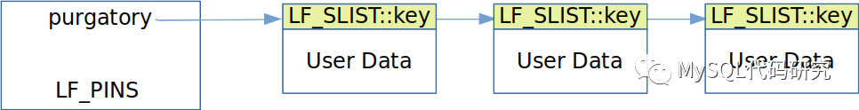

  

当将一个元素放入purgatory时，其他的线程可能正在读取这个元素，也可能正在读取这个元素的LF\_SLIST::link。因此puragory链表使用LF\_SLIST::key将要purge的元素链接到一起的。难道并发的线程不访问这个元素的LF\_SLIST::key吗？会访问，为了能够访问到正确的值，lf\_hash有下面这个设计。

####   

#### 删除标记

每个元素都有一个DELETED的标记位，在将元素从全局链表中移除之前，首先要将元素标记为DELETED。看代码时，你可能会迷惑。因为LF\_SLIST中，并没有一个DELETED标记位。那是因为DELETED标记位共享了link的最低位。

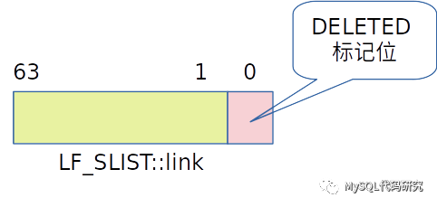

之所以能够和link共享最低位，是因为link是一个指针指向一个内存地址。内存地址总是4/8字节对齐的，最低位一定是0。

  

#### 删除的过程

1.  找到元素
    
2.  标记为DELETED
    
3.  从全局链表中移除
    
4.  加入purgatory链表，会修改元素的LF\_SLIST::key
    
5.  执行purge过程，如果purgatory链表有10个元素。
    

  

#### 查找元素的过程

1.  pin当前元素
    
2.  拷贝元素的hash key指针到临时变量,会读取LF\_SLIST::key
    
3.  检查元素是否是DELETED，如果是则移动到下一个元素。
    
4.  比较元素的hashnr和key，如果hashnr和key都小于要查找的hashnr和key则，移动到下一个元素。
    

  

**可以看到，删除的过程中是先标记DELETED，然后修改****LF\_SLIST::key。而在查找元素时，是先拷贝****LF\_SLIST::key，然后检查****DELETED标记。这就保证了查找中使用的key是正确的key。**

  

### LF\_PINBOX

Pinbox是pin的管理器，所有的pin放在一个动态数据里。

*   pinarray pin的动态数组
    

  

#### LF\_PINBOX::pinstack\_top\_ver

和LF\_ALLOCATOR::top类似，pinstack\_top\_ver指向free pin的链表(栈)。但它存储的不是指针，而是第一个元素在pinarray中的index. LF\_PINS::link用来指向下一个pin在pinarray中的index。

  

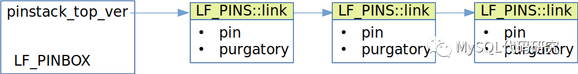

  

当用户调用lf\_hash\_put\_pins()时，会将pin放入这个链表。当调用lf\_hash\_get\_pins()时，会从pinstack\_top\_ver取出一个free pin。如果free pin的链表是空的(top是0)，则会给pinarray中增加一个元素。

  

#### top version

LF\_ALLOCATOR::top上的lock free操作是通过Pin来保护。那么LF\_PINBOX::pinstack\_top\_ver上的lock free操作又是做到的呢? 为了做到lock free， LF\_PINBOX::pinstack\_top\_ver上使用了version的方法。

  

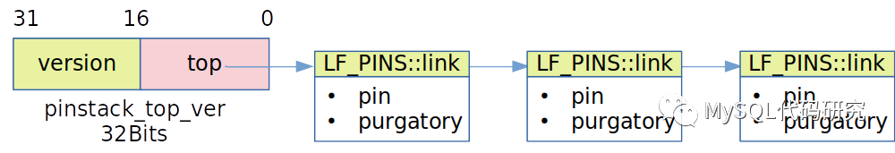

  

每次操作free pin链表时，都会将version加1。在做atomic\_compare\_exchange操作时，pinstack\_top\_ver作为一个整数，整体进行操作。

  

由于top只有16位，这就限制了pinarray最多只能有LF\_PINBOX\_MAX\_PINS(65535)个元素。

  

### PIN使用上的问题

从pin的设计可以看出，pin的使用原则是保护lf\_hash操作本身的。一个操作完成后,pin就可以释放了。MySQL中有些lf\_hash的pin是长期持有的。如MDL\_context::m\_pins，这个pin是在session第一次调用时获取，session退出时才释放。它会导致：

*   session的数量最多只能有65535个
    
*   session的数量很大时，导致pinarray很大。因此元素的purge操作效率很低。
    
*   前面说过purgatory中的元素到达LF\_PURGATORY\_SIZE(10个)时或者释放pin时，才会释放。由于这些pin到session结束时才释放，就会导致元素的释放不及时。分配的元素更多，占用内存更多。
    

  

## 动态数组

lf\_hash中的bucket和pin都使用了动态数组。为了实现lock free，在动态扩展时不拷贝内存，它做了特殊的设计。

  

### 多级数组

这个数组LF\_DYNARRAY\_LEVELS(4).

  

<table><tbody><tr style="height: 33px;"><td style="min-width: 90px;font-size: 14px;white-space: normal;overflow-wrap: break-word;border-color: rgb(217, 217, 217);padding: 4px 8px;cursor: default;"><p style="color: rgb(38, 38, 38);line-height: 1.74;letter-spacing: 0.05em;outline-style: none;overflow-wrap: break-word;">Level</p></td><td style="min-width: 90px;font-size: 14px;white-space: normal;overflow-wrap: break-word;border-color: rgb(217, 217, 217);padding: 4px 8px;cursor: default;"><p style="color: rgb(38, 38, 38);line-height: 1.74;letter-spacing: 0.05em;outline-style: none;overflow-wrap: break-word;">Index范围</p></td></tr><tr style="height: 33px;"><td style="min-width: 90px;font-size: 14px;white-space: normal;overflow-wrap: break-word;border-color: rgb(217, 217, 217);padding: 4px 8px;cursor: default;"><p style="color: rgb(38, 38, 38);line-height: 1.74;letter-spacing: 0.05em;outline-style: none;overflow-wrap: break-word;">0</p></td><td style="min-width: 90px;font-size: 14px;white-space: normal;overflow-wrap: break-word;border-color: rgb(217, 217, 217);padding: 4px 8px;cursor: default;"><p style="color: rgb(38, 38, 38);line-height: 1.74;letter-spacing: 0.05em;outline-style: none;overflow-wrap: break-word;">0 到 255</p></td></tr><tr style="height: 33px;"><td style="min-width: 90px;font-size: 14px;white-space: normal;overflow-wrap: break-word;border-color: rgb(217, 217, 217);padding: 4px 8px;cursor: default;"><p style="color: rgb(38, 38, 38);line-height: 1.74;letter-spacing: 0.05em;outline-style: none;overflow-wrap: break-word;">1</p></td><td style="min-width: 90px;font-size: 14px;white-space: normal;overflow-wrap: break-word;border-color: rgb(217, 217, 217);padding: 4px 8px;cursor: default;"><p style="color: rgb(38, 38, 38);line-height: 1.74;letter-spacing: 0.05em;outline-style: none;overflow-wrap: break-word;">256 到 256*256-1</p></td></tr><tr style="height: 33px;"><td style="vertical-align: top;background-color: rgb(255, 255, 255);color: rgb(38, 38, 38);min-width: 90px;font-size: 14px;white-space: normal;overflow-wrap: break-word;border-color: rgb(217, 217, 217);padding: 4px 8px;cursor: default;"><p style="line-height: 1.74;letter-spacing: 0.05em;outline-style: none;overflow-wrap: break-word;">2</p></td><td style="vertical-align: top;background-color: rgb(255, 255, 255);color: rgb(38, 38, 38);min-width: 90px;font-size: 14px;white-space: normal;overflow-wrap: break-word;border-color: rgb(217, 217, 217);padding: 4px 8px;cursor: default;"><p style="line-height: 1.74;letter-spacing: 0.05em;outline-style: none;overflow-wrap: break-word;">256*256 到 256*256*256-1</p></td></tr><tr style="height: 33px;"><td style="vertical-align: top;background-color: rgb(255, 255, 255);color: rgb(38, 38, 38);min-width: 90px;font-size: 14px;white-space: normal;overflow-wrap: break-word;border-color: rgb(217, 217, 217);padding: 4px 8px;cursor: default;"><p style="line-height: 1.74;letter-spacing: 0.05em;outline-style: none;overflow-wrap: break-word;">3</p></td><td style="vertical-align: top;background-color: rgb(255, 255, 255);color: rgb(38, 38, 38);min-width: 90px;font-size: 14px;white-space: normal;overflow-wrap: break-word;border-color: rgb(217, 217, 217);padding: 4px 8px;cursor: default;"><p style="line-height: 1.74;letter-spacing: 0.05em;outline-style: none;overflow-wrap: break-word;">256*256*256 到 256*256*256*256-1</p></td></tr></tbody></table>

  

#### 0级

0级包含256个指针，指向index 0到255的元素。这些元素初始化时不分配，用到时才分配。

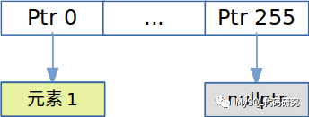

#### 1级

1级包含256个指针，每个指针指向一个0级数组。

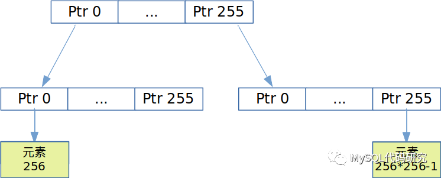

#### 2级

2级包含256个指针，每个指针指向一个1级数组。

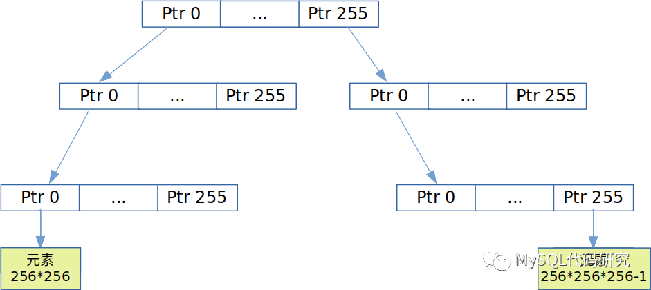

#### 3级

3级包含256个指针，每个指针指向一个2级数组。

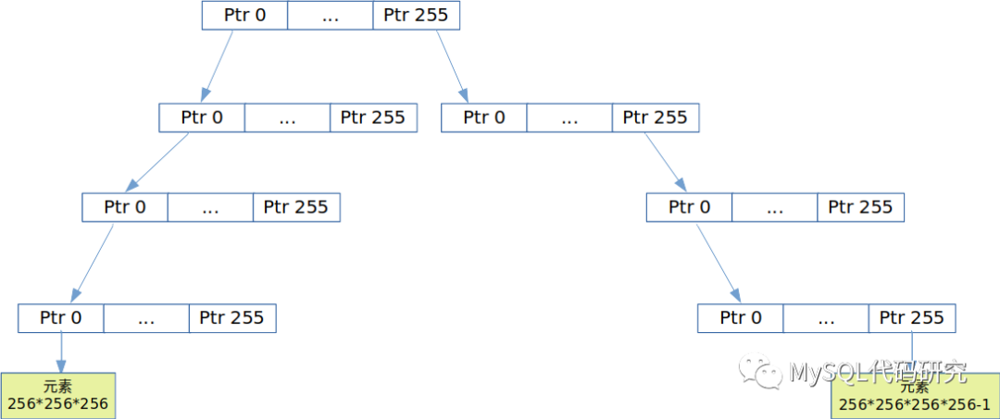