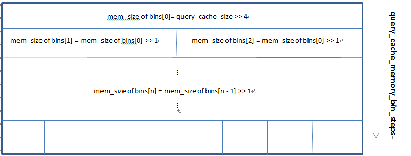

# MySQL · 源码分析 · Query Cache内部剖析

*   [当期文章](#)

## MySQL · 源码分析 · Query Cache内部剖析

## Query Cache背景

Query Cache在其他数据库里面也称为结果集缓存。顾名思义，它的目的是将SELECT语句与其返回结果缓存到Query Cache中，如果重复执行相同的SELECT语句的话，我们可以跳过MySQL的解析、优化、执行阶段，将SELECT的查询结果直接返回到客户端，加速SELECT语句的执行。

## Query Cache中的主要数据结构

<table><tbody><tr><td>Query_cache</td><td>对整个Query Cache进行管理，负责提供接口供Server调用。</td></tr><tr><td>Query_cache_block</td><td>Query Cache中的所有存储都是以Query_cache_block来组织的。每一个Query_cache_block的格式都是Block_header + data.</td></tr><tr><td>Query_cache_table</td><td>用来记录单个数据表的Block_header。</td></tr><tr><td>Query_cache_block_table</td><td>用来存储与Query相关的数据表的Block_header。每一个数据表都有一个独立的Query_cache_block_table结构对应。与Query_cache_table的区别是，所有Query使用的同一个数据表对应同一个Query_cache_table。</td></tr><tr><td>Query_cache_query</td><td>用来记录Query的Block_header。</td></tr><tr><td>Query_cache_result</td><td>用来记录结果集的Block_header。</td></tr><tr><td>Query_cache_memory_bin</td><td>用来管理Query Cache的内存使用，Query Cache的整体内存被划分为多个bins。该结构在Query Cache初始化的过程中完成。请参考下面Query Cache内存初始化部分。</td></tr><tr><td>Query_cache_memory_bin_step</td><td>用来辅助初始化Query_cache_memory_bins，记录内存管理的每一层的bins内存分配的大小。请参考下面Query Cache内存初始化部分。</td></tr><tr><td>Query_cache_query_flags</td><td>用来记录影响Query返回结果的环境变量，比如sql_mode，字符集，time_zone等。</td></tr></tbody></table>

## Query cache的存储结构

Query cache中是利用Query\_cache\_block对象进行存储的，存储结构如下图：

```plain
+----------------------------------------------------------------------------+
| Block header                                                               |
+----------------------------------------------------------------------------+
| Table of database table lists                                              |
+----------------------------------------------------------------------------+
| Type depended header                                                       |
+----------------------------------------------------------------------------+
| Data ...                                                                   |
+----------------------------------------------------------------------------+
```

**说明**：

*   Block header：指的就是Query\_cache\_block这个结构体自身需要存储的一些信息。详细信息可以参考sql/sql\_cache.h中的结构体说明。
    
*   Table of database table lists：这部分是用来记录与Query相关的所有数据表header信息(Query\_cache\_block\_table结构）。对于一条Query来说，每个相关的数据表都有一个这样的header信息。而对于结果集数据块来说，这部分不包含数据。
    
*   Type depended header ：这部分用来记录依赖于该Block的具体对象header，比如是Query\_cache\_query还是Query\_cache\_result。
    
*   Data：顾名思义，就是记录我们当前存储对象的数据信息。
    

## Query cache的内存管理

Query cache依靠自己对内存进行管理。当用户调整query\_cache\_size系统参数时，Query cache会自动的修改内存大小。

### Query cache内存的初始化

Query cache的内存初始化包含两个部分：

1.  一次性申请query\_cache\_size大小的内存空间。
    
2.  初始化内存管理方式。
    

Query cache的内存管理方式如下图所示：



**说明**：

Query cache对于整个内存的管理是将整个内存块划分多层大小不同的多个`query_cache_memory_bins`（简称bins）。具体的层数由`query_cache_memory_bin_steps` （简称steps）确定，steps是动态根据`query_mem_size`确定的，如何确定steps请参考`Query_cache::init_cache`。第N层的bins数量是由（前N-1层bins数量总和 + QUERY\_CACHE\_MEM\_BIN\_PARTS\_INC） \* QUERY\_CACHE\_MEM\_BIN\_PARTS\_MUL 确定的。`QUERY_CACHE_MEM_BIN_PARTS_INC`和`QUERY_CACHE_MEM_BIN_PARTS_MUL`是定义的控制每一层bins增量的两个宏。

### Query cache内存的分配

Query cache刚初始化后，整个内存作为一个大的free\_block。当需要申请新的数据块时，Query cache首先寻找大小最为接近的bins进行匹配，判断bins中有没有free\_block。如果有则使用；如果没有则从其上一个bins中寻找free\_block(bins是按照空间大小降序排列的，上层的bins大小要比下层的bins空间大），直到找到合适大小的一个。 如果最后没有找到合适大小的，Query cache将启动淘汰机制进行淘汰，以满足空间申请的需求。

### Query cache内存的回收

在需要申请内存块时，如果没有找到合适大小的free block, Query cache将启动淘汰机制来淘汰最旧的缓存记录，释放的block将被分配到对于大小的bins中。如果分配过程中发现当前回收的free block和bins中free block地址相邻， 当前回收的free block将会和相邻的free block进行合并，重新插入到大小合适的bins中。另外Query cache通过flush query cache语句可以自动整理Query cache的defragments。

## Query cache相关的几个重点系统变量

#### query\_cache\_type

<table><tbody><tr><td>范围</td><td>SESSION</td></tr><tr><td>类型</td><td>ENUM</td></tr><tr><td>功能</td><td>a) ON: cache所有SELECT语句。<br>b) OFF: 关闭query cache。(默认)。<br>c) DEMAND: 使用SQL_CACHE hint的SELECT语句才可以缓存</td></tr></tbody></table>

#### query\_cache\_size

<table><tbody><tr><td>范围</td><td>GLOBAL</td></tr><tr><td>类型</td><td>ULong</td></tr><tr><td>功能</td><td>a) 设置Query cache的大小，设置范围是（0 ~ ULONG_MAX）。<br>b) 默认值是1M。</td></tr></tbody></table>

#### query\_cache\_limit

<table><tbody><tr><td>范围</td><td>GLOBAL</td></tr><tr><td>类型</td><td>ULong</td></tr><tr><td>功能</td><td>a) 设置最大结果集大小范围，如果结果集超出了该值的大小，将不会被缓存。<br>设置范围是（0 ~ ULONG_MAX）。<br>b) 默认值是1M。</td></tr></tbody></table>

#### query\_cache\_min\_res\_unit

<table><tbody><tr><td>范围</td><td>GLOBAL</td></tr><tr><td>类型</td><td>ULong</td></tr><tr><td>功能</td><td>a) 设置内存申请的最小单元块的大小，如果设置太大会影响Query Cache的实际使用率，造成空间浪费。<br>如果设置太小会增加内存的分配以及合并成本。设置范围是（0 ~ ULONG_MAX）。<br>b) 默认值是4K。</td></tr></tbody></table>

### Query cache相关的两个Hints

#### sql\_no\_cache

功能: 当前sql语句忽略使用query cache.

#### sql\_cache

功能: 当query\_cache\_type为ON或者DEMAND时，考虑缓存当前sql语句的结果集。

## Query cache的工作原理

为了快速查找，Query cache中维护着一个HASH map，用来记录Query对应的其所在的query\_cache\_block。其对应的Key由query + database + flag（包含影响执行结果的所有环境变量）组成。如果当前Query与任何Key比较一致的话，对应的结果集就可以被直接返回。

## Query cache 的失效

当一个表发生改变时，所有与该表相关的cached queries将失效。一个表发生变化，包含多种语句，比如 INSERT, UPDATE, DELETE, TRUNCATE TABLE,ALTER TABLE, DROP TABLE, 或者 DROP DATABASE。 为了加速失效过程，Query cache中维护着一个HASH map, 用来记录table对应的query\_cache\_block\_table。其Key由db\_name + table\_name构成。通过Key的比较可以获取query\_cache\_block\_table，该对象包含一个双向链表，记录了所有与该表相关的cached queries。通过这样的方式便可以快速的失效一个表对应的所有cached queries。

## Query cache 的监控

*   Query cache 通过show status可以看到如下一系列的状态信息：

<table><tbody><tr><td>Qcache_total_blocks</td><td>Query cache总的块数。</td></tr><tr><td>Qcache_free_blocks</td><td>Query cache的free blocks数。</td></tr><tr><td>Qcache_hits</td><td>通过Query cache，命中的query次数。</td></tr><tr><td>Qcache_inserts</td><td>该变量记录了之前有多少条query及其数据集成功插入了Query Cache中，即便插入的记录后来被淘汰了，该值也不会受到影响。</td></tr><tr><td>Qcache_lowmem_prunes</td><td>Query cache中淘汰的query记录数。</td></tr><tr><td>Qcache_not_cached</td><td>未被缓存的query数。</td></tr><tr><td>Qcache_queries_in_cache</td><td>当前Query cache存在的query记录数，如果有记录被淘汰了，该值就会发生变化。注意与Qcache_inserts的不同。</td></tr><tr><td>Qcache_total_blocks</td><td>当前Query cache中总的blocks个数。</td></tr></tbody></table>

*   Optimizer\_trace中会显示“query\_result\_read\_from\_cache：true”这样的信息。

## 总结

如果当前用户频繁使用同样的query进行查询，Query cache对于性能的提升是显而易见的。但是也有不太理想的情况，Query cache由于不仅依赖于执行的query，同时也依赖于当时的执行环境，比如SQL\_MODE信息，字符集等，因此对于多用户共享Query cache，很难做到完全的共享。

另外，对于失效方式，目前MySQL做的并不到位，只要是表或表中的数据发生了变化便会引发相关cached queries失效，而更理想的方式是只有影响当前cached queries的执行结果的表的变化才引发相关cached plan失效。比如如果UPDATE语句并未修改某个cached queries的执行记过，其实可以不用对其失效。

我们会在接下来的文章中继续剖析Query cache的并发处理过程，敬请期待。