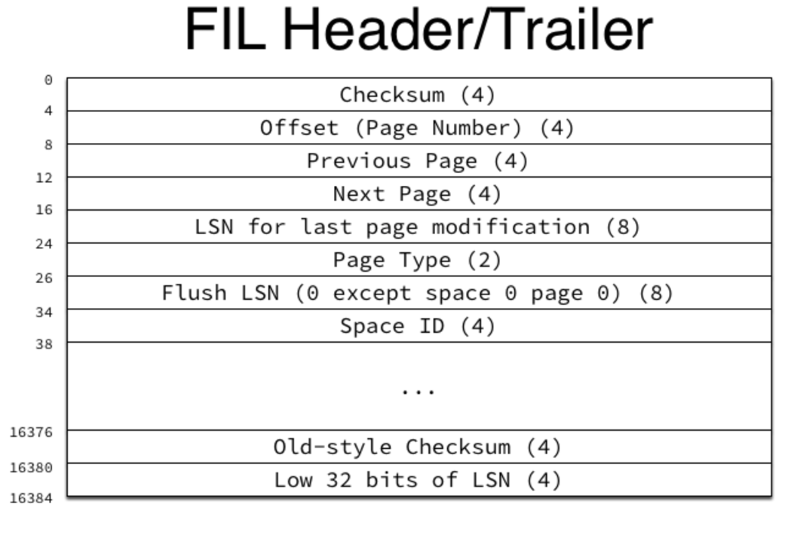

# [innodb\_force\_recovery]

## 概念

### Undo Log

在事务执行之前：

*   首先将**原数据**备份到InnoDB的系统表空间（System Tablespace）的回滚段（Rollback Segments）
*   然后进行数据的修改
*   如果出现了错误或者用户执行了ROLLBACK语句，系统可以利用Undo Log中的备份将数据恢复到事务开始之前的状态

保证事务的**原子性**

### Redo Log

在事务提交之前：

*   首先将**新数据**备份记录到Redo Log
*   将Redo Log持久化即认为事务提交成功
*   不需要立即保证新数据在表空间文件持久化
*   如果在MySQL刷新Buffer Pool脏页时crash，重启后可以通过Redo Log恢复数据

Redo Log一般为顺序写，要快于InnoDB表空间文件中B+ Tree的随机写

保证事务的**持久性**和提高写盘性能

### Change Buffer

主键为唯一字段，数据页按照主键顺序存放

二级索引通常为非唯一字段，当随机写（插入操作）时会离散访问，InnoDB采用Change Buffer（也叫Insert Buffer）缓存将这些操作，减少随机I/O

## InnoDB Crash Recovery

需要先介绍一下InnoDB崩溃恢复（Crash Recovery）时的主要流程

*   【1】使用Redo Log重做（重新执行）上次Checkpoint之后的所有事务
*   【2】使用Undo Log回滚部分执行成功、未提交成功的事务
*   【3】Merge Change buffer中缓存的操作
*   【4】Purge标注为delete-marked的记录

以上步骤可以部分的并行执行

## 系统变量innodb\_force\_recovery

innodb\_force\_recovery用于指定崩溃恢复（crash recovery）模式，忽略某些InnoDB的启动操作，使InnoDB在“紧急”的情况下强制启动

*   默认值0，不执行”强制启动“选项
*   **每一个恢复选项都拥有全部较低等级恢复选项的功能**

### SRV\_FORCE\_IGNORE\_CORRUPT

整型值：1

忽略数据损坏页

*   buf\_page\_is\_corrupted函数

#### buf\_page\_is\_corrupted

函数主要关注页的Header和Trailer，如上图

*   如果数据页没有压缩，检查LSN的低4位字节（LSN for last page modification，offset：20）和页的最后4个字节（Low 32 bits of LSN）是否相等
    *   相等，函数继续
    *   不相等，返回页损坏
*   Redo Log的LSN小于当前数据页的LSN（LSN for last page modification），否则报错
*   LSN是否可以被8整除，否则报错
    
*   重新计算数据页的Checksum，检查是否等于CheckSum（数据页前4个字节）或者Old-style Checksum

### SRV\_FORCE\_NO\_BACKGROUND

整型值：2

阻止master thread和purge thread运行

### SRV\_FORCE\_NO\_TRX\_UNDO

整型值：3

innodb crash recovery时不执行事务的回滚

### SRV\_FORCE\_NO\_IBUF\_MERGE

整型值：4

对 change buffer（insert buffer）不执行merge操作

### SRV\_FORCE\_NO\_UNDO\_LOG\_SCAN

整型值：5

不查看undo日志；将未完成的事务视为已完成

### SRV\_FORCE\_NO\_LOG\_REDO

整型值：6

不执行前滚操作：

*   常规的，当InnoDB崩溃恢复时（crash recovery），在Redo Log中，从最近的checkpoint之后，来重新执行事务以达到与崩溃之前的数据一致性
*   如果设置SRV\_FORCE\_NO\_LOG\_REDO，跳过上面的操作

