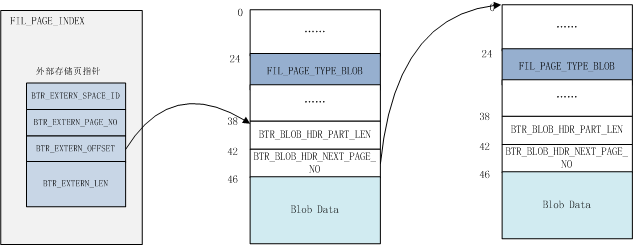
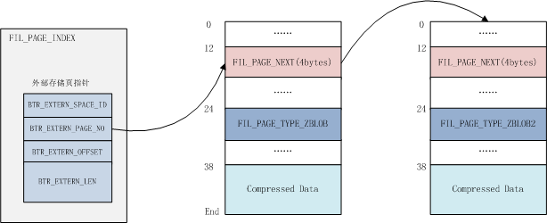

#1.内核月报FIL_PAGE_TYPE_BLOB

## 外部存储页

对于大字段，在满足一定条件时InnoDB使用外部页进行存储。外部存储页有三种类型：

1.  `FIL_PAGE_TYPE_BLOB`：表示非压缩的外部存储页，结构如下图所示：
    
    
    
2.  `FIL_PAGE_TYPE_ZBLOB`：压缩的外部存储页，如果存在多个blob page，则表示第一个 `FIL_PAGE_TYPE_ZBLOB2`：如果存在多个压缩的blob page，则表示blob链随后的page； 结构如下图所示：
    
    
    

而在记录内只存储了20个字节的指针以指向外部存储页，指针描述如下：

| Macro | bytes | Desc |
| --- | --- | --- |
| BTR\_EXTERN\_SPACE\_ID | 4 | 外部存储页所在的space id |
| BTR\_EXTERN\_PAGE\_NO | 4 | 第一个外部页的Page no |
| BTR\_EXTERN\_OFFSET | 4 | 对于压缩页，为12，该偏移量存储了指向下一个外部页的的page no；对于非压缩页，值为38，指向blob header，如上图所示 |

外部页的写入参阅函数 `btr_store_big_rec_extern_fields`
