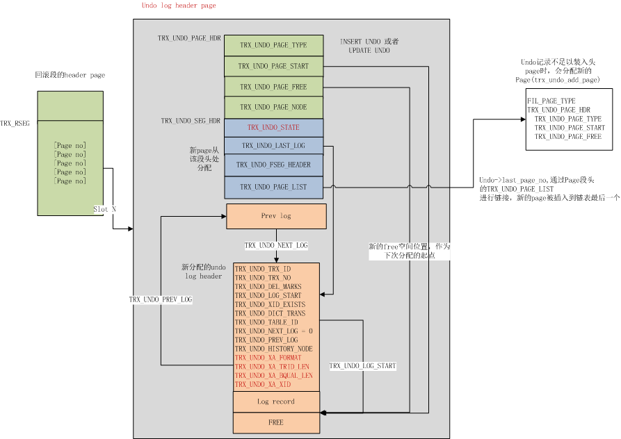

#1.MACRO SYSTEM page offset

```cpp
/** @name The space low address page map
The pages at FSP_XDES_OFFSET and FSP_IBUF_BITMAP_OFFSET are repeated
every XDES_DESCRIBED_PER_PAGE pages in every tablespace. */
/* @{ */
/*--------------------------------------*/
#define FSP_XDES_OFFSET         0   /* !< extent descriptor */
#define FSP_IBUF_BITMAP_OFFSET      1   /* !< insert buffer bitmap */
                /* The ibuf bitmap pages are the ones whose
                page number is the number above plus a
                multiple of XDES_DESCRIBED_PER_PAGE */

#define FSP_FIRST_INODE_PAGE_NO     2   /*!< in every tablespace */
                /* The following pages exist
                in the system tablespace (space 0). */
#define FSP_IBUF_HEADER_PAGE_NO     3   /*!< insert buffer
                        header page, in
                        tablespace 0 */
#define FSP_IBUF_TREE_ROOT_PAGE_NO  4   /*!< insert buffer
                        B-tree root page in
                        tablespace 0 */
                /* The ibuf tree root page number in
                tablespace 0; its fseg inode is on the page
                number FSP_FIRST_INODE_PAGE_NO */
#define FSP_TRX_SYS_PAGE_NO     5   /*!< transaction
                        system header, in
                        tablespace 0 */
#define FSP_FIRST_RSEG_PAGE_NO      6   /*!< first rollback segment
                        page, in tablespace 0 */
#define FSP_DICT_HDR_PAGE_NO        7   /*!< data dictionary header
                        page, in tablespace 0 */
/*--------------------------------------*/
/* @} */
```

#2.内核月报--系统数据页

这里我们将所有非独立的数据页统称为系统数据页，主要存储在ibdata中，如下图所示：


InnoDB 系统数据页

ibdata的三个page和普通的用户表空间一样，都是用于维护和管理文件页。其他Page我们下面一一进行介绍。

**FSP\_IBUF\_HEADER\_PAGE\_NO** Ibdata的第4个page是Change Buffer的header page，类型为`FIL_PAGE_TYPE_SYS`，主要用于对ibuf btree的Page管理。

**FSP\_IBUF\_TREE\_ROOT\_PAGE\_NO** 用于存储change buffer的根page，change buffer目前存储于Ibdata中，其本质上也是一颗btree，root页为固定page，也就是Ibdata的第5个page。

IBUF HEADER Page 和Root Page联合起来对ibuf的数据页进行管理。

首先Ibuf btree自己维护了一个空闲Page链表，链表头记录在根节点中，偏移量在`PAGE_BTR_IBUF_FREE_LIST`处，实际上利用的是普通索引根节点的`PAGE_BTR_SEG_LEAF`字段。Free List上的Page类型标示为`FIL_PAGE_IBUF_FREE_LIST`

每个Ibuf page重用了`PAGE_BTR_SEG_LEAF`字段，以维护IBUF FREE LIST的前后文件页节点（`PAGE_BTR_IBUF_FREE_LIST_NODE`）。

由于root page中的segment字段已经被重用，因此额外的开辟了一个Page，也就是Ibdata的第4个page来进行段管理。在其中记录了ibuf btree的segment header，指向属于ibuf btree的inode entry。

关于ibuf btree的构建参阅函数 `btr_create`

**FSP\_TRX\_SYS\_PAGE\_NO/FSP\_FIRST\_RSEG\_PAGE\_NO** ibdata的第6个page，记录了InnoDB重要的事务系统信息，主要包括：

| Macro | bytes | Desc |
| --- | --- | --- |
| TRX\_SYS | 38 | 每个数据页都会保留的文件头字段 |
| TRX\_SYS\_TRX\_ID\_STORE | 8 | 持久化的最大事务ID，这个值不是实时写入的，而是256次递增写一次 |
| TRX\_SYS\_FSEG\_HEADER | 10 | 指向用来管理事务系统的segment所在的位置 |
| TRX\_SYS\_RSEGS | 128 \* 8 | 用于存储128个回滚段位置，包括space id及page no。每个回滚段包含一个文件segment（`trx_rseg_header_create`） |
| …… | 以下是Page内UNIV\_PAGE\_SIZE - 1000的偏移位置 |   |
| TRX\_SYS\_MYSQL\_LOG\_MAGIC\_N\_FLD | 4 | Magic Num ，值为873422344 |
| TRX\_SYS\_MYSQL\_LOG\_OFFSET\_HIGH | 4 | 事务提交时会将其binlog位点更新到该page中，这里记录了在binlog文件中偏移量的高位的4字节 |
| TRX\_SYS\_MYSQL\_LOG\_OFFSET\_LOW | 4 | 同上，记录偏移量的低4位字节 |
| TRX\_SYS\_MYSQL\_LOG\_NAME | 4 | 记录所在的binlog文件名 |
| …… | 以下是Page内UNIV\_PAGE\_SIZE - 200 的偏移位置 |   |
| TRX\_SYS\_DOUBLEWRITE\_FSEG | 10 | 包含double write buffer的fseg header |
| TRX\_SYS\_DOUBLEWRITE\_MAGIC | 4 | Magic Num |
| TRX\_SYS\_DOUBLEWRITE\_BLOCK1 | 4 | double write buffer的第一个block(占用一个Extent)在ibdata中的开始位置，连续64个page |
| TRX\_SYS\_DOUBLEWRITE\_BLOCK2 | 4 | 第二个dblwr block的起始位置 |
| TRX\_SYS\_DOUBLEWRITE\_REPEAT | 12 | 重复记录上述三个字段，即MAGIC NUM, block1, block2，防止发生部分写时可以恢复 |
| TRX\_SYS\_DOUBLEWRITE\_SPACE\_ID\_STORED | 4 | 用于兼容老版本，当该字段的值不为TRX\_SYS\_DOUBLEWRITE\_SPACE\_ID\_STORED\_N时，需要重置dblwr中的数据 |

在5.7版本中，回滚段既可以在ibdata中，也可以在独立undo表空间，或者ibtmp临时表空间中，一个可能的分布如下图所示（摘自我之前的[这篇文章](http://mysql.taobao.org/monthly/2015/04/01/)）。


InnoDB Undo 回滚段结构

由于是在系统刚启动时初始化事务系统，因此第0号回滚段头页总是在ibdata的第7个page中。

事务系统创建参阅函数 `trx_sysf_create`

InnoDB最多可以创建128个回滚段，每个回滚段需要单独的Page来维护其拥有的undo slot，Page类型为`FIL_PAGE_TYPE_SYS`。描述如下：

| Macro | bytes | Desc |
| --- | --- | --- |
| TRX\_RSEG | 38 | 保留的Page头 |
| TRX\_RSEG\_MAX\_SIZE | 4 | 回滚段允许使用的最大Page数，当前值为ULINT\_MAX |
| TRX\_RSEG\_HISTORY\_SIZE | 4 | 在history list上的undo page数，这些page需要由purge线程来进行清理和回收 |
| TRX\_RSEG\_HISTORY | FLST\_BASE\_NODE\_SIZE(16) | history list的base node |
| TRX\_RSEG\_FSEG\_HEADER | (FSEG\_HEADER\_SIZE)10 | 指向当前管理当前回滚段的inode entry |
| TRX\_RSEG\_UNDO\_SLOTS | 1024 \* 4 | undo slot数组，共1024个slot，值为FIL\_NULL表示未被占用，否则记录占用该slot的第一个undo page |

回滚段头页的创建参阅函数 `trx_rseg_header_create`

实际存储undo记录的Page类型为`FIL_PAGE_UNDO_LOG`，undo header结构如下

| Macro | bytes | Desc |
| --- | --- | --- |
| TRX\_UNDO\_PAGE\_HDR | 38 | Page 头 |
| TRX\_UNDO\_PAGE\_TYPE | 2 | 记录Undo类型，是TRX\_UNDO\_INSERT还是TRX\_UNDO\_UPDATE |
| TRX\_UNDO\_PAGE\_START | 2 | 事务所写入的最近的一个undo log在page中的偏移位置 |
| TRX\_UNDO\_PAGE\_FREE | 2 | 指向当前undo page中的可用的空闲空间起始偏移量 |
| TRX\_UNDO\_PAGE\_NODE | 12 | 链表节点，提交后的事务，其拥有的undo页会加到history list上 |

undo页内结构及其与回滚段头页的关系参阅下图：



InnoDB Undo 页内结构

关于具体的Undo log如何存储，本文不展开描述，可阅读我之前的这篇文章：[MySQL · 引擎特性 · InnoDB undo log 漫游](http://mysql.taobao.org/monthly/2015/04/01/)

**FSP\_DICT\_HDR\_PAGE\_NO** ibdata的第8个page，用来存储数据词典表的信息 （只有拿到数据词典表，才能根据其中存储的表信息，进一步找到其对应的表空间，以及表的聚集索引所在的page no）

Dict\_Hdr Page的结构如下表所示：

| Macro | bytes | Desc |
| --- | --- | --- |
| DICT\_HDR | 38 | Page头 |
| DICT\_HDR\_ROW\_ID | 8 | 最近被赋值的row id，递增，用于给未定义主键的表，作为其隐藏的主键键值来构建btree |
| DICT\_HDR\_TABLE\_ID | 8 | 当前系统分配的最大事务ID，每创建一个新表，都赋予一个唯一的table id，然后递增 |
| DICT\_HDR\_INDEX\_ID | 8 | 用于分配索引ID |
| DICT\_HDR\_MAX\_SPACE\_ID | 4 | 用于分配space id |
| DICT\_HDR\_MIX\_ID\_LOW | 4 |   |
| DICT\_HDR\_TABLES | 4 | SYS\_TABLES系统表的聚集索引root page |
| DICT\_HDR\_TABLE\_IDS | 4 | SYS\_TABLE\_IDS索引的root page |
| DICT\_HDR\_COLUMNS | 4 | SYS\_COLUMNS系统表的聚集索引root page |
| DICT\_HDR\_INDEXES | 4 | SYS\_INDEXES系统表的聚集索引root page |
| DICT\_HDR\_FIELDS | 4 | SYS\_FIELDS系统表的聚集索引root page |

dict\_hdr页的创建参阅函数 `dict_hdr_create`

**double write buffer** InnoDB使用double write buffer来防止数据页的部分写问题，在写一个数据页之前，总是先写double write buffer，再写数据文件。当崩溃恢复时，如果数据文件中page损坏，会尝试从dblwr中恢复。

double write buffer存储在ibdata中，你可以从事务系统页(ibdata的第6个page)获取dblwr所在的位置。总共128个page，划分为两个block。由于dblwr在安装实例时已经初始化好了，这两个block在Ibdata中具有固定的位置，Page64 ~127 划属第一个block，Page 128 ~191划属第二个block。

在这128个page中，前120个page用于batch flush时的脏页回写，另外8个page用于SINGLE PAGE FLUSH时的脏页回写。


