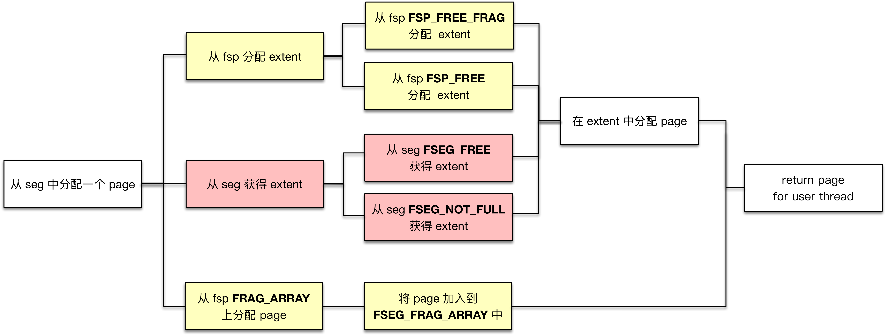
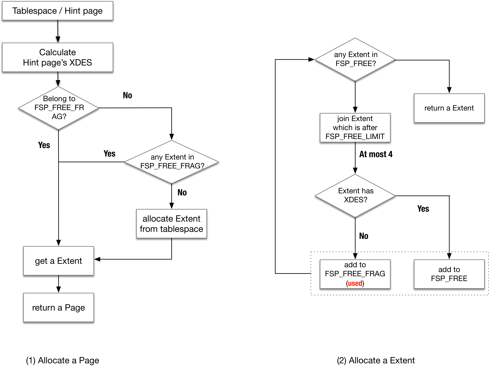

#1.在Segment中申请一个Page


以用户表空间的 Segement 为例，为 Segement 分配空间主要发生在两处：

*   为 B-tree 结构的 Segement 的分裂时分配 Page（fseg\_alloc\_free\_page\_low）
*   为 Rollback Segement 分配 Page

以前者为例（复杂的过程 ...）。有多种分配策略，下图中的起点到终点的任意路径都是可能的方式

  



有一个问题，在这个过程中前置条件是一个索引中需要新分配一个Page（给待分裂的节点），那么如果这个索引如何知道它保存了哪些Extent？

1.  在SYS\_INDEXES系统表中找到该索引的根节点位置（SYS\_INDEXES系统表记录了表，索引，及根节点对应的Page no）
2.  在根节点的Segment Header中找到该 Segment 占有的 INODE entry 位置
3.  在INODE entry中即可找到一系列的关于 Extent 的链表

**在为Segment分配Page / Extent之前，往往需要****【预留空间】，防止如在****B+ Tree分裂的过程中出现空间不足**

*   预留空间的大小是tree\_height / 16 + 3（通常都是3个Extents）

从 Segment 申请 Page 时，有一个参数叫 Hint Page no，通常是当前需要分裂 Page 的前一个（direction = FSP\_DOWN）或者后一个 Page (direction = FSP\_UP)，其目的是将逻辑上相邻的 Page 在物理文件中上也尽量相邻

```cpp
// 在 Segment 中申请一个 Page
fseg_alloc_free_page_low(
    // 调用者希望被分配的 Page。通常是当前需要分裂 Page 的前一个（direction = FSP_DOWN）或者后一个 Page(direction = FSP_UP)
    // 其目的是将逻辑上相邻的 Page 在物理文件中上也尽量相邻
    ulint      hint
)
{
    // 计算 Segment 当前占用的 Page 总数和使用的 Page 总数
    // 1）占用总数：FSEG_FREE上 Page 总数（链表长度 * 64） + FSEG_NOT_FULL上的 Page 总数
    //           +FSEG_FULL上 Page 总数 + FRAG_ARRY中的已使用的 Page 数
    // 2）使用总数：FSEG_NOT_FULL 链表上使用的 Page 总数（保存在 XDES Entry FSEG_NOT_FULL_N_USED 域）
    //           +FSEG_FULL 链表上的 Page 总数（链表长度 * 64）+ FRAG_ARRY 中的已使用的 Page 数
    reserved = fseg_n_reserved_pages_low();
 
    // 计算 hint 所在的 XDES Entry
    //   * 先计算 hint 所属的 XDES page no，即用 ut_2pow_round (hint_page_no, 16K)
    //     因为每 256 extents（256*64=16K pages）有一个 XDES
    hint_XDES_entry = xdes_get_descriptor_with_space_hdr();
     
    if (hint Extent 属于 Segment
        && hint 尚未被使用)
        // Situation 1
        return hint
    else if (hint_XDES_entry在FSP_FREE上
        && 空间使用率大于7/8
        && FRAG_ARRAY 已被用完)
        // Situation 2
        // 分配 hint_XDES_entry给Segment，拿到 hint
        // 注意这里的条件，即使 hint_XDES_entry 在FSP_FREE上，但比如空间使用率不大于7/8
        // 也不会分配新的 Extent，这里可以阻止碎片的产生
        return hint
    else if (是 B-tree 的分裂（direction != FSP_NO_DIR）
        && 空间使用率不大于7/8 
        && 当前 Segment 已经使用了超过32个 frag page)
        // Situation 3
        // 到这里已经说明无法获得hint
        // 尝试从Segment获取一个Extent（如果没有，则从Tablespace分配一个Extent给Segment）**
        // 返回该Extent最后一个Page（direction == FSP_DOWN）或第一个Page（direction == FSP_UP）
    else if (hint Extent属于Segment
        && hint Extent未被用完)
        // Situation 4
        return any_free_page (in hint Extent)
    else if (空间使用率不是100%)
        // Situation 5
        return any_free_page (in Segment)
    else if (已经使用的 Page < 32)
        // Situation 6
        // 从表空间中分配一个 Page 给 Segment，并加入到 Segment FRAG_ARRAY
    else
        // Situation 7
        // 以上情况都不满足
        // 从Tablespace直接分配一个 Extent**，并返回其中一个 Page
}
```

上述过程复杂，但总结起来优先级由高至低为：

1.  尽力申请 Hint Page
2.  申请 Segment 中 Extent 的 Page
1. 1. 1. 3.  Segment 从 Tablespace 中申请一个 Extent，返回 PageE

#2. 从表空间申请单独的 Page / Extent

上述的代码步骤里出现两个操作：**从表空间申请碎片的 Page / Extent（Situation 3 / 7）**

*   碎片的Page是从 **FSP\_FREE\_FRAG** 链表中分配
*   Extent是从 **FSP\_FREE** 链表中分配  
      
    

  

**TODO：释放Segment / 回收Page**

#3.内核月报分配数据页

**分配数据页** 随着btree数据的增长，我们需要为btree的segment分配新的page。前面我们已经讲过，segment是一个独立的page管理单元，我们需要将从全局获得的数据空间纳入到segment的管理中。

Step 1：空间扩展

当判定插入索引的操作可能引起分裂时，会进行悲观插入(`btr_cur_pessimistic_insert`)，在做实际的分裂操作之前，会先对文件进行扩展，并尝试预留(tree\_height / 16 + 3)个Extent，大多数情况下都是3个Extent。

这里有个意外场景：如果当前文件还不超过一个Extent，并且请求的page数小于1/2个Extent时，则如果指定page数，保证有2个可用的空闲Page，或者分配指定的page，而不是以Extent为单位进行分配。

注意这里只是保证有足够的文件空间，避免在btree操作时进行文件Extent。如果在这一步扩展了ibd文件(`fsp_try_extend_data_file`)，新的数据页并未初始化，也未加入到任何的链表中。

在判定是否有足够的空闲Extent时，本身ibd预留的空闲空间也要纳入考虑，对于普通用户表空间是2个Extent + file\_size \* 1%。这些新扩展的page此时并未进行初始化，也未加入到，在头page的`FSP_FREE_LIMIT`记录的page no标识了这类未初始化页的范围。

Step 2：为segment分配page

随后进入索引分裂阶段(`btr_page_split_and_insert`)，新page分配的上层调用栈：

```sql
btr_page_alloc
|--> btr_page_alloc_low
	|--> fseg_alloc_free_page_general
			|--> fseg_alloc_free_page_low
```

在传递的参数中，有个hint page no，通常是当前需要分裂的page no的前一个（direction = FSP\_DOWN）或者后一个page no(direction = FSP\_UP)，其目的是将逻辑上相邻的节点在物理上也尽量相邻。

在Step 1我们已经保证了物理空间有足够的数据页，只是还没进行初始化。将page分配到当前segment的流程如下(`fseg_alloc_free_page_low`)：

1.  计算当前segment使用的和占用的page数
    *   使用的page数存储包括`FSEG_NOT_FULL`链表上使用的page数(存储在inode entry的`FSEG_NOT_FULL_N_USED`中) + 已用满segment的`FSEG_FULL`链表上page数 + 占用的frag array page数量；
    *   占用的page数包括`FSEG_FREE`、`FSEG_NOT_FULL`、`FSEG_FULL`三个链表上的Extent + 占用的frag array page数量。
2.  根据hint page获取对应的xdes entry (`xdes_get_descriptor_with_space_hdr`)
3.  当满足如下条件时该hint page可以直接拿走使用：
    *   Extent状态为`XDES_FSEG`，表示属于一个segment
    *   hint page所在的Extent已被分配给当前segment(检查xdes entry的XDES\_ID)
    *   hint page对应的bit设置为free，表示尚未被占用
    *   **返回hint page**
4.  当满足条件：1) xdes entry当前是空闲状态(XDES\_FREE)；2) 该segment中已使用的page数大于其占用的page数的7/8 (`FSEG_FILLFACTOR`)；3) 当前segment已经使用了超过32个frag page，即表示其inode中的frag array可能已经用满。
    *   从表空间分配hint page所在的Extent (`fsp_alloc_free_extent`)，将其从FSP\_FREE链表上移除
    *   设置该Extent的状态为XDES\_FSEG，写入seg id，并加入到当前segment的FSEG\_FREE链表中。
    *   **返回hint page**
5.  当如下条件时：1) direction != FSP\_NO\_DIR，对于Btree分裂，要么FSP\_UP，要么FSP\_DOWN；2）已使用的空间小于已占用空间的7/8； 3）当前segment已经使用了超过32个frag page
    *   尝试从segment获取一个Extent(`fseg_alloc_free_extent`)，如果该segment的FSEG\_FREE链表为空，则需要从表空间分配（`fsp_alloc_free_extent`）一个Extent，并加入到当前segment的FSEG\_FREE链表上
    *   direction为FSP\_DOWN时，**返回该Extent最后一个page**，为FSP\_UP时，**返回该Extent的第一个Page**
6.  xdes entry属于当前segment且未被用满，从其中取一个**空闲page并返回**
7.  如果该segment占用的page数大于实用的page数，说明该segment还有空闲的page，则依次先看`FSEG_NOT_FULL`链表上是否有未满的Extent，如果没有，再看FSEG\_FREE链表上是否有完全空闲的Extent。从其中取一个**空闲Page并返回**
8.  当前已经实用的Page数小于32个page时，则分配独立的page（`fsp_alloc_free_page`）并加入到该inode的frag array page数组中，然后**返回该block**
9.  当上述情况都不满足时，直接分配一个Extent(`fseg_alloc_free_extent`)，并从**其中取一个page返回**。

上述流程看起来比较复杂，但可以总结为：

1.  对于一个新的segment，总是优先填满32个frag page数组，之后才会为其分配完整的Extent，可以利用碎片页，并避免小表占用太多空间。
2.  尽量获得hint page;
3.  如果segment上未使用的page太多，则尽量利用segment上的page。

上文提到两处从表空间为segment分配数据页，一个是分配单独的数据页，一个是分配整个Extent

表空间单独数据页的分配调用函数`fsp_alloc_free_page`:

1.  如果hint page所在的Extent在链表`XDES_FREE_FRAG`上，可以直接使用；否则从根据头page的`FSP_FREE_FRAG`链表查看是否有可用的Extent；
2.  未能从上述找到一个可用Extent，直接分配一个Extent，并加入到`FSP_FREE_FRAG`链表中；
3.  从获得的Extent中找到描述为空闲（`XDES_FREE_BIT`）的page。
4.  分配该page (`fsp_alloc_from_free_frag`)
    *   设置page对应的bitmap的`XDES_FREE_BIT`为false，表示被占用；
    *   递增头page的`FSP_FRAG_N_USED`字段；
    *   如果该Extent被用满了，就将其从`FSP_FREE_FRAG`移除，并加入到`FSP_FULL_FRAG`链表中。同时对头Page的`FSP_FRAG_N_USED`递减1个Extent(`FSP_FRAG_N_USED`只存储未满的Extent使用的page数量)；
    *   对Page内容进行初始化(`fsp_page_create`)。

表空间Extent的分配函数`fsp_alloc_free_extent`:

1.  通常先通过头page看FSP\_FREE链表上是否有空闲的Extent，如果没有的话，则将新的Extent（例如上述step 1对文件做扩展产生的新page，从`FSP_FREE_LIMIT`算起）加入到`FSP_FREE`链表上(`fsp_fill_free_list`)：
    *   一次最多加4个Extent(`FSP_FREE_ADD`)；
    *   如果涉及到xdes page，还需要对xdes page进行初始化；
    *   如果Extent中存在类似xdes page这样的系统管理页，这个Extent被加入到`FSP_FREE_FRAG`链表中而不是`FSP_FREE`链表；
    *   取链表上第一个Extent为当前使用；
2.  将获得的Extent从`FSP_FREE`移除，并返回对应的xdes entry(`xdes_lst_get_descriptor`)。

#4.回收page

**回收Page** 数据页的回收分为两种，一种是整个Extent的回收，一种是碎片页的回收。在删除索引页或者drop索引时都会发生。

当某个数据页上的数据被删光时，我们需要从其所在segmeng上删除该page（`btr_page_free -->fseg_free_page --> fseg_free_page_low`），回收的流程也比较简单：

1.  首先如果是该segment的frag array中的page，将对应的slot设置为FIL\_NULL, 并返还给表空间(`fsp_free_page`):
    *   page在xdes entry中的状态置为空闲；
    *   如果page所在Extent处于`FSP_FULL_FRAG`链表，则转移到`FSP_FREE_FRAG`中；
    *   如果Extent中的page完全被释放掉了，则释放该Extent(`fsp_free_extent`)，将其转移到FSP\_FREE链表；
    *   从函数**返回**；
2.  如果page所处于的Extent当前在该segment的FSEG\_FULL链表上，则转移到`FSEG_NOT_FULL`链表；
3.  设置Page在xdes entry的bitmap对应的XDES\_FREE\_BIT为true；
4.  如果此时该Extent上的page全部被释放了，将其从`FSEG_NOT_FULL`链表上移除，并加入到表空间的`FSP_FREE`链表上(而非Segment的`FSEG_FREE`链表)。


