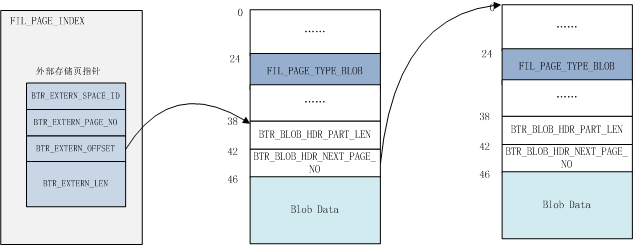

[

# 数据库内核月报 － 2016 / 02

](http://mysql.taobao.org/monthly/2016/02)

[›](http://mysql.taobao.org/monthly/2016/02/02/)

*   [当期文章](#)

## MySQL · 引擎特性 · InnoDB 文件系统之文件物理结构

## 综述

从上层的角度来看，InnoDB层的文件，除了redo日志外，基本上具有相当统一的结构，都是固定block大小，普遍使用的btree结构来管理数据。只是针对不同的block的应用场景会分配不同的页类型。通常默认情况下，每个block的大小为 UNIV\_PAGE\_SIZE，在不做任何配置时值为16kb，你还可以选择在安装实例时指定一个块的block大小。对于压缩表，可以在建表时指定block size，但在内存中表现的解压页依旧为统一的页大小。

从物理文件的分类来看，有日志文件、主系统表空间文件ibdata、undo tablespace文件、临时表空间文件、用户表空间。

日志文件主要用于记录redo log，InnoDB采用循环使用的方式，你可以通过参数指定创建文件的个数和每个文件的大小。默认情况下，日志是以512字节的block单位写入。由于现代文件系统的block size通常设置到4k，InnoDB提供了一个选项，可以让用户将写入的redo日志填充到4KB，以避免read-modify-write的现象；而Percona Server则提供了另外一个选项，支持直接将redo日志的block size修改成指定的值。

ibdata是InnoDB最重要的系统表空间文件，它记录了InnoDB的核心信息，包括事务系统信息、元数据信息，记录InnoDB change buffer的btree，防止数据损坏的double write buffer等等关键信息。我们稍后会展开描述。

undo独立表空间是一个可选项，通常默认情况下，undo数据是存储在ibdata中的，但你也可以通过配置选项 `innodb_undo_tablespaces` 来将undo 回滚段分配到不同的文件中，目前开启undo tablespace 只能在install阶段进行。在主流版本进入5.7时代后，我们建议开启独立undo表空间，只有这样才能利用到5.7引入的新特效：online undo truncate。

MySQL 5.7 新开辟了一个临时表空间，默认的磁盘文件命名为ibtmp1，所有非压缩的临时表都存储在该表空间中。由于临时表的本身属性，该文件在重启时会重新创建。对于云服务提供商而言，通过ibtmp文件，可以更好的控制临时文件产生的磁盘存储。

用户表空间，顾名思义，就是用于自己创建的表空间，通常分为两类，一类是一个表空间一个文件，另外一种则是5.7版本引入的所谓General Tablespace，在满足一定约束条件下，可以将多个表创建到同一个文件中。除此之外，InnoDB还定义了一些特殊用途的ibd文件，例如全文索引相关的表文件。而针对空间数据类型，也构建了不同的数据索引格式R-tree。

在关键的地方本文注明了代码函数，建议读者边参考代码边阅读本文，本文的代码部分基于MySQL 5.7.11版本，不同的版本函数名或逻辑可能会有所不同。请读者阅读本文时尽量选择该版本的代码。

## 文件管理页

InnoDB 的每个数据文件都归属于一个表空间，不同的表空间使用一个唯一标识的space id来标记。例如ibdata1, ibdata2… 归属系统表空间，拥有相同的space id。用户创建表产生的ibd文件，则认为是一个独立的tablespace，只包含一个文件。

每个文件按照固定的 page size 进行区分，默认情况下，非压缩表的page size为16Kb。而在文件内部又按照64个Page（总共1M）一个Extent的方式进行划分并管理。对于不同的page size，对应的Extent大小也不同，对应为：

| page size | file space extent size |
| --- | --- |
| 4 KiB | 256 pages = 1 MiB |
| 8 KiB | 128 pages = 1 MiB |
| 16 KiB | 64 pages = 1 MiB |
| 32 KiB | 64 pages = 2 MiB |
| 64 KiB | 64 pages = 4 MiB |

尽管支持更大的Page Size，但目前还不支持大页场景下的数据压缩，原因是这涉及到修改压缩页中slot的固定size（其实实现起来也不复杂）。在不做声明的情况下，下文我们默认使用16KB的Page Size来阐述文件的物理结构。

为了管理整个Tablespace，除了索引页外，数据文件中还包含了多种管理页，如下图所示，一个用户表空间大约包含这些页来管理文件，下面会一一进行介绍。


InnoDB 管理页

### 文件链表

首先我们先介绍基于文件的一个基础结构，即文件链表。为了管理Page，Extent这些数据块，在文件中记录了许多的节点以维持具有某些特征的链表，例如在在文件头维护的inode page链表，空闲、用满以及碎片化的Extent链表等等。

在InnoDB里链表头称为`FLST_BASE_NODE`，大小为`FLST_BASE_NODE_SIZE`(16个字节)。BASE NODE维护了链表的头指针和末尾指针，每个节点称为`FLST_NODE`，大小为`FLST_NODE_SIZE`（12个字节）。相关结构描述如下：

`FLST_BASE_NODE`:

| Macro | bytes | Desc |
| --- | --- | --- |
| FLST\_LEN | 4 | 存储链表的长度 |
| FLST\_FIRST | 6 | 指向链表的第一个节点 |
| FLST\_LAST | 6 | 指向链表的最后一个节点 |

`FLST_NODE`:

| Macro | bytes | Desc |
| --- | --- | --- |
| FLST\_PREV | 6 | 指向当前节点的前一个节点 |
| FLST\_NEXT | 6 | 指向当前节点的下一个节点 |

如上所述，文件链表中使用6个字节来作为节点指针，指针的内容包括：

| Macro | bytes | Desc |
| --- | --- | --- |
| FIL\_ADDR\_PAGE | 4 | Page No |
| FIL\_ADDR\_BYTE | 2 | Page内的偏移量 |

该链表结构是InnoDB表空间内管理所有page的基础结构，下图先感受下，具体的内容可以继续往下阅读。


InnoDB 表空间page管理

文件链表管理的相关代码参阅：include/fut0lst.ic, fut/fut0lst.cc

### FSP\_HDR PAGE

数据文件的第一个Page类型为`FIL_PAGE_TYPE_FSP_HDR`，在创建一个新的表空间时进行初始化(`fsp_header_init`)，该page同时用于跟踪随后的256个Extent(约256MB文件大小)的空间管理，所以每隔256MB就要创建一个类似的数据页，类型为`FIL_PAGE_TYPE_XDES` ，XDES Page除了文件头部外，其他都和`FSP_HDR`页具有相同的数据结构，可以称之为Extent描述页，每个Extent占用40个字节，一个XDES Page最多描述256个Extent。

`FSP_HDR`页的头部使用`FSP_HEADER_SIZE`个字节来记录文件的相关信息，具体的包括：

| Macro | bytes | Desc |
| --- | --- | --- |
| FSP\_SPACE\_ID | 4 | 该文件对应的space id |
| FSP\_NOT\_USED | 4 | 如其名，保留字节，当前未使用 |
| FSP\_SIZE | 4 | 当前表空间总的PAGE个数，扩展文件时需要更新该值（`fsp_try_extend_data_file_with_pages`） |
| FSP\_FREE\_LIMIT | 4 | 当前尚未初始化的最小Page No。从该Page往后的都尚未加入到表空间的FREE LIST上。 |
| FSP\_SPACE\_FLAGS | 4 | 当前表空间的FLAG信息，见下文 |
| FSP\_FRAG\_N\_USED | 4 | FSP\_FREE\_FRAG链表上已被使用的Page数，用于快速计算该链表上可用空闲Page数 |
| FSP\_FREE | 16 | 当一个Extent中所有page都未被使用时，放到该链表上，可以用于随后的分配 |
| FSP\_FREE\_FRAG | 16 | FREE\_FRAG链表的Base Node，通常这样的Extent中的Page可能归属于不同的segment，用于segment frag array page的分配（见下文） |
| FSP\_FULL\_FRAG | 16 | Extent中所有的page都被使用掉时，会放到该链表上，当有Page从该Extent释放时，则移回FREE\_FRAG链表 |
| FSP\_SEG\_ID | 8 | 当前文件中最大Segment ID + 1，用于段分配时的seg id计数器 |
| FSP\_SEG\_INODES\_FULL | 16 | 已被完全用满的Inode Page链表 |
| FSP\_SEG\_INODES\_FREE | 16 | 至少存在一个空闲Inode Entry的Inode Page被放到该链表上 |

在文件头使用FLAG（对应上述`FSP_SPACE_FLAGS`）描述了创建表时的如下关键信息：

| Macro | Desc |
| --- | --- |
| FSP\_FLAGS\_POS\_ZIP\_SSIZE | 压缩页的block size，如果为0表示非压缩表 |
| FSP\_FLAGS\_POS\_ATOMIC\_BLOBS | 使用的是compressed或者dynamic的行格式 |
| FSP\_FLAGS\_POS\_PAGE\_SSIZE | Page Size |
| FSP\_FLAGS\_POS\_DATA\_DIR | 如果该表空间显式指定了data\_dir，则设置该flag |
| FSP\_FLAGS\_POS\_SHARED | 是否是共享的表空间，如5.7引入的General Tablespace，可以在一个表空间中创建多个表 |
| FSP\_FLAGS\_POS\_TEMPORARY | 是否是临时表空间 |
| FSP\_FLAGS\_POS\_ENCRYPTION | 是否是加密的表空间，MySQL 5.7.11引入 |
| FSP\_FLAGS\_POS\_UNUSED | 未使用的位 |

除了上述描述信息外，其他部分的数据结构和XDES PAGE（`FIL_PAGE_TYPE_XDES`）都是相同的，使用连续数组的方式，每个XDES PAGE最多存储256个XDES Entry，每个Entry占用40个字节，描述64个Page（即一个Extent）。格式如下：

| Macro | bytes | Desc |
| --- | --- | --- |
| XDES\_ID | 8 | 如果该Extent归属某个segment的话，则记录其ID |
| XDES\_FLST\_NODE | 12(FLST\_NODE\_SIZE) | 维持Extent链表的双向指针节点 |
| XDES\_STATE | 4 | 该Extent的状态信息，包括：XDES\_FREE，XDES\_FREE\_FRAG，XDES\_FULL\_FRAG，XDES\_FSEG，详解见下文 |
| XDES\_BITMAP | 16 | 总共16\*8= 128个bit，用2个bit表示Extent中的一个page，一个bit表示该page是否是空闲的(XDES\_FREE\_BIT)，另一个保留位，尚未使用（XDES\_CLEAN\_BIT） |

`XDES_STATE`表示该Extent的四种不同状态：

| Macro | Desc |
| --- | --- |
| XDES\_FREE(1) | 存在于FREE链表上 |
| XDES\_FREE\_FRAG(2) | 存在于FREE\_FRAG链表上 |
| XDES\_FULL\_FRAG(3) | 存在于FULL\_FRAG链表上 |
| XDES\_FSEG(4) | 该Extent归属于ID为XDES\_ID记录的值的SEGMENT。 |

通过`XDES_STATE`信息，我们只需要一个`FLIST_NODE`节点就可以维护每个Extent的信息，是处于全局表空间的链表上，还是某个btree segment的链表上。

### IBUF BITMAP PAGE

第2个page类型为`FIL_PAGE_IBUF_BITMAP`，主要用于跟踪随后的每个page的change buffer信息，使用4个bit来描述每个page的change buffer信息。

| Macro | bits | Desc |
| --- | --- | --- |
| IBUF\_BITMAP\_FREE | 2 | 使用2个bit来描述page的空闲空间范围：0（0 bytes）、1（512 bytes）、2（1024 bytes）、3（2048 bytes） |
| IBUF\_BITMAP\_BUFFERED | 1 | 是否有ibuf操作缓存 |
| IBUF\_BITMAP\_IBUF | 1 | 该Page本身是否是Ibuf Btree的节点 |

由于bitmap page的空间有限，同样每隔256个Extent Page之后，也会在XDES PAGE之后创建一个ibuf bitmap page。

关于change buffer，这里我们不展开讨论，感兴趣的可以阅读之前的这篇月报： [MySQL · 引擎特性 · Innodb change buffer介绍](http://mysql.taobao.org/monthly/2015/07/01/)

### INODE PAGE

数据文件的第3个page的类型为`FIL_PAGE_INODE`，用于管理数据文件中的segement，每个索引占用2个segment，分别用于管理叶子节点和非叶子节点。每个inode页可以存储`FSP_SEG_INODES_PER_PAGE`（默认为85）个记录。

| Macro | bits | Desc |
| --- | --- | --- |
| FSEG\_INODE\_PAGE\_NODE | 12 | INODE页的链表节点，记录前后Inode Page的位置，BaseNode记录在头Page的FSP\_SEG\_INODES\_FULL或者FSP\_SEG\_INODES\_FREE字段。 |
| Inode Entry 0 | 192 | Inode记录 |
| Inode Entry 1 |   |   |
| …… |   |   |
| Inode Entry 84 |   |   |

每个Inode Entry的结构如下表所示：

| Macro | bits | Desc |
| --- | --- | --- |
| FSEG\_ID | 8 | 该Inode归属的Segment ID，若值为0表示该slot未被使用 |
| FSEG\_NOT\_FULL\_N\_USED | 8 | FSEG\_NOT\_FULL链表上被使用的Page数量 |
| FSEG\_FREE | 16 | 完全没有被使用并分配给该Segment的Extent链表 |
| FSEG\_NOT\_FULL | 16 | 至少有一个page分配给当前Segment的Extent链表，全部用完时，转移到FSEG\_FULL上，全部释放时，则归还给当前表空间FSP\_FREE链表 |
| FSEG\_FULL | 16 | 分配给当前segment且Page完全使用完的Extent链表 |
| FSEG\_MAGIC\_N | 4 | Magic Number |
| FSEG\_FRAG\_ARR 0 | 4 | 属于该Segment的独立Page。总是先从全局分配独立的Page，当填满32个数组项时，就在每次分配时都分配一个完整的Extent，并在XDES PAGE中将其Segment ID设置为当前值 |
| …… | …… |   |
| FSEG\_FRAG\_ARR 31 | 4 | 总共存储32个记录项 |

#### 文件维护

从上文我们可以看到，InnoDB通过Inode Entry来管理每个Segment占用的数据页，每个segment可以看做一个文件页维护单元。Inode Entry所在的inode page有可能存放满，因此又通过头Page维护了Inode Page链表。

在ibd的第一个Page中还维护了表空间内Extent的FREE、`FREE_FRAG`、`FULL_FRAG`三个Extent链表；而每个Inode Entry也维护了对应的FREE、`NOT_FULL`、FULL三个Extent链表。这些链表之间存在着转换关系，以高效的利用数据文件空间。

当创建一个新的索引时，实际上构建一个新的btree(`btr_create`)，先为非叶子节点Segment分配一个inode entry，再创建root page，并将该segment的位置记录到root page中，然后再分配leaf segment的Inode entry，并记录到root page中。

当删除某个索引后，该索引占用的空间需要能被重新利用起来。

**创建Segment** 首先每个Segment需要从ibd文件中预留一定的空间(`fsp_reserve_free_extents`)，通常是2个Extent。但如果是新创建的表空间，且当前的文件小于1个Extent时，则只分配2个Page。

当文件空间不足时，需要对文件进行扩展(`fsp_try_extend_data_file`)。文件的扩展遵循一定的规则：如果当前小于1个Extent，则扩展到1个Extent满；当表空间小于32MB时，每次扩展一个Extent；大于32MB时，每次扩展4个Extent（`fsp_get_pages_to_extend_ibd`）。

在预留空间后，读取文件头Page并加锁（`fsp_get_space_header`），然后开始为其分配Inode Entry(`fsp_alloc_seg_inode`)。首先需要找到一个合适的inode page。

我们知道Inode Page的空间有限，为了管理Inode Page，在文件头存储了两个Inode Page链表，一个链接已经用满的inode page，一个链接尚未用满的inode page。如果当前Inode Page的空间使用完了，就需要再分配一个inode page，并加入到`FSP_SEG_INODES_FREE`链表上(`fsp_alloc_seg_inode_page`)。对于独立表空间，通常一个inode page就足够了。

当拿到目标inode page后，从该Page中找到一个空闲（`fsp_seg_inode_page_find_free`）未使用的slot（空闲表示其不归属任何segment，即FSEG\_ID置为0）。

一旦该inode page中的记录用满了，就从`FSP_SEG_INODES_FREE`链表上转移到`FSP_SEG_INODES_FULL`链表。

获得inode entry后，递增头page的`FSP_SEG_ID`，作为当前segment的seg id写入到inode entry中。随后进行一些列的初始化。

在完成inode entry的提取后，就将该inode entry所在inode page的位置及页内偏移量存储到其他某个page内（对于btree就是记录在根节点内，占用10个字节，包含space id, page no, offset）。

Btree的根节点实际上是在创建non-leaf segment时分配的，root page被分配到该segment的frag array的第一个数组元素中。

Segment分配入口函数： `fseg_create_general`

**分配数据页** 随着btree数据的增长，我们需要为btree的segment分配新的page。前面我们已经讲过，segment是一个独立的page管理单元，我们需要将从全局获得的数据空间纳入到segment的管理中。

Step 1：空间扩展

当判定插入索引的操作可能引起分裂时，会进行悲观插入(`btr_cur_pessimistic_insert`)，在做实际的分裂操作之前，会先对文件进行扩展，并尝试预留(tree\_height / 16 + 3)个Extent，大多数情况下都是3个Extent。

这里有个意外场景：如果当前文件还不超过一个Extent，并且请求的page数小于1/2个Extent时，则如果指定page数，保证有2个可用的空闲Page，或者分配指定的page，而不是以Extent为单位进行分配。

注意这里只是保证有足够的文件空间，避免在btree操作时进行文件Extent。如果在这一步扩展了ibd文件(`fsp_try_extend_data_file`)，新的数据页并未初始化，也未加入到任何的链表中。

在判定是否有足够的空闲Extent时，本身ibd预留的空闲空间也要纳入考虑，对于普通用户表空间是2个Extent + file\_size \* 1%。这些新扩展的page此时并未进行初始化，也未加入到，在头page的`FSP_FREE_LIMIT`记录的page no标识了这类未初始化页的范围。

Step 2：为segment分配page

随后进入索引分裂阶段(`btr_page_split_and_insert`)，新page分配的上层调用栈：

```sql
btr_page_alloc
|--> btr_page_alloc_low
	|--> fseg_alloc_free_page_general
			|--> fseg_alloc_free_page_low
```

在传递的参数中，有个hint page no，通常是当前需要分裂的page no的前一个（direction = FSP\_DOWN）或者后一个page no(direction = FSP\_UP)，其目的是将逻辑上相邻的节点在物理上也尽量相邻。

在Step 1我们已经保证了物理空间有足够的数据页，只是还没进行初始化。将page分配到当前segment的流程如下(`fseg_alloc_free_page_low`)：

1.  计算当前segment使用的和占用的page数
    *   使用的page数存储包括`FSEG_NOT_FULL`链表上使用的page数(存储在inode entry的`FSEG_NOT_FULL_N_USED`中) + 已用满segment的`FSEG_FULL`链表上page数 + 占用的frag array page数量；
    *   占用的page数包括`FSEG_FREE`、`FSEG_NOT_FULL`、`FSEG_FULL`三个链表上的Extent + 占用的frag array page数量。
2.  根据hint page获取对应的xdes entry (`xdes_get_descriptor_with_space_hdr`)
3.  当满足如下条件时该hint page可以直接拿走使用：
    *   Extent状态为`XDES_FSEG`，表示属于一个segment
    *   hint page所在的Extent已被分配给当前segment(检查xdes entry的XDES\_ID)
    *   hint page对应的bit设置为free，表示尚未被占用
    *   **返回hint page**
4.  当满足条件：1) xdes entry当前是空闲状态(XDES\_FREE)；2) 该segment中已使用的page数大于其占用的page数的7/8 (`FSEG_FILLFACTOR`)；3) 当前segment已经使用了超过32个frag page，即表示其inode中的frag array可能已经用满。
    *   从表空间分配hint page所在的Extent (`fsp_alloc_free_extent`)，将其从FSP\_FREE链表上移除
    *   设置该Extent的状态为XDES\_FSEG，写入seg id，并加入到当前segment的FSEG\_FREE链表中。
    *   **返回hint page**
5.  当如下条件时：1) direction != FSP\_NO\_DIR，对于Btree分裂，要么FSP\_UP，要么FSP\_DOWN；2）已使用的空间小于已占用空间的7/8； 3）当前segment已经使用了超过32个frag page
    *   尝试从segment获取一个Extent(`fseg_alloc_free_extent`)，如果该segment的FSEG\_FREE链表为空，则需要从表空间分配（`fsp_alloc_free_extent`）一个Extent，并加入到当前segment的FSEG\_FREE链表上
    *   direction为FSP\_DOWN时，**返回该Extent最后一个page**，为FSP\_UP时，**返回该Extent的第一个Page**
6.  xdes entry属于当前segment且未被用满，从其中取一个**空闲page并返回**
7.  如果该segment占用的page数大于实用的page数，说明该segment还有空闲的page，则依次先看`FSEG_NOT_FULL`链表上是否有未满的Extent，如果没有，再看FSEG\_FREE链表上是否有完全空闲的Extent。从其中取一个**空闲Page并返回**
8.  当前已经实用的Page数小于32个page时，则分配独立的page（`fsp_alloc_free_page`）并加入到该inode的frag array page数组中，然后**返回该block**
9.  当上述情况都不满足时，直接分配一个Extent(`fseg_alloc_free_extent`)，并从**其中取一个page返回**。

上述流程看起来比较复杂，但可以总结为：

1.  对于一个新的segment，总是优先填满32个frag page数组，之后才会为其分配完整的Extent，可以利用碎片页，并避免小表占用太多空间。
2.  尽量获得hint page;
3.  如果segment上未使用的page太多，则尽量利用segment上的page。

上文提到两处从表空间为segment分配数据页，一个是分配单独的数据页，一个是分配整个Extent

表空间单独数据页的分配调用函数`fsp_alloc_free_page`:

1.  如果hint page所在的Extent在链表`XDES_FREE_FRAG`上，可以直接使用；否则从根据头page的`FSP_FREE_FRAG`链表查看是否有可用的Extent；
2.  未能从上述找到一个可用Extent，直接分配一个Extent，并加入到`FSP_FREE_FRAG`链表中；
3.  从获得的Extent中找到描述为空闲（`XDES_FREE_BIT`）的page。
4.  分配该page (`fsp_alloc_from_free_frag`)
    *   设置page对应的bitmap的`XDES_FREE_BIT`为false，表示被占用；
    *   递增头page的`FSP_FRAG_N_USED`字段；
    *   如果该Extent被用满了，就将其从`FSP_FREE_FRAG`移除，并加入到`FSP_FULL_FRAG`链表中。同时对头Page的`FSP_FRAG_N_USED`递减1个Extent(`FSP_FRAG_N_USED`只存储未满的Extent使用的page数量)；
    *   对Page内容进行初始化(`fsp_page_create`)。

表空间Extent的分配函数`fsp_alloc_free_extent`:

1.  通常先通过头page看FSP\_FREE链表上是否有空闲的Extent，如果没有的话，则将新的Extent（例如上述step 1对文件做扩展产生的新page，从`FSP_FREE_LIMIT`算起）加入到`FSP_FREE`链表上(`fsp_fill_free_list`)：
    *   一次最多加4个Extent(`FSP_FREE_ADD`)；
    *   如果涉及到xdes page，还需要对xdes page进行初始化；
    *   如果Extent中存在类似xdes page这样的系统管理页，这个Extent被加入到`FSP_FREE_FRAG`链表中而不是`FSP_FREE`链表；
    *   取链表上第一个Extent为当前使用；
2.  将获得的Extent从`FSP_FREE`移除，并返回对应的xdes entry(`xdes_lst_get_descriptor`)。

**回收Page** 数据页的回收分为两种，一种是整个Extent的回收，一种是碎片页的回收。在删除索引页或者drop索引时都会发生。

当某个数据页上的数据被删光时，我们需要从其所在segmeng上删除该page（`btr_page_free -->fseg_free_page --> fseg_free_page_low`），回收的流程也比较简单：

1.  首先如果是该segment的frag array中的page，将对应的slot设置为FIL\_NULL, 并返还给表空间(`fsp_free_page`):
    *   page在xdes entry中的状态置为空闲；
    *   如果page所在Extent处于`FSP_FULL_FRAG`链表，则转移到`FSP_FREE_FRAG`中；
    *   如果Extent中的page完全被释放掉了，则释放该Extent(`fsp_free_extent`)，将其转移到FSP\_FREE链表；
    *   从函数**返回**；
2.  如果page所处于的Extent当前在该segment的FSEG\_FULL链表上，则转移到`FSEG_NOT_FULL`链表；
3.  设置Page在xdes entry的bitmap对应的XDES\_FREE\_BIT为true；
4.  如果此时该Extent上的page全部被释放了，将其从`FSEG_NOT_FULL`链表上移除，并加入到表空间的`FSP_FREE`链表上(而非Segment的`FSEG_FREE`链表)。

**释放Segment** 当我们删除索引或者表时，需要删除btree（`btr_free_if_exists`），先删除除了root节点外的其他部分(`btr_free_but_not_root`)，再删除root节点(`btr_free_root`)

由于数据操作都需要记录redo，为了避免产生非常大的redo log，leaf segment通过反复调用函数`fseg_free_step`来释放其占用的数据页：

1.  首先找到leaf segment对应的Inode entry（`fseg_inode_try_get`）；
2.  然后依次查找inode entry中的`FSEG_FULL`、或者`FSEG_NOT_FULL`、或者`FSEG_FREE`链表，找到一个Extent，注意着里的链表元组所指向的位置实际上是描述该Extent的Xdes Entry所在的位置。因此可以快速定位到对应的Xdes Page及Page内偏移量(`xdes_lst_get_descriptor`)；
3.  现在我们可以将这个Extent安全的释放了(`fseg_free_extent`，见后文)；
4.  当反复调用`fseg_free_step`将所有的Extent都释放后，segment还会最多占用32个碎片页，也需要依次释放掉(`fseg_free_page_low`)
5.  最后，当该inode所占用的page全部释放时，释放inode entry：
    *   如果该inode所在的inode page中当前被用满，则由于我们即将释放一个slot，需要从`FSP_SEG_INODES_FULL`转移到`FSP_SEG_INODES_FREE`（更新第一个page）；
    *   将该inode entry的SEG\_ID清除为0，表示未使用；
    *   如果该inode page上全部inode entry都释放了，就从`FSP_SEG_INODES_FREE`移除，并删除该page。

non-leaf segment的回收和leaf segment的回收基本类似，但要注意btree的根节点存储在该segment的frag arrary的第一个元组中，该Page暂时不可以释放(`fseg_free_step_not_header`)

btree的root page在完成上述步骤后再释放，此时才能彻底释放non-leaf segment

## 索引页

ibd文件中真正构建起用户数据的结构是BTREE，在你创建一个表时，已经基于显式或隐式定义的主键构建了一个btree，其叶子节点上记录了行的全部列数据（加上事务id列及回滚段指针列）；如果你在表上创建了二级索引，其叶子节点存储了键值加上聚集索引键值。本小节我们探讨下组成索引的物理存储页结构，这里默认讨论的是非压缩页，我们在下一小节介绍压缩页的内容。

每个btree使用两个Segment来管理数据页，一个管理叶子节点，一个管理非叶子节点，每个segment在inode page中存在一个记录项，在btree的root page中记录了两个segment信息。

当我们需要打开一张表时，需要从ibdata的数据词典表中load元数据信息，其中SYS\_INDEXES系统表中记录了表，索引，及索引根页对应的page no（`DICT_FLD__SYS_INDEXES__PAGE_NO`），进而找到btree根page，就可以对整个用户数据btree进行操作。

索引最基本的页类型为`FIL_PAGE_INDEX`。可以划分为下面几个部分。

**Page Header** 首先不管任何类型的数据页都有38个字节来描述头信息（`FIL_PAGE_DATA`, or `PAGE_HEADER`），包含如下信息：

| Macro | bytes | Desc |
| --- | --- | --- |
| FIL\_PAGE\_SPACE\_OR\_CHKSUM | 4 | 在MySQL4.0之前存储space id，之后的版本用于存储checksum |
| FIL\_PAGE\_OFFSET | 4 | 当前页的page no |
| FIL\_PAGE\_PREV | 4 | 通常用于维护btree同一level的双向链表，指向链表的前一个page，没有的话则值为FIL\_NULL |
| FIL\_PAGE\_NEXT | 4 | 和FIL\_PAGE\_PREV类似，记录链表的下一个Page的Page No |
| FIL\_PAGE\_LSN | 8 | 最近一次修改该page的LSN |
| FIL\_PAGE\_TYPE | 2 | Page类型 |
| FIL\_PAGE\_FILE\_FLUSH\_LSN | 8 | 只用于系统表空间的第一个Page，记录在正常shutdown时安全checkpoint到的点，对于用户表空间，这个字段通常是空闲的，但在5.7里，FIL\_PAGE\_COMPRESSED类型的数据页则另有用途。下一小节单独介绍 |
| FIL\_PAGE\_SPACE\_ID | 4 | 存储page所在的space id |

**Index Header** 紧随`FIL_PAGE_DATA`之后的是索引信息，这部分信息是索引页独有的。

| Macro | bytes | Desc |
| --- | --- | --- |
| PAGE\_N\_DIR\_SLOTS | 2 | Page directory中的slot个数 （见下文关于Page directory的描述） |
| PAGE\_HEAP\_TOP | 2 | 指向当前Page内已使用的空间的末尾便宜位置，即free space的开始位置 |
| PAGE\_N\_HEAP | 2 | Page内所有记录个数，包含用户记录，系统记录以及标记删除的记录，同时当第一个bit设置为1时，表示这个page内是以Compact格式存储的 |
| PAGE\_FREE | 2 | 指向标记删除的记录链表的第一个记录 |
| PAGE\_GARBAGE | 2 | 被删除的记录链表上占用的总的字节数，属于可回收的垃圾碎片空间 |
| PAGE\_LAST\_INSERT | 2 | 指向最近一次插入的记录偏移量，主要用于优化顺序插入操作 |
| PAGE\_DIRECTION | 2 | 用于指示当前记录的插入顺序以及是否正在进行顺序插入，每次插入时，PAGE\_LAST\_INSERT会和当前记录进行比较，以确认插入方向，据此进行插入优化 |
| PAGE\_N\_DIRECTION | 2 | 当前以相同方向的顺序插入记录个数 |
| PAGE\_N\_RECS | 2 | Page上有效的未被标记删除的用户记录个数 |
| PAGE\_MAX\_TRX\_ID | 8 | 最近一次修改该page记录的事务ID，主要用于辅助判断二级索引记录的可见性。 |
| PAGE\_LEVEL | 2 | 该Page所在的btree level，根节点的level最大，叶子节点的level为0 |
| PAGE\_INDEX\_ID | 8 | 该Page归属的索引ID |

**Segment Info** 随后20个字节描述段信息，仅在Btree的root Page中被设置，其他Page都是未使用的。

| Macro | bytes | Desc |
| --- | --- | --- |
| PAGE\_BTR\_SEG\_LEAF | 10(FSEG\_HEADER\_SIZE) | leaf segment在inode page中的位置 |
| PAGE\_BTR\_SEG\_TOP | 10(FSEG\_HEADER\_SIZE) | non-leaf segment在inode page中的位置 |

10个字节的inode信息包括：

| Macro | bytes | Desc |
| --- | --- | --- |
| FSEG\_HDR\_SPACE | 4 | 描述该segment的inode page所在的space id （目前的实现来看，感觉有点多余…） |
| FSEG\_HDR\_PAGE\_NO | 4 | 描述该segment的inode page的page no |
| FSEG\_HDR\_OFFSET | 2 | inode page内的页内偏移量 |

通过上述信息，我们可以找到对应segment在inode page中的描述项，进而可以操作整个segment。

**系统记录** 之后是两个系统记录，分别用于描述该page上的极小值和极大值，这里存在两种存储方式，分别对应旧的InnoDB文件系统，及新的文件系统（compact page）

| Macro | bytes | Desc |
| --- | --- | --- |
| REC\_N\_OLD\_EXTRA\_BYTES + 1 | 7 | 固定值，见infimum\_supremum\_redundant的注释 |
| PAGE\_OLD\_INFIMUM | 8 | “infimum\\0” |
| REC\_N\_OLD\_EXTRA\_BYTES + 1 | 7 | 固定值，见infimum\_supremum\_redundant的注释 |
| PAGE\_OLD\_SUPREMUM | 9 | “supremum\\0” |

Compact的系统记录存储方式为：

| Macro | bytes | Desc |
| --- | --- | --- |
| REC\_N\_NEW\_EXTRA\_BYTES | 5 | 固定值，见infimum\_supremum\_compact的注释 |
| PAGE\_NEW\_INFIMUM | 8 | “infimum\\0” |
| REC\_N\_NEW\_EXTRA\_BYTES | 5 | 固定值，见infimum\_supremum\_compact的注释 |
| PAGE\_NEW\_SUPREMUM | 8 | “supremum”，这里不带字符0 |

两种格式的主要差异在于不同行存储模式下，单个记录的描述信息不同。在实际创建page时，系统记录的值已经初始化好了，对于老的格式(REDUNDANT)，对应代码里的`infimum_supremum_redundant`，对于新的格式(compact)，对应`infimum_supremum_compact`。infimum记录的固定heap no为0，supremum记录的固定Heap no 为1。page上最小的用户记录前节点总是指向infimum，page上最大的记录后节点总是指向supremum记录。

具体参考索引页创建函数：`page_create_low`

**用户记录** 在系统记录之后就是真正的用户记录了，heap no 从2（`PAGE_HEAP_NO_USER_LOW`）开始算起。注意Heap no仅代表物理存储顺序，不代表键值顺序。

根据不同的类型，用户记录可以是非叶子节点的Node指针信息，也可以是只包含有效数据的叶子节点记录。而不同的行格式存储的行记录也不同，例如在早期版本中使用的redundant格式会被现在的compact格式使用更多的字节数来描述记录，例如描述记录的一些列信息，在使用compact格式时，可以改为直接从数据词典获取。因为redundant属于渐渐被抛弃的格式，本文的讨论中我们默认使用Compact格式。在文件rem/rem0rec.cc的头部注释描述了记录的物理结构。

每个记录都存在rec header，描述如下（参阅文件include/rem0rec.ic）

| bytes | Desc |
| --- | --- |
| 变长列长度数组 | 如果列的最大长度为255字节，使用1byte；否则，0xxxxxxx (one byte, length=0..127), or 1exxxxxxxxxxxxxx (two bytes, length=128..16383, extern storage flag) |
| SQL-NULL flag | 标示值为NULL的列的bitmap，每个位标示一个列，bitmap的长度取决于索引上可为NULL的列的个数(dict\_index\_t::n\_nullable)，这两个数组的解析可以参阅函数`rec_init_offsets` |
| 下面5个字节（REC\_N\_NEW\_EXTRA\_BYTES）描述记录的额外信息 | …. |
| REC\_NEW\_INFO\_BITS (4 bits) | 目前只使用了两个bit，一个用于表示该记录是否被标记删除(`REC_INFO_DELETED_FLAG`)，另一个bit(REC\_INFO\_MIN\_REC\_FLAG)如果被设置，表示这个记录是当前level最左边的page的第一个用户记录 |
| REC\_NEW\_N\_OWNED (4 bits) | 当该值为非0时，表示当前记录占用page directory里一个slot，并和前一个slot之间存在这么多个记录 |
| REC\_NEW\_HEAP\_NO (13 bits) | 该记录的heap no |
| REC\_NEW\_STATUS (3 bits) | 记录的类型，包括四种：`REC_STATUS_ORDINARY`(叶子节点记录)， `REC_STATUS_NODE_PTR`（非叶子节点记录），`REC_STATUS_INFIMUM`(infimum系统记录)以及`REC_STATUS_SUPREMUM`(supremum系统记录) |
| REC\_NEXT (2bytes) | 指向按照键值排序的page内下一条记录数据起点，这里存储的是和当前记录的相对位置偏移量（函数`rec_set_next_offs_new`） |

在记录头信息之后的数据视具体情况有所不同：

*   对于聚集索引记录，数据包含了事务id，回滚段指针；
*   对于二级索引记录，数据包含了二级索引键值以及聚集索引键值。如果二级索引键和聚集索引有重合，则只保留一份重合的，例如pk (col1, col2)，sec key(col2, col3)，在二级索引记录中就只包含(col2, col3, col1);
*   对于非叶子节点页的记录，聚集索引上包含了其子节点的最小记录键值及对应的page no；二级索引上有所不同，除了二级索引键值外，还包含了聚集索引键值，再加上page no三部分构成。

**Free space** 这里指的是一块完整的未被使用的空间，范围在页内最后一个用户记录和Page directory之间。通常如果空间足够时，直接从这里分配记录空间。当判定空闲空间不足时，会做一次Page内的重整理，以对碎片空间进行合并。

**Page directory** 为了加快页内的数据查找，会按照记录的顺序，每隔4~8个数量（`PAGE_DIR_SLOT_MIN_N_OWNED` ~ `PAGE_DIR_SLOT_MAX_N_OWNED`）的用户记录，就分配一个slot （每个slot占用2个字节，`PAGE_DIR_SLOT_SIZE`），存储记录的页内偏移量，可以理解为在页内构建的一个很小的索引(sparse index)来辅助二分查找。

Page Directory的slot分配是从Page末尾（倒数第八个字节开始）开始逆序分配的。在查询记录时。先根据page directory 确定记录所在的范围，然后在据此进行线性查询。

增加slot的函数参阅 `page_dir_add_slot`

页内记录二分查找的函数参阅 `page_cur_search_with_match_bytes`

**FIL Trailer** 在每个文件页的末尾保留了8个字节（`FIL_PAGE_DATA_END` or `FIL_PAGE_END_LSN_OLD_CHKSUM`），其中4个字节用于存储page checksum，这个值需要和page头部记录的checksum相匹配，否则认为page损坏(`buf_page_is_corrupted`)

## 压缩索引页

InnoDB当前存在两种形式的压缩页，一种是Transparent Page Compression，还有一种是传统的压缩方式，下文分别进行阐述。

### Transparent Page Compression

这是MySQL5.7新加的一种数据压缩方式，其原理是利用内核Punch hole特性，对于一个16kb的数据页，在写文件之前，除了Page头之外，其他部分进行压缩，压缩后留白的地方使用punch hole进行 “打洞”，在磁盘上表现为不占用空间 （但会产生大量的磁盘碎片）。 这种方式相比传统的压缩方式具有更好的压缩比，实现逻辑也更加简单。

对于这种压缩方式引入了新的类型`FIL_PAGE_COMPRESSED`，在存储格式上略有不同，主要表现在从`FIL_PAGE_FILE_FLUSH_LSN`开始的8个字节被用作记录压缩信息：

| Macro | bytes | Desc |
| --- | --- | --- |
| FIL\_PAGE\_VERSION | 1 | 版本，目前为1 |
| FIL\_PAGE\_ALGORITHM\_V1 | 1 | 使用的压缩算法 |
| FIL\_PAGE\_ORIGINAL\_TYPE\_V1 | 2 | 压缩前的Page类型，解压后需要恢复回去 |
| FIL\_PAGE\_ORIGINAL\_SIZE\_V1 | 2 | 未压缩时去除FIL\_PAGE\_DATA后的数据长度 |
| FIL\_PAGE\_COMPRESS\_SIZE\_V1 | 2 | 压缩后的长度 |

打洞后的page其实际存储空间需要是磁盘的block size的整数倍。

这里我们不展开阐述，具体参阅我之前写的这篇文章：[MySQL · 社区动态 · InnoDB Page Compression](http://mysql.taobao.org/monthly/2015/08/01/)

### 传统压缩存储格式

当你创建或修改表，指定`row_format=compressed key_block_size=1|2|4|8` 时，创建的ibd文件将以对应的block size进行划分。例如`key_block_size`设置为4时，对应block size为4kb。

压缩页的格式可以描述如下表所示：

| Macro | Desc |
| --- | --- |
| FIL\_PAGE\_HEADER | 页面头数据，不做压缩 |
| Index Field Information | 索引的列信息，参阅函数`page_zip_fields_encode`及`page_zip_fields_decode`，在崩溃恢复时可以据此恢复出索引信息 |
| Compressed Data | 压缩数据，按照heap no排序进入压缩流，压缩数据不包含系统列(trx\_id, roll\_ptr)或外部存储页指针 |
| Modification Log(mlog) | 压缩页修改日志 |
| Free Space | 空闲空间 |
| External\_Ptr (optional) | 存在外部存储页的列记录指针数组，只存在**聚集索引叶子节点**，每个数组元素占20个字节(`BTR_EXTERN_FIELD_REF_SIZE`)，参阅函数`page_zip_compress_clust_ext` |
| Trx\_id, Roll\_Ptr(optional) | 只存在于**聚集索引叶子节点**，数组元素和其heap no一一对应 |
| Node\_Ptr | 只存在于**索引非叶子节点**，存储节点指针数组，每个元素占用4字节(REC\_NODE\_PTR\_SIZE) |
| Dense Page Directory | 分两部分，第一部分是有效记录，记录其在解压页中的偏移位置，n\_owned和delete标记信息，按照**键值顺序**；第二部分是空闲记录；每个slot占两个字节。 |

在内存中通常存在压缩页和解压页两份数据。当对数据进行修改时，通常先修改解压页，再将DML操作以一种特殊日志的格式记入压缩页的mlog中。以减少被修改过程中重压缩的次数。主要包含这几种操作：

*   Insert: 向mlog中写入完整记录
*   Update:
    *   Delete-insert update，将旧记录的dense slot标记为删除，再写入完整新记录
    *   In-place update，直接写入新更新的记录
*   Delete: 标记对应的dense slot为删除

页压缩参阅函数 `page_zip_compress` 页解压参阅函数 `page_zip_decompress`

## 系统数据页

这里我们将所有非独立的数据页统称为系统数据页，主要存储在ibdata中，如下图所示：


InnoDB 系统数据页

ibdata的三个page和普通的用户表空间一样，都是用于维护和管理文件页。其他Page我们下面一一进行介绍。

**FSP\_IBUF\_HEADER\_PAGE\_NO** Ibdata的第4个page是Change Buffer的header page，类型为`FIL_PAGE_TYPE_SYS`，主要用于对ibuf btree的Page管理。

**FSP\_IBUF\_TREE\_ROOT\_PAGE\_NO** 用于存储change buffer的根page，change buffer目前存储于Ibdata中，其本质上也是一颗btree，root页为固定page，也就是Ibdata的第5个page。

IBUF HEADER Page 和Root Page联合起来对ibuf的数据页进行管理。

首先Ibuf btree自己维护了一个空闲Page链表，链表头记录在根节点中，偏移量在`PAGE_BTR_IBUF_FREE_LIST`处，实际上利用的是普通索引根节点的`PAGE_BTR_SEG_LEAF`字段。Free List上的Page类型标示为`FIL_PAGE_IBUF_FREE_LIST`

每个Ibuf page重用了`PAGE_BTR_SEG_LEAF`字段，以维护IBUF FREE LIST的前后文件页节点（`PAGE_BTR_IBUF_FREE_LIST_NODE`）。

由于root page中的segment字段已经被重用，因此额外的开辟了一个Page，也就是Ibdata的第4个page来进行段管理。在其中记录了ibuf btree的segment header，指向属于ibuf btree的inode entry。

关于ibuf btree的构建参阅函数 `btr_create`

**FSP\_TRX\_SYS\_PAGE\_NO/FSP\_FIRST\_RSEG\_PAGE\_NO** ibdata的第6个page，记录了InnoDB重要的事务系统信息，主要包括：

| Macro | bytes | Desc |
| --- | --- | --- |
| TRX\_SYS | 38 | 每个数据页都会保留的文件头字段 |
| TRX\_SYS\_TRX\_ID\_STORE | 8 | 持久化的最大事务ID，这个值不是实时写入的，而是256次递增写一次 |
| TRX\_SYS\_FSEG\_HEADER | 10 | 指向用来管理事务系统的segment所在的位置 |
| TRX\_SYS\_RSEGS | 128 \* 8 | 用于存储128个回滚段位置，包括space id及page no。每个回滚段包含一个文件segment（`trx_rseg_header_create`） |
| …… | 以下是Page内UNIV\_PAGE\_SIZE - 1000的偏移位置 |   |
| TRX\_SYS\_MYSQL\_LOG\_MAGIC\_N\_FLD | 4 | Magic Num ，值为873422344 |
| TRX\_SYS\_MYSQL\_LOG\_OFFSET\_HIGH | 4 | 事务提交时会将其binlog位点更新到该page中，这里记录了在binlog文件中偏移量的高位的4字节 |
| TRX\_SYS\_MYSQL\_LOG\_OFFSET\_LOW | 4 | 同上，记录偏移量的低4位字节 |
| TRX\_SYS\_MYSQL\_LOG\_NAME | 4 | 记录所在的binlog文件名 |
| …… | 以下是Page内UNIV\_PAGE\_SIZE - 200 的偏移位置 |   |
| TRX\_SYS\_DOUBLEWRITE\_FSEG | 10 | 包含double write buffer的fseg header |
| TRX\_SYS\_DOUBLEWRITE\_MAGIC | 4 | Magic Num |
| TRX\_SYS\_DOUBLEWRITE\_BLOCK1 | 4 | double write buffer的第一个block(占用一个Extent)在ibdata中的开始位置，连续64个page |
| TRX\_SYS\_DOUBLEWRITE\_BLOCK2 | 4 | 第二个dblwr block的起始位置 |
| TRX\_SYS\_DOUBLEWRITE\_REPEAT | 12 | 重复记录上述三个字段，即MAGIC NUM, block1, block2，防止发生部分写时可以恢复 |
| TRX\_SYS\_DOUBLEWRITE\_SPACE\_ID\_STORED | 4 | 用于兼容老版本，当该字段的值不为TRX\_SYS\_DOUBLEWRITE\_SPACE\_ID\_STORED\_N时，需要重置dblwr中的数据 |

在5.7版本中，回滚段既可以在ibdata中，也可以在独立undo表空间，或者ibtmp临时表空间中，一个可能的分布如下图所示（摘自我之前的[这篇文章](http://mysql.taobao.org/monthly/2015/04/01/)）。


InnoDB Undo 回滚段结构

由于是在系统刚启动时初始化事务系统，因此第0号回滚段头页总是在ibdata的第7个page中。

事务系统创建参阅函数 `trx_sysf_create`

InnoDB最多可以创建128个回滚段，每个回滚段需要单独的Page来维护其拥有的undo slot，Page类型为`FIL_PAGE_TYPE_SYS`。描述如下：

| Macro | bytes | Desc |
| --- | --- | --- |
| TRX\_RSEG | 38 | 保留的Page头 |
| TRX\_RSEG\_MAX\_SIZE | 4 | 回滚段允许使用的最大Page数，当前值为ULINT\_MAX |
| TRX\_RSEG\_HISTORY\_SIZE | 4 | 在history list上的undo page数，这些page需要由purge线程来进行清理和回收 |
| TRX\_RSEG\_HISTORY | FLST\_BASE\_NODE\_SIZE(16) | history list的base node |
| TRX\_RSEG\_FSEG\_HEADER | (FSEG\_HEADER\_SIZE)10 | 指向当前管理当前回滚段的inode entry |
| TRX\_RSEG\_UNDO\_SLOTS | 1024 \* 4 | undo slot数组，共1024个slot，值为FIL\_NULL表示未被占用，否则记录占用该slot的第一个undo page |

回滚段头页的创建参阅函数 `trx_rseg_header_create`

实际存储undo记录的Page类型为`FIL_PAGE_UNDO_LOG`，undo header结构如下

| Macro | bytes | Desc |
| --- | --- | --- |
| TRX\_UNDO\_PAGE\_HDR | 38 | Page 头 |
| TRX\_UNDO\_PAGE\_TYPE | 2 | 记录Undo类型，是TRX\_UNDO\_INSERT还是TRX\_UNDO\_UPDATE |
| TRX\_UNDO\_PAGE\_START | 2 | 事务所写入的最近的一个undo log在page中的偏移位置 |
| TRX\_UNDO\_PAGE\_FREE | 2 | 指向当前undo page中的可用的空闲空间起始偏移量 |
| TRX\_UNDO\_PAGE\_NODE | 12 | 链表节点，提交后的事务，其拥有的undo页会加到history list上 |

undo页内结构及其与回滚段头页的关系参阅下图：


InnoDB Undo 页内结构

关于具体的Undo log如何存储，本文不展开描述，可阅读我之前的这篇文章：[MySQL · 引擎特性 · InnoDB undo log 漫游](http://mysql.taobao.org/monthly/2015/04/01/)

**FSP\_DICT\_HDR\_PAGE\_NO** ibdata的第8个page，用来存储数据词典表的信息 （只有拿到数据词典表，才能根据其中存储的表信息，进一步找到其对应的表空间，以及表的聚集索引所在的page no）

Dict\_Hdr Page的结构如下表所示：

| Macro | bytes | Desc |
| --- | --- | --- |
| DICT\_HDR | 38 | Page头 |
| DICT\_HDR\_ROW\_ID | 8 | 最近被赋值的row id，递增，用于给未定义主键的表，作为其隐藏的主键键值来构建btree |
| DICT\_HDR\_TABLE\_ID | 8 | 当前系统分配的最大事务ID，每创建一个新表，都赋予一个唯一的table id，然后递增 |
| DICT\_HDR\_INDEX\_ID | 8 | 用于分配索引ID |
| DICT\_HDR\_MAX\_SPACE\_ID | 4 | 用于分配space id |
| DICT\_HDR\_MIX\_ID\_LOW | 4 |   |
| DICT\_HDR\_TABLES | 4 | SYS\_TABLES系统表的聚集索引root page |
| DICT\_HDR\_TABLE\_IDS | 4 | SYS\_TABLE\_IDS索引的root page |
| DICT\_HDR\_COLUMNS | 4 | SYS\_COLUMNS系统表的聚集索引root page |
| DICT\_HDR\_INDEXES | 4 | SYS\_INDEXES系统表的聚集索引root page |
| DICT\_HDR\_FIELDS | 4 | SYS\_FIELDS系统表的聚集索引root page |

dict\_hdr页的创建参阅函数 `dict_hdr_create`

**double write buffer** InnoDB使用double write buffer来防止数据页的部分写问题，在写一个数据页之前，总是先写double write buffer，再写数据文件。当崩溃恢复时，如果数据文件中page损坏，会尝试从dblwr中恢复。

double write buffer存储在ibdata中，你可以从事务系统页(ibdata的第6个page)获取dblwr所在的位置。总共128个page，划分为两个block。由于dblwr在安装实例时已经初始化好了，这两个block在Ibdata中具有固定的位置，Page64 ~127 划属第一个block，Page 128 ~191划属第二个block。

在这128个page中，前120个page用于batch flush时的脏页回写，另外8个page用于SINGLE PAGE FLUSH时的脏页回写。

## 外部存储页

对于大字段，在满足一定条件时InnoDB使用外部页进行存储。外部存储页有三种类型：

1.  `FIL_PAGE_TYPE_BLOB`：表示非压缩的外部存储页，结构如下图所示：
    
    
    
2.  `FIL_PAGE_TYPE_ZBLOB`：压缩的外部存储页，如果存在多个blob page，则表示第一个 `FIL_PAGE_TYPE_ZBLOB2`：如果存在多个压缩的blob page，则表示blob链随后的page； 结构如下图所示：
    
    
    

而在记录内只存储了20个字节的指针以指向外部存储页，指针描述如下：

| Macro | bytes | Desc |
| --- | --- | --- |
| BTR\_EXTERN\_SPACE\_ID | 4 | 外部存储页所在的space id |
| BTR\_EXTERN\_PAGE\_NO | 4 | 第一个外部页的Page no |
| BTR\_EXTERN\_OFFSET | 4 | 对于压缩页，为12，该偏移量存储了指向下一个外部页的的page no；对于非压缩页，值为38，指向blob header，如上图所示 |

外部页的写入参阅函数 `btr_store_big_rec_extern_fields`

## MySQL5.7新数据页：加密页及R-TREE页

MySQL 5.7版本引入了新的数据页以支持表空间加密及对空间数据类型建立R-TREE索引。本文对这种数据页不做深入讨论，仅仅简单描述下，后面我们会单独开两篇文章分别进行介绍。

**数据加密页** 从MySQL5.7.11开始InnoDB支持对单表进行加密，因此引入了新的Page类型来支持这一特性，主要加了三种Page类型：

*   `FIL_PAGE_ENCRYPTED`：加密的普通数据页
*   `FIL_PAGE_COMPRESSED_AND_ENCRYPTED`：数据页为压缩页(transparent page compression) 并且被加密（先压缩，再加密）
*   `FIL_PAGE_ENCRYPTED_RTREE`：GIS索引R-TREE的数据页并被加密

对于加密页，除了数据部分被替换成加密数据外，其他部分和大多数表都是一样的结构。

加解密的逻辑和Transparent Compression类似，在写入文件前加密(`os_file_encrypt_page --> Encryption::encrypt`)，在读出文件时解密数据(`os_file_io_complete --> Encryption::decrypt`)

秘钥信息存储在ibd文件的第一个page中（`fsp_header_init --> fsp_header_fill_encryption_info`），当执行SQL `ALTER INSTANCE ROTATE INNODB MASTER KEY`时，会更新每个ibd存储的秘钥信息(`fsp_header_rotate_encryption`)

默认安装时，一个新的插件`keyring_file`被安装并且默认Active，在安装目录下，会产生一个新的文件来存储秘钥，位置在$MYSQL\_INSTALL\_DIR/keyring/keyring，你可以通过参数[keyring\_file\_data](http://dev.mysql.com/doc/refman/5.7/en/server-system-variables.html#sysvar_keyring_file_data)来指定秘钥的存放位置和文件命名。 当你安装多实例时，需要为不同的实例指定keyring文件。

开启表加密的语法很简单，在CREATE TABLE或ALTER TABLE时指定选项ENCRYPTION=‘Y’来开启，或者ENCRYPTION=‘N’来关闭加密。

关于InnoDB表空间加密特性，参阅该[commit](https://github.com/mysql/mysql-server/commit/9340eb1146fedc538cc54e96a45f95a58b345fbf)及[官方文档](http://dev.mysql.com/doc/refman/5.7/en/innodb-tablespace-encryption.html)。

**R-TREE索引页** 在MySQL 5.7中引入了新的索引类型R-TREE来描述空间数据类型的多维数据结构，这类索引的数据页类型为`FIL_PAGE_RTREE`。

R-TREE的相关设计参阅官方[WL#6968](http://dev.mysql.com/worklog/task/?id=6968)， [WL#6609](http://dev.mysql.com/worklog/task/?id=6609), [WL#6745](http://dev.mysql.com/worklog/task/?id=6745)

## 临时表空间ibtmp

MySQL5.7引入了临时表专用的表空间，默认命名为ibtmp1，创建的非压缩临时表都存储在该表空间中。系统重启后，ibtmp1会被重新初始化到默认12MB。你可以通过设置参数[innodb\_temp\_data\_file\_path](http://dev.mysql.com/doc/refman/5.7/en/innodb-parameters.html#sysvar_innodb_temp_data_file_path)来修改ibtmp1的默认初始大小，以及是否允许autoExtent。默认值为 “ibtmp1:12M:autoExtent”。

除了用户定义的非压缩临时表外，第1~32个临时表专用的回滚段也存放在该文件中（0号回滚段总是存放在ibdata中）(`trx_sys_create_noredo_rsegs`)，

## 日志文件ib\_logfile

关于日志文件的格式，网上已经有很多的讨论，在之前的[系列文章](http://mysql.taobao.org/monthly/2015/05/01/)中我也有专门介绍过，本小节主要介绍下MySQL5.7新的修改。

首先是checksum算法的改变，当前版本的MySQL5.7可以通过参数`innodb_log_checksums`来开启或关闭redo checksum，但目前唯一支持的checksum算法是CRC32。而在之前老版本中只支持效率较低的InnoDB本身的checksum算法。

第二个改变是为Redo log引入了版本信息([WL#8845](http://dev.mysql.com/worklog/task/?id=8845))，存储在ib\_logfile的头部，从文件头开始，描述如下

| Macro | bytes | Desc |
| --- | --- | --- |
| LOG\_HEADER\_FORMAT | 4 | 当前值为1(LOG\_HEADER\_FORMAT\_CURRENT)，在老版本中这里的值总是为0 |
| LOG\_HEADER\_PAD1 | 4 | 新版本未使用 |
| LOG\_HEADER\_START\_LSN | 8 | 当前iblogfile的开始LSN |
| LOG\_HEADER\_CREATOR | 32 | 记录版本信息，和MySQL版本相关，例如在5.7.11中，这里存储的是”MySQL 5.7.11”(LOG\_HEADER\_CREATOR\_CURRENT) |

每次切换到下一个iblogfile时，都会更新该文件头信息(`log_group_file_header_flush`)

新的版本支持兼容老版本（`recv_find_max_checkpoint_0`），但升级到新版本后，就无法在异常状态下in-place降级到旧版本了（除非做一次clean的shutdown，并清理掉iblogfile）。

具体实现参阅该[commit](https://github.com/mysql/mysql-server/commit/af0acedd885eb7103e319f79d25fda7386ef1506)。

[阿里云RDS-数据库内核组](http://mysql.taobao.org/)  
[欢迎在github上star AliSQL](https://github.com/alibaba/AliSQL)  
阅读： -  
[](http://creativecommons.org/licenses/by-nc-sa/3.0/)  
本作品采用[知识共享署名-非商业性使用-相同方式共享 3.0 未本地化版本许可协议](http://creativecommons.org/licenses/by-nc-sa/3.0/)进行许可。

---------------------------------------------------


原网址: [访问](http://mysql.taobao.org/monthly/2016/02/01/)

创建于: 2020-06-14 21:19:58

目录: default

标签: `mysql.taobao.org`

