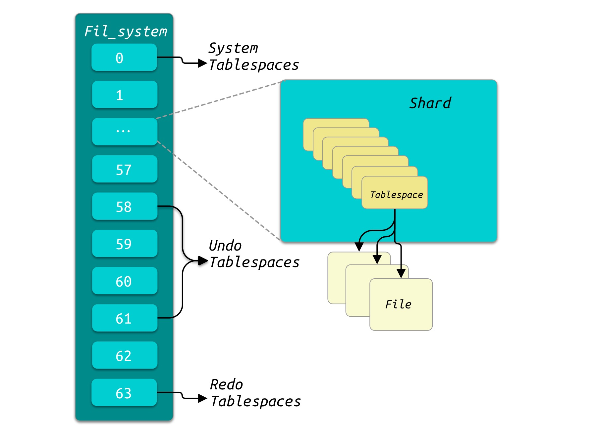
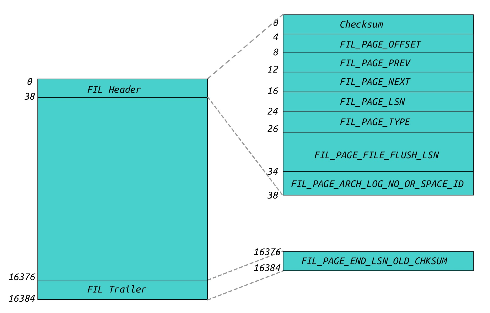
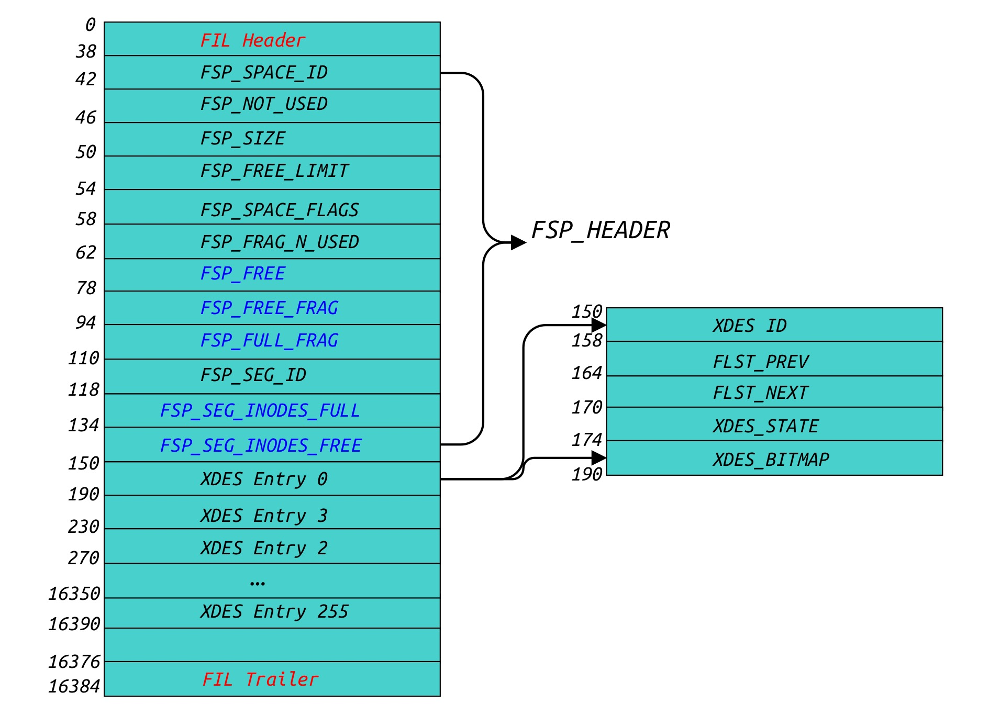
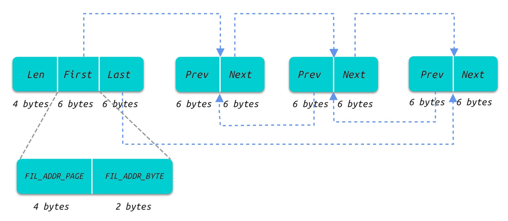
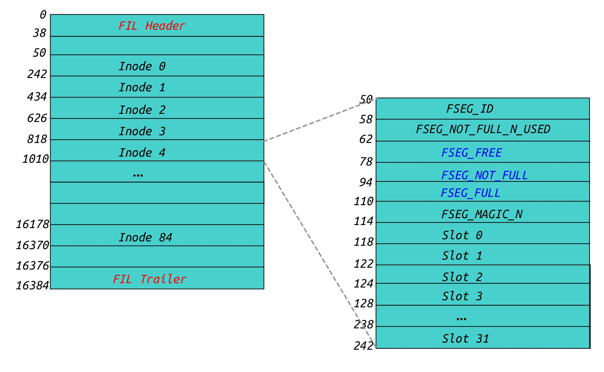
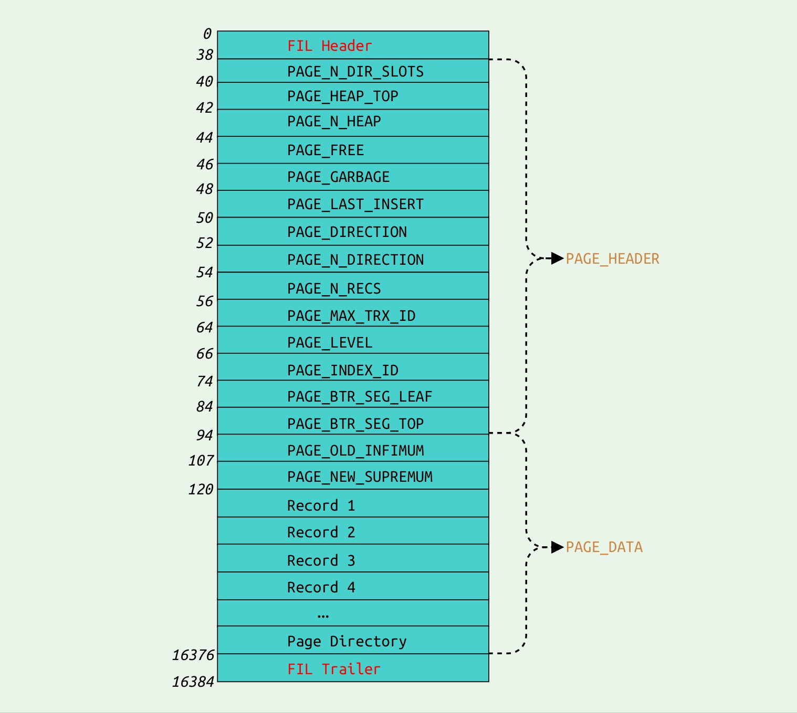

# InnoDB的文件组织结构

1.  [准备](#%E5%87%86%E5%A4%87)
2.  [内存文件管理](#%E5%86%85%E5%AD%98%E6%96%87%E4%BB%B6%E7%AE%A1%E7%90%86)
    1.  [Fil\_system](#Fil-system)
    2.  [文件管理的数据结构](#%E6%96%87%E4%BB%B6%E7%AE%A1%E7%90%86%E7%9A%84%E6%95%B0%E6%8D%AE%E7%BB%93%E6%9E%84)
    3.  [Page](#Page)
    4.  [Tablespace](#Tablespace)
    5.  [Page 0](#Page-0)
    6.  [Extent Descriptor](#Extent-Descriptor)
    7.  [文件链表](#%E6%96%87%E4%BB%B6%E9%93%BE%E8%A1%A8)
    8.  [Page 2](#Page-2)
3.  [数据页(Index)](#%E6%95%B0%E6%8D%AE%E9%A1%B5-Index)
    1.  [数据页的页目录](#%E6%95%B0%E6%8D%AE%E9%A1%B5%E7%9A%84%E9%A1%B5%E7%9B%AE%E5%BD%95)
    2.  [数据页Record的插入(page\_cur\_rec\_insert)](#%E6%95%B0%E6%8D%AE%E9%A1%B5Record%E7%9A%84%E6%8F%92%E5%85%A5-page-cur-rec-insert)
    3.  [数据页Record的删除](#%E6%95%B0%E6%8D%AE%E9%A1%B5Record%E7%9A%84%E5%88%A0%E9%99%A4)
    4.  [数据页Record的查找](#%E6%95%B0%E6%8D%AE%E9%A1%B5Record%E7%9A%84%E6%9F%A5%E6%89%BE)
4.  [物理文件管理](#%E7%89%A9%E7%90%86%E6%96%87%E4%BB%B6%E7%AE%A1%E7%90%86)
    1.  [物理文件创建](#%E7%89%A9%E7%90%86%E6%96%87%E4%BB%B6%E5%88%9B%E5%BB%BA)
    2.  [Tablespace创建](#Tablespace%E5%88%9B%E5%BB%BA)
    3.  [Segment的创建](#Segment%E7%9A%84%E5%88%9B%E5%BB%BA)
    4.  [Extent的创建](#Extent%E7%9A%84%E5%88%9B%E5%BB%BA)
5.  [参数解释](#%E5%8F%82%E6%95%B0%E8%A7%A3%E9%87%8A)
    1.  [innodb\_file\_per\_table](#innodb-file-per-table)
    2.  [innodb\_data\_file\_path](#innodb-data-file-path)

## [](#%E5%87%86%E5%A4%87 "准备")准备

**MySQL版本: 8.0**

从用户的角度看InnoDB根据不同的功能将文件分为Redo Log文件(`ib_logfile`)，Undo Log文件(`undo_xxx`)，系统表文件(`ibdata`)，临时表文件(`ibtmp`)，数据文件(`.ibd`)等等。当MySQL运行时，InnoDB引擎内部同样需要在内存中维护这些文件，方便管理和读取，所以我们从内存中的文件管理和文件的物理结构两个方向来分析.

## [](#%E5%86%85%E5%AD%98%E6%96%87%E4%BB%B6%E7%AE%A1%E7%90%86 "内存文件管理")内存文件管理

在InnoDB中，表空间是基本的数据单元，比如系统表属于系统表空间(`System tablespace`)，Undo Log属于(`Undo Tablespaces`). 由表空间来管理其文件和元信息.

### [](#Fil-system "Fil_system")Fil\_system

在InnoDB的内存中维护了一个`Fil_system`的数据结构来缓存整个文件管理. `Fil_system`分为64个`shard`. 而每个`shard`管理多个`Tablespace`, 层级关系为: Fil\_system->shard->Tablespace



层级关系为: Fil\_system -> shard -> tablespace

64个`shard`中，第1个即索引为0的`shard`属于系统表空间，最后一个`shard`即索引为63的`shard`为`Redo Log`的`Tablespace`, 而58-61是属于`Undo Log`的`shard`:

```c++
/** Maximum number of shards supported. */
static const size_t MAX_SHARDS = 64;

/** The redo log is in its own shard. */
static const size_t REDO_SHARD = MAX_SHARDS - 1;	/* Redo Log的shard */

/** Number of undo shards to reserve. */
static const size_t UNDO_SHARDS = 4;			/* 分配4个shard给Undo Log */

/** The UNDO logs have their own shards (4). */
static const size_t UNDO_SHARDS_START = REDO_SHARD - (UNDO_SHARDS + 1);
```

在`shard`中的每一个`Tablespace`都有唯一的ID，通过`shard_by_id()`函数寻找所属的`shard`：

```c++
Fil_shard *shard_by_id(space_id_t space_id) const
      MY_ATTRIBUTE((warn_unused_result)) {
#ifndef UNIV_HOTBACKUP
    if (space_id == dict_sys_t::s_log_space_first_id) {
      /* 假如Tablespace ID为dict_sys_t::s_log_space_first_id, 即返回m_shards[63] */
      return (m_shards[REDO_SHARD]);

    } else if (fsp_is_undo_tablespace(space_id)) {
      /* 假如Tablespace ID为
         dict_sys_t::s_min_undo_space_id与
      	 dict_sys_t::s_max_undo_space_id之间则返回m_shards[UNDO_SHARDS_START + limit] */
      const size_t limit = space_id % UNDO_SHARDS;

      return (m_shards[UNDO_SHARDS_START + limit]);
    }

    ut_ad(m_shards.size() == MAX_SHARDS);

    /* 其余的Tablespace根据ID求模获取对应的shard */
    return (m_shards[space_id % UNDO_SHARDS_START]);
#else  /* !UNIV_HOTBACKUP */
    ut_ad(m_shards.size() == 1);

    return (m_shards[0]);
#endif /* !UNIV_HOTBACKUP */
  }
```

每一个`Tablespce`都对应一个或多个物理文件`fil_node_t`。

### [](#%E6%96%87%E4%BB%B6%E7%AE%A1%E7%90%86%E7%9A%84%E6%95%B0%E6%8D%AE%E7%BB%93%E6%9E%84 "文件管理的数据结构")文件管理的数据结构

InnoDB将文件分为Log文件(Redo Log、Undo Log)、系统表空间文件`ibdata`、临时表空间文件、用户表空间。其中数据文件(`.ibd`)都由`Pages`\->`Extents`\-> `Segments`\-> `Tablespaces`多级组成。`Tablespace`是由多个`Segment`组成，而每个`Segment`又由多个`Extent`组成，每个`Extent`由多个`Page`组成，`Extent`中`Page`的数量由其`Page`的大小决定, 对应关系如下:

```c++
/** File space extent size in pages
page size | file space extent size
----------+-----------------------
   4 KiB  | 256 pages = 1 MiB
   8 KiB  | 128 pages = 1 MiB
  16 KiB  |  64 pages = 1 MiB
  32 KiB  |  64 pages = 2 MiB
  64 KiB  |  64 pages = 4 MiB
*/
```


### [](#Page "Page")Page

每个`Tablespace`内部都是由`Page`组成，每个`Page`都具有相同的大小，默认的`UNIV_PAGE_SIZE`是16KB，即每个`Extent`的大小为1M, `Page`的大小可以由参数`--innodb-page-size`配置。下图是`Page`的布局图:

需要注意的是`Extent`是一个物理概念，对应的是物理文件上1MB空间大小，而Segment是一个逻辑概念，便于整个B tree索引的管理.



*   `FIL_PAGE_OFFSET`就是`Page`的Number号, 第0页即为0
*   `FIL_PAGE_TYPE`是`Page`的类型，比如`Tablespace`的第0页即为`FIL_PAGE_TYPE_FSP_HDR`类型
*   在第0页中`FIL_PAGE_PREV`的值被替换为`FIL_PAGE_SRV_VERSION`即MySQL的版本, 比如`80013`
*   在第0页中`FIL_PAGE_NEXT`的值被替换为`FIL_PAGE_SPACE_VERSION`即`Tablespace`的ID, 比如临时表就是`0xFFFFFFFD`
*   `FIL_PAGE_ARCH_LOG_NO_OR_SPACE_ID`为`Page`所在的Tablespace的`space_id`

### [](#Tablespace "Tablespace")Tablespace

`Tablespace`由多个`Page`组成，为了管理这些`Page`也需要一些`Page`存放元信息，所以`Page 0`、`Page 1`、`Page 2`和`Page 3`包含了这些元信息数据:

> We initially let it be 4 pages:
> 
> *   page 0 is the fsp header and an extent descriptor page,
> *   page 1 is an ibuf bitmap page,
> *   page 2 is the first inode page,
> *   page 3 will contain the root of the clustered index of the  
>     first table we create here. \*/

我们这里介绍关于文件管理的`Page 0`和`Page 2`. `Page 0`作为`Tablespace`的`Header`其中保存关于`Extent`的信息，而`Page 2`作为管理`Segment`的元信息页面.

### [](#Page-0 "Page 0")Page 0

`Page 0`包括`Tablespace`的头部、`Extents`和`Segments`的链表管理，下图的`Page 0`的布局，其中蓝色的字段表示**文件链表**:



**图中蓝色字段表示数据类型为[文件链表](http://leviathan.vip/2019/04/18/InnoDB%E7%9A%84%E6%96%87%E4%BB%B6%E7%BB%84%E7%BB%87%E7%BB%93%E6%9E%84/#%E6%96%87%E4%BB%B6%E9%93%BE%E8%A1%A8)**

*   `FSP_SPACE_ID`表示该Tablespace的ID
*   `FSP_SIZE`表示目前`Tablespace`有多少个`Page`
*   `FSP_FREE_LIMIT`表示目前在空闲的`Extent`上最小的尚未被初始化的`Page`的`Page Number`
*   `FSP_SPACE_FLAGS`表示`Tablespace`的标志位
*   `FSP_FRAG_N_USED`表示`FSP_FREE_FRAG`中已经使用的Page数量
*   `FSP_FREE`表示所有的`Page`均为空闲的`Extent`
*   `FSP_FREE_FRAG`表示`Extent`中尚有`Page`未被使用
*   `FSP_FULL_FRAG`表示`Extent`的所有的`Page`均已被使用
*   `FSP_SEG_ID`表示下一个未被使用的`Segment ID`
*   `FSP_SEG_INODES_FULL`表示`Segment Page`的所有的`Inode`均已被使用
*   `FSP_SEG_INODES_FREE`表示`Segment Page`存在空闲的`Inode`

### [](#Extent-Descriptor "Extent Descriptor")Extent Descriptor

`Page 0`中的字段`XDES Entry`即为Extent的描述符, `FSP_HEADER`后面紧跟256个`EXTENT DESCRIPTOR`用于记录`Extent`的描述页，大小为 40 Bytes. 其中的状态标志有6种:

```c++
enum xdes_state_t {

  /** extent descriptor is not initialized */
  XDES_NOT_INITED = 0,

  /** extent is in free list of space */
  XDES_FREE = 1,

  /** extent is in free fragment list of space */
  XDES_FREE_FRAG = 2,

  /** extent is in full fragment list of space */
  XDES_FULL_FRAG = 3,

  /** extent belongs to a segment */
  XDES_FSEG = 4,

  /** fragment extent leased to segment */
  XDES_FSEG_FRAG = 5
};
```

其中字段`XDES_BITMAP`为16`Bytes`即 `16 * 8`bits，其中一个`Page`占用两个`bit`用来表示`Page`是否被占用。

记录`EXTENT DESCRIPTOR`信息的`Page`所在的`Extent`会被直接插入`FSP_FREE_FRAG`，因为已经存在一个被使用了的`Page`。而一个`EXTENT DESCRIPTOR`的`Page`只记录了256个`Extent`，所以假如`Page`的大小是`16KB`即每隔`256 * 64 = 16384`页 就需要申请一个带有`EXTENT DESCRIPTOR`的`Page`，后面新申请分配的`Extent`依然与其他的`Extent`文件链表连接。

```c++
bool init_xdes = (ut_2pow_remainder(i, page_size.physical()) == 0);
```

### [](#%E6%96%87%E4%BB%B6%E9%93%BE%E8%A1%A8 "文件链表")文件链表

例如`FSP_FREE`是一个文件链表，有一个`BaseNode`包含整个链表元素长度，并且指向第一个元素`First`和最后一个元素`Last`。 除了`BaseNode`多了一个`4 bytes`的长度标记，其他的元素都具有相同的数据结构，`6 bytes`分为两部分: `4 bytes`的`Page Number`, `2 bytes`的`Page`在整个Tablespace的偏移，其组织形式如下图：



### [](#Page-2 "Page 2")Page 2

`Tablespace`的第三个`Page`是关于`Segment`信息的，类型为`FIL_PAGE_INODE`，其中一个`Inode`可以理解为管理一个`Segment`元信息单元:



在一个`Inode`即一个`Segment`中:

*   `FSEG_ID`表示`Segment`的`ID`
*   `FSEG_NOT_FULL_N_USED`表示`Segment`中被使用的`Page`数量
*   `FSEG_FREE`表示所有`Page`均为空闲的`Extent`
*   `FSEG_NOT_FULL`表示部分`Page`空闲的`Extent`
*   `FSEG_FULL`表示所有`Page`均被使用的`Extent`
*   `FSEG_MAGIC_N`表示一个`magic numbe`用于`Debug`
*   `Slot`表示一个`Page`

## [](#%E6%95%B0%E6%8D%AE%E9%A1%B5-Index "数据页(Index)")数据页(Index)

在InnoDB中，数据即索引，索引即数据，所以这里的数据页一般也指索引页，非压缩页的结构如下:



*   `PAGE_N_DIR_SLOTS`表示数据页中页目录的数量
*   `PAGE_HEAP_TOP`指向数据页中的空闲空间的起始地址
*   `PAGE_N_HEAP`表示目前存放的Record数量
*   `PAGE_FREE`表示删除的Record的链表
*   `PAGE_GARBAGE`表示被删除的Record所占的Bytes大小
*   `PAGE_LAST_INSERT`指向最近一次插入的Record
*   `PAGE_DIRECTION`表示最后一个记录插入的方向
*   `PAGE_N_DIRECTION`表示连续同一个方向插入的Record数量
*   `PAGE_N_RECS`表示当前数据页中用户的Record数量
*   `PAGE_MAX_TRX_ID`表示当前数据页中最大的Transaction ID
*   `PAGE_LEVEL`表示当前数据页在整个索引的B+树中的层级
*   `PAGE_INDEX_ID`表示当前数据页所属的索引ID
*   `PAGE_BTR_SEG_LEAF`表示Leaf节点对应的Segment Header信息
*   `PAGE_BTR_SEG_TOP`表示非Leaf节点对应的Segment Header信息
*   `PAGE_OLD_INFIMUM`表示当前数据页中最大的Record
*   `PAGE_OLD_SUPREMUM`表示当前数据页中最小的Record

`Infimum Record`和`Supremum Record`分别代表该数据页中逻辑最大和最小的值.

### [](#%E6%95%B0%E6%8D%AE%E9%A1%B5%E7%9A%84%E9%A1%B5%E7%9B%AE%E5%BD%95 "数据页的页目录")数据页的页目录

Page Directory(页目录)占用两个字节，存放了Record在Page的相对位置, 页目录是一个稀疏目录(Sparse Directory), 即一个页目录中有多个Record, 上下限分别为4和8.在整个数据页中，会存在多个Record作为Slot，即管理一个页目录. 其中Record中的`REC_NEW_N_OWNED`字段记录该页目录的Record数量.

### [](#%E6%95%B0%E6%8D%AE%E9%A1%B5Record%E7%9A%84%E6%8F%92%E5%85%A5-page-cur-rec-insert "数据页Record的插入(page_cur_rec_insert)")数据页Record的插入(page\_cur\_rec\_insert)

*   获取Record的长度
*   从`PAGE_FREE`链表取下最近一个被删除的Record, 判断大小是否合适，假如待插入的Record超过了被删除的Record的大小, 则从Page的`PAGE_HEAP_TOP`指向的位置分配空间
*   将待插入的Record拷贝至对应的存储位置
*   更新Record的前序后置Record
*   设置Record的`REC_OLD_N_OWNED`和`REC_OLD_HEAP_NO`标志位
*   更新Page Header的`PAGE_DIRECTION`,`PAGE_N_DIRECTION`,`PAGE_LAST_INSERT`标志位
*   更新数据页的页目录(Page Directory), 即对应的`REC_NEW_N_OWNED`自增1，假如超过了`PAGE_DIR_SLOT_MAX_N_OWNED`即8个Record, 数据目录需要分裂成两个
*   写Redo Log持久化插入操作

### [](#%E6%95%B0%E6%8D%AE%E9%A1%B5Record%E7%9A%84%E5%88%A0%E9%99%A4 "数据页Record的删除")数据页Record的删除

*   写Redo Log持久化
*   将待删除的Record从对应的前序后置Record链表中删除
*   更新页目录directory slot对应的信息
*   将待删除的Record插入`PAGE_FREE`链表
*   假如directory slot中Record的数量小于`PAGE_DIR_SLOT_MIN_N_OWNED`, 则平衡Page Directory

### [](#%E6%95%B0%E6%8D%AE%E9%A1%B5Record%E7%9A%84%E6%9F%A5%E6%89%BE "数据页Record的查找")数据页Record的查找

*   调用`page_cur_search_with_match()`对指定Page的Page Directory(页目录)进行二分查找定位Record周边的两个slot
*   从`low_rec`开始线性迭代直到`up_rec`，查找符合条件的Record.

## [](#%E7%89%A9%E7%90%86%E6%96%87%E4%BB%B6%E7%AE%A1%E7%90%86 "物理文件管理")物理文件管理

为了理解上半部分介绍的多种数据结构和不同`Page`的格式的真正用途，我们需要分析InnoDB是如何利用这些数据结构来完成文件的管理。

### [](#%E7%89%A9%E7%90%86%E6%96%87%E4%BB%B6%E5%88%9B%E5%BB%BA "物理文件创建")物理文件创建

创建Tablespace的同时通过`os_file_create()`创建物理文件, 一个`Fil_shard`管理多个 Tablespace, 一个 Tablesapce 根据类型不同会创建一个或者多个文件. 例如数据Tablespace仅有一个物理文件，而系统表有多个文件.

### [](#Tablespace%E5%88%9B%E5%BB%BA "Tablespace创建")Tablespace创建

*   对于非临时表的数据Tablesapce，初始化大小为 `FIL_IBD_FILE_INITIAL_SIZE`(7) 个Page, 而对于临时Tablspace， 初始化大小为 `FIL_IBT_FILE_INITIAL_SIZE`(5) 个Page
    
*   `fil_create_tablespace()`初始化`tablespace`的相关元信息包括`m_flags`等等
    
*   创建`ibd`文件并更新至内存文件管理`Fil_system`，初始化`Page 0`的`FIL_Header`
    
*   初始化`Page 0`的`FSP_Header` 字段和`EXTENT DESCRIPTOR`文件链表，更新`EXTENT DESCRIPTOR`列表中的第一个`Extent`描述符
    

`Tablespace`的创建流程初始化`Page 0`，完成了`Tablespace`中前`256`个`Extent Descriptor`的初始化创建。在用户创建的`Tablespace`过程中，对于系统表的新建，会调用`btr_create()`从而引入`Segment`的创建. 对于用户普通表, 会根据是否在建表时指定Primary Key选择不同的策略来创建索引(`btr_create()`)从而引入`Segment`的创建(`create_clustered_index_when_no_primary()/create_index()`).

### [](#Segment%E7%9A%84%E5%88%9B%E5%BB%BA "Segment的创建")Segment的创建

*   首先通过`fsp_reserve_free_extents()`为不同类型的Tablespace预留空间.
    
*   寻找空闲的`Page`作为`Inode`的`Page`，初始化`Inode`的文件链表
    
*   选中一个空闲的`Inode`并对其进行初始化
    
    ```c++
    seg_id = mach_read_from_8(space_header + FSP_SEG_ID);
    
    // 更新Tablespace的Header中FSP_SEG_ID
    mlog_write_ull(space_header + FSP_SEG_ID, seg_id + 1, mtr);
    
    // 更新Inode的所属的FSEG_ID和FSEG_NOT_FULL_N_USED
    mlog_write_ull(inode + FSEG_ID, seg_id, mtr);
    mlog_write_ulint(inode + FSEG_NOT_FULL_N_USED, 0, MLOG_4BYTES, mtr);
    
    // 初始化文件链表FSEG_FREE、FSEG_NOT_FULL和FSEG_FULL
    flst_init(inode + FSEG_FREE, mtr);
    flst_init(inode + FSEG_NOT_FULL, mtr);
    flst_init(inode + FSEG_FULL, mtr);
    
    mlog_write_ulint(inode + FSEG_MAGIC_N, FSEG_MAGIC_N_VALUE, MLOG_4BYTES, mtr);
    for (i = 0; i < FSEG_FRAG_ARR_N_SLOTS; i++) {
      // 初始化Inode的32个Slot
      fseg_set_nth_frag_page_no(inode, i, FIL_NULL, mtr);
    }
    ```
    
*   从选中的`Inode`中选取一个`Extent`并从中获取空闲的`Page`
    
    *   在B+树索引中，叶子节点的`Page`分裂过程中，需要申请一个新的`Page`，而新申请的`Page`为了与被分裂的`Page`物理相邻，所以新申请的`Page`会被预设一个`hint_page_no`，根据分裂方向决定:
        
        *   假如分裂的方向为`FSP_DOWN`:
            
            ```c++
            direction = FSP_DOWN;
            hint_page_no = page_no - 1;	// page_no为被分裂的Page的ID
            ```
            
        *   假如分裂的方向为`FSP_UP`:
            
            ```c++
            direction = FSP_UP;
            hint_page_no = page_no + 1;	// page_no为被分裂的Page的ID
            ```
            
    *   假如`hint`页所在的`Extent`属于该`Segment`并且`hint`页属于空闲`XDES_FREE_BIT`状态，直接获取该`hint`页。
        
    *   假如`hint`所在的`Extent`属于`XDES_FREE`状态、而`Segment`中使用的`Page`数量已经超过分配的`Page`数量的`87.5%` 并且`Segment`中使用的`Page`数量也超过了`32`：
        
        *   尝试为`Segment`分配一个`Extent`，将其加入该`Segment`的`FSEG_FREE`链表，获取`hint`页
    *   假如申请的用户为`B+`树分裂，而`Segment`中使用的`Page`数量已经超过分配的`Page`数量的`87.5%` 并且`Segment`中使用的`Page`数量也超过了`32`：
        *   尝试为`Segment`分配一个`Extent`，将其加入该`Segment`的`FSEG_FREE`链表
        *   假如`B+`树分裂方向为`FSP_DOWN`，返回`Extent`的最后一个`Page`
    *   否则返回`Extent`中第一个空闲的`Page`
        
    *   假如`hint`所在的`Extent`存在空闲的`Page`，直接获取该`Extent`中的一个空闲`Page`
        
    *   假如`Segment`中已经分配的`Page`数量大于使用的`Page`数量：
        
        *   尝试迭代`FSEG_NOT_FULL`和`FSEG_FREE`链表，取得一个存在空闲`Page`的`Extent`然后获取一个空闲`Page`
    *   假如`Segment`使用的`Page`数量小于32(`FSEG_FRAG_LIMIT`)：
        
        *   尝试直接为`Segment`分配一个`Page`，插入`Segment`自带的`Slot`
    *   上述情况都不满足的情况下，我们需要为该`Segment`申请一个新的`Extent`，之后再获取空闲的`Page`

### [](#Extent%E7%9A%84%E5%88%9B%E5%BB%BA "Extent的创建")Extent的创建

为`Segment`分配`Extent`时:

*   通过`Tablespace`的`Header`检查是否存在空闲的`Extent`，假如存在，即从`FSP_FREE`链表移除，之后返回空闲的`Extent`
*   否则需要新建`Extent`，最多创建4个`Extent`，并且每隔`FSP_EXTENT_SIZE`个`Page`就需要一个创建`Extent descriptor`的`Page`。存在`Extent descriptor`的`Page`需要加入`Tablespace`的`FSP_FREE_FRAG`链表，完全空闲的`Extent`加入`FSP_FREE`链表
*   `Extent`申请分配完成后，从`FSP_FREE`链表中移除一个`Extent`分配给`Segment`并插入`FSEG_FREE`链表。

## [](#%E5%8F%82%E6%95%B0%E8%A7%A3%E9%87%8A "参数解释")参数解释

### [](#innodb-file-per-table "innodb_file_per_table")innodb\_file\_per\_table

在MySQL5.6以上的版本新增了一个参数`innodb_file_per_table`, 默认创建的`Table`存储在系统表`System Tablespace`, 打开这个参数允许用户为每一个`table`创建单独的`Tablespace`:

```plain
mysql> SET GLOBAL innodb_file_per_table=1;
mysql> CREATE TABLE t2 (c1 INT PRIMARY KEY);
```

示例中的表`t2`会在所属的`Database`目录下拥有独立的表空间文件`t2.ibd`.

### [](#innodb-data-file-path "innodb_data_file_path")innodb\_data\_file\_path

`innodb_data_file_path`配置系统表空间文件的名字，大小，属性等。例如:

```plain
[mysqld]
innodb_data_file_path=ibdata1:50M;ibdata2:12M:autoextend:max:500MB
```

示例配置两个系统表文件`ibdata1`和`ibdata2`, 大小分别是`50M`和`12M`, 其中`ibdata2`可以自动扩容，但大小限制为`500M`.

2019-04-18

*   [MySQL](http://www.leviathan.vip/tags/MySQL/)

[Back to Top](#top)

---------------------------------------------------


原网址: [访问](http://www.leviathan.vip/2019/04/18/InnoDB%E7%9A%84%E6%96%87%E4%BB%B6%E7%BB%84%E7%BB%87%E7%BB%93%E6%9E%84/)

创建于: 2020-06-15 11:11:40

目录: default

标签: `www.leviathan.vip`

