# [InnoDB（十三）：Tablespace Managment]


## 概念

InnoDB的物理文件分为如下几类：

*   日志文件（Redo）：每个Block的话，5.6为512KB；5.7可配置
*   系统表空间文件（ibdata）：Change Buffer，Undo，事务系统（trx\_sys→ max\_trx\_id），Double Write Buffer
*   Undo表空间文件（可选）：默认存储在系统表空间中
*   临时表空间文件：只有当前连接可见的用户表  
    
*   **用户表空间文件**（\*.ibd）：普通的表空间文件，一般的由CREATE TABLE产生  
    

本文主要介绍**系统表空间文件**和**用户表空间文件。**用户表空间有着从顶至下的四个层级结构：Tablespace / Segment / Extent / Page

### Tablespace

表空间是最上层的**逻辑的**概念，表示**一组文件构成的集合**：

*   User Tablespace：innodb\_file\_per\_table = ON/OFF，表示每个用户表空间单独使用一个文件（ON）或者都存储在系统表空间中（OFF）
*   System Tablespace：系统表空间可能有多个文件构成（ibdata1，ibdata2 ...）
*   ......

通常的，一个Tablespace用一个文件表示

### Segment

Segment是另一个**逻辑的**概念，**表示存储同一类内容的Page（Extent）的集合**（可能包含少量独立的Page）。例如：

对于用户表空间的内容以B+ Tree的形式组织：

*   Internal-Node Segment：存储的都是B+ Tree中间节点
*   Leaf-Node Segment：存储的都是B+ Tree叶子节点

又如系统表空间中的Rollback Segment（回滚段），存储的都是事物产生的Undo日志

```text
为Segment分配空间有两种方式：
 - 为其分配一个Extent
 - 如果Segment较小时，为其分配一个Page（不能认为Segment至少包含一个Extent，这种方式是为了提高Tablespace中空间的利用率）
```

### Extent  / Page

Extent与Page都是物理的概念：

*   Page是Tablespace的**最小管理单位**
*   Extent是InnoDB运行时（多数情况下）的**空间分配单位**，是64个Page的集合（若 _**[innodb\_page\_size](https://dev.mysql.com/doc/refman/8.0/en/innodb-parameters.html#sysvar_innodb_page_size)**_ = 16KB）。当 innodb\_page\_size 变化时如下

```plain
/** File space extent size in pages
page size | file space extent size
----------+-----------------------
   4 KiB  | 256 pages = 1 MiB
   8 KiB  | 128 pages = 1 MiB
  16 KiB  |  64 pages = 1 MiB
  32 KiB  |  64 pages = 2 MiB
  64 KiB  |  64 pages = 4 MiB
*/
#define FSP_EXTENT_SIZE                                                 \
  static_cast<page_no_t>(                                               \
      ((UNIV_PAGE_SIZE <= (16384)                                       \
            ? (1048576 / UNIV_PAGE_SIZE)                                \
            : ((UNIV_PAGE_SIZE <= (32768)) ? (2097152 / UNIV_PAGE_SIZE) \
                                           : (4194304 / UNIV_PAGE_SIZE)))))
```

Tablespace / Segment / Extent / Page的联系如下图：

  

               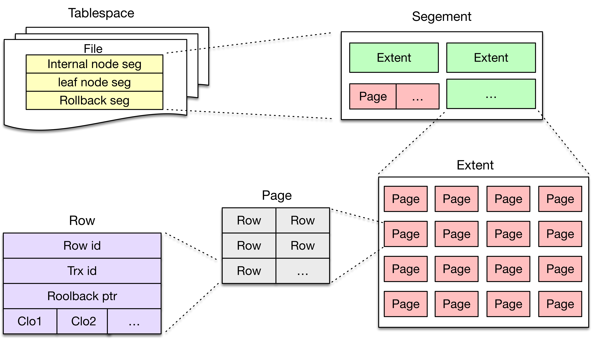

## Tablespace File Layout

### Basic Page

Tablespace的每一个文件都顺序的被分割成UNIV\_PAGE\_SIZE（16K）大小的单元，称为Basic Page

Basic Page有着统一的Layout：Header（38B） / Body / Tailer（8B），在Header中存在**类型域**（FIL\_PAGE\_TYPE），其实Body存储内容及其相应的Layout由不同的**类型**决定

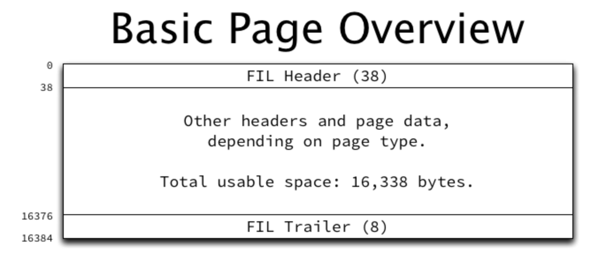

#### Page Header

*   **FIL\_PAGE\_SPACE\_OR\_CHKSUM**：在 MySQL 4.0.14 之后是 Checksum
*   **FIL\_PAGE\_OFFSET**："page no"，是 Page 在文件中的逻辑偏移量（0，1，2 ...）
*   **FIL\_PAGE\_PREV** / **FIL\_PAGE\_NEXT**：所有 Page 构成双向链表
*   **FIL\_PAGE\_LSN**：最新的修改该页的 mtr end lsn
*   **FIL\_PAGE\_TYPE**：页的类型；常用的包括
    *   **Index Page**：FIL\_PAGE\_INDEX 
    *   **Log Page**：FIL\_PAGE\_UNDO\_LOG
    *   **Descripter Page**：FIL\_PAGE\_INODE / FIL\_PAGE\_IBUF\_BITMAP / FIL\_PAGE\_TYPE\_SYS / FIL\_PAGE\_TYPE\_FSP\_HDR
*   **FIL\_PAGE\_FILE\_FLUSH\_LSN**：仅定义在系统表空间的第一个页，是判断 InnoDB 是否需要 Crash Recovery 的条件之一（另一个是 recv\_sys->scanned\_lsn > recv\_sys→checkpoint）
*   **FIL\_PAGE\_SPACE\_ID：**Page 所归属的 tablespace id

#### Page Trailer

*   **FIL\_PAGE\_END\_LSN\_OLD\_CHKSUM**：前四个字节表示Checksum，后四个字节表示FIL\_PAGE\_LSN的后四个字节

  
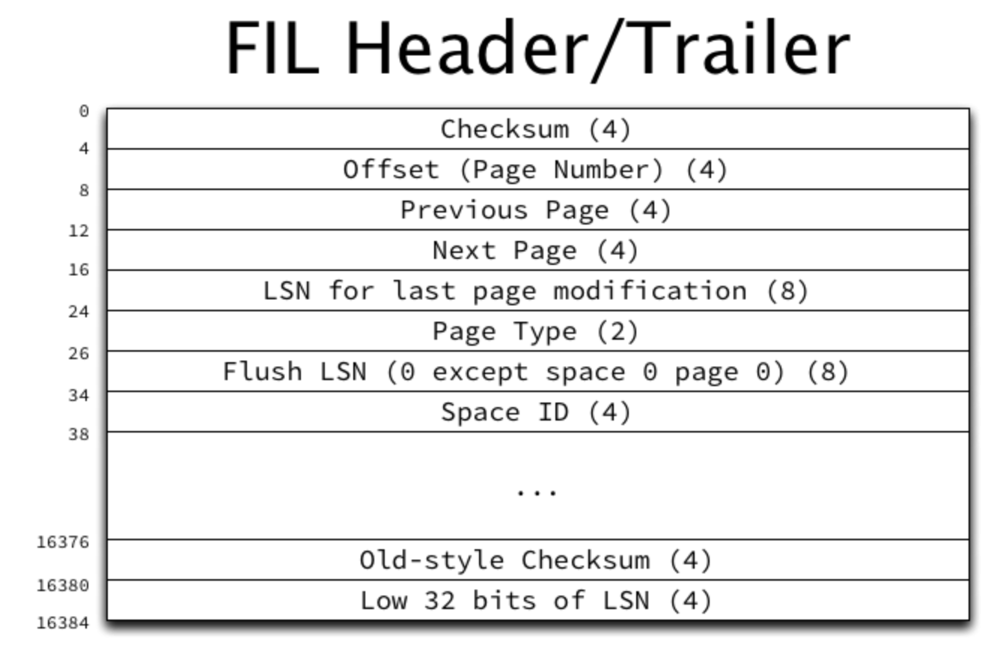  

下面根据FIL\_PAGE\_TYPE分类介绍

### Tablespace Descripter Page（FIL\_PAGE\_TYPE\_FSP\_HDR）

**表空间的第一个 Page**，用来描述表空间。这个 Page 的依然符合 Basic Page 的格式，由上图的 FIL header / trailer 以及 body 组成；这里介绍其 body 部分。

包括：

*   **Part I**：Tablespace Header（在代码中叫做 “Filespace Header”，简写做 FSP）
    
*   **Part II**：256个 XDES（Extent Descripter）Entry，每个 Entry 用于描述一个 Extent 的所有 Page，由下节介绍
    

#### Part I：Tablespace Header

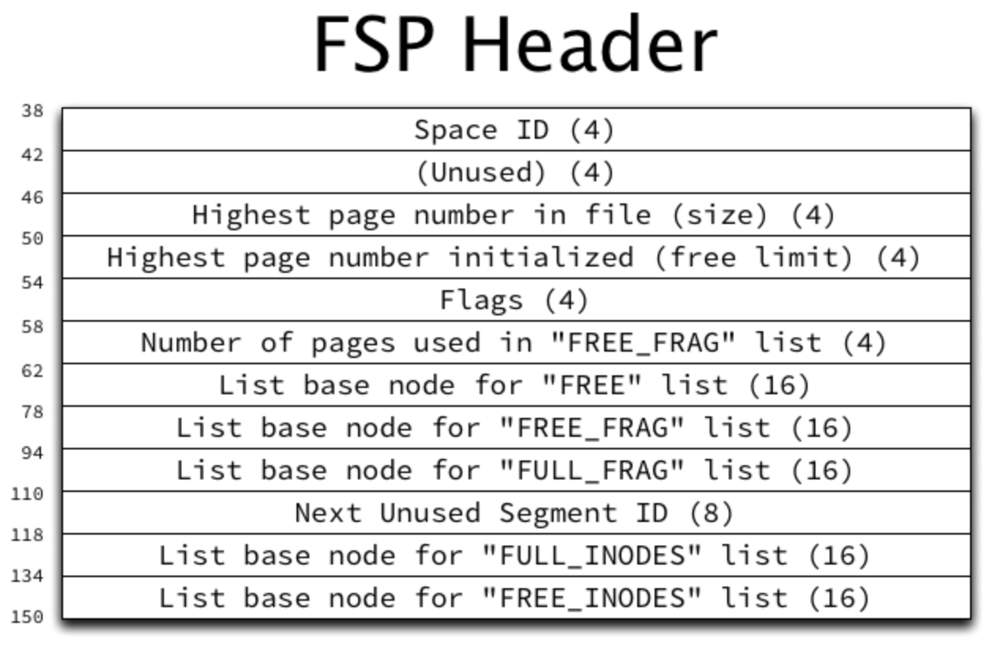

*   **FSP\_SPACE\_ID**：该文件对应的 tablespace id
*   **FSP\_NOT\_USED**：保留字节，当前未使用
*   **FSP\_SIZE**：当前表空间数据页总数，扩展文件时需要更新该值（fsp\_try\_extend\_data\_file\_with\_pages）
*   **FSP\_FREE\_LIMIT**：当前尚未初始化的最小 page no。从该页往后的都尚未加入到表空间的 FSP\_FREE 上
*   **FSP\_SPACE\_FLAGS**：当前表空间的 flag 信息，见下文
*   **FSP\_SEG\_ID**：当前文件中最大 segment id + 1，用于段分配时的 seg id 计数器
*   **FSP\_FRAG\_N\_USED**：FSP\_FREE\_FRAG 链表上已被使用的页数，用于快速计算该链表上可用空闲页数

**\*同时的，每一个Tablespace都维护若干（双向）链表**：

【Segment 相关】

*   **FSP\_SEG\_INODES\_FULL**：已被完全用满的 INODE Page
*   **FSP\_SEG\_INODES\_FREE**：存在空闲Entry的 INODE Page

【Extent 和 FRAG PAGE 相关】

*   **FSP\_FREE**：Extent 中所有页有都未被使用时，放到该链表上
*   **FSP\_FREE\_FRAG**：Extent 中部分页被使用（不属于任何 Segment，被共享使用）
*   **FSP\_FULL\_FRAG**：Extent 中所有页都被使用（不属于任何 Segment，被共享使用）

#### Part II：XDES Descripter

除了 Tablespace Header，页内还剩余大量空间。这些空间用来描述随后256个 Extent

这部分的 Layout 与 Extent Descripter Page 完全相同，在下小节介绍

### Extent Descripter Page（FIL\_PAGE\_TYPE\_XDES）

一个 Extent 由物理上连续的 64 个 Page 构成（1MB），每个 Extent Descripter Page（简写**XDES**）用来描述包含其在内的256个 Extent（一共 256\*64 个页，每个 Extent  64 个页 1MB）

XDES Layout 与 Tablespace Descripter Page 完全相同，只是 **Part I 为空**

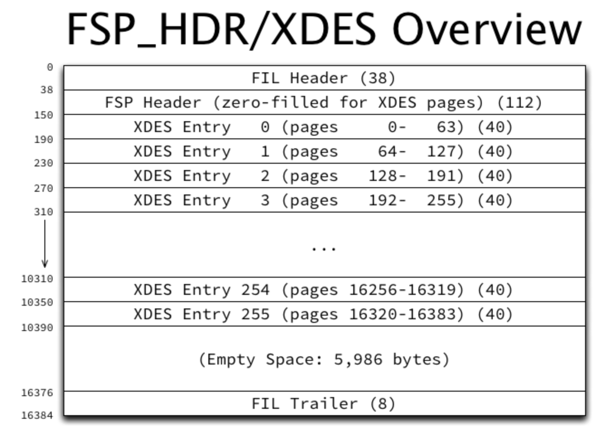


XDES 由256个 Entry 组成（**XDES\_ARR\_OFFSET**），每个 Entry 包含128 bit（16B）的**XDES\_BITMAP**域，2 bits 描述 Extent 中的一个 Page：

*   一个bit（XDES\_FREE\_BIT）表示该页是否闲置
*   一个bit 暂未使用

**XDES Entry 与 Extent 是一一对应**  

（当 innodb\_page\_size = 16KB 时）因为一个 XDES 只能用来描述 256 个 Extent，所以每 256 个 Extent 就需要创建一个 XDES

**如果 innodb\_page\_size != 16 KB？**

```plain
// 1. 每个 XDES entry 依然描述一个 Extent ？
// 每个 Page 占用2 bits(XDES_BITS_PER_PAGE)
// XDES entry bitmap 的大小描述的页数量为 FSP_EXTENT_SIZE，即XDES entry依然描述一个 Extent
#define XDES_SIZE \
  (XDES_BITMAP + UT_BITS_IN_BYTES(FSP_EXTENT_SIZE * XDES_BITS_PER_PAGE))
 
// 2. 每个 XDES 描述多少 Extent（entry 的数量）？
// 可以看到每个 XDES 描述接下来的 page_size.physical() 个数据页。因此描述 page_size / FSP_EXTENT_SIZE 个Extent
// 当 innodb_page_size = 16K 时：
//  1 - 每个 XDES 描述16K个数据页
//  2 - 每个Extent包含64个数据页
//  3 - 每个 XDES 描述256（16K/64）个 Extent
// 当 innodb_page_size = 4K 时：
//  1 - 每个 XDES 描述4K个数据页
//  2 - 每个Extent包含256个数据页
//  3 - 每个 XDES 描述16（4K/256）个 Extent
// 注：当 innodb_page_size 减小后，每个 entry 变大（XDES_BITMAP增大），因而entry的数量就减少（这样才不会超出页的大小）
// 当 innodb_page_size = 4K 时，每个 entry 占用 88B，所有 XDES entry 一共占用 88 * 16 = 1408B
// FIL Header(38) + FSP Header(112) + FSP Trailer(8) + 所有 XDES entry(1408) = 1566B < 4KB
// 在xdes_page_print函数中也可以得到证明：
//  每个 XDES entry 的数量：
//    ulint N = UNIV_PAGE_SIZE / FSP_EXTENT_SIZE;
page_no_t xdes_calc_descriptor_page(const page_size_t &page_size,
                                    page_no_t offset) {
  return (ut_2pow_round(offset, page_size.physical()));
}
```

### iBuf Bitmap Page（FIL\_PAGE\_IBUF\_BITMAP）

表空间的第二个 Page 类型为 FIL\_PAGE\_IBUF\_BITMAP，用于描述随后的 256 个 Extent 内数据页中与 iBuf 有关的信息（每个 Page 4 bits）

*   **IBUF\_BITMAP\_FREE**（2 bits）：使用2个bit来描述页的空闲空间范围：0（0B）、1（512B）、2（1024B）、3（2048B）  
    
*   **IBUF\_BITMAP\_BUFFERED**（1 bit）：iBuf 中是否缓存着这个页的操作  
    
*   **IBUF\_BITMAP\_IBUF**（1 bit）：该页是否是 iBuf B-tree的节点  
    

由于iBuf Bitmap Page 的空间有限，同样也会在每个 XDES 之后创建一个iBuf Bitmap Page，用于追踪其后 256 个 Extent 的情况  

关于iBuf（Change Buffer）细节请参考[InnoDB（八）：Change Buffer]，这里不再展开讨论

### Segment Descripter Page（INODE Page）

表空间的第三个Page 叫做 “INODE Page”（其实叫做 Segment Descripter Page 更合适，但 InnoDB 重载了名词“INODE Page”）

 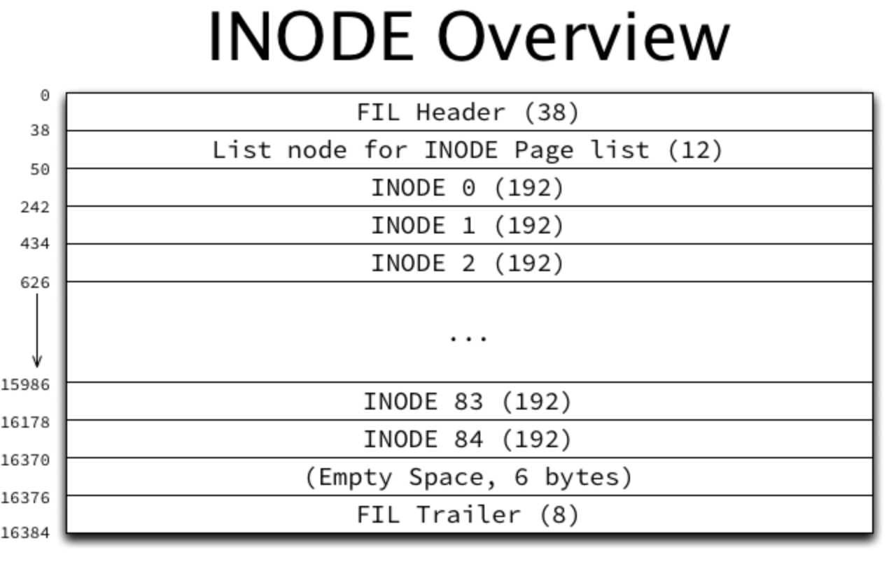       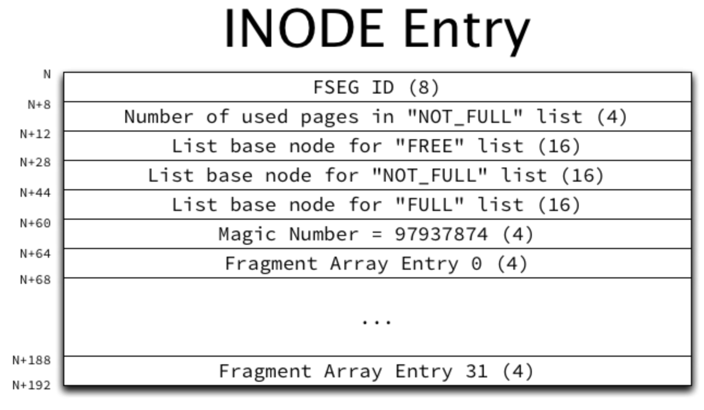 

  

INODE Page 上存在 84 个 INODE Entry。Segment 与 INODE Entry 是一一对应的，INODE Entry可以作为 Segment Descripter，保存该 Segment 的元数据

每个INODE Entry包含：

*   **FSEG\_ID**：该Inode归属的 Segment ID，若值为0表示该 slot 未被使用
*   **FSEG\_NOT\_FULL\_N\_USED**：FSEG\_NOT\_FULL链表上被使用的Page数量
*   **FSEG\_MAGIC\_N**：Magic Number

【四个 **XDES Entry** 链表】（链表上的对象是 XDES Entry，即 Extent）

*   **FSEG\_FREE**：完全没有被使用并分配给该 Segment 的 Extent链表
*   **FSEG\_NOT\_FULL**：FSEG\_FREE 中的 Extent 被使用后，移动到 FSEG\_NOT\_FULL 链表；FSEG\_NOT\_FULL 链表中的 Extent 用完后，移动到 FSEG\_FULL 链表。反之也成立
*   **FSEG\_FULL**：分配给当前 Segment，且Page完全使用完的Extent链表
*   **FSEG\_FRAG\_ARR**：属于该 Segment 的独立的 Page 数组（数组每个元素是 page no）。总是先从全局分配独立的 Page（FSP\_FREE\_FRAG 链表），当数组被填满时（32 Page），每次分配时都分配一个完整的 Extent，并在 XDES PAGE 中将其 Segment ID 设置为当前值

建立新的 Segment 有几个典型场景：

1.  用户表空间对于每个索引（聚簇索引或二级索引）需要申请两个 Segment：Internal Node Seg / Leaf Node Seg（所以在使用 innodb\_file\_per\_table 时，通常 INODE Page 都很空，**除非该表上有超过42个索引**。当超过42个索引后，就需要分配新的 INODE Page（fsp\_alloc\_seg\_inode\_page）。分配的方式同【**从表空间申请单独的Page / Extent】**小节，新的 INODE Page 位置并不固定）
2.  Undo tablespace 需要建立 128 个 rollback seg（MySQL 5.7/8/0）。

对于建立的每个 Segment：

1.  需要现在 INODE Page 申请一个 Entry。其次 Tablespace 中为其申请第一个 Page 作为 Segment Header Page
2.  在 Segment Header Page 上存有 **FSEG header（10个字节）**，**偏移处由调用者指定**（根据 Segment 的用处而不同，比如 Rollback seg 指定的偏移是 TRX\_RSEG\_FSEG\_HEADER）  
     Segment Header Page 上的内容也有调用者填充（e.g Rollback seg 保存 TRX\_RSEG\_HISTORY ,TRX\_RSEG\_UNDO\_SLOTS 等等）
3.  FSEG header 主要存放指针指向 Segment 的 INODE Entry
    
    ```plain
    #define FSEG_HDR_SPACE 0   /*!< space id of the inode */
    #define FSEG_HDR_PAGE_NO 4 /*!< page number of the inode */
    #define FSEG_HDR_OFFSET 8  /*!< byte offset of the inode */
    ```
    
4.  Segment Header Page 由调用方妥善保存，比如存放在 trx\_rsegf\_t 中（rollback seg），存放在系统表中（B-tree index 根节点）

  

**1. Tablespace的逻辑视图**

**_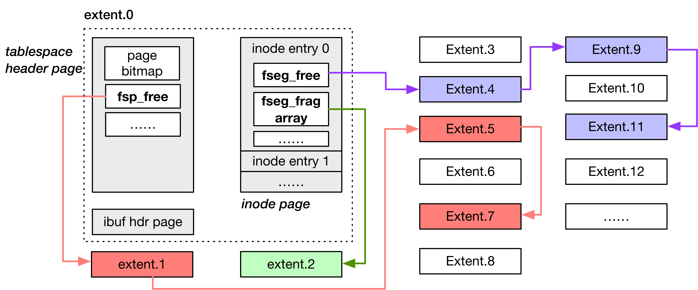_**

****2\. Tablespace的物理视图****

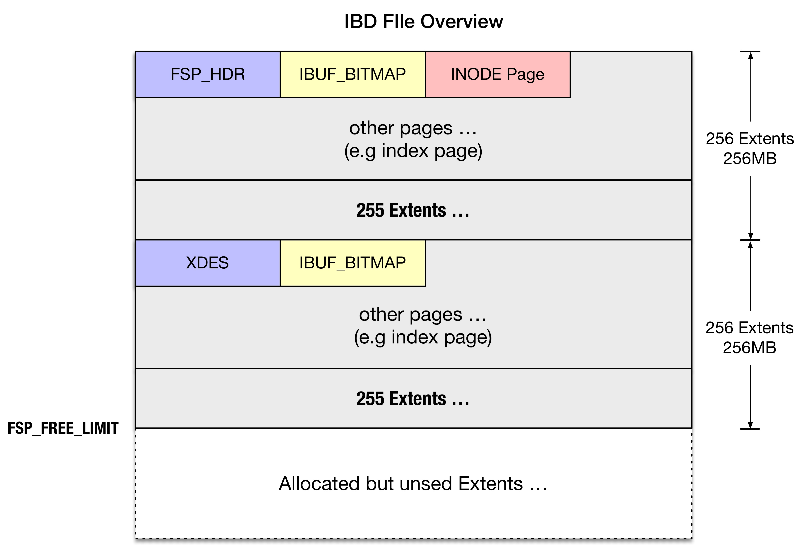

### Index Page

InnoDB中存在数量最多的一类Page就是Index Page（FIL\_PAGE\_INDEX），在Basic Page Header（下图中的FIL Header）之后便是INDEX Header、FSEG Header


#### FSEG Header

前面提到过每个B+Tree有两个Segment：Internal Node Segment / Leaf Node Segment，每个Segment在INODE Page中存在一个记录项，在B+Tree根节点中记录了（该Segment所占用的）INODE Page的位置及INODE Entry偏移，即FSEG Header（**PAGE\_BTR\_SEG\_LEAF / PAGE\_BTR\_SEG\_TOP**）。

FSEG Header 的指向该Segment申请的INODE Entry，格式为：

*   FSEG\_HDR\_SPACE：INODE Entry所在的Space id
    
*   FSEG\_HDR\_PAGE\_NO：INODE Entry所在的Page no
    
*   FSEG\_HDR\_OFFSET：INODE Entry页内偏移量
    

注：对于Index Page，FSEG Header 仅在根节点生效

```plain
- InnoDB重启后，如何找到B+ Tree的根节点？
当需要打开一张表时，需要从数据字典表中加载此表的元数据信息（e.g 列的数量及类型）到 dict_table_t* 内存结构中
其中SYS_INDEXES系统表中记录了表，索引，及索引根节点page no（DICT_FLD__SYS_INDEXES__PAGE_NO）
```

#### System Records

即是 Page 上的极大值与极小值记录（infimum/supremum）

#### User Records

以及 Page Directory（加速页内 record 的查找），请参考 [InnoDB（九）：Index Structure & Ops]，这里不再展开说明

### Layout Overview

这是 Layout 的逻辑视图（注：INODE 节点可以视为 Segment Descriptor Page）

  


## Tablespace Operation

我们接下来看看Tablespace的一些基本操作

### Tablespace 自动扩展

如果\*.ibd剩余空间不足（e.g 在 B-tree 分裂时有时会预留 2 Extent，如果此时剩余空间不足，则需要 Tablespace 自动扩展），自动扩展文件（fsp\_try\_extend\_data\_file）

```plain
Tablespace < 1 Extent（1MB），则扩展到1 Extent
Tablespace < 32MB，每次扩展1 Extent
Tablespace > 大于32MB时，每次扩展4 Extent（fsp_get_pages_to_extend_ibd）
```

但扩展的空间不会立即加入到FSP\_FREE中（即并不初始化），等到FSP\_FREE为空时，再批量的加入

```plain
// 从 Tablespace 中分配一个 Extent（给某个 Segment）
fsp_alloc_free_extent {
  // FSP_FREE 的第一个 Extent（所属的 XDES entry 的地址）
  first = flst_get_first(header + FSP_FREE, mtr);
  // 该 Extent 所属的 XDES entry 的地址为空，表明 FSP_FREE 为空（为何不直接判断 FSP_FREE 为空？）
  if (fil_addr_is_null(first)) {
    // 将在 FSP_FREE_LIMIT 之外的空间以 Extent 为单位分割，并加入到 FSP_FREE 中
    fsp_fill_free_list(false, space, header, mtr);
 
    first = flst_get_first(header + FSP_FREE, mtr);
  }
}
```

### Create Segment

这是每个表空间内创建Segment的通用流程（fseg\_create\_general）：

1.  【预留空间】即观察 Tablespace 中剩余空间是否足够（fsp\_reserve\_free\_extents），通常是 2 Extent（如果\*.ibd小于1个Extent，预留2 Page）
    
2.  【分配INODE Entry】在 FSP\_SEG\_INODES\_FREE 链表的第一个 INODE Page，并在 INODE Page 中寻找未使用的 INODE Entry（FSED\_ID == 0）
3.  【初始化INODE Entry】初始化INODE Entry的域
4.  【保存INODE Page】将 INODE Page 的引用（Page no + INODE Entry no）保存到 Root Page 内（PAGE\_BTR\_SEG\_LEAF / PAGE\_BTR\_SEG\_TOP）  
    

### 在Segment中申请一个Page

以用户表空间的 Segement 为例，为 Segement 分配空间主要发生在两处：

*   为 B-tree 结构的 Segement 的分裂时分配 Page（fseg\_alloc\_free\_page\_low）
*   为 Rollback Segement 分配 Page

以前者为例（复杂的过程 ...）。有多种分配策略，下图中的起点到终点的任意路径都是可能的方式

  

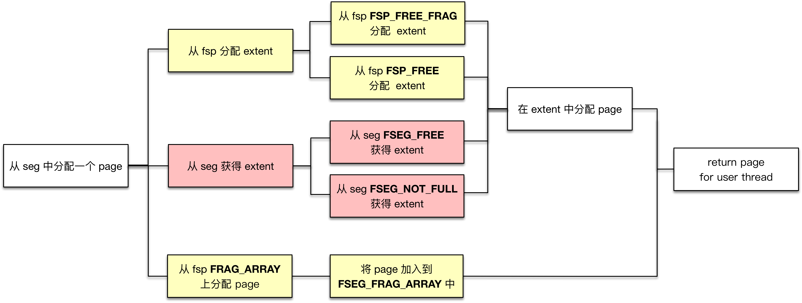

有一个问题，在这个过程中前置条件是一个索引中需要新分配一个Page（给待分裂的节点），那么如果这个索引如何知道它保存了哪些Extent？

1.  在SYS\_INDEXES系统表中找到该索引的根节点位置（SYS\_INDEXES系统表记录了表，索引，及根节点对应的Page no）
2.  在根节点的Segment Header中找到该 Segment 占有的 INODE entry 位置
3.  在INODE entry中即可找到一系列的关于 Extent 的链表

**在为Segment分配Page / Extent之前，往往需要****【预留空间】，防止如在****B+ Tree分裂的过程中出现空间不足**

*   预留空间的大小是tree\_height / 16 + 3（通常都是3个Extents）

从 Segment 申请 Page 时，有一个参数叫 Hint Page no，通常是当前需要分裂 Page 的前一个（direction = FSP\_DOWN）或者后一个 Page (direction = FSP\_UP)，其目的是将逻辑上相邻的 Page 在物理文件中上也尽量相邻

```plain
// 在 Segment 中申请一个 Page
fseg_alloc_free_page_low(
    // 调用者希望被分配的 Page。通常是当前需要分裂 Page 的前一个（direction = FSP_DOWN）或者后一个 Page(direction = FSP_UP)
    // 其目的是将逻辑上相邻的 Page 在物理文件中上也尽量相邻
    ulint      hint
)
{
    // 计算 Segment 当前占用的 Page 总数和使用的 Page 总数
    // 1）占用总数：FSEG_FREE上 Page 总数（链表长度 * 64） + FSEG_NOT_FULL上的 Page 总数
    //           +FSEG_FULL上 Page 总数 + FRAG_ARRY中的已使用的 Page 数
    // 2）使用总数：FSEG_NOT_FULL 链表上使用的 Page 总数（保存在 XDES Entry FSEG_NOT_FULL_N_USED 域）
    //           +FSEG_FULL 链表上的 Page 总数（链表长度 * 64）+ FRAG_ARRY 中的已使用的 Page 数
    reserved = fseg_n_reserved_pages_low();
 
    // 计算 hint 所在的 XDES Entry
    //   * 先计算 hint 所属的 XDES page no，即用 ut_2pow_round (hint_page_no, 16K)
    //     因为每 256 extents（256*64=16K pages）有一个 XDES
    hint_XDES_entry = xdes_get_descriptor_with_space_hdr();
     
    if (hint Extent 属于 Segment
        && hint 尚未被使用)
        // Situation 1
        return hint
    else if (hint_XDES_entry在FSP_FREE上
        && 空间使用率大于7/8
        && FRAG_ARRAY 已被用完)
        // Situation 2
        // 分配 hint_XDES_entry给Segment，拿到 hint
        // 注意这里的条件，即使 hint_XDES_entry 在FSP_FREE上，但比如空间使用率不大于7/8
        // 也不会分配新的 Extent，这里可以阻止碎片的产生
        return hint
    else if (是 B-tree 的分裂（direction != FSP_NO_DIR）
        && 空间使用率不大于7/8 
        && 当前 Segment 已经使用了超过32个 frag page)
        // Situation 3
        // 到这里已经说明无法获得hint
        // 尝试从Segment获取一个Extent（如果没有，则从Tablespace分配一个Extent给Segment）**
        // 返回该Extent最后一个Page（direction == FSP_DOWN）或第一个Page（direction == FSP_UP）
    else if (hint Extent属于Segment
        && hint Extent未被用完)
        // Situation 4
        return any_free_page (in hint Extent)
    else if (空间使用率不是100%)
        // Situation 5
        return any_free_page (in Segment)
    else if (已经使用的 Page < 32)
        // Situation 6
        // 从表空间中分配一个 Page 给 Segment，并加入到 Segment FRAG_ARRAY
    else
        // Situation 7
        // 以上情况都不满足
        // 从Tablespace直接分配一个 Extent**，并返回其中一个 Page
}
```

上述过程复杂，但总结起来优先级由高至低为：

1.  尽力申请 Hint Page
2.  申请 Segment 中 Extent 的 Page
3.  Segment 从 Tablespace 中申请一个 Extent，返回 Page

#### 从表空间申请单独的 Page / Extent

上述的代码步骤里出现两个操作：**从表空间申请碎片的 Page / Extent（Situation 3 / 7）**

*   碎片的Page是从 **FSP\_FREE\_FRAG** 链表中分配
*   Extent是从 **FSP\_FREE** 链表中分配  
      
    

  

**TODO：释放Segment / 回收Page**

## System Tablespace

接下来我们看一个特殊的表空间：系统表空间（ibdata）

系统表空间存储的是与整个系统运行都息息相关的元数据，包括Change Buffer，Undo Segment，Trx System，Double Write等等

（未完待续）

## MySQL 8.0 的变化

### File shard

在 File system manager（File\_system）与 Tablespace 中间多了一个概念，叫 File shard：

*   File system manager 由64个 File shard 组成
*   File shard 由若干个 Tablespace 组成
*   Tablespace 由若干个文件组成

                          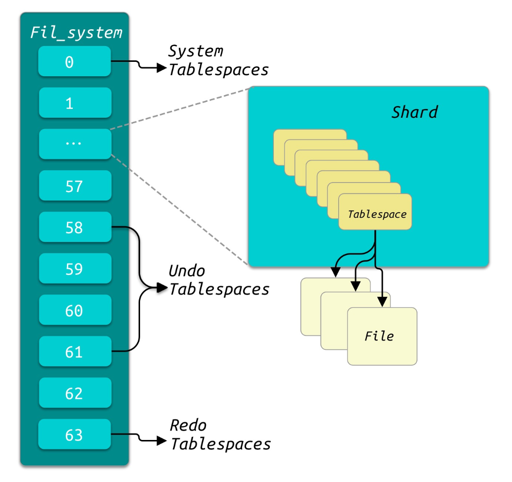

(未完待续)

  

## 参考

*   [Jeremy Cole - InnoDB](https://blog.jcole.us/innodb/)
*   [MySQL · 引擎特性 · InnoDB 文件系统之文件物理结构](http://mysql.taobao.org/monthly/2016/02/01/)
*   [InnoDB的文件组织结构](http://www.leviathan.vip/2019/04/18/InnoDB%E7%9A%84%E6%96%87%E4%BB%B6%E7%BB%84%E7%BB%87%E7%BB%93%E6%9E%84/)

