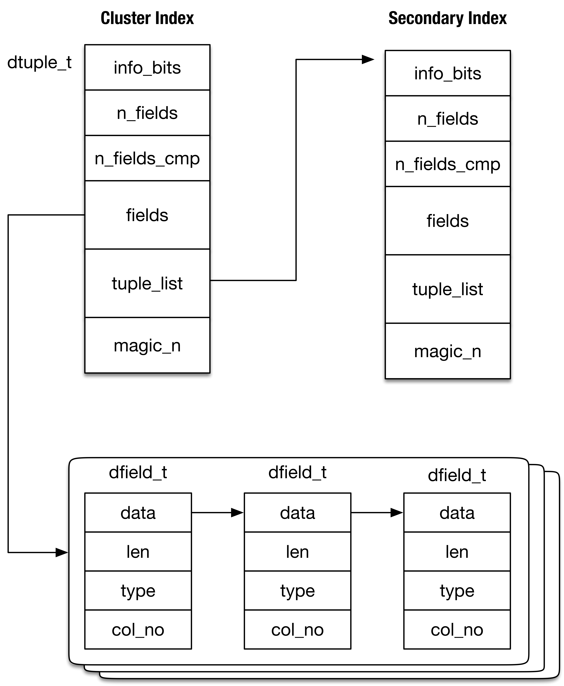

# [InnoDB（九）：Index Structure & Ops]


## 基本概念

InnoDB的数据记录分为物理记录（record）和逻辑记录（tuple），物理记录即是记录在文件中（磁盘）的存储形式。这里只考虑普通的记录，非大记录（_blob_）

### 物理记录（record）

  

  

  

即记录在磁盘文件上的格式。如上图

*   column offset list：每个列的偏移列表，包括三个系统列（**DB\_ROW\_ID** / **DB\_TRX\_ID** / **DB\_ROLL\_PTR**）
*   record header：记录头部，最后的「next record」指向下一个记录的「original offset」处
*   original offset：实际该记录数据的开始位置

```plain
CREATE TABLE t (
    t1 VARCHAR(10),
    t2 VARCHAR(10),
    t3 CHAR(10),
    t4 VARCHAR(10),
) ENGINE = InnoDB
 
INSERT INTO t VALUES ('a', 'bb', 'bb', 'ccc');
 
// hexdump ...
/* Column offset list，7个列（逆序存放）：
第一列（DB_ROW_ID）：0x00 - 0x06，左闭右开区间（0x06是第二列起始地址）、6个字节
第二列（DB_TRX_ID）：0x06 - 0x0c，6个字节
第三列（DB_ROLL_PTR）：0x0c - 0x13，7个字节
第四列（t1）：0x13 - 0x14，1个字节
第五列（t2）：...
*/
23 20 16 14 13 0c 06
00 00 10 0f 00 ba /* Record Header，6 Bytes */
00 00 00 2b 68 0b /* DB_ROW_ID */
00 00 00 00 06 53 /* DB_TRX_ID */
80 00 00 00 32 01 01 /* DB_ROLL_PTR */
61 /* t1 'a' */
62 62 /* t2 'bb' */
62 62 20 20 20 20 20 20 20 20 20 20 /* t3 'bb'，CHAR类型 */
63 63 63  /* t4 'ccc' */
```

### 逻辑记录（tuple）

                  

逻辑记录即是在内存中的代表数据行的Structure，如上图：

*   n\_fields：列的数量
*   fields：列的数组，存储每一列真实数据
*   tuple\_list：连接多个tuple（每个索引都有一个tuple，比如INSERT SQL需要向主键索引和二级索引中都插入时）

```plain
/** Structure for an SQL data field */
struct dfield_t{
    void*  data;      // 真实的列数据 
    unsigned  ext:1;  // 如果是大记录（blob），则在外部页存储
    unsigned  len:32; // 列数据的长度    
    dtype_t  type;    // 列数据的类型
};
```

### 游标（cursor）

cursor是一个逻辑的概念，表示索引中一个record的“指针”

```plain
struct btr_cur_t {
  // cursor指向的record所在的索引
  dict_index_t*  index; 
  //page_cur_t的两个成员是
  //    byte* rec;
  //    buf_block_t* block;
  // 表示cursor指向的record所在的索引页及页内的偏移量
  page_cur_t  page_cur;
  ...
  // 这四个值的意义在下一节"索引页二分查找算法的实现"讲述
  ulint      up_match;
  ulint      up_bytes;
  ulint      low_match;
  ulint      low_bytes;
  ...
}
```

## 基于B+ Tree的索引

InnoDB的索引全貌（[B+Tree index structures in InnoDB](https://blog.jcole.us/2013/01/10/btree-index-structures-in-innodb/)）：


其中：

*   树高度的定义：叶子节点是0，父节点高度是子节点高度+1
*   每一个Record由key + value组成：
    *   中间节点的key：保存的是其子节点中最小的key
    *   中间节点的value：是一个pointer（page\_no），指向子节点（可能是中间节点，可能是叶子节点）
    *   叶子节点的key：能唯一确定该数据行的若干列（对于不同索引不一样，主键列、或唯一键列、或二级索引列+主键列）
    *   叶子节点的value：其余列
*   同一高度的Page连接成“双向链表”，称作page list
*   同一Page的Record连接成“单向链表”，称作record list（按record key升序连接）。数据页内的record逻辑上相邻，物理上不一定相邻
*   Infimum record（下确界）/ supremum record（上确界）：两个系统记录（具有固定页内偏移量），为一个page内record list的头/尾节点

## InnoDB 中二分查找算法的实现

InnoDB的二分查找算法有两个输入和一个输出：

*   输入：search tuple（待查找的列）与search\_mode（查找模式）
*   输出：cursor（放置于某个物理记录）

InnoDB在B+ Tree索引页（叶子节点与中间节点）上的二分查找有四种查找模式，这四种搜索模式决定了cursor放置的位置（具体可见page\_cur\_search\_with\_match函数）

*   **PAGE\_CUR\_G（>）**：SELECT \* WHERE column > 1
    
*   **PAGE\_CUR\_GE****（>=）**：UPDATE / DELETE / SELECT \* WHERE column = 1
    
*   **PAGE\_CUR\_L****（<）**：SELECT \* WHERE column < 1
    
*   **PAGE\_CUR\_LE****（<=）**：INSERT
    

  

**但对于中间节点只使用两种模式，****PAGE\_CUR\_L / PAGE\_CUR\_LE**，转换关系在函数btr\_cur\_search\_to\_nth\_level之中

```plain
// page_mode即为中间节点使用的搜索模式
switch (mode) {
  case PAGE_CUR_GE:
      page_mode = PAGE_CUR_L;
      break;
  case PAGE_CUR_G:
      page_mode = PAGE_CUR_LE;
      break;
  default:
      page_mode = mode;
      break;
}
```

这是为什么？为什么PAGE\_CUR\_GE对应于PAGE\_CUR\_L，而不是PAGE\_CUR\_LE？

如下图，假设PAGE\_CUR\_GE对应于PAGE\_CUR\_LE，在二级索引中我们执行：

*   Trx1：SELECT >= 50

根据索引页内的二分查找算法，PAGE\_CUR\_LE的选择路径如图中红色虚线所示。导致在叶子节点既需要向左移动，有需要向右移动，这并不是一个好的做法。而如果使用PAGE\_CUR\_L也会导致问题，因为使用的模式是PAGE\_CUR\_L，会导致选择中间节点10。但此种情况下最终会将cursor置于Leaf1内的supremum record中，进而找到Leaf2。因此使用PAGE\_CUR\_L要优于PAGE\_CUR\_LE

         

这里还需要注意一个corner case。比如右图SELECT >=5，难道在root page二分查找法会选择infimum record？在每一层的最左节点都会被置一个标记REC\_INFO\_MIN\_REC\_FLAG

**问题1：为什么执行DELETE...WHERE的精确删除时仍使用PAGE\_CUR\_GE？可否使用**PAGE\_CUR\_LE？****

## Index / Table Scan

对于索引的查找分为两类：Index scan（索引扫描），Table scan（表扫描）

一次index / table scan的流程是：

1.  Server Layer：选择合适的索引（或者无合适的索引），根据WHERE条件构建search tuple
2.  **纵向**（Server Layer→ InnoDB Layer）：在索引中查找search tuple，将cursor放置于search tuple等价的record处，并"store cursor"
3.  **横向**（InnoDB Layer→ Server Layer）："restore cursor"，将cursor正向移动到下一个record，并返回给Server Layer
4.  Server Layer→ InnoDB Layer：Server Layer再通过Handler得到下一个record，直至该record不再满足WHERE条件

Server 层的实现很容易理解

5.6 版本

```plain
// function sub_select
// 循环的读数据行直至不满足查询条件
while (rc == NESTED_LOOP_OK && join->return_tab >= join_tab) {
  in_first_read = true;
   
  if (in_first_read) {
    in_first_read= false;
    // 读第一个记录：对于index scan则调用join_init_read_record
    // 一般的有两种方法rr_quick(index scan) / rr_sequential(table scan)
    error= (*join_tab->read_first_record)(join_tab);
  } else {
    // 对于范围查询，读下一条记录
    error= info->read_record(info);
  }
  // 比较获得的数据行是否满足查询条件
  evaluate_join_record(join, join_tab);
  ...
}
```

8.0 版本

```plain
IndexScanIterator::Read
  // 读满足某个 WHERE 条件的第一个记录
  |- ha_index_first
    |- index_first
      |- index_read
        // row_search_mvcc 根据传入参数的不同，大体上有两种行为：
        //  1. 由顶至下遍历 B-tree，将 cursor 放置于叶子节点的某个记录上
        //  2. 在叶子节点横向（正向/反向）移动，寻找满足某个条件的记录
        |- row_search_mvcc
  // 读满足某个 WHERE 条件的后续记录，直至不再满足
  |- ha_index_next
    |- index_next
      |- general_fetch
        |- row_search_mvcc
```

InnoDB 层的实现是通过函数 row\_search\_for\_mysql 完成的，作用是返回一个数据行给 Server 层

  


### store / restore cursor

store cursor 即是保存此时 cursor 的一些有意义的值（e.g 数据页的 modify\_clock，可供下一次的移动 cursor 之前时判断此时 cursor 指向的位置是否合法）

```plain
modify_clock的更新：当page上指向一个record的指针可能发生失效时，便更新该page的modify_clock
- btr_page_reorganize（页的重组，消除页内碎片）
- page_create
- buf_page_free_low
- buf_LRU_block_remove_hashed
- page_cur_delete_rec
- page_delete_rec_list_end（B+ Tree分裂）
```

restore cursor的意义防止cursor指向的位置**非法（e.g record 被删除）**，需要将cursor重新放置在一个正确的位置。分为四种方式：

*   【方式一】cursor置于 **user record**，将cursor恢复到 **<= user record**的位置
*   【方式二】cursor置于 **infimum record**，将cursor恢复到 **< （infimum record的后一个user record）**
*   【方式三】cursor置于 **supremum record**，将cursor恢复到 **\> （supremum record的前一个user record）**
*   【方式四】cursor置于 **B+ Tree 的第一个/最后一个 record（**infimum record或**supremum record****）**，将cursor恢复到B+ Tree的第一个****infimum record或最后一个******supremum record**********

下图展示了cursor置于user / infimum / supremum record的情况。比如Trx2正是【规则三】的反应。restore cursor时需要将cursor置于到 > supremum record的前一个user record（15），恢复完的cursor置于50。而50正是第一个>=20的数据行


**问题：【方式二】cursor能否处于一个非最左叶子节点的infimum record？**

restore cursor分为乐观方式和悲观方式，乐观方式即直接获得之前保存的cursor所在的page，如果cursor仍有效（modify\_clock未变化）。悲观的方式就是由顶至下根据前一次cursor放置的record（作为search tuple），再做一次由顶至下的查找

```plain
当page上指向一个record的指针可能发生失效时，便更新该page的modify_clock
- btr_page_reorganize（页的重组，消除页内碎片）
- page_create
- buf_page_free_low
- buf_LRU_block_remove_hashed
- page_cur_delete_rec
- page_delete_rec_list_end（B+ Tree分裂）
```

## 基于锁（latch）的并发控制

我们基于MySQL 8.0.17。在B+ tree上共有三种操作：

*   读（**BTR\_SEARCH\_LEAF** / **BTR\_SEARCH\_LEAF**）：分为点查询和范围查询
*   乐观写（**BTR\_MODIFY\_LEAF**）：仅影响到一个索引页的增删改
*   悲观写（**BTR\_MODIFY\_TREE**）：影响到超过一个索引页的增删改（e.g. DELETE SQL导致了页合并）

并发控制使用两种latch：index latch / page latch

我们再插入一些说明：数据库里的latch / lock的不同，latch与lock都可以用来完成2PL（2 Phase Locking），使用latch的是MTR，使用lock的是用户事务（Transaction）。这与latch和MTR都是物理意义的，lock与用户事务（Transaction）都是逻辑意义的相一致

### 读（**BTR\_SEARCH\_LEAF / BTR\_SEARCH\_LEAF**）


#### 点查询

1.  获得索引的S lock
2.  **由上至下**依次获取搜索路径节点的S lock，直至叶子节点
3.  释放索引和中间节点的S lock，仅保留叶子节点
4.  读叶子节点的内容 ......
5.  释放叶子节点S lock

#### 范围查询

我们知道范围查询的第一步是点查询（如SELECT id>40，先定位到记录10，然后沿着叶子节点向右扫描），在叶节点切换时，我们尤其要注意。

_向右扫描_（move\_up = true）很简单（因为符合**至左向右** latch order）：

1.  获得右兄弟S lock
2.  释放自身的S lock

_向左扫描_（move\_up = false）比较复杂，MySQL 8.0有**乐观**和**悲观**两种策略（**MySQL 5.6只使用悲观策略**）

*   **乐观的策略：释放当前页的latch，获得左兄弟的latch，并检查当前页的左兄弟是否有改动**

```plain
为了叙述方便，设当前页为P1，左兄弟为P0
```

```plain
btr_cur_optimistic_latch_leaves {
  // 这里只分析BTR_SEARCH_PREV（向左扫描）部分的代码
  // 如果P1的modify_clock发生变化，则乐观策略失败
  rw_lock_s_lock(&block->lock);
  if (block->modify_clock != modify_clock) {
    rw_lock_s_unlock(&block->lock);
    // 函数返回失败
  }
  // 获得左兄弟（P0）的page_no
  left_page_no = btr_page_get_prev(buf_block_get_frame(block), mtr);
  rw_lock_s_unlock(&block->lock);
  // 在Buffer Pool中查找左兄弟节点，并获得RW_S_LATCH
  cursor->left_block = btr_block_get(left_page_no ...)
  // IMPORTANT：再次查看P1的modify_clock是否改变，如果改变，函数返回失败
  if (buf_page_optimistic_get(P1)) {
    // P1的modify_clock未改变，判断P1的左兄弟是否仍是P0？
    if (btr_page_get_prev(P1) == left_page_no)
      // 函数返回成功
      return(true);
  }
 
  // 函数返回失败
}
```

当然，若乐观的策略失效，则再使用悲观的策略

*   **悲观的策略：**重新定位游标（由顶至下搜索一遍B+ tree）至最近一次访问的记录（open\_no\_init）。search\_mode 是 **PAGE\_CUR\_L（<）**，search\_tuple 为P1的**第一个 user record**（不是 infimum record），这样定位到的记录就是P0的最后一个 user record

### 乐观写（BTR\_MODIFY\_LEAF）

1.  获得索引的S lock
2.  **由上至下**依次获取搜索路径节点的S lock
3.  叶子节点获得**X lock**
4.  释放索引和中间节点的S lock，仅保留叶子节点
5.  修改叶子节点的内容 ......
6.  释放叶子节点**X lock**


### 悲观写（BTR\_MODIFY\_TREE）

1.  获得索引的**SX lock**
2.  **由上至下**依次获取**可能引起分裂或合并**的节点（如P1）的**X lock**
3.  依次获得叶子节点**左兄弟、自身、右兄弟**的**X lock**
4.  修改索引结构和叶子节点的内容 ......
5.  释放所有**X lock**（TODO：顺序？）


## 源码实现

索引中的查找通过四个函数实现：

*   row\_search\_for\_mysql：从InnoDB获取数据行的入口函数
*   btr\_cur\_search\_to\_nth\_level：通过对整个B+树的“二分查找”，定位到Page
*   page\_cur\_search\_with\_match：在一个Page内“二分查找”（使用Page中的Slot），定位到Record
*   cmp\_dtuple\_rec\_with\_match\_low：比较定位的Record是否是需要的Record

row\_search\_for\_mysql函数有两种使用方式，Point query / Range query。在B+ Tree中由顶至下的查找到指定的search\_tuple，并在此处放置cursor，即完成Point query。  
之后，在cursor指向的叶子节点"横向"（正向或反向）遍历进行Range query

```plain
row_search_for_mysql {
  mtr_start(mtr);
     
  // Step-1：定位 cursor。
  // 在B+ Tree中放置cursor，或restore一个已有的cursor
  if（direction != 0）
    // cursor已被置于到叶子节点内的正确位置，"restore"的意思是从Buffer Pool里拿到
    // 并*锁住*cursor指向的数据页（叶子节点）
    sel_restore_position_for_mysql
    // IMPORTANT：goto的使用使得这个函数很难梳理，比如有三个记录（10，15，20），SELECT id>=10。一个典型的其流程是：
    // 第一次调用row_search_for_mysql：
    //  1）pcur通过index scan定位到rec=10（btr_pcur_open_with_no_init）
    //  2）store pcur（btr_pcur_store_position）
    // 第二次调用row_search_for_mysql：
    //  3）restore pcur。此时pcur指向的是记录10
    //  4）goto next_rec
    //  5）goto rec_loop。此时pcur指向15
    //  6）store pcur（btr_pcur_store_position）
    // 第三次调用 ......
    goto next_rec;
  // 注：以下两种情况都是首次放置 cursor。会获取 index latch
  else if (dtuple_get_n_fields(search_tuple) > 0)
    // 用于index scan
    // 尚未放置cursor，从顶至下遍历B+ Tree，根据search_tuple放置cursor
    btr_pcur_open_with_no_init()
  else
    // 用于table scan
    // 尚未放置cursor，将cursor置于B+ Tree的一端
    btr_pcur_open_at_index_side()
 
rec_loop:
  // 得到 cursor 指向的 record
  rec = btr_pcur_get_rec(pcur)
  // 如果是点查询，比较 rec 与 search_tuple（范围查询match_mode为0）
  if (match_mode == ...) {
    if (cmp_dtuple_rec() != 0)
      // 返回错误，record不存在
      err = DB_RECORD_NOT_FOUND;
      return;
  }
 
  // Step-2：根据需求对 record 加锁（lock），或者不需要锁（MVCC）
  if (prebuilt->select_lock_type != LOCK_NONE) { 
    // 对 record 加 next-key lock 或 gap lock，防止幻读
  } else {
    // 根据不同的隔离级别，有不同的行为。
    // 1）隔离级别是 RU（read uncommitted），不做任何处理
    if (trx->isolation_level == TRX_ISO_READ_UNCOMMITTED) 
    // 2）其他隔离级别，如果索引是聚簇索引，直接构建可见的数据行版本，得到 result_rec
    else if (index == clust_index)
      row_sel_build_prev_vers_for_mysql()
    // 3）如果不是聚簇索引，那么需要根据二级索引数据行再次在聚簇索引中查找，得到 result_rec
    else ...
  }
 
  // Step-3：根据 ICP （index condition pushdown），判断该记录行是否满足条件
  // 1）不满足，直接 goto next_rec
  // 2）满足，向下执行（应该返回给 MySQL 该记录行）
  // 3）超出范围，goto idx_cond_failed
  row_search_idx_cond_check(buf, prebuilt, rec, offsets)
 
 
  // 必要的话，拿到主键索引的记录行（如果使用的是二级索引查询）
  row_sel_get_clust_rec_for_mysql 
  // result_rec 是得到的满足可见性的聚簇索引数据行
  // 是否需要 prefetch 更多的记录行？或者直接转换成 MySQL 格式
  if (record_buffer != nullptr ...) {
    // 接下来实现"cache rows"优化，暂略
  } else {
    // 将 record 转换成 MySQL 格式
    row_sel_store_mysql_rec()
  }
  // 函数成功
  err = DB_SUCCESS;
   
idx_cond_failed:
  // Step-4：保存 cursor 的实时信息（如果是聚簇索引上的点查询则无需保存）并返回给 MySQL
  if (!unique_search || !dict_index_is_clust(index) || ...)
    btr_pcur_store_position()
 
  return;
 
next_rec:
  // Step-5：将 cursor 移动到顺序的下一个 record，或前一个 record
  if (mtr_has_extra_clust_latch) {
    // 如果cursor在二级索引中，那么需要先mtr_commit(mtr)，再mtr_start(mtr)
    // 这里需要注意cursor->rel_pos这个变量
    // 在每一次得到row，更新cursor，然后返回给
  }
  if (moves_up)
    // 移动到后一个 record，如果需要则移动到后一个数据页
    btr_pcur_move_to_next()
  else 
    // 移动到前一个 record，如果需要则移动到前一个数据页（e.g cursor在当前数据页的第一个record）
    // 需要 mtr_commit(mtr)，再 mtr_start(mtr)，因为 B-tree 并发控制机制要求 latch 持有顺序是由左至右
    btr_pcur_move_to_prev()
}
```

btr\_cur\_search\_to\_nth\_level函数同时实现B+ Tree的并发控制，此处重点讲述MySQL 5.7的机制（**TODO...**）

```plain
btr_cur_search_to_nth_level（
    dict_index_t*  index,  /*!< in: index */
    ulint      level,  /*!< in: the tree level of search */
    ulint      mode,   /*!< in: PAGE_CUR_L, ...;
                Inserts should always be made using
                PAGE_CUR_LE to search the position! */
    ...)
{
    // 初始的，获得索引的根节点（space_id，page_no）
    space = dict_index_get_space(index);
    page_no = dict_index_get_page(index);
 
search_loop:
    // 循环、逐层的查找，直至达到传入的层数「level」，一般是0（即叶子节点）
    // 此处的分析忽略Change Buffer的部分
    // 从Buffer Pool或磁盘中得到索引页    
    block = buf_page_get_gen(
        space, zip_size, page_no, rw_latch, guess, buf_mode,
        file, line, mtr);
     
    // 在索引页中中查找对于指定的Tuple，满足某种条件（依赖于传入的mode，PAGE_CUR_L/PAGE_CUR_LE...）的Record
    // 将查找结果保存在page_cursor中，page_cursor结构也很简单：
    //     struct page_cur_t{
    //        byte*       rec;    /*!< pointer to a record on page */
    //        buf_block_t*    block;  /*!< pointer to the block containing rec */
    //     };
    page_cur_search_with_match(
        block, index, tuple, page_mode, &up_match, &up_bytes,
        &low_match, &low_bytes, page_cursor);
 
    if (level != height) {
        // 如果没到达指定层数，获得page_cursor（中间节点）内保存的下层节点的索引页page_no
        //注意：中间节点的Value是一个Pointer（page_no），指向子节点（中间节点或叶子节点）
        node_ptr = page_cur_get_rec(page_cursor);
        /* Go to the child node */
        page_no = btr_node_ptr_get_child_page_no(node_ptr, offsets);
         
        // 在下一层继续查找
        goto search_loop;
    }
 
    // 达到指定层数，函数退出
}
```

page\_cur\_search\_with\_match函数

```plain
page_cur_search_with_match （
    const buf_block_t* block,  /*!< in: buffer block */
    const dict_index_t* index,  /*!< in: record descriptor */
    const dtuple_t*     tuple,  /*!< in: data tuple */
    ulint           mode,   /*!< in: PAGE_CUR_L,
                    PAGE_CUR_LE, PAGE_CUR_G, or
                    PAGE_CUR_GE */
    ...)
{
    // 在索引页内查找对于指定的Tuple，满足某种条件（依赖于传入的mode，PAGE_CUR_L/PAGE_CUR_LE...）的Record
    // PAGE_CUR_G（>），PAGE_CUR_GE（>=），PAGE_CUR_L（<），PAGE_CUR_LE（<=）
    // 1. 二分查找
    // 在稀疏的Page Directory内使用二分查找
    low = 0;
    up = page_dir_get_n_slots(page) - 1;
 
    while (up - low > 1) {
        mid = (low + up) / 2;
        slot = page_dir_get_nth_slot(page, mid);
        mid_rec = page_dir_slot_get_rec(slot);
 
        // 比较mid和Tuple的大小
        cmp = cmp_dtuple_rec_with_match(tuple, mid_rec, offsets,
                        &cur_matched_fields,
                        &cur_matched_bytes);
         
        if (UNIV_LIKELY(cmp > 0)) 
            low = mid;
        else if (UNIV_EXPECT(cmp, -1)) {
            up = mid;
        ...
    }
 
    // 二分查找结束后，low和up是临近的两个slot，这两个slot指向的record记为low_rec和up_rec，满足：
    // low_rec <= tuple <= up_rec，切记tuple为待插入的（逻辑）记录
     
    // 2. 线性查找
    // 在两个相邻的Directory内，进行线性查找。线性查找的实现即不断"增大low"，"减小up"，渐渐夹逼tuple
    while (page_rec_get_next_const(low_rec) != up_rec) {
        cmp = cmp_dtuple_rec_with_match(tuple, mid_rec, offsets,
                        &cur_matched_fields,
                        &cur_matched_bytes);
    }
 
    // 线性查找结束后，low_rec和up_rec是临近的两个record，满足：
    //     low_rec <= tuple <= up_rec
    // cur_matched_fields、cur_matched_bytes是tuple与mid_rec匹配相等的列的个数与字节数
    // 注：btr_cur_t中的up_match、up_bytes是up_rec与tuple匹配相等的列的个数与字节数（同理于low_match、low_bytes）
    // 如果查找模式为PAGE_CUR_G/PAGE_CUR_GE，cursor"放于"low_rec（INSERT即为这个模式，可见cursor放于最后一个
    // 小于tuple的record位置处），否则（PAGE_CUR_L/PAGE_CUR_LE），cursor放于"up_rec"
}
```

####   
记录的插入


我们粗略的分析在乐观的INSERT SQL执行时，对数据页的插入操作流程

```plain
row_ins_clust_index_entry_low
  // 查找Record，以PAGE_CUR_LE模式（<=），即Curosr指向最后一个主键小于待插入值的Record的位置（下图中的id=3）
  // 详细见上文函数page_cur_search_with_match的分析
  |- btr_cur_search_to_nth_level
  |- btr_cur_optimistic_insert
    |- page_cur_tuple_insert
      |- page_cur_insert_rec_low
        // 从自由空间链表或未分配空间区域分配空间
        |- page_mem_alloc_heap / page_header_get_ptr(page, PAGE_FREE)
        // Insert the record in the linked list of records
        |- ......
        // 记录此次INSERT的Redo日志
        |- page_cur_insert_rec_write_log
```

用户插入的数据行，在内存中的“Structure”叫Tuple，在物理上（数据页上）的结构叫Record。Record在数据页_物理空间上是乱序存储_，通过Record头部组织成单向链表。这里有两个概念需要说明：

*   Cursor Record：即（3，C），是待插入记录的前一个记录
*   Insert Record：即（5，E），待插入的Record


这里再说明一下INSERT Redo日志的格式。如下图：

*   original offset：在上文已说明，是指 record 真实数据的起始偏移
*   extra info：用意是**对记录压缩**，即在 cursor record 的基础上，对 insert record 进行压缩，大致是如果 cursor record 和 insert record 头 N 个字节相同，则只写入 insert record 从第 N+1 字节（mismatch）到末尾的记录
    


假设插入记录时（5，E），尤其注意其中的 rec\_offset 指的是（3，C）的偏移。这样在 Crash Recovery 时回放到 INSERT redo，即会找到（3，C），将「original rec boay」，即（5，E）作为Record插入到（3，C）之后，InnoDB redo 日志是「物理逻辑」日志，**Physiological**（_**physical-to-a-page logical-within-a-page**，详见Jim Gray《Transaction Processing》10.3.6小节_），可以看到，如果执行两次INSERT Redo，会导致在数据页中有两个（5，E）记录：

*   （3，C）→ （5，E）→ （5，E）  
    

 **InnoDB Redo日志****不具有幂等性**

### 数据页的分裂

先要简单介绍一下B+ Tree分裂的方式。假设在执行INSERT INTO t VALUES(6)时引起数据页的分裂（顺序插入的情景）


分裂的方式有两种：

*   **50% - 50%算法**：将旧页50%的数据量移动到新页
*   **0% - 100%算法**：不移动旧页任何的数据，只将引起分裂的记录插入到新页

详见[从MySQL Bug#67718浅谈B+树索引的分裂优化](http://hedengcheng.com/?p=525)


  

InnoDB结合了这两种算法，数据页的分裂的函数是btr\_page\_split\_and\_insert

```plain
btr_page_split_and_insert (
    ...
    btr_cur_t* cursor /*上文的Cursor Record*/
    const dtuple_t*    tuple /*待插入的记录*/)
{
    // 1. 选择作为分裂点的记录，以及分裂方向（向左或向右）
 
    // 1.1 如果该数据页已经分裂一次（n_iterations），仍无法插入成功，则继续分裂
    if (n_iterations > 0) 
        // 向右分裂
        direction = FSP_UP;
        ...
    // 1.2 如果是顺序插入（本次插入记录在上次插入记录的右侧），采用0%-100%算法。这里需要将旧页中后面的部分记录移动到新页
    //  1）上次插入记录的下条或下下条记录是Supremum Record，从本次插入记录开始分裂
    //  2）上次插入记录的下条或下下条记录都不是Supremum Record，从下下条记录开始分裂（保留一条记录，在注释中有解释说是
    //     为了在连续插入的情景下使用自适应哈希索引，尚存疑 ...）
    else if (btr_page_get_split_rec_to_right(cursor/* 即上文的Cursor Record */, &split_rec))
        // 向右分裂
        direction = FSP_UP;
    // 1.3 如果是顺序插入（本次插入记录在上次插入记录的左侧），采用0%-100%算法。这里需要将旧页中前面的部分记录移动到新页
    //  1）Cursor Record是数据页的第一条记录（Infimum Record的下一条），从Cursor Record开始分裂
    //  2）否则从Cursor Record的下一条记录开始分裂
    else if (btr_page_get_split_rec_to_left(cursor, &split_rec))
        // 向左分裂
        direction = FSP_DOWN;
    else
    // 1.4 不是顺序插入的话，向右分裂
        direction = FSP_UP;
 
         1）如果数据页上有不止一条记录，从中间记录开始分裂
        ...
 
    // 2. 建立一个新的数据页
    new_block = btr_page_alloc(cursor->index, hint_page_no, direction,
                   btr_page_get_level(page, mtr), mtr, mtr);
    new_page = buf_block_get_frame(new_block);
 
    // 3. 获得在第一步中确定的分裂记录
    if (split_rec)
        first_rec = move_limit = split_rec;
    else
        first_rec = rec_convert_dtuple_to_rec(buf, cursor->index,
                              tuple, n_ext);
    // 4. 修改B+ Tree的结构：
    //   1）将新页加入到对应的层次
    //   2）修改上一层次（中间节点）数据页的记录的Key+Value
    // 注：中间节点的Key是Pointer指向的Page中最小的Key，Value是一个Pointer（page_no），
    //     指向子节点Page（可能是中间节点，可能是叶子节点）
    // 具体的行为是，数据页中保存着该页的层次（PAGE_LEVEL），采用btr_cur_search_to_nth_level可以查找到该层次
    btr_attach_half_pages(flags, cursor->index, block,
                  first_rec, new_block, direction, mtr);
     
    // 5. 逐个的将记录从旧页拷贝到新页
    page_move_rec_list_start ...
 
    // 6. 数据页分裂完毕，插入新纪录
    ...
}
```

### 数据页的合并

详见btr\_compress

## 参考

*   [B+Tree index structures in InnoDB](https://blog.jcole.us/2013/01/10/btree-index-structures-in-innodb/)
*   [关于innodb中查询的定位方法](https://www.jianshu.com/p/0cdd573a8232)
*   [innodb对B树游标的定位过程以及对“小于(等于)B树最小记录”的特殊处理](http://wqtn22.iteye.com/blog/1820436)
*   [MySQL：一个简单insert语句的大概流程](https://www.jianshu.com/p/5248ca67eac2)
*   [\[MySQL 源码\] Innodb Pessimistic Insert流程](https://yq.aliyun.com/articles/40991)
*   [从MySQL Bug#67718浅谈B+树索引的分裂优化](http://hedengcheng.com/?p=525)
*   [WL#6326: InnoDB: fix index->lock contention](https://dev.mysql.com/worklog/task/?id=6326)
*   [MySQL · 引擎特性 · B+树并发控制机制的前世今生](http://mysql.taobao.org/monthly/2018/09/01/)
*   [MySQL · 引擎特性 · InnoDB index lock前世今生](http://mysql.taobao.org/monthly/2015/07/05/)
*   [从MySQL Bug#67718浅谈B+树索引的分裂优化](http://hedengcheng.com/?p=525)

 
