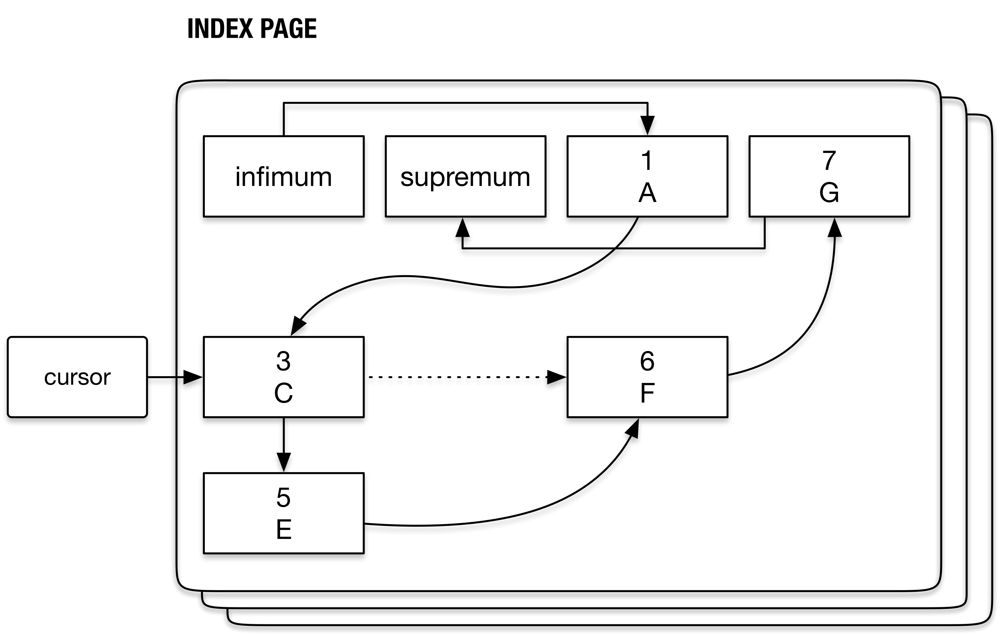

# [InnoDB（9.2）：B-tree Index]
## 持久化游标（persistent cursor）

cursor 是一个逻辑的概念，产生于对 B-tree 遍历的需求。表示在 B-tree 上遍历至某一个位置（某个 block，其上的某个 record），包括 B-tree cursor（btr\_cur\_t） 和 page cursor（page\_cur\_t）

```plain
/* The tree cursor */
struct btr_cur_t {
  dict_index_t*  index;
  page_cur_t  page_cur; // 遍历至 B-tree 的某个 page
  ulint tree_height
  ...
  // 这四个值的意义比较重要，在后文分析
  ulint      up_match;
  ulint      up_bytes;
  ulint      low_match;
  ulint      low_bytes;
  ...
}
 
/** Index page cursor */
struct page_cur_t {
  const dict_index_t *index{nullptr};
  rec_t *rec{nullptr}; /*!< pointer to a record on page */
  ulint *offsets{nullptr};
  buf_block_t *block{nullptr}; /*!< pointer to the block containing rec */
};
```

通常情况下，我们需要根据查询条件，从 B-tree 根节点开始查找到叶子节点，找到满足条件的记录（tuple）。为了减少查找的开销，InnoDB 本身做了几点优化：

1.  record buffer：对于连续的记录扫描，在满足比较严格的条件时采用 record buffer（又叫 pre-fetch queue）的方式连续读取  4 条（MYSQL\_FETCH\_CACHE\_THRESHOLD）记录，将记录格式转换成 MySQL format 存储在线程私有的 row\_prebuilt\_t::fetch\_cache 中；这样一次查找就可以获取多条记录，在 SQL 层处理完一条记录后，可以直接从 record buffer 中直接拿数据而无需再次寻路，直到record buffer 中数据取完，再进行下一轮查找。
2.  persistent cursor（持久化游标，简称 pcur）：当进入 InnoDB 层获得记录后，返回 SQL 层前，当前在 B-tree 上的 cursor 会被暂时存储到 row\_prebuilt\_t::pcur 中，当再次返回 InnoDB 层拿数据时，如果对应的 buf\_block\_t 没有发生任何修改，则可以继续沿用之前存储的 cursor（optimistic restore cursor）。否则需要重新定位（pessimistic restore cursor）

接下来我们详细介绍 pcur。pcur 是一个“有记忆”的 B-tree cursor。支持 B-tree cursor 的保存（store）和恢复（restore）。下文所指的 cursor 都是 B-tree cursor

```plain
// 持久化游标
btr_pcur_t {
  btr_cur_t m_btr_cur; // B-tree cursor
 
  buf_block_t *m_block_when_stored; // cursor 之前指向的数据页
  rec_t *m_old_rec;  // cursor 之前指向的 record 的内容
  uint64_t m_modify_clock; // m_block_when_stored modify clock
  // 如果此前 cursor 指向的是 inf 或 sup record，m_old_rec 保存的是 inf 的下一个或者 sup 的前一个 record
  // 相应的 m_rel_pos 被设置成 BTR_PCUR_BEFORE/BTR_PCUR_AFTER。否则是 BTR_PCUR_ON
  btr_pcur_pos_t m_rel_pos;
}
```

### store cursor

store cursor 即是把此时 cursor （m\_btr\_cur）的信息（record 内容，数据页地址，数据页 modify clock ...）复制给 m\_block\_when\_stored  / m\_old\_rec / m\_modify\_clock / m\_rel\_pos 等等

### restore cursor

restore cursor 就是把 cursor 重新指向 store cursor 时的位置。根据 store cursor 时的位置，分为四种 restore 方式：

1.  cursor 之前置于 **user record**，将 cursor 恢复到 **小于等于 user record** 的位置
2.  cursor 之前置于 **infimum record**，将 cursor 恢复到 **小于** **infimum record 的后一个 user record）**的位置
3.  cursor 之前置于 **supremum record**，将 cursor 恢复到 **大于（supremum record 的前一个 user record）**的位置
4.  cursor 之前置于 **B-tree 的第一个/最后一个 record（**infimum record 或 **supremum record****）**的位置，将 cursor 恢复到 B-tree 的第一个 ****infimum record 或最后一个 ******supremum record**********

restore cursor 的实现是先尝试乐观策略，失败的话再尝试悲观策略。

乐观策略 （）指的是如果 cursor 仍有效（modify clock 未变化），根据 latch mode 直接锁住之前保存的 cursor 所在的 page（m\_block\_when\_stored）。只应用于这四种 latch mode，BTR\_SEARCH\_LEAF / BTR\_MODIFY\_LEAF / BTR\_SEARCH\_PREV / BTR\_MODIFY\_PREV

悲观策略 就是由顶至下根据前一次 cursor 放置的record（search tuple），再做一次由顶至下的查找。

```plain
bool btr_pcur_t::restore_position(ulint latch_mode, mtr_t *mtr,
                                  const char *file, ulint line)
```

modify\_clock 的更新：当 page 上指向一个 record 的指针可能发生失效时，便更新该页的 modify\_clock

```plain
- btr_page_reorganize // 页的重组，消除页内碎片
- page_create // 新添加一个 B-tree 数据页
- buf_page_free_low // 释放一个数据页
- buf_LRU_block_remove_hashed // buffer pool 淘汰一个数据页
- page_cur_delete_rec  // B-tree 分裂，update SQL，purge ...
- page_delete_rec_list_end // B+ Tree 分裂
```

下图展示了 cursor 置于 user / infimum / supremum record 的情况

比如 Trx2 正是【规则三】的反映。restore cursor 时需要将 cursor 置于到 > supremum record 的前一个 user record（15），恢复完的 cursor 置于 50。而 50 正是第一个 >= 20 的数据行

  


  

在 B-tree 节点的逆序遍历，change buffer merge 以及 B-tree 通过二级索引的查找都涉及到 pcur store / restore，下面进行详细介绍

### Adjust cursor  

有可能发生 restore 之后 cursor 的位置与之前保存的并不一样（不是同一个 record），需要 adjust cursor。见函数 sel\_restore\_position\_for\_mysql

我们不禁要问，什么情况下会出现？

### 例1 - B-tree 逆序遍历

把 pcur 的位置逆序移动到下一个记录（btr\_pcur\_move\_to\_prev），如果 pcur 指向的是当前页面的 inf record 则需要逆序移动到下一个数据页（move\_backward\_from\_page），否则只需要移动到当前页面的前一个记录（move\_to\_prev\_on\_page）。我们详细说明函数 move\_backward\_from\_page。

```plain
// 将 pcur 逆序移动到下一个数据页。设当前数据页是 P1，逆序的下一个数据页是 P0
void btr_pcur_t::move_backward_from_page(mtr_t *mtr) {
  // 释放 P1 latch，因为 B-tree 叶子节点 latch 的持有顺序是正序的，逆序持有不符合 latch order
  store_position(mtr);
  mtr_commit(mtr);
  mtr_start(mtr);
 
  // latch_mode2 是 BTR_SEARCH_PREV，在 restore_position 里如果使用悲观策略，btr_search_to_nth_level 也是使
  // BTR_SEARCH_PREV
  restore_position(latch_mode2, mtr, __FILE__, __LINE__);
     
  if (prev_page_no == FIL_NULL) {
   ;
  } else if (is_before_first_on_page()) {
    // pcur 指向了 inf record，说明 restore_position 使用的是乐观策略（悲观策略的话，btr_search_to_nth_level
    // 不会定位到 inf record）。此时 pcur 指向的是 P1 inf record，但我们已经锁住了 P0 所以直接把 pcur 指向 P0 的
    // sup record。并释放 P1 latch
    prev_block = get_btr_cur()->left_block;
    btr_leaf_page_release(get_block(), old_latch_mode, mtr);
 
    page_cur_set_after_last(prev_block, get_page_cur());
  } else {
    // pcur 通过悲观策略恢复
    // 在 pcur store 时，因为 pcur 指向的是 inf record，m_old_rec 保存的是 inf 的下一个 record
    // 在 pcur restore 使用悲观策略时，search mode 是 PAGE_CUR_L，latch mode 是 BTR_SEARCH_PREV
    // 因此 pcur restore 完成后，pcur 指向的是 P0，但此额外 latch 住了 P0 的逆序的下一个数据页，要把
    // 这个数据页的 latch 释放掉
    prev_block = get_btr_cur()->left_block;
 
    btr_leaf_page_release(prev_block, old_latch_mode, mtr);
  }
}
```

#### 补充：两种策略的实现

乐观策略：释放当前页的 latch，获得左兄弟的 latch，并检查当前页的左兄弟是否有改动

```plain
btr_cur_optimistic_latch_leaves {
  // 这里只分析 BTR_SEARCH_PREV（向左扫描）部分的代码
  // 如果 P1 的 modify clock 发生变化，则乐观策略失败
  rw_lock_s_lock(&block->lock);
  if (block->modify_clock != modify_clock) {
    rw_lock_s_unlock(&block->lock);
    // 函数返回失败
  }
  // 获得左兄弟（P0）的 page no
  left_page_no = btr_page_get_prev(buf_block_get_frame(block), mtr);
  rw_lock_s_unlock(&block->lock);
  // 在 Buffer Pool 中查找左兄弟节点，并获得 RW_S_LATCH
  cursor->left_block = btr_block_get(left_page_no ...)
  // IMPORTANT：再次查看 P1 的 modify clock 是否改变，如果改变，函数返回失败
  if (buf_page_optimistic_get(P1)) {
    // P1 的 modify_clock 未改变，判断 P1 的左兄弟是否仍是 P0？
    if (btr_page_get_prev(P1) == left_page_no)
      // 函数返回成功
      return(true);
  }
 
  // 函数返回失败
}
```

当然，若乐观的策略失效，则再使用悲观的策略重新定位游标（由顶至下搜索一遍B+ tree）至最近一次访问的记录（open\_no\_init）。search\_mode 是 **PAGE\_CUR\_L（<）**，search\_tuple 为 P1 的**第一个 user record**（不是 infimum record），这样定位到的记录就是P0的最后一个 user record

### 例2 - change buffer merge

Change Buffer merge 时，apply 完一个 entry 时若该 entry 是 IBUF\_OP\_DELETE 类型，则需要 pcur store。原因在下图代码的注释中

```plain
// 把 pcur 放在 change buffer 中关于这个数据页的第一个 entry
btr_pcur_open_on_user_rec(ibuf->index, search_tuple, PAGE_CUR_GE,
                            BTR_MODIFY_LEAF, &pcur, &mtr);
 
ibuf_op_t op = ibuf_rec_get_op_type(&mtr, rec);
 
switch (op) {
  // 这是一个 purge 线程产生的 entry，ibuf_delete 会把 entry 里记录的内容（"changes"）apply 到数据页上
  // 会真正的删除数据页上的内容。因此，可能需要更新 ibuf bitmap page，ibuf bitmap page 记载着每个 page 
  // 的空闲空间。由于 change buffer 缓存的操作都是针对某个具体数据页的，因此在缓存操作时必须保证该操作不会导致
  // 空页或分裂，在决定缓存操作之前，要看 ibuf bitmap page 记载的该页的空闲空间，若会该页导致太满，则不能缓存
  case IBUF_OP_DELETE:
    ibuf_delete(entry, block, dummy_index, &mtr);
     
    // latch order 的顺序是先 Index pages 再 File system pages，持有 File system page latch（ibuf bitmap
    // page）后不能再获得 Index page latch，因此需要释放 ibuf bitmap page latch，此时的做法是直接提交 mtr，因
    // 此需要先保存 pcur
    btr_pcur_store_position(&pcur, &mtr);
    ibuf_btr_pcur_commit_specify_mtr(&pcur, &mtr);
    ibuf_mtr_start(&mtr);
  ...
}
 
// 在 change buffer 中删除这个 entry
ibuf_delete_rec(page_id.space(), page_id.page_no(), &pcur, search_tuple, &mtr)
```

### 例3 - 通过二级索引查找

在 row\_search\_mvcc 中，使用二级索引查找完成后会回溯到主键索引中再次查找，当此次查找完成后（在主键索引中拿到 record）会提交 mtr 然后再次查找二级索引，因为 latch order 是 （sunc0types.h）先拿二级索引的 latch，再拿主键索引的 latch

```plain
Secondary index tree latch    The tree latch protects also all
|         the B-tree non-leaf pages. These
V         can be read with the page only
Secondary index non-leaf    bufferfixed to save CPU time,
|         no s-latch is needed on the page.
|         Modification of a page requires an
|         x-latch on the page, however. If a
|         thread owns an x-latch to the tree,
|         it is allowed to latch non-leaf pages
|         even after it has acquired the fsp
|         latch.
V
Secondary index leaf      The latch on the secondary index leaf
|         can be kept while accessing the
|         clustered index, to save CPU time.
V
Clustered index tree latch    To increase concurrency, the tree
|         latch is usually released when the
|         leaf page latch has been acquired.
V
Clustered index non-leaf
|
V
Clustered index leaf
```

### 例4 - MySQL Server 的需要

对于索引的查找分为两类：index scan（索引扫描），table scan（表扫描）

一次 index / table scan 的典型流程是：

1.  Server 选择合适的索引（或者无合适的索引），根据 WHERE 条件构建 search tuple，首次调用 InnoDB 的接口获得下一个记录行
2.  InnoDB 在索引中自顶向下查找 search tuple，将 cursor 放置于 search tuple 等价的 record 处，并 "store cursor"
3.  Server 判断返回的记录是否满足要求，再次调用 InnoDB 的接口（handler）获得下一个记录行
4.  InnoDB restore cursor，将 cursor 正序（逆序）移动到下一个 record，并返回给 Server
5.  重复 3~4 步 ...

5.6 的实现

```plain
// function sub_select
// 循环的读数据行直至不满足查询条件
while (rc == NESTED_LOOP_OK && join->return_tab >= join_tab) {
  in_first_read = true;
   
  if (in_first_read) {
    in_first_read= false;
    // 读第一个记录：对于 index scan 则调用 join_init_read_record
    // 一般的有两种方法 rr_quick(index scan) / rr_sequential(table scan)
    error= (*join_tab->read_first_record)(join_tab);
  } else {
    // 对于范围查询，读下一条记录
    error= info->read_record(info);
  }
  // 比较获得的数据行是否满足查询条件
  evaluate_join_record(join, join_tab);
  ...
}
```

8.0 的实现

```plain
IndexScanIterator::Read
  // 读满足某个 WHERE 条件的第一个记录
  |- ha_index_first
    |- index_first
      |- index_read
        // row_search_mvcc 根据传入参数的不同，大体上有两种行为：
        //  1. 由顶至下遍历 B-tree，将 cursor 放置于叶子节点的某个记录上
        //  2. 在叶子节点横向（正向/反向）移动，寻找满足某个条件的记录
        |- row_search_mvcc
  // 读满足某个 WHERE 条件的后续记录，直至不再满足
  |- ha_index_next
    |- index_next
      |- general_fetch
        |- row_search_mvcc
```

InnoDB 层的实现是通过函数 row\_search\_mvcc 完成的，作用是返回一个数据行给 Server 层

## B-tree 查找实现

  

  

  

索引中的查找通过四个函数实现：

*   row\_search\_mvcc：从InnoDB获取数据行的入口函数
*   btr\_cur\_search\_to\_nth\_level：由顶之下的查找整个 B-tree的
*   page\_cur\_search\_with\_match：在一个数据页内“二分查找”（使用数据页中的 directory slot），定位到 record
*   cmp\_dtuple\_rec\_with\_match\_low：比较定位的 record 是否是需要的 record

row\_search\_mvcc 函数有两种使用方式，point query / range query。在 B+tree 中由顶至下的查找到指定的 search tuple，并在此处放置 cursor，即完成 point query。之后，在 cursor 指向的叶子节点"横向"（正向或反向）遍历进行 range query。源码分析：

 折叠源码

```plain
row_search_mvcc {
  mtr_start(mtr);
     
  // Step-1: 在 B-tree 中放置 cursor，或 restore 一个已有的 cursor
  // direction 是 ROW_SEL_PREV/ROW_SEL_NEXT，表示是 range scan
  if（direction != 0）
    // cursor(pcur) 之前已被放置在叶子节点内的某一位置，"restore" 的意思将 cursor 重新指向之前的位置。有两个办法：
    //  1- 乐观恢复：之前指向数据页的 modify clock （m_modify_clock）若没有改变，则可以直接 latch 住该页
    //             restore cursor 完成
    //  2- 悲观恢复：之前指向数据页的 modify clock 有改变（数据页上的记录被 reorganize，或者某些记录被删除），无法
    //             确定 pcur
    // （m_btr_cur）是否还有效，根据保存的记录（m_old_rec）来重新 traverse B-tree（row_search_to_nth_level）
    need_to_process = sel_restore_position_for_mysql
    // IMPORTANT：goto 的使用使得这个函数很难梳理，比如有三个记录（10，15，20），SELECT id >= 10。典型的其流程：
    // 第一次调用 row_search_mvcc：
    //  1）pcur 通过定位到 rec=10（btr_pcur_open_with_no_init）
    //  2）store pcur（btr_pcur_store_position）
    // 第二次调用 row_search_mvcc：
    //  3）restore pcur。此时 pcur 指向的是记录 10
    //  4）goto next_rec
    //  5）goto rec_loop，此时 pcur 指向 15
    //  6）store pcur（btr_pcur_store_position）
    // 第三次调用 ......
     
    // 一般的，sel_restore_position_for_mysql 会重新把 pcur 恢复到之前同样的记录上，这样 need_to_process 为
    // false 表示这个记录已经被处理过了，就可以 goto next_rec
    if (!need_to_process)
      goto next_rec;
  // 注：以下两种情况都是首次放置 cursor。会获取 index latch
  else if (dtuple_get_n_fields(search_tuple) > 0)
    // 用于index scan
    // 尚未放置cursor，从顶至下遍历B+ Tree，根据search_tuple放置cursor
    btr_pcur_open_with_no_init()
  else
    // 用于 table scan
    // 尚未放置cursor，将cursor置于B+ Tree的一端
    btr_pcur_open_at_index_side()
 
rec_loop:
  if (page_rec_is_infimum)
    goto next_rec
   
  if (page_rec_is_supremum)
    goto next_rec;
 
  // 得到 cursor 指向的 record
  rec = btr_pcur_get_rec(pcur)
  // 如果是点查询，比较 rec 与 search_tuple（范围查询 match_mode 为0）
  if (match_mode == ...) {
    if (cmp_dtuple_rec() != 0)
      // 返回错误，record不存在
      err = DB_RECORD_NOT_FOUND;
      return;
  }
 
  // Step-2：根据需求对 record 加锁（lock），或者不需要锁（MVCC）
  if (prebuilt->select_lock_type != LOCK_NONE) { 
    // 对 record 加 next-key lock 或 gap lock，防止幻读
  } else {
    // 根据不同的隔离级别，有不同的行为。
    // 1）隔离级别是 RU（read uncommitted），不做任何处理
    if (trx->isolation_level == TRX_ISO_READ_UNCOMMITTED) 
    // 2）其他隔离级别，如果索引是聚簇索引，直接构建可见的数据行版本，得到 result_rec
    else if (index == clust_index)
      row_sel_build_prev_vers_for_mysql()
    // 3）如果不是聚簇索引，那么需要根据二级索引数据行再次在聚簇索引中查找，得到 result_rec
    else ...
  }
 
  // Step-3：根据 ICP （index condition pushdown），判断该记录行是否满足条件
  // 1）不满足（ICP_NO_MATCH），试图得到下一个 record（goto next_rec）
  // 2）满足（ICP_MATCH），返回给 MySQL 该记录行
  // 3）超出范围（ICP_OUT_OF_RANGE），goto idx_cond_failed
  row_search_idx_cond_check(buf, prebuilt, rec, offsets)
 
  // 必要的话，拿到主键索引的记录行（如果使用的是二级索引查询）
  row_sel_get_clust_rec_for_mysql 
  // result_rec 是得到的满足可见性的聚簇索引数据行
  // 是否需要 prefetch 更多的记录行？或者直接转换成 MySQL 格式
  if (record_buffer != nullptr ...) {
    // 接下来实现"cache rows"优化，暂略
  } else {
    // 将 record 转换成 MySQL 格式
    row_sel_store_mysql_rec()
  }
     
  // 优化：使用 record buffer
  // 如果可以使用 record buffer（函数 can_prefetch_records）且 record buffer 未满，则把 record 缓存到
  // record buffer 里，然后 goto next_reocrd
  // 等到 record buffer 填满，从 record buffer 拿到最开始的 record，返回给 Server 层
  row_sel_enqueue_cache_row_for_mysql
  ...
  // 函数成功
  err = DB_SUCCESS;
   
idx_cond_failed:
  // Step-4：保存 cursor 的实时信息（如果是聚簇索引上的点查询则无需保存）并返回给 MySQL
  if (!unique_search || !dict_index_is_clust(index) || ...)
    btr_pcur_store_position()
 
  return;
 
next_rec:
  // Step-5：将 cursor 移动到顺序的下一个 record，或前一个 record
  if (mtr_has_extra_clust_latch) {
    // 如果cursor在二级索引中，那么需要先mtr_commit(mtr)，再mtr_start(mtr)
    // 这里需要注意cursor->rel_pos这个变量
    // 在每一次得到row，更新cursor，然后返回给
  }
  if (moves_up)
    // 移动到后一个 record，如果需要则移动到后一个数据页
    btr_pcur_move_to_next()
  else 
    // 移动到前一个 record，如果需要则移动到前一个数据页（e.g cursor在当前数据页的第一个record）
    // 需要 mtr_commit(mtr)，再 mtr_start(mtr)，因为 B-tree 并发控制机制要求 latch 持有顺序是由左至右
    btr_pcur_move_to_prev()
}
```

我们要注意，restore cursor 可能会出现 cursor record 已保存的不一致情况，这里会 **adjust cursor**，会把 cursor 正向或逆向移动到下一个 record（sel\_restore\_position\_for\_mysql）：

1.  cursor 之前位于 user record，restore 之后是同一 record，goto next\_rec（根据正序或逆序不同）
2.  cursor 之前位于 user record，restore 之后是不同的 record，等待处理（如果是正向移动，则移动到下一个 record（当前页或者下一个页））
3.  cursor 之前位于 sup record，等待处理。如果现在位于 user record 而且 逆向移动，则移动到前一个 record（当前页或者前一个页）
4.  cursor 之前位于 inf record  
    *   若是 optimistic restore 成功（位于 user reocrd），而且是 PAGE\_CUR\_GE 需要移动到前一个 record（当前页或者前一个页）
    *   若是 pessimistic restore 成功，位于 user record 且正向移动，则移动到下一个 record

btr\_cur\_search\_to\_nth\_level 函数同时实现 B-tree 的并发控制，在上文已阐述

 折叠源码

```plain
btr_cur_search_to_nth_level（
    dict_index_t*  index,  /*!< in: index */
    ulint      level,  /*!< in: the tree level of search */
    ulint      mode,   /*!< in: PAGE_CUR_L, ...;
                Inserts should always be made using
                PAGE_CUR_LE to search the position! */
    ...)
{
    // 初始的，获得索引的根节点（space_id，page_no）
    space = dict_index_get_space(index);
    page_no = dict_index_get_page(index);
 
search_loop:
    // 循环、逐层的查找，直至达到传入的层数「level」，一般是0（即叶子节点）
    // 此处的分析忽略Change Buffer的部分
    // 从Buffer Pool或磁盘中得到索引页    
    block = buf_page_get_gen(
        space, zip_size, page_no, rw_latch, guess, buf_mode,
        file, line, mtr);
     
    // 在索引页中中查找对于指定的Tuple，满足某种条件（依赖于传入的mode，PAGE_CUR_L/PAGE_CUR_LE...）的Record
    // 将查找结果保存在page_cursor中，page_cursor结构也很简单：
    //     struct page_cur_t{
    //        byte*       rec;    /*!< pointer to a record on page */
    //        buf_block_t*    block;  /*!< pointer to the block containing rec */
    //     };
    page_cur_search_with_match(
        block, index, tuple, page_mode, &up_match, &up_bytes,
        &low_match, &low_bytes, page_cursor);
 
    if (level != height) {
        // 如果没到达指定层数，获得page_cursor（中间节点）内保存的下层节点的索引页page_no
        //注意：中间节点的Value是一个Pointer（page_no），指向子节点（中间节点或叶子节点）
        node_ptr = page_cur_get_rec(page_cursor);
        /* Go to the child node */
        page_no = btr_node_ptr_get_child_page_no(node_ptr, offsets);
         
        // 在下一层继续查找
        goto search_loop;
    }
 
    // 达到指定层数，函数退出
}
```

page\_cur\_search\_with\_match 函数

 折叠源码

```plain
page_cur_search_with_match （
    const buf_block_t* block,  /*!< in: buffer block */
    const dict_index_t* index,  /*!< in: record descriptor */
    const dtuple_t*     tuple,  /*!< in: data tuple */
    ulint           mode,   /*!< in: PAGE_CUR_L,
                    PAGE_CUR_LE, PAGE_CUR_G, or
                    PAGE_CUR_GE */
    ...)
{
    // 在索引页内查找对于指定的Tuple，满足某种条件（依赖于传入的mode，PAGE_CUR_L/PAGE_CUR_LE...）的Record
    // PAGE_CUR_G（>），PAGE_CUR_GE（>=），PAGE_CUR_L（<），PAGE_CUR_LE（<=）
    // 1. 二分查找
    // 在稀疏的Page Directory内使用二分查找
    low = 0;
    up = page_dir_get_n_slots(page) - 1;
 
    while (up - low > 1) {
        mid = (low + up) / 2;
        slot = page_dir_get_nth_slot(page, mid);
        mid_rec = page_dir_slot_get_rec(slot);
 
        // 比较mid和Tuple的大小
        cmp = cmp_dtuple_rec_with_match(tuple, mid_rec, offsets,
                        &cur_matched_fields,
                        &cur_matched_bytes);
         
        if (UNIV_LIKELY(cmp > 0)) 
            low = mid;
        else if (UNIV_EXPECT(cmp, -1)) {
            up = mid;
        ...
    }
 
    // 二分查找结束后，low和up是临近的两个slot，这两个slot指向的record记为low_rec和up_rec，满足：
    // low_rec <= tuple <= up_rec，切记tuple为待插入的（逻辑）记录
     
    // 2. 线性查找
    // 在两个相邻的Directory内，进行线性查找。线性查找的实现即不断"增大low"，"减小up"，渐渐夹逼tuple
    while (page_rec_get_next_const(low_rec) != up_rec) {
        cmp = cmp_dtuple_rec_with_match(tuple, mid_rec, offsets,
                        &cur_matched_fields,
                        &cur_matched_bytes);
    }
 
    // 线性查找结束后，low_rec和up_rec是临近的两个record，满足：
    //     low_rec <= tuple <= up_rec
    // cur_matched_fields、cur_matched_bytes是tuple与mid_rec匹配相等的列的个数与字节数
    // 注：btr_cur_t中的up_match、up_bytes是up_rec与tuple匹配相等的列的个数与字节数（同理于low_match、low_bytes）
    // 如果查找模式为PAGE_CUR_G/PAGE_CUR_GE，cursor"放于"low_rec（INSERT即为这个模式，可见cursor放于最后一个
    // 小于tuple的record位置处），否则（PAGE_CUR_L/PAGE_CUR_LE），cursor放于"up_rec"
}
```

## B-tree SMO 实现

### 插入记录


我们粗略的分析在乐观的 INSERT SQL 执行时，对数据页的插入操作流程

 折叠源码

```plain
row_ins_clust_index_entry_low
  // 查找 record，以 PAGE_CUR_LE 模式（<=），即 curosr 指向最后一个主键小于待插入值的 record 的位置（下图中的id=3）
  // 详细见上文函数 page_cur_search_with_match 的分析
  |- btr_cur_search_to_nth_level
  |- btr_cur_optimistic_insert
    |- page_cur_tuple_insert
      |- page_cur_insert_rec_low
        // 从自由空间链表或未分配空间区域分配空间
        |- page_mem_alloc_heap / page_header_get_ptr(page, PAGE_FREE)
        // Insert the record in the linked list of records
        |- ......
        // 记录此次 INSERT 的 redo 日志
        |- page_cur_insert_rec_write_log
```

用户插入的数据行，在内存中的 structure 叫 tuple，在物理上（数据页上）的结构叫 record。record 在数据页物理空间上是乱序存储，通过 record 头部组织成单向链表。这里有两个概念需要说明：

*   cursor record：即（3，C），是待插入记录的前一个记录
*   tnsert record：即（5，E），待插入记录



这里再说明一下 INSERT redo 日志的格式。如下图：

*   original offset：在上文已说明，是指 record 真实数据的起始偏移
*   extra info：用意是**对记录压缩**，即在 cursor record 的基础上，对 insert record 进行压缩，大致是如果 cursor record 和 insert record 头 N 个字节相同，则只写入 insert record 从第 N+1 字节（mismatch）到末尾的记录
    


假设插入记录时（5，E），尤其注意其中的 rec\_offset 指的是（3，C）的偏移。这样在 Crash Recovery 时回放到 INSERT redo，即会找到（3，C），将「original rec boay」，即（5，E）作为Record插入到（3，C）之后，InnoDB redo 日志是「物理逻辑」日志，**Physiological**（_**physical-to-a-page logical-within-a-page**，详见 Jim Gray《Transaction Processing》10.3.6小节_ ），可以看到，如果执行两次 INSERT redo，会导致在数据页中有两个（5，E）记录：

*   （3，C）→ （5，E）→ （5，E）  
    

 **InnoDB Redo日志****不具有幂等性**

### 数据页的分裂

先要简单介绍一下 B+ tree 分裂的方式。假设在执行 INSERT INTO t VALUES(6) 时引起数据页的分裂（顺序插入的情景）


分裂的方式有两种：

*   **50% - 50%算法**：将旧页50%的数据量移动到新页
*   **0% - 100%算法**：不移动旧页任何的数据，只将引起分裂的记录插入到新页

详见[从MySQL Bug#67718浅谈B+树索引的分裂优化](http://hedengcheng.com/?p=525)


  

InnoDB 结合了这两种算法，数据页的分裂的函数是 btr\_page\_split\_and\_insert，大概有8个流程:

1.  从要分裂的 page 中, 找到要分裂的 record，分裂的时候要保证分裂的位置是 record 的边界
2.  分配一个新的 index page
3.  分别计算 page, 和 new page 的边界 record
4.  在父节点添加新的 index page 的 node ptr record（索引项），如果父节点没有足够的空间, 那么就触发父节点的分裂操作
5.  连接当前索引页, 当前索引页 prev\_page, next\_page, father\_page，新创建的 page。当前的连接顺序是先连接父节点, 然后是 prev\_page/next\_page, 最后是 page 和 new page
6.  将当前索引页上的部分 record 移动到新的索引页
7.  SMO 操作已经结束, 计算本次 insert 要插入的 page 位置
8.  进行 insert 操作, 如果insert 失败, 通过 reorgination page 重新尝试插入

```plain
btr_page_split_and_insert (
    ...
    btr_cur_t* cursor /*上文的Cursor Record*/
    const dtuple_t*    tuple /*待插入的记录*/)
{
    // 1. 选择作为分裂点的记录，以及分裂方向（向左或向右）
 
    // 1.1 如果该数据页已经分裂一次（n_iterations），仍无法插入成功，则继续分裂
    if (n_iterations > 0) 
        // 向右分裂
        direction = FSP_UP;
        ...
    // 1.2 如果是顺序插入（本次插入记录在上次插入记录的右侧），采用0%-100%算法。这里需要将旧页中后面的部分记录移动到新页
    //  1）上次插入记录的下条或下下条记录是 supremum record，从本次插入记录开始分裂
    //  2）上次插入记录的下条或下下条记录都不是 supremum record，从下下条记录开始分裂（保留一条记录，在注释中有解释说是
    //     为了在连续插入的情景下使用自适应哈希索引，尚存疑 ...）
    else if (btr_page_get_split_rec_to_right(cursor/* 即上文的 cursor record */, &split_rec))
        // 向右分裂
        direction = FSP_UP;
    // 1.3 如果是顺序插入（本次插入记录在上次插入记录的左侧），采用0%-100%算法。这里需要将旧页中前面的部分记录移动到新页
    //  1）cursor record 是数据页的第一条记录（infimum record 的下一条），从 cursor record 开始分裂
    //  2）否则从 cursor record 的下一条记录开始分裂
    else if (btr_page_get_split_rec_to_left(cursor, &split_rec))
        // 向左分裂
        direction = FSP_DOWN;
    else
    // 1.4 不是顺序插入的话，50%-50%算法向右分裂
        direction = FSP_UP;
 
    // 2. 建立一个新的数据页
    new_block = btr_page_alloc(cursor->index, hint_page_no, direction,
                   btr_page_get_level(page, mtr), mtr, mtr);
    new_page = buf_block_get_frame(new_block);
 
    // 3. 获得在第一步中确定的分裂记录
    if (split_rec)
        first_rec = move_limit = split_rec;
    else
        first_rec = rec_convert_dtuple_to_rec(buf, cursor->index,
                              tuple, n_ext);
    // 4. 修改 B-tree 的结构：
    //   1）将新页加入到对应的层次
    //   2）修改上一层次（中间节点）数据页的记录的Key+Value
    // 注：中间节点的 key 指向的子节点中最小的 key，value 子节点的 page no，
    //     指向子节点Page（可能是中间节点，可能是叶子节点）
    // 具体的行为是，数据页中保存着该页的层次（PAGE_LEVEL），采用 btr_cur_search_to_nth_level 可以查找到该层次
    btr_attach_half_pages(flags, cursor->index, block,
                  first_rec, new_block, direction, mtr);
     
    // 5. 逐个的将记录从旧页拷贝到新页
    page_move_rec_list_start ...
 
    // 6. 数据页分裂完毕，插入新纪录
    ...
}
```

### 数据页的合并

详见 btr\_compress

