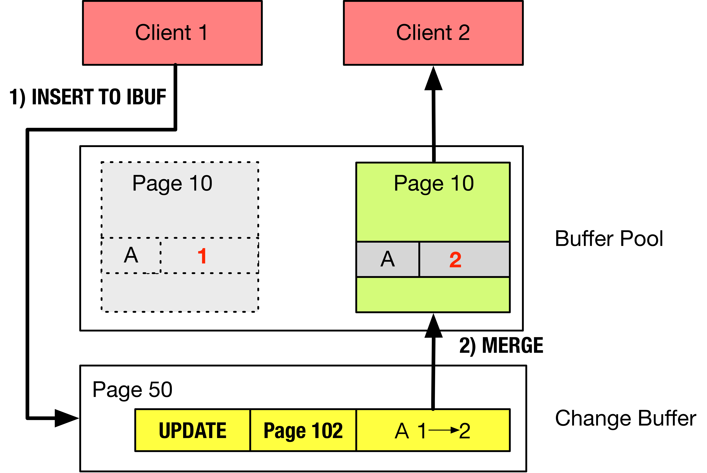
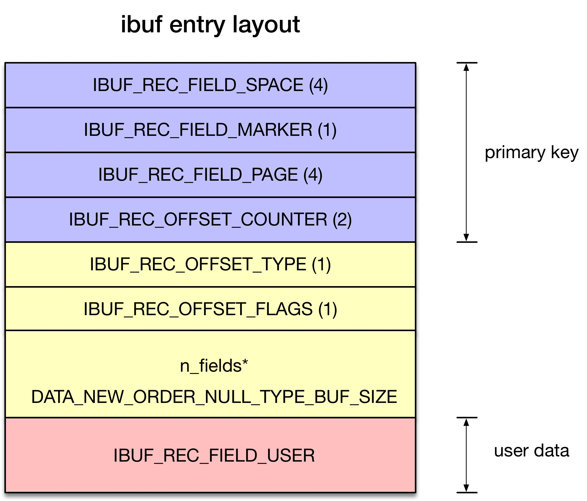
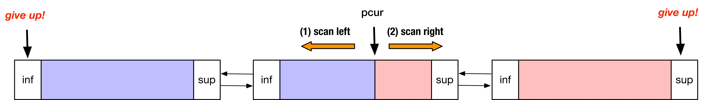
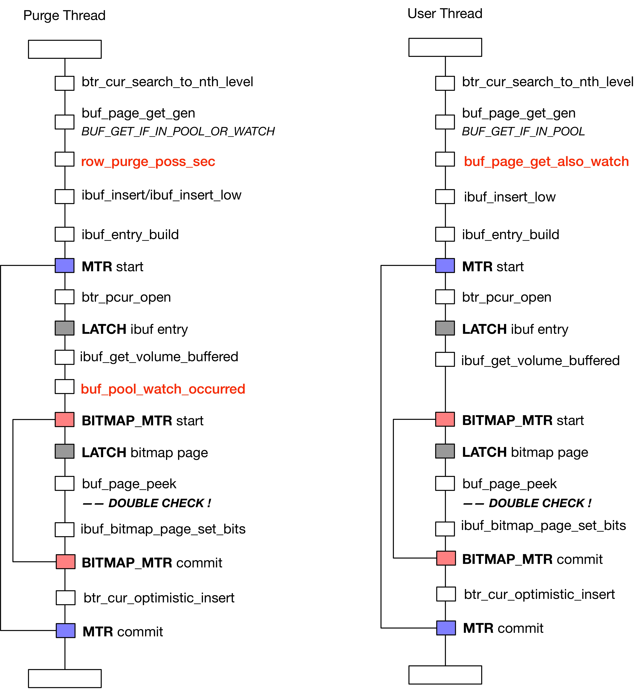
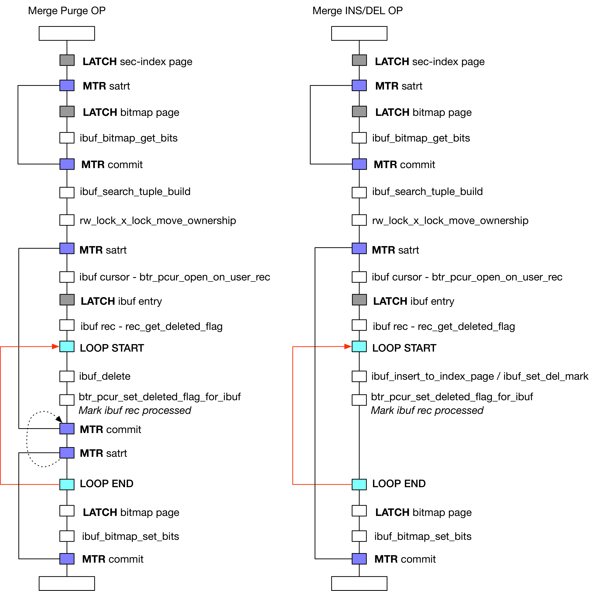

# [InnoDB（八）：Change Buffer]

## 介绍

Change Buffer（在MySQL 5.6之前叫Insert Buffer，简称 ibuf ）是 InnoDB 5.5 引入的一种优化策略，若二级索引页不在Buffer Pool 中，则暂时将针对二级索引页的操作暂时缓存起来，一定时机再批量（Batch）执行，从而达到减少随机磁盘I/O的目的。

具体一点就是：

1.  Client 1 执行写操作（e.g UPDATE），但针对的 Page 10 并不在Buffer Pool中
2.  于是 Client 1 将这个操作缓存到 Change Buffer 里，即添加一个 entry（**IBUF INSERT**）
3.  Client 2 需要读操作，将 Page 10 读到 Buffer Pool 中
4.  将 Change Buffer 里相关的缓存的操作全部合并（merge）至 Page 10（**IBUF MERGE**）
5.  将 Page 10 返回给用户线程

                       

## 组织形式- B-tree

Change Buffer 本质是一块写缓存，组织形式是 B-tree，存在于系统表空间中。其根节点位于系统表空间的第四页面（**FSP\_IBUF\_TREE\_ROOT\_PAGE\_NO**）

### ibuf entry layout

                                  

其缓存的每一个操作叫做一个 entry，物理结构是（详见 ibuf\_entry\_build）：

*   IBUF\_REC\_FIELD\_SPACE：对应二级索引页的 space id
    
*   IBUF\_REC\_FIELD\_MARKER：用于区分新旧版本的 entry 格式，目前默认值为0  
    
*   IBUF\_REC\_FIELD\_PAGE\_NO：对应二级索引页的 page no  
    
*   IBUF\_REC\_OFFSET\_COUNTER：对于同一个二级索引页，其 entry 的递增序号（**非单调递增**，详见下文）  
    
*   IBUF\_REC\_OFFSET\_TYPE：缓存的操作的类型，IBUF\_OP\_INSERT / IBUF\_OP\_DELETE\_MARK / IBUF\_OP\_DELETE
    
*   IBUF\_REC\_OFFSET\_FLAGS：待操作的用户记录格式，REDUNDANT / COMPACT
    
*   IBUF\_REC\_FIELD\_USER：用户记录

### ibuf entry counter

entry counter 的存在是为了与 space\_id 和 page\_no 一起构成 entry 的主键，在 change buffer 里对同一二级索引页的 entry，其 entry counter 是递增的

在 change buffer 中插入 entry 时，先定位到待插入的位置（btr\_pcur\_open）：

*   search tuple**: （space\_id, page\_no, 0xFFFF）**为主键
*   mode **PAGE\_CUR\_LE（<=）**模式搜索B-tree
*   latch\_mode 是 **BTR\_MODIFY\_PREV 或 BTR\_MODIFY\_TREE**

**0xFFFF**是最大的 entry counter（IBUF\_REC\_OFFSET\_COUNTER 域为两个字节），所以 cursor 会定位到对应于同一二级索引页的具有最大 counter 的 entry，记为max\_counter。max\_counter+1 即为待插入 entry 的 counter

                  

但在每一次 ibuf merge ，清空了该二级索引页的所有 entry 后，再插入针对该索引页的新的 ibuf entry，counter 又**从0开始**

### Change Buffer 的几个约束

当待操作的二级索引页不在 Buffer Pool 时，想把操作缓存在 Change Buffer 中，还需要满足一定的约束条件。Change Buffer 的约束

*   【硬约束】**如果该操作可能引起二级索引页的 SMO，则该操作不能缓存在 Change Buffer 中**

这个约束可以理解。如果针对Page 1缓存了三个 entry：entry1 / entry2 / entry3，在 ibuf merge 时，如果 entry2 使得 Page 1 发生分裂，那么 entry3 无法正确的 merge 至分裂后的Page 1（**本质原因是 ibuf entry 属于逻辑日志**）

Change Buffer 在缓存新的操作时，需要防止两种情况发生：

*   分裂：页的空间被填满
*   合并：页内只剩下一条记录（**TODO：记得是当页内空间少了一定阈值就触发页合并？**）

#### 1. 缓存的容量有上限

这是一个“软约束”，不像其他的约束会导致程序错误。

*   【软约束】Change Buffer 里针对一个 Page X 缓存的操作不能超过 Page X 大小的 1/8

通过iBuf Bitmap Page来实现（详见 [InnoDB（十三）：Tablespace Managment]），iBuf Bitmap Page 用 4 bits 描述每个 Page：

*   **IBUF\_BITMAP\_FREE**（2 bits）：描述页的空闲空间范围：0（0 Bytes）、1（ >= 512 Bytes）、2（ >= 1024 Bytes）、3（ >= 2048 Bytes）  
    
*   **IBUF\_BITMAP\_BUFFERED**（1 bit）：iBuf 中是否缓存着这个Page的操作  
    
*   **IBUF\_BITMAP\_IBUF**（1 bit）：该 Page 是否是 iBuf B-Tree 的节点

但在计算 Page X 的剩余空间时，只取下限：0 / 512 / 1024 / 2048，缓存的数据量不能超过2048 Bytes，详见下节

#### 2\. 防止页的分裂

只有在缓存 IBUF\_OP\_INSERT 时才需要防止页的分裂发生。这里涉及到一个函数 **ibuf\_get\_volume\_buffered。**该函数用于计算对于特定的二级索引页（ 设为Page X ），Change Buffer 里缓存的操作 merge 完会导致此页增长的数据量是多少（affect the available space on the page）

注意，定位待插入 ibuf entry 时，search\_mode 是 BTR\_MODIFY\_PREV 或 BTR\_MODIFY\_TREE：

*   **BTR\_MODIFY\_PREV**: X-latch 左兄弟节点 / 当前叶子节点
*   **BTR\_MODIFY\_TREE**: X-latch 左兄弟节点 / 当前叶子节点 / 右兄弟节点

  

****

  

从 pcur 开始：

*   首先向左搜索，直至得到的 ibuf entry 不再是关于Page X。若直到左兄弟节点的 infimum record 还未停止，则放弃（根据 latch order，无法再 latch 左兄弟的左兄弟）
*   然后向右搜索，直至得到的 ibuf entry 不再是关于Page X。若直到右兄弟节点的 supremum record 还未停止，则放弃（认为缓存的操作足够多了，会引起 Page X 的分裂）  
    

放弃的意思是返回 UNIV\_PAGE\_SIZE（见下面的代码分析）

```plain
buffered = ibuf_get_volume_buffered(&pcur, page_id.space(), page_id.page_no(),
                               op == IBUF_OP_DELETE ? &min_n_recs : NULL, &mtr);
if (op == IBUF_OP_INSERT) {
    ulint bits = ibuf_bitmap_page_get_bits(bitmap_page, page_id, page_size,
                                           IBUF_BITMAP_FREE, &bitmap_mtr);
    // 若 ibuf_get_volume_buffered 返回 UNIV_PAGE_SIZE，那么 if 里一定是 TRUE
    if (buffered + entry_size + page_dir_calc_reserved_space(1) >
        // 根据 IBUF_FREE_BITS 计算 Page 内的剩余空间，0 / 512 / 1024 / 2048 Bytes
        // Change Buffer 里缓存的针对 Page X 的最大容量不能超过 2048 Bytes
        ibuf_index_page_calc_free_from_bits(page_size, bits)) {
      ...
      /* It may not fit */
      goto fail_exit;
    }
}
```

在上述横向遍历的过程中，对于每一个 ibuf entry，计算其对于 Page X 的可能占用的空间。并累加该值（ibuf\_get\_volume\_buffered\_count）

ibuf\_get\_volume\_buffered\_count 里只计算 IBUF\_OP\_INSERT 的 ibuf entry

```plain
// ibuf_get_volume_buffered_count 的一部分
entry = ibuf_build_entry_from_ibuf_rec(mtr, rec, heap, &dummy_index);
volume = rec_get_converted_size(dummy_index, entry, 0);
// 占用的空间包括 record + 目录
return (volume + page_dir_calc_reserved_space(1));
```

#### 3\. 防止页的合并

依然通过函数 ibuf\_get\_volume\_buffered\_count 计算。

**TODO** n\_min\_recs 的意思是？为什么 n\_min\_recs < 2 就不能缓存 IBUF\_OP\_DELETE ？  

## 实现

在以下三种操作时，会尝试使用 ibuf：

*   BTR\_INSERT\_OP：普通的INSERT
    
*   BTR\_INSERT\_IGNORE\_UNIQUE\_OP：INSERT，但是忽略唯一键的唯一性检查（`[unique_checks](https://dev.mysql.com/doc/refman/8.0/en/server-system-variables.html#sysvar_unique_checks)置位FALSE`）
    
*   BTR\_DELETE\_OP：Purge线程发起的 DELETE，删除删除辅助索引中 delete mark 的数据行
*   BTR\_DELMARK\_OP：在用户线程执行 UPDATE 和 DELETE 中，会将记录标记为 delete mark

Change Buffer（下文简称 iBuf）的入口在函数 btr\_cur\_search\_to\_nth\_level 中

```plain
btr_cur_search_to_nth_level
{
    // 是否可以使用 ibuf？
    ibuf_should_try
    // 只针对叶子节点，在 Buffer Pool 中获取数据页失败后，尝试使用 ibuf
    // 如果此处的 buf_mode 是 BUF_GET_IF_IN_POOL_OR_WATCH（说明当前线程是 Purge 线程）
    // 需要在 buf_pool->watch 数组中加入"Sentinel Page"（详细见附录）
    buf_page_get_gen(buf_mode, ...)
  
    if（block == NULL）
        // BTR_INSERT_OP/IBUF_OP_DELETE_MARK/BTR_DELETE_OP
        switch (btr_op) {
        case BTR_INSERT_OP:
        case BTR_INSERT_IGNORE_UNIQUE_OP:
            ibuf_insert()
        case BTR_DELMARK_OP:
            ibuf_insert()
        case BTR_DELETE_OP:
            // BTR_DELETE_OP的情况要繁琐些...
            row_purge_poss_sec()
            ibuf_insert()
        ...
}
```

### Insert iBuf 流程图

函数：btr\_cur\_search\_to\_nth\_level

      

### Merge iBuf 流程图

函数：ibuf\_merge\_or\_delete\_for\_page

    

#### 补充说明

LATCH Bitmap Page：

```plain
// IN FUNCTION ibuf_insert_low
ibuf_mtr_start(&bitmap_mtr);
// 获取Bitmap Page，Bitmap Pgae携带如下信息：
// 1）iBuf中是否缓存有该Page的操作？
// 2）该Page还剩余多少空间？
bitmap_page = ibuf_bitmap_get_map_page(space, page_no,
                           zip_size, &bitmap_mtr);
// 再次检查Buffer Pool里是否已有该Page
if (buf_page_peek(space, page_no)
        || lock_rec_expl_exist_on_page(space, page_no)) {
             
        ibuf_mtr_commit(&bitmap_mtr);
        goto fail_exit;
}
  
==============================
// ibuf_bitmap_get_map_page函数由宏定义指向ibuf_bitmap_get_map_page_func
page_t*
ibuf_bitmap_get_map_page_func(
/*==========================*/
    ulint       space,  /*!< in: space id of the file page */
    ulint       page_no,/*!< in: page number of the file page */
    ulint       zip_size,/*!< in: compressed page size in bytes;
                0 for uncompressed pages */
    const char* file,   /*!< in: file name */
    ulint       line,   /*!< in: line where called */
    mtr_t*      mtr)    /*!< in: mtr */
{
    buf_block_t*    block;
    // 以BUF_GET的方式（如果Buffer Pool中未命中，去磁盘上获取）获取Bitmap Page
    // 并对Bitmap Page加锁模式为RW_X_LATCH
    block = buf_page_get_gen(space, zip_size,
                 ibuf_bitmap_page_no_calc(zip_size, page_no),
                 RW_X_LATCH, NULL, BUF_GET,
                 file, line, mtr);
    buf_block_dbg_add_level(block, SYNC_IBUF_BITMAP);
 
    return(buf_block_get_frame(block));
}
```

## 用户线程间的并发控制

设线程 Thr1 要写入的二级索引是 index X，具体的页面是 Page P1，在 ibuf 中生成的记录是 entry E，要写入到 ibuf 的页面是 Page P2

```plain
线程 Thr1 要遵守的约束是，下述的三个步骤是事务的（mini-transaction）
 Step-1: 检查到 P1 在 Buffer Pool 未命中
 Step-2: 生成 entry E
 Step-3: 写入到 P2 中
```

### 异常场景

这个约束的意义其实不难理解；比如 Step-2 时数据页被另一个线程载入在 Buffer Pool，而在 Step-3 该线程又写入 E 到 P2，直观的感觉不太对劲？我们可以列举个详细的异常场景

*   Thr 1：执行事务T1：INSERT INTO t VALUES (1, 'Alice') （插入一行记录到聚簇索引和二级索引中）
*   Thr 1：检查到 P1 不在 Buffer Pool，生成 entry E
*   Thr 2：**将 P1 从磁盘读到 Buffer Pool**
*   Thr 2：完成 P1 的 iBuf Merge
*   Thr 1：entry E 写入到 P2
*   Thr 1：事务提交。entry E 留在了 ibuf 中，还没有被 merge 到 P1
*   Thr 1：SELECT \* FROM t WHERE id=1；直接从 Buffer Pool 中返回 P1，客户端未看到刚插入的记录行（1, 'Alice'）

### 正确性证明

我们要说明上述的场景在 MySQL 5.6.23 中不会出现；先只考虑用户线程。我们假设两个线程：Thr1 写，Thr2 读

这里主要依靠两点来保证正确性：**Double Check /** **ibuf entry page's Latch**

#### Double Check

这里有很关键的一系列步骤是：

1.  在函数 btr\_cur\_search\_to\_nth\_level 中，先检查 P1 在 Buffer Pool 是否命中（buf\_page\_get\_gen）
2.  进入函数 ibuf\_insert ...
3.  持有 Latch bitmap page，**再次检查 P1 在 Buffer Pool 是否命中**（buf\_page\_peek）（**重要**）

如果没有这个 **Double Check**，事务性约束必定无法满足

#### iBuf entry page's Latch

在 Thr1 执行完上述的 **Double Check**，发现 P1 在 Buffer Pool 中未命中；此时已持有：

*   Latch1 (ibuf entry page)
*   Latch2 (bitmap page)

当然，此时 P1 依然有可能被 Thr2 读入到Buffer Pool中，载入 Buffer Pool 包含一系列过程：

*   将 P1 加入到 page hash 中
*   将 P1 使用 ibuf Merge
*   ......

我们不禁止在此时 P1 被 Thr2 加入到 page hash 中，但 Thr2 在执行将 P1 使用 ibuf Merge 时会被阻塞，因为此时 Thr2 依然需要 Latch1（ibuf entry page）

而 Latch1（ibuf entry page）已被 Thr1 持有，故 Thr2 将被阻塞

## 用户 / Purge 线程的并发控制

### Purge 线程的“误删除”隐患

Purge 的具体过程是得到根据 undo record 构造出 entry 用来在主键索引 / 二级索引中搜索记录，然后将其删除。这是一种 **逻辑的** 操作；我们不禁担忧，是否可能存在 **长的一模一样的另一个记录**，从而引发 **误删除** ？考虑这个场景：

*   CREATE TABLE t (id INT, value VARCHAR(5), PRIMARY KEY(id), KEY idx\_val(value))
*   Step-1：T1 生成（1，‘A’）。包括主键索引和二级索引
*   Step-2：T2 删除（1，‘A’）。**将（1，‘A’）标记为 delete mark**

T1 / T2 均已提交。此时 Purge 线程被唤醒，而无任何读视图，会删除 T1 / T2 所产生的 delete mark 记录和 undo 日志

在 Purge线程 执行之前，出现事务 T3 / T4 / T5…（**我们在构造 T3 "复用" T1 的记录**）:

*   Step-3：T3 再次插入（1，‘A’）。重用 T2 中（1，‘A’）的空间，去掉 delete mark 标记
*   Step-4：T4 SELECT \* FROM t WHERE value = 'A'
*   Step-5：T5 更新（1，‘A’）为（2，‘A’），**将（1，‘A’）标记为 delete mark**
*   Step-6：Purge 开始 ......

其中，二级索引中的记录（1，‘A’）有两次被标记为 delete mark：T2 / T5

而此次 Purge 需要删除T1 / T2产生的 delete mark 记录和 undo 日志，但在 Step-6 Purge 操作 **如果没有任何限制** 会把此时二级索引中的记录（1，‘A’）删除，但 Purge 本意是删除 T2 标记为 delete mark 的（1，‘A’），而不是删除 T5 标记为 delete mark  的（1，‘A’）。因为，此时的（1，‘A’）还需要被 T4 所使用（**长的一模一样的另一个记录...**）

**我们管这种现象叫做“误删除”。**那么 Purge 时是否会有什么限制来阻止这个场景的发生？

### Purge 线程不会引发 “误删除”

Purge 的执行步骤是：

```plain
row_purge_del_mark
|- row_purge_remove_sec_if_poss
  |- row_purge_remove_sec_if_poss_leaf / row_purge_remove_sec_if_poss_tree
  // 函数row_purge_poss_sec用来检查二级索引的一行记录是否可以被 Purge
  // 二级索引记录 R 不能被删除当且仅当同时满足下述两条：
  // 1）在主键索引中可以查找到对应记录
  // 2）主键索引当前版本记录 或 某个历史版本记录 中的 "二级索引列" 与 R 一致，且该版本不是 delete mark
  // 其余情况都能被删除
  |- row_purge_poss_sec
    // 该二级索引记录行是否有 delete mark
    |- rec_get_deleted_flag
      // 删除记录行 ……
      |- btr_cur_optimistic_delete
```

**没有修改主键的话，在 undo 日志里的记录是不标记 delete mark 的（见图中红色区域），原因如下：**

```plain
------ UPDATE 的简约流程如下
row_upd_clust_step // UPDATE OR DELETE聚簇索引
  |- row_upd_del_mark_clust_rec // 如果在执行 DELETE SQL，将 record标记为 delete mark
  // 以不同的方式执行UPDATE
  // 1. 修改主键
  |- row_upd_clust_rec_by_insert // DELETE MARK + INSERT 的方式
    |- btr_cur_del_mark_set_clust_rec // 将 record 标记为 delete mark
  // 2. 未修改主键（不会将 record 标记为 delete mark）
  |- row_upd_clust_rec 
    |- btr_cur_update_in_place   // 属性列长度未变化：INPLACE 的方式
    |- btr_cur_optimistic_update // 属性列长度有变化：DELETE + INSERT 的方式（注意，不是 DELETE MARK）
 
------ 生成 UPDATE undo 日志
trx_undo_page_report_modify
  // 直接将 record "info bits" 写入 undo（delete mark 是"info bits"其中的一个位）
  // 因此如果 record 没有被标记为 delete mark，undo 日志中 delete mark 位也是0
  |- rec_get_info_bits
```

**可见，未修改主键的话，不会将 record 标记为 delete mark。在生成 undo 日志时 delete mark 位（"info bits"中的一位）是0。**因此上述场景，在真正 Purge 记录时，函数 row\_purge\_poss\_sec 会返回"不可以删除"（标红的历史版本二级索引列与待删除的二级索引记录中的二级索引列一致，都是'A'，且该历史版本不是 delete mark）

###  Change Buffer 会引发 “误删除”

在用户线程 和 Purge 线程并发的插入 ibuf 时，可能会产生如下的问题

```plain
/* If a thread attempts to buffer an insert on a page while a
    purge is in progress on the same page, the purge must not be
    buffered, because it could remove a record that was
    re-inserted later.  For simplicity, we block the buffering of
    all operations on a page that has a purge pending. */
```

即如果用户线程发现Purge线程在“操作”这个页面（这个页面是"Sentinel Page"，buf\_page\_get\_also\_watch），中止此次缓存，返回“Insert iBuf”失败。为什么需要这个约束？“it could remove a record that was re-inserted later”，这句话怎么理解？即 Purge 线程缓存的操作会引发 “误删除”；在函数ibuf\_merge\_or\_delete\_for\_page中，Merge IBUF\_OP\_DELETE 时：

```plain
ibuf_merge_or_delete_for_page
|- ibuf_delete
  |- page_cur_delete_rec
    /* 3. Remove the record from the linked list of records */
    |- page_rec_set_next(prev_rec, next_rec);
    |- ...
```

**此时没有row\_purge\_poss\_sec的检查。**因此当用户线程准备缓存一个INSERT/DELETE\_MARK操作时，如果观察到Page是“Sentinal”（表明Purge线程在“操作”这个Page），如果不巧的插入到iBuf中的顺序是：

*   “用户的操作”先于“Purge的操作”，即上图中的场景；

但 iBuf Merge IBUF\_OP\_DELETE 时又没有 row\_purge\_poss\_sec 的检查，所以会导致 “误删除”

（未完待续）

## 实现

函数ibuf\_merge\_or\_delete\_for\_page

```plain
UNIV_INTERN
void
ibuf_merge_or_delete_for_page
{
loop:
    // 在iBuf中，将cursor置于对应于这个二级索引页的第一个Entry上
    btr_pcur_open_on_user_rec ...
     
    // 遍历当前iBuf索引页的record，应用每一个record至二级索引页；直至iBuf索引页分裂或者到iBuf索引页的最后一个record
    // 此时需要返回到loop处重新定位cursor
    for (;;) {
        // 这个Entry是否真是对应于这个二级索引页的？如果不是，说明该二级索引页在iBuf中并无changes
        if (ibuf_rec_get_page_no(&mtr, rec) != page_no
            || ibuf_rec_get_space(&mtr, rec) != space) {
            goto reset_bit;
        }
         
        // 针对每种操作的类型，分别对二级索引页应用相应的处理逻辑
        switch (op) {
            case IBUF_OP_INSERT:
            case IBUF_OP_DELETE_MARK:
            case IBUF_OP_DELETE:
                ...
        }
 
        // 1. 如果是乐观的删除Entry，返回到loop处
        // 2. 如果是乐观的删除Entry，cursor已经指向page的supremum记录，也返回到loop处（说明该到别的iBuf页去查找了？）
        // 3. 否则，继续遍历当前页的record
        // 注：在ibuf_delete_rec中会将cursor移动到下一个record：
        //  btr_cur_optimistic_delete_func->page_cur_delete_rec->page_cur_move_to_next
        if (ibuf_delete_rec(space, page_no, &pcur, search_tuple,
                    &mtr)) {
            /* Deletion was pessimistic and mtr was committed:
            we start from the beginning again */
 
            goto loop;
        } else if (btr_pcur_is_after_last_on_page(&pcur)) {
            ibuf_mtr_commit(&mtr);
            btr_pcur_close(&pcur);
 
            goto loop;
        }
    }
}
```

**TODO** 为什么只有在 IBUF\_OP\_DELETE 时，需要先latch ibuf bitmap page，然后 commit mtr？

## 参考

*   [innodb purge--二级索引](https://blog.csdn.net/yanzongshuai/article/details/72057508)
*   [innodb purge--聚集索引](https://blog.csdn.net/yanzongshuai/article/details/72026891)
*   [关于InnoDB中mvcc和覆盖索引查询的困惑？](https://www.zhihu.com/question/27674363)
*   [MySQL · 引擎特性 · Innodb change buffer介绍](http://mysql.taobao.org/monthly/2015/07/01/)
*   [InnoDB多版本(MVCC)实现简要分析](http://hedengcheng.com/?p=148)
*   [MySQL · 社区动态 · MySQL5.6.26 Release Note解读](http://mysql.taobao.org/monthly/2015/08/03/)

  

