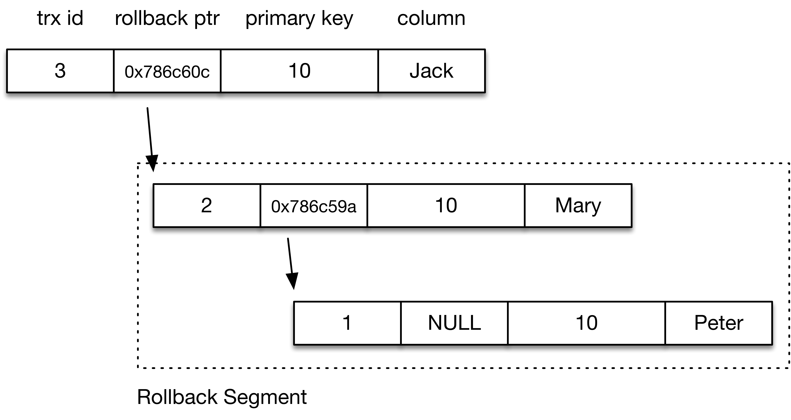
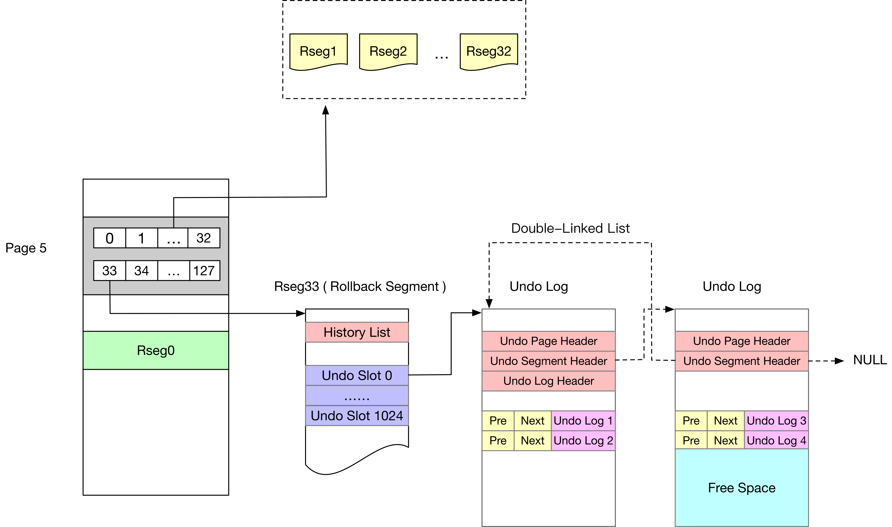

# [InnoDB（四）：Concurrency Control]


InnoDB使用Undo日志来实现MVCC（多版本并发控制）

### 事务的逻辑时间

需要先介绍一下 InnoDB 中事务的几个实现细节

```plain
// InnoDB的全局事务实例对象（trx_sys_t trx_sys），单例模式
struct trx_sys_t{
    // 本质上是一个全局ID生成器
    trx_id_t   max_trx_id; /*!< The smallest number not yet
                    assigned as a transaction id or
                    transaction number */
}
  
// 每个事务具有一个实例对象
struct trx_t{
    // 需要尤其注意id和no，分配时都是id/no = trx_sys->max_trx_id，trx_sys->max_trx_id++
    // （trx_sys_get_new_trx_id函数）可以保障全局唯一且递增
    // 1）id在事务开始时分配，全局唯一且递增，表明事务的开始顺序
    // 2）no在事务结束时分配，全局唯一且递增，表明事务的结束顺序
    // 3）全部事务的id和no组成了"无缝隙"的自然数序列1，2，3 ...
    trx_id_t   no;
    trx_id_t   id;
}
  
trx_start_low(
/*==========*/
    trx_t*  trx)        /*!< in: transaction */
{   
    // 分配事务ID
    trx->id = trx_sys_get_new_trx_id();
    if (trx->read_only) {
        ...
    } else {
        // 加入InnoDB的活跃事务列表
        UT_LIST_ADD_FIRST(trx_list, trx_sys->rw_trx_list, trx);
    }
}
```

**trx→ id和trx→ no何时赋值？**

```plain
/****************************************************************//**
Starts a transaction. */
static
void
trx_start_low(
/*==========*/
    trx_t*  trx)        /*!< in: transaction */
{
    // 设置trx->id为trx_sys->max_trx_id，然后trx_sys->max_trx_id ++
    trx->id = trx_sys_get_new_trx_id();
}
  
/****************************************************************//**
Commits a transaction and a mini-transaction. */
UNIV_INTERN
void
trx_commit_low(
/*===========*/
    trx_t*  trx,    /*!< in/out: transaction */
    mtr_t*  mtr)    /*!< in/out: mini-transaction (will be committed),
            or NULL if trx made no modifications */
{   
    // 设置trx->no为trx_sys->max_trx_id，然后trx_sys->max_trx_id ++
    trx_write_serialisation_history(trx, mtr);
}
```

### 视图

视图（ReadView）记录了某一个时刻系统事务的总体状态（Snapshot）

```plain
struct read_view_t{
    trx_id_t*  trx_ids; // 视图创建时刻InnoDB中的活跃事务的ID列表
    trx_id_t   up_limit_id; // 活跃事务列表中，最小的事务ID
    trx_id_t   low_limit_id; // 活跃事务列表中，最大的事务ID
    // low_limit_no表示创建ReadView时，所有NO.<low_limit_no的事务都已经提交
    // 因此事务NO.小于low_limit_no的事务（事务NO.表示的是事务的结束时间）的Undo日志对于当前视图已经不再需要
    // 因为事务自身的修改已对 ReadView 可见，不再需要回溯。
    // Notice：这里只给出了low_limit_no的定义，没有给出low_limit_no的计算方法
    trx_id_t   low_limit_no; 
}
```

如何计算low\_limit\_no？还有，low\_limit\_no和low\_limit\_id / up\_limit\_id是什么关系？

```plain
/*********************************************************************//**
Opens a read view where exactly the transactions serialized before this
point in time are seen in the view.
@return own: read view struct */
static
read_view_t*
read_view_open_now_low(
    // 新建一个ReadView，low_limit_no是trx_sys->max_trx_id：
     
    view = read_view_create_low(n_trx, heap);
    view->low_limit_no = trx_sys->max_trx_id;
  
    // 注意：CreateView(view)重载了运算符()
    // ut_list_map函数的执行过程：
    // 1）将当前活跃读写事务全部加入到视图的trx_ids中
    // 2）rw_trx_list是当前系统活跃的读写事务列表：
    //      2.1）选取其中最小的NO.赋值给view->low_limit_no
    //      2.2）如果rw_trx_list所有事务的NO.都是TRX_ID_MAX（都未结束），view->low_limit_no不变
    //         （trx_sys->max_trx_id）
    // 注意:
    // 1) 在事务提交时，先对NO.赋值（trx_write_serialisation_history），再将事务移除rw_trx_list
    //   （trx_commit_in_memory）。因此可能存在事务的NO.已经被赋值，但仍在rw_trx_list列表中
    // 2）NO.大于trx_sys->max_trx_id的事务还未结束
    // 3）NO.表示了事务的结束顺序      
    // 【例如】rw_trx_list={[2, MAX][5, 9]}，trx_sys->max_trx_id=15
    //      那么，view->low_limit_no=9，NO.小于9的事务有可能还没有提交吗？
    //      如果存在trx->no < 9还未提交，那么trx应该在rw_trx_list中，与9是rw_trx_list最小的NO.矛盾
    // 因此2.1和2.2保证了low_limit_no是创建ReadView时InnoDB中已提交的最大事务NO.
    ut_list_map(trx_sys->rw_trx_list, &trx_t::trx_list, CreateView(view));
    ...
}
```

【例1】考虑如下场景：


ReadView开启在**T2刚刚提交完成**：

*   max\_trx\_id是6
*   活跃事务列表是{3}

因为T3还未提交，所以T3.no = TRX\_ID\_MAX. 那么ReadView.low\_limit\_no是max\_trx\_id=6：

*   即trx.no小于6的事务在ReadView开启前已经提交（ReadView不再需要这些事物的Undo日志）

【例2】考虑如下场景：


ReadView开启在**T3提交期间，并且T3.no已赋值，并未移除出"活跃事务列表"**：

*   max\_trx\_id是7
*   活跃事务列表是{3}

ReadView.low\_limit\_no先被赋值为max\_trx\_id=7，但存在trx.no小于7的事务在ReadView开启前已经提交（T3），所以ReadView.low\_limit\_no=6：

*   即trx.no小于6的事务在ReadView开启前已经提交（T1/T2已经提交）

注：事务T3并未移除出"活跃事务列表"，表明事务对上文的ReadView并不可见，所以ReadView依然需要T3的Undo日志

## 事务可见性

这里我们以Reaptable Read隔离级别为例

InnoDB对于聚簇索引的每一行数据会增加若干个系统列，其中包括：

*   事务ID（DATA\_TRX\_ID）：修改这行数据的最后的事务ID  
    
*   回滚段指针（DATA\_ROLL\_PTR）：指向这行数据上一个版本的指针（存储在回滚段中，即Undo日志）

```sql
CREATE TABLE t (id int, name varchar(10) PRIMARY KEY(id));
INSERT INTO t VALUES (10, 'Peter');
```

【注意】**InnoDB会为每个事务分配全局递增的唯一ID**（trx\_sys\_t -> max\_trx\_id，这个字段表示系统当前还未分配的最小事务id，如果有一个新的事务，直接把这个值作为新事务的ID，然后这个字段递增即可）

数据行看起来是这样：


```sql
UPDATE TABLE t SET name='Mary' WHERE id='10';
UPDATE TABLE t SET name='Jack' WHERE id='10';
```

数据行与回滚段看起来是这样：



```sql
... 
-- After some transcations
SELECT * FROM t WHERE id='10';
```

在执行查询之前，InnoDB会保存当前**（所有）**活跃事务列表（ReadView::m\_ids，已经开始但还未提交的事务）在**ReadView**中（根据事务ID升序排列）:

*   记活跃事务列表中最大事务ID为max\_id
*   记活跃事务列表中最小事务ID为min\_id  
    

判断一行数据对一个ReadView是否可见：

【定义1】**只有在ReadView创建之前提交的事务（的变更）对于ReadView可见**

分析：

*   【1】DATA\_TRX\_ID < min\_id，**对 ReadView 可见。**说明对数据行修改的最后一个事务的结束（提交）时间早于ReadView的开始，
*   【2】DATA\_TRX\_ID > max\_id，**对 ReadView 不可见。**说明在ReadView开始后，又有新事务（MaxID）开始修改数据行，新事物的开始时间晚于ReadView的开始时间
*   【3】min\_id < DATA\_TRX\_ID < max\_id，DATA\_TRX\_ID是否在当前活跃事务列表（read\_view\_t::trx\_ids）中？
    *   【3.1】在，**对ReadView不可见。**表明数据行的修改是被创建时的活跃事务修改，
    *   【3.2】不在，**对ReadView可见**。

举个例子：ReadView={5, 6, 8}，DATA\_TRX\_ID=7

1.  DATA\_TRX\_ID开始于ReadView创建之前：因为8是活跃事务（开始于ReadView创建之前），7之前也是开始于ReadView创建之前
2.  DATA\_TRX\_ID**也结束于**ReadView创建之前：如果7没结束，ReadView里会记录

当DATA\_TRX\_ID对ReadView不可见时，需要回溯到上一个版本的数据行，并判断该数据行对ReadView是否可见（如不可见，继续回溯到再上一个版本的数据行，直至找到可见版本的数据行或者回溯完所有历史记录）

## 垃圾回收（Purge）

这里需要先介绍Undo日志：

*   【前提1】一个事务产生的所有Undo日志记录（下图中的Undo Log 1/Undo Log 2 ...）组成一个双向链表（Prev/Next指针）

  



垃圾回收涉及两个方面：

*   聚簇/辅助索引中被标记为DELETE的记录
*   History List中已经不会被任何事务需要的Undo记录（UPDATE的Undo日志在事务提交后，需要放在History List上）

### 【0】事务提交后，其 Undo日志 会如何处理？

事务提交后，其 undo 日志 **TRX\_UNDO\_STATE** 域会被置成如下一种状态：TRX\_UNDO\_CACHED / TRX\_UNDO\_TO\_FREE / TRX\_UNDO\_TO\_PURGE

```plain
trx_undo_set_state_at_finish {
  ......
  if (
      // 1. 只使用 undo log header page，没有使用 undo log normal page
      undo->size == 1 && 
      // 2. undo log header page 的使用率小于3/4
      mach_read_from_2(page_hdr + TRX_UNDO_PAGE_FREE) <
                             TRX_UNDO_PAGE_REUSE_LIMIT) {
    // undo log header page 可以重用
    state = TRX_UNDO_CACHED;
  } else if (undo->type == TRX_UNDO_INSERT) {
    // 如果是 TRX_UNDO_INSERT，直接释放
    state = TRX_UNDO_TO_FREE;
  } else {
    // 如果是 TRX_UNDO_UPDATE，放到 segment history list 上（头插法）
    state = TRX_UNDO_TO_PURGE;
  }
}
```

**TODO** 详细分析函数 trx\_undo\_insert\_cleanup / trx\_purge\_truncate\_rseg\_history

### 【1】哪些DETELE记录/History List上的Undo日志可以被删除？

垃圾回收由Purge线程完成。系统当前可能有多个读写事务/只读事务在同时进行，所以可能存在多个视图，获取**活跃的**最老的视图的low\_limit\_no：

```plain
oldest_view = UT_LIST_GET_LAST(trx_sys->view_list);
```

**【定理1】NO.小于low\_limit\_no的事务的Undo记录可以被安全的删除**

NO.<low\_limit\_no的事务在ReadView创建时已经提交，根据【定义1】，该事物产生的变更对于ReadView已经可见，因此ReadView不会回溯该事物产生的Undo日志，也即可已被删除

**【定理2】Purge线程删除的Undo日志，对应的事务一定已提交**

因为只有事务提交，相应的Undo日志才会插入到History List中

### 【2】如何删除？

事务提交后，History List类似为：


每个回滚段中维护：

*   【前提2】History List：一个回滚段中事务的按照提交顺序有序
*   【前提3】最早提交的事务：也就是History List的尾部事务

```plain
/* The rollback segment memory object */
struct trx_rseg_t{
    // 最早提交事务的信息
    ulint       last_page_no;   /*!< Page number of the last not yet
                    purged log header in the history list;
                    FIL_NULL if all list purged */
    ulint       last_offset;    /*!< Byte offset of the last not yet
                    purged log header */
    trx_id_t    last_trx_no;    /*!< Transaction number of the last not
                    yet purged log */
    ibool       last_del_marks; /*!< TRUE if the last not yet purged log
                    needs purging */
}
```

Purge线程需要获取所有回滚段（Rollback Segment）中最老的事务

**在每个回滚段中，第一个提交（最老）的事务会被加入到一个（全局）最小堆（purge\_sys->ib\_bh）中**

```plain
/****************************************************************//**
Set the transaction serialisation number. */
static
void
trx_serialisation_number_get(
/*=========================*/
    trx_t*      trx)    /*!< in: transaction */
{
    // 事务的结束时间
    trx->no = trx_sys_get_new_trx_id();
    // 将事务的回滚段按照"事务的提交时间"排序，加入到最小堆中，方便在
    rseg_queue_t  rseg_queue;
 
    rseg_queue.rseg = rseg;
    rseg_queue.trx_no = trx->no;
 
    ptr = ib_bh_push(purge_sys->ib_bh, &rseg_queue);
}
```

Purge Coordinater线程的工作方式为（srv\_purge\_coordinator\_thread）：

*   【1】弹出最小堆顶元素：全局最老的事务所在的回滚段Rseg\_min（上文已阐述，**每个回滚段的第一个提交的事务会被加入到最小堆中**）
*   【2】通过【前提3】，获得该回滚段中最老的事务T\_min（如果事务[T\_min.no](http://t_min.no/)\> oldest\_view.limit\_trx\_no，Purge结束）
*   【3】通过【前提1】，获得该事物的所有Undo日志记录，加入Purge Worker队列中
    *   Purge Worker负责解析Undo日志（e.g 找出主键索引），在聚簇/辅助索引中清理索引中DETELE\_MARK的数据行
*   【4】通过【前提2】，获取事务T的在History List前一个事务T\_next（History List采用头插法，沿着Prev指针方向事务no递增，沿着Next指针方向事务no递减，当前事务在链表尾部）
*   【5】将<Rsg\_min, [T\_next.no](http://t_next.no/)\>入堆，重复执行【1】（此时全局次小的事务可能存在于另一个回滚段中，为事务分配回滚段是采用Round-Robin算法），直至事务数量达到[innodb\_purge\_batch\_size](https://dev.mysql.com/doc/refman/8.0/en/innodb-parameters.html#sysvar_innodb_purge_batch_size)（默认值为300）
*   【6】在上述【1】-【5】执行TRX\_SYS\_N\_RSEGS（128）轮后，做一次History List中的Undo记录的清理：
    *   逐次遍历每个回滚段
    *   对于每个回滚段，遍历History List，**如果History List上的事务Undo日志已被Purge Worker线程处理（遍历事务的Undo日志，解析Undo日志，在索引里删除DELETE\_MARK记录），在History List中也可以删除**

最小堆保证每次总能取出全局的最老事务（所在的回滚段）：

      

### 删除 delete mark 记录的实现

代码分析参考[InnoDB Rollback Segment & Undo Page Deallocation实现源码分析](http://hedengcheng.com/?p=191#_Toc322972194)

```plain
srv_purge_coordinator_thread
  |- srv_do_purge
    |- trx_purge
        // 获取事务系统中最老的视图
        |- read_view_purge_open
        // 1. 聚簇索引/辅助索引中DEL_BIT=1数据记录的清理
        |- trx_purge_attach_undo_recs
          |- trx_purge_fetch_next_rec // 从History List中读取日志记录
            // 【1】从最小堆顶部弹出保存着最小事务no的回滚段
            // 【2】获得该回滚段中最老的事务T_min
            |- trx_purge_choose_next_log 
            // 【3】顺序读取当前（历史）事务的Undo日志
            |- trx_purge_get_next_rec
              // 【4】【5】 如果当前事务的Undo日志读取完毕，将History List中的前一个事务（次小）压入最小堆中
              |- trx_purge_rseg_get_next_history_log
        // 2. History List中update_undo日志记录的清理
        |- trx_purge_truncate
```

函数trx\_purge\_fetch\_next\_rec / trx\_purge\_get\_next\_rec

```plain
trx_undo_rec_t*
trx_purge_fetch_next_rec(
/*=====================*/
    roll_ptr_t* roll_ptr,   /*!< out: roll pointer to undo record */
    ulint*      n_pages_handled,/*!< in/out: number of UNDO log pages
                    handled */
    mem_heap_t* heap)       /*!< in: memory heap where copied */
{
    if (!purge_sys->next_stored)
        // 在小根堆中选择出最早提交的事务，和它所在的Rollback Segment
        trx_purge_choose_next_log
    // 返回下一个需要被Purge线程选中的Undo Record（当前所有Rseg中最早提交的事务的第一个Undo Record）
    return(trx_purge_get_next_rec ...)
}
 
 
trx_undo_rec_t*
trx_purge_get_next_rec(
/*===================*/
    ulint*      n_pages_handled,/*!< in/out: number of UNDO pages
                    handled */
    mem_heap_t* heap)       /*!< in: memory heap where copied */
{
    // 若当前事务的Undo Record已经遍历完毕
    if (offset == 0)
        // 将当前Rseg的History List中最早提交事务（非全局最小）
        // 放入到小根堆中（小根堆的作用是选出所有Rseg的最早提交事务）
        trx_purge_rseg_get_next_history_log ...
        // 选择出所有Rseg中最早提交的事务
        trx_purge_choose_next_log
 
 
    // 若当前事务的Undo Record没有遍历完毕，得到当前事务需要被Purge的Undo Record
    rec = undo_page + offset;
     
    // 这里需要"预读"出下一个需要被Purge的Undo Record（不一定是当前事务的）
    for (;;) {
 
        // rec2是"预读"出下一个Record，以下都是判断rec2是否"有用"
        if (type == TRX_UNDO_DEL_MARK_REC) {
            // DELETE SQL产生的Undo，"有用"，因为会在索引中产生"DELETE MARK"记录
            // 可以跳出循环了
            break;
        }
 
        // cmpl_info & UPD_NODE_NO_ORD_CHANGE == TRUE说明该UPDATE主键值没变，
        // 一次UPDATE的Undo记录内容是：
        // 1. 修改聚簇索引键：DELETE MARK+INSERT
        // 2. 未修改聚簇索引键:
        //   2.1 属性列长度未变化：INPLACE的方式
        //   2.2 属性列长度变化：非INPLACE，DELETE+INSERT的方式
        if ((type == TRX_UNDO_UPD_EXIST_REC)
            && !(cmpl_info & UPD_NODE_NO_ORD_CHANGE)) {
            // 此时对应于1，说明是有用的"Undo Record"，可以跳出循环了
            // 2、3是没用的"Undo Record"，因为不会产生"DELETE MARK"的记录
            break;
        }
    }
    // 注意，函数返回的是"当前的"Undo Record，不是"预读的下一个"Undo Record（rec2）
}
```

### 删除 undo log 的实现

```plain
// 删除一个 rseg 中的 undo log record
trx_purge_truncate_rseg_history
  // 由尾至头遍历 history list，即首先拿到最后一个 undo log（最老的，采用头插法，trx no 由尾至头递增）。
  // 注意 history list 上连接的是 Undo Log Header
  hdr_addr = trx_purge_get_log_from_hist(flst_get_last(rseg_hdr + TRX_RSEG_HISTORY, &mtr));
  // 在相同的数据页上得到 seg header
  seg_hdr = undo_page + TRX_UNDO_SEG_HDR; 
  // 如果
  //   1- undo log segement 上的最新的活跃事务已经提交，且状态是 TRX_UNDO_TO_PURGE
  //   2- 目前遍历到的 undo log 是该 undo log segement 的最后一个事务（已全部遍历完成）
  if ((mach_read_from_2(seg_hdr + TRX_UNDO_STATE) == TRX_UNDO_TO_PURGE) &&
      (mach_read_from_2(log_hdr + TRX_UNDO_NEXT_LOG) == 0)) 
    // 释放整个 segment
  else
    // 否则只把这个 undo log hdr 从 history list 上摘除
```

## 事务回滚

```plain
trx_rollback_for_mysql
  |- trx_rollback_for_mysql
    |- trx_rollback_for_mysql_low
      |- trx_rollback_to_savepoint_low
        |- que_run_threads // 在索引中恢复记录行（核心函数row_undo_step）
        |- trx_rollback_finish // 事务回滚完成，提交事务
          |- trx_commit
```

回滚一个事务，使得事务的Redo记录类似如下：

*   Begin T1
*   将<space\_id, page\_no, offset>处id=0，修改为id=1
*   将<space\_id, page\_no, offset>处id=1，修改为id=0（回滚事务产生的Redo记录）
*   Commit T1

因此是不需要Rollback T1类似的Redo日志类型

## 参考


2.  [MySQL · 引擎特性 · InnoDB 事务系统](http://mysql.taobao.org/monthly/2017/12/01/)
3.  [InnoDB多版本(MVCC)实现简要分析](http://hedengcheng.com/?p=148)
4.  [MySQL · 引擎特性 · InnoDB 事务系统](http://mysql.taobao.org/monthly/2017/12/01/)
5.  [InnoDB Rollback Segment & Undo Page Deallocation实现源码分析](http://hedengcheng.com/?p=191#_Toc322972194)

  

