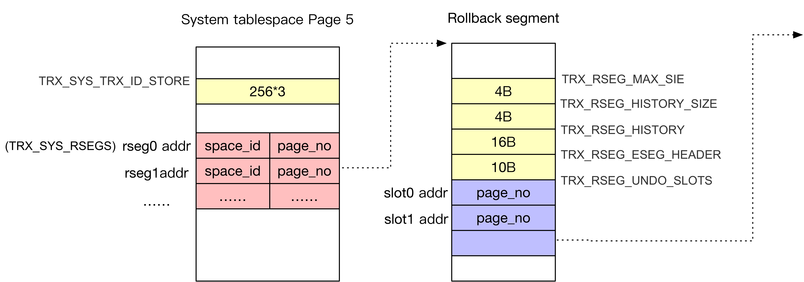
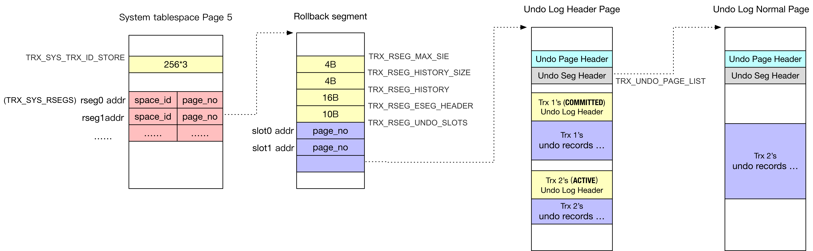
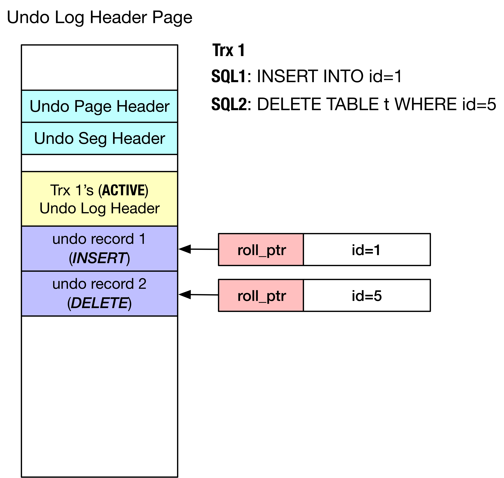
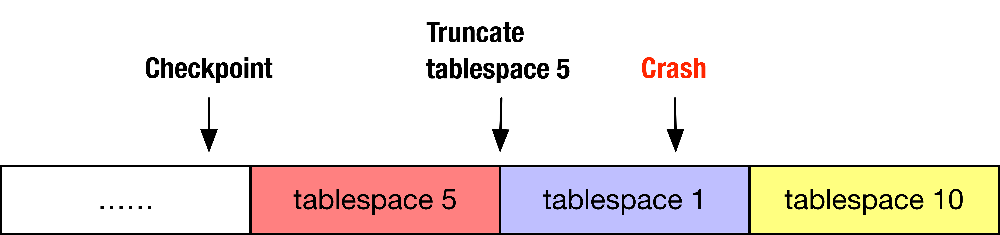

# [InnoDB（七）：Undo log]


## 介绍

事务的特性之一就是原子性，原子性的定义如下：

```plain
The ability to abort a transaction on error and have all writes from that transaction
discarded is the defining feature of ACID atomicity
```

其中 “discard” 就是通过 **使用 undo 日志回滚**（rollback）**事务** 实现的。这里着重介绍 **undo 日志的组织和如何实现事务回滚。**undo 日志的另一主要作用是实现并发控制，详见 [InnoDB（四）：MVCC & Purge]

本文介绍三个主题：

1.  undo 日志的组织
2.  使用 undo 日志实现事务回滚
3.  undo 日志的维护（truncate）

## MySQL 5.6 的组织结构

起源于系统表空间（ibdata1）的第五页面...，叫做 Transcation Syatem Header Page

```plain
#define TRX_SYS_SPACE   0   /* the SYSTEM tablespace */
#define TRX_SYS_PAGE_NO FSP_TRX_SYS_PAGE_NO
#define FSP_TRX_SYS_PAGE_NO     5   /*!< transaction system header, in tablespace 0 */
```

### 1. Transcation Syatem Header Page

系统表空间（ibdata1）第五页面

#### 存储内容

*   **TRX\_SYS\_TRX\_ID\_STORE**：InnoDB 定期持久化的事务ID  
    
*   **TRX\_SYS\_RSEGS**：128个回滚段的数组首地址；第i个回滚段位于：
    
    *   space\_id：（TRX\_SYS\_RSEGS + i \* TRX\_SYS\_RSEG\_SLOT\_SIZE） + TRX\_SYS\_RSEG\_SPACE
    *   page\_no：（TRX\_SYS\_RSEGS + i \* TRX\_SYS\_RSEG\_SLOT\_SIZE） + TRX\_SYS\_RSEG\_PAGE\_NO
        

注：TRX\_SYS\_TRX\_ID\_STORE、TRX\_SYS\_RSEGS 等指的都是在页面内的偏移量

当创建一个 Rseg，将其地址（space id, page no）记录在 **TRX\_SYS\_RSEGS** 数组中

### 2. Rollback Segment Header Page

我们在 [InnoDB（十三）：Tablespace Managment] 中提到过，Segment 是一个**逻辑**的概念，**表示存储同一类内容的数据页的集合**。这个 Rseg（Rollback Segment）表示的就是每一个 Rseg 地址指向的是一个【Rollback Segment Header Page】

#### 存储内容

*   **TRX\_RSEG\_MAX\_SIZE**（0，4字节）：该回滚段允许的最大容量（number in page）
    
*   **TRX\_RSEG\_HISTORY\_SIZE**（4，4字节）：在 History List 中，事务所占用的容量（number in page）
*   **TRX\_RSEG\_HISTORY**（8，16字节）：History List 链表首地址
*   **TRX\_RSEG\_FSEG\_HEADER**（24，10字节）：参考 [InnoDB（十三）：Tablespace Managment]，用于记录 Segment 申请的 INODE Entry
*   **TRX\_RSEG\_UNDO\_SLOTS**（34，1024\*4字节）：该回滚段的1024个 Slot 数组首地址，每个 Slot 占用4字节



  

在内存中被记录在 trx\_sys->rseg\_array 数组中

  

### 3\. Undo Log Header Page

**每一个事务的 Undo 日志其实都是一个 FSP Segment**，其第一个页就是【Undo Log Header Page】

每一个 Slot 地址指向的就是一个【Undo Log Header Page】（注意是“Header Page”（是一个Page），不是“Page Header”（是一个Header））

*   是存储 Undo Record 的页面类型之一（另一个为 **Normal Undo Page**）
*   每一个 Undo Log Header Page 同一时刻只隶属于**同一活跃事务。**Undo Log Header Page 可以同时保存**若干个已提交事务+一个活跃事务**
*   每一个 Undo Log Header Page 同一时刻要么是 “TRX\_UNDO\_INSERT”（只保存INSERT产生的Undo Record），要么是 “TRX\_UNDO\_UPDATE”（只保存UPDATE/DELETE产生的Undo Record）；主要是为了分类回收
*   一个事务如果既有INSERT又有UPDATE/DELETE，那么会占有两个 Undo Log Header Page（也即占有两个 Slot）

每个 Undo Log Header Page 独占一个 File Segment（分配 INODE entry，有若干个 Extent List ...）

存储内容：

*   Undo Page Header：每一个存放 undo log 的数据页都有的 header
*   Undo Segment Header：只有一个 undo log segment 才有的 header，对应于使用该 undo log segment 的事务
*   若干“事务级别”Header：其中每一个事务都由“【Undo Log Header】 + 日志记录内容”组成

#### Undo Page Header（TRX\_UNDO\_PAGE\_HDR）

*   **TRX\_UNDO\_PAGE\_TYPE**（0，2字节）：类型；使用该页的事务的类型。TRX\_UNDO\_INSERT / TRX\_UNDO\_UPDATE
*   **TRX\_UNDO\_PAGE\_START**（2，2字节）：（时间上）最近一个事务的 undo 日志记录起始地址
    
*   **TRX\_UNDO\_PAGE\_FREE**（4，2字节）：当前页面空闲的起始地址，使用该页的事务从这个位置开始写 undo log record
    
*   **TRX\_UNDO\_PAGE\_NODE**（6，12字节）：对于同一个 Slot 下的【Undo Log Header Page】和【Normal Undo Page】构成的双向链表，双向链表的“中间节点”
    

#### Undo Segment Header（TRX\_UNDO\_SEG\_HDR）

```plain
/** The offset of the undo log segment header on the first page of the undo
log segment */
#define TRX_UNDO_SEG_HDR  (TRX_UNDO_PAGE_HDR + TRX_UNDO_PAGE_HDR_SIZE)
```

描述这个 FSP Segment，我们曾说过，Segment 的第一个页往往由调用者存放着这一类数据页的描述信息

*   **TRX\_UNDO\_STATE**（18，2字节）：此 Segment 状态，TRX\_UNDO\_ACTIVE ...
*   **TRX\_UNDO\_LAST\_LOG**（20，2字节）：当前页面的最后一条Undo日志记录的【Undo Log Header】
    
*   **TRX\_UNDO\_FSEG\_HEADER**（24，10字节）：见下文 “事务的开始与提交”
    
*   **TRX\_UNDO\_PAGE\_LIST**（34，16字节）：对于同一个Slot下的【Undo Log Header Page】和【Normal Undo Page】构成的双向链表的“首节点”
    

#### Undo Log Header

每个事务都有一个 Undo Log Header，当（UPDATE/DELETE）事务结束后，Undo Log Header被加入到 History List 中。**注：Undo Log Header 仅存在于** **Undo Log Header Page 上**

*   **TRX\_UNDO\_TRX\_ID**（0，8字节）：事务ID（事务开始的逻辑时间）
    
*   **TRX\_UNDO\_TRX\_NO**（8，8字节）：事务NO.（事务结束的逻辑时间）
*   **TRX\_UNDO\_DEL\_MARKS**（16，2字节）：如果事务可能造成“DELETE MARK”某个索引记录
*   **TRX\_UNDO\_LOG\_START**（18，2字节）：此事务中第一个 undo record 的偏移
    
*   **TRX\_UNDO\_XID\_EXISTS**（20，1字节）：Undo Log Header 中是否 XID？
    
*   **TRX\_UNDO\_DICT\_TRANS**（21，1字节）：事务是否是"create table"/"create index or drop"？ 
    
*   **TRX\_UNDO\_TABLE\_ID**（22，8字节）：如果TRX\_UNDO\_DICT\_TRANS是TRUE，保存的是table\_id
    
*   **TRX\_UNDO\_NEXT\_LOG**（30，2字节）：当前 Page（Undo Log Header Page）的下一个 Undo Log Header
    
*   **TRX\_UNDO\_PREV\_LOG**（32，2字节）：当前 Page（Undo Log Header Page）的上一个 Undo Log Header
    
*   **TRX\_UNDO\_HISTORY\_NODE**（34，6字节）：指向 History List 中下一个 Page（Undo Log Header Page）
    

### 4\. Undo Log Normal Page

当活跃事务产生的 undo record 超过 Undo Log Header Page 容量后，单独再为此事务分配 Normal Undo Page（trx\_undo\_add\_page）

*   实际存储 undo records 的页面类型之一（另一个是 Undo Log Header Page）
*   Normal Undo Page 只隶属于一个事务
*   包含 Undo Page Header 和 Undo Segment Header
*   不包含 Undo Log Header，只是存储“溢出”的 undo records



### 5\. Undo Record

每个 undo record对应于事务修改（IUD）的一个数据行：

*   undo record 的**最前两个字节为 next pointer**，**最后两个字节为 prev pointer**，组成双向链表（_**TODO**_：每个事务？）

这里有必要再介绍下 IUD（INSERT / UPDATE / DELETE）操作在 undo 日志中记录的内容

#### 1. INSERT SQL

*   记录（全部）主键列的值

#### 2\. UPDATE SQL（IN-PLACE）

**未修改**主键索引列，并且所修改的列长度**未发生变化**

*   原记录的系统列 (DB\_TRX\_ID, ROLLBACK\_PTR, ...);
    
*   原记录的主键列;
    
*   UPDATE 列的前镜像;
    
*   若 UPDATE 列中包含二级索引列，则将二级索引其他未修改列;
    

最后一步的目的是在事务回滚时能构建出二级索引 Entry 的**前镜像**

#### 3\. UPDATE SQL（DELETE MARK + INSERT）

**修改**主键索引列

*   旧记录进行 delete mark 操作，写入 delete mark 操作的 undo record;
    
*   新纪录插入聚簇索引，写入 INSERT 操作 undo record;
    

#### 4\. UPDATE SQL（DELETE + INSERT）

**未修改**主键索引列，并且所修改的列长度**发生变化**

*   当前记录的系统列 (DB\_TRX\_ID, ROLLBACK\_PTR, ...);
    
*   当前记录的主键列;
    
*   当前Update列的前镜像;
    
*   若Update列中包含二级索引列，则将二级索引其他未修改列;
    

#### 4\. DELETE SQL

*   记录的系统列（DB\_TRX\_ID,ROLLBACK\_PTR ... ）
    
*   记录的主键列
    
*   记录的所有辅助索引列
    
    Purge 线程根据每个索引的"索引列+主键列"构建出 Entry，在每个辅助索引中真正的删除该数据行（猜想：如果单纯的为了实现事务回滚并不需要记录）
    

### Rollback Pointer（roll\_ptr）

每个数据行的 roll\_ptr 指向的是修改该记录的 SQL语句所产生的 undo record

              

### 一些补充

1\. Rseg slot 的内容

 Rseg 中每个 slot 都有四个字节：

*   如果该 slot 被某个活跃事务所占用，存储的是该活跃事务的 Undo Log Header Page 的 page no
*   如果该 slot 没被任何活跃事务占用，存储的是 FIL\_NULL（0xFFFFFFFF）

2\. 只有 Undo Log Header Page 上的最后一个事务可以有 Normal Undo Page

```plain
UNIV_INTERN
page_t*
trx_undo_set_state_at_finish(
/*=========================*/
    trx_undo_t* undo,   /*!< in: undo log memory copy */
    mtr_t*      mtr)    /*!< in: mtr */
{
    // 当Undo Log Header Page的剩余空间大于UNIV_PAGE_SIZE*1/4时，可以被"复用"
    if (undo->size == 1
        && mach_read_from_2(page_hdr + TRX_UNDO_PAGE_FREE)
           < TRX_UNDO_PAGE_REUSE_LIMIT) {
 
        state = TRX_UNDO_CACHED;
    }
    ...
}
```

## MySQL 8.0 的组织结构

在 MySQL 5.7/8.0 中支持独立的 undo tablespace，5.6 的 rollback seg 只隶属于系统表空间，而 8.0 的 rollback seg 可以隶属于独立的 undo 表空间。在系统表空间中第五页面来追踪创建的 rollback seg，在独立的 undo tablespace 中第三个数据页（FSP\_RSEG\_ARRAY\_PAGE\_NO，叫做 RSEG\_ARRAY page）来追踪创建的 rollback seg

*   独立的 undo tablespace 个数是 srv\_undo\_tablespaces（默认是 2，最大 127）
*   每个 undo tablespace 中 rollback seg 个数是 srv\_rollback\_segments（默认是 128）

```plain
// 在指定的 tablespace 创建一个 rseg，与 5.6 在系统表中创建一个 rseg 无异
trx_rseg_create
  |- trx_rseg_header_create
    // Step-1：在指定的 tablespace 创建一个 seg
    |- fseg_create
      |- fsp_get_space_header // 获得 FSP header
      |- fsp_alloc_seg_inode  // 为待创建的 seg 分配一个 INODE entry
      // 为待创建的 seg 分配第一个数据页，这里存放 FSEG header。偏移由调用者指定
      // FSEG header 里的保存的是 INODE entry 的位置（space id, page no, offset）
      // seg 第一个数据页里的内容也由调用者指定
      |- fseg_alloc_free_page_low
  // Step-2：设置 1024（NULLTRX_RSEG_UNDO_SLOTS，1K） 个 slot 的数组为 NULL 
  |- trx_rsegf_set_nth_undo
  // Step-3：将 undo tablespace 里所有的 rseg 都记录到 RSEG_ARRAY page 的一个数组中（RSEG_ARRAY_PAGES_OFFSET）
  |- trx_rsegsf_set_page_no
```

## Undo 日志的分配

这里包括 分配 rseg（回滚段） 和 分配 undo log seg

### 分配 rseg

为事务分配一个 rseg 由函数 trx\_assign\_rseg\_durable 实现，在**事务开始**（trx\_start\_low）或切换为**读写事务**时（trx\_set\_rw\_mode）分配。采取的策略是 round-robin：

```plain
/* Traverse the rsegs like this: (space, rseg_id)
    (0,0), (1,0), ... (n,0), (0,1), (1,1), ... (n,1), ... */
```

具体点是：

1.  采用 round-robin 的轮询方式分配 rseg，如果 rseg 被标记为 inactive（等待被 truncate），则跳到下一个；
2.  选择完 rseg 后，将该回滚段的 `rseg->trx_ref_count`递增，这样该 rseg 所在的 undo tablespace 文件就不可以被 truncate

临时表事务的 rseg 保存在 `trx->rsegs->m_noredo`，普通表事务的 rseg 保存在 `trx->rsegs->m_redo`

### 分配 undo log seg

在修改数据页之前，需要通过 undo 日志的形式记录修改记录的当前版本（前镜像，before image）以支持事务回滚和并发控制（MVCC）。准备写 undo 日志之前（trx\_undo\_report\_row\_operation）会被其分配 undo log seg（并且 INSERT 和 DELETE / UPDATE 分开记）

```plain
trx_undo_assign_undo
  // Step-1：首先在 rseg→update_undo_cached 或 rseg→insert_undo_cached 上分配 trx_undo_t。trx_undo_t 与一个 undo log 
  // segment 一一映射。在 InnoDB（四）：Concurrency Control 中写到，当事务提交时，若只使用 undo log header page 且 undo 
  // log header page 的使用率小于 3/4 则根据其类型（INSERT 或 DELETE / UPDATE ）将其（trx_undo_t）放到 
  // rseg→update_undo_cached 或 rseg→insert_undo_cached
  |- trx_undo_reuse_cached
 
  // Step-2：如果上述的 list 为空，则创建一个新的 undo log seg
  |- trx_undo_create
    // 创建一个新的 undo log seg，同时初始化 undo page header 和 undo segment header
    |- trx_undo_seg_create
      // 在 rseg 的 Rollback Segment Header Page 的 TRX_RSEG_UNDO_SLOTS 数组中找到一个空闲（NULL）的 slot 指向 undo log
      // seg 的 Segment Header Page（一个 rseg 可以支持 1024 个并发的事务，如果达到上限值，会返回 DB_TOO_MANY_CONCURRENT_
      // TRXS）
      |- trx_rsegf_undo_find_free
    // 初始化 undo log header
    |- trx_undo_header_create
    // 创建 trx_undo_t 结构体
    |- trx_undo_mem_create 
 
  // Step-3：加入到 rseg 内存结构体的 insert_undo_list 或 update_undo_list 中
  |- UT_LIST_ADD_FIRST(rseg->insert_undo_list, undo);
  |- UT_LIST_ADD_FIRST(rseg->update_undo_list, undo);
```

## 多版本并发控制和 Undo 日志的回收

见 [InnoDB（四）：Concurrency Control]

## 事务回滚

**undo 日志属于"逻辑日志"，回滚时根据 undo 日志的内容执行 "反向操作"**

#### **INSERT的回滚**

以INSERT的回滚为例。假设场景为：

```sql
1. CREATE TABLE t VALUES (id int, name varchar(20), score int, primary key(id), key(name)) ENGINE=InnoDB;
2. T1：BEGIN;
3. T1：INSERT INTO t VALUES (1, 'Peter', 100)
[CRASH ...]
```

在数据库启动时，Crash Recovery时会**回滚活跃的事务**（[InnoDB（三）：Crash Recovery]

INSERT会把数据行（Tuple）的主键列（可能不止一列）全部写入Undo日志。首先会根据Undo日志在二级索引中删除该数据行（1, 'Peter', 100），其次在聚簇索引中删除该数据行

```plain
row_undo_ins    
  |- row_undo_ins_parse_undo_rec
    |- row_undo_search_clust_to_pcur
      // 根据在 undo 日志中保存的主键列，在聚簇索引中搜索该数据行；如果没找到，则返回 "回滚成功"
      |- row_search_on_row_ref
  |- row_undo_ins_remove_sec_rec
    // 根据二级索引的索引列（即例子中的'name'），与主键列拼接成二级索引的Entry（索引列 + 主键列）
    |- row_build_index_entry
  // 直接删除之前定位到的数据行
  // 写 redo 日志，MLOG_COMP_REC_DELETE / MLOG_REC_DELETE
  |- row_undo_ins_remove_clust_rec
```

#### 逻辑的 undo日志 回滚的异常

因为 undo 日志属于"逻辑日志"，根据 undo 日志我们执行的是"反向操作"（而物理日志的恢复则是直接去覆盖，因为物理日志保证幂等性），比如说在 INSERT 过程中，先写 undo 日志（INSERT 主键列）。在数据页中真正插入数据行之前 crash，那么在 crash recovery 时根据 undo 日志在主键索引中找不到数据行（row\_search\_on\_row\_ref），便认为无需回滚

## MySQL 8.0.18 的变化：Truncate

MySQL 8.0 之后，undo tablespace 的行为多次发生变化，我们这里仅分析 MySQL 8.0.18 的实现

```plain
srv_start
  // 首次启动的数据库（判断依据是有无系统表空间）
  |- create_new_db
    |- srv_undo_tablespaces_init
    |- trx_sys_create_sys_pages
      |- trx_sysf_create
    |- trx_sys_init_at_db_start
  // 再次启动的数据库（需要 crash recovery）
  |- NOT create_new_db
    |- recv_recovery_from_checkpoint_start
    |- recv_recovery_from_checkpoint_finish
    |- srv_undo_tablespaces_init
    |- trx_sys_init_at_db_start
    |- srv_undo_tablespaces_upgrade
  |- trx_rseg_adjust_rollback_segments
  |- srv_undo_tablespaces_mark_construction_done
}
```

### Truncate undo tablespace

MySQL 5.7 增加的新特性，可以将膨胀的Undo日志以某种方式“回收”（文件减小），详见 [WL#6965: InnoDB: Truncate UNDO logs/tablespace](https://dev.mysql.com/worklog/task/?id=6965) 

Truncate undo logs 需要InnoDB至少建立两个 undo tablespace 保证至少有一个 undo tablespace 是活跃的。Truncate undo logs 采用的实现办法是 _**删除旧文件，创建新文件**_

```plain
// undo tablespace 有四种状态：
//  *ACTIVE："活跃"，可以被新的事务使用
//  *INACTIVE_IMPLICIT：被 purged 线程标记为"不活跃"，不能被新的事务使用
//  *INACTIVE_EXPLICIT：被 SQL (ALTER UNDO TABLESPACE) 标记为"不活跃"，不能被新的事务使用
//  *EMPTY：被 truncated，但尚未能提供使用（活跃）
trx_purge_truncate_history {
  ...
  // space_count 是 undo tablespace 的数量，至少是两个
  for (i = 0; i < space_count; i++) {
    // 以 round-robin 方式遍历所有的 undo tablespace，如果一个 undo tablespace 大小超过阈值（1GB）
    // 将其标记为 "marked"，设置该 undo tablespace 的状态是 INACTIVE_IMPLICIT
    trx_purge_mark_undo_for_truncate()
    // 观察 "marked undo tablespace" 是否 empty。对于每一个 resg 需要满足：
    //   1. 无写事务使用：无使用该 rseg 的活跃事务（resg->trx_ref_count 都为0）
    //   2. 无读事务使用：该 resg 的所有 undo logs 都被 purged （rseg->last_page_no == FIL_NULL）
    // resg->trx_ref_count 的行为是：
    //   1. 为 trx 分配回滚段时，当分配到特定的 undo tablespace 的特定 segment 时，resg->trx_ref_count ++
    //   2. 当 trx 提交时，其对应的 resg->trx_ref_count --
    trx_purge_check_if_marked_undo_is_empty()
    // Step-0: start_logging，创建 undo_<num>_trunc.log 文件，使得在 truncate undo tablespace 过程中
    //         crash safe（具体见下文）
    // Step-1: 获得 MDL-lock，阻止 ALTER / DROP undo tablespace
    //         优先是（BACKUP_LOCK, MDL_INTENTION_EXCLUSIVE），否则是（TABLESPACE, MDL_EXCLUSIVE）
    //         purge thread 是后台线程，但也有"thd"（current_thd）
    // Setp-2: 删除 undo tablespace（数据文件和内存结构）
    //         建立新的 undo tablespace（数据文件和内存结构，不同的 space_id）
    //         初始化大小为SRV_UNDO_TABLESPACE_SIZE_IN_PAGES（10MB）
    // Step-3: 释放 MDL-lock
    // Step-4: 更新数据字典（dd_tablespace_set_id_and_state）
    //         并立即提交该修改（commit_or_rollback_tablespace_change）
    // Step-5: done_logging，删除 undo_<num>_trunc.log，表明 truncate undo tablespace 结束
    trx_purge_truncate_marked_undo()
  }
}
```

**疑问一：为新建立的 tablespace 分配新的 space id**

如果保持 space id 不变，考虑这个场景：checkpoint 在 truncate undo Tablespace 5 之前很远（白色区域），Crash Recovery 时在前滚红色区域日志时会找到一个刚刚 "初始化" 的 Tablespace 5。很可能会导致一些日志会找不到对应的 page no（参考 [Bug #93170: undo truncation in 8.0.13 is not crash safe](https://bugs.mysql.com/bug.php?spm=a2c4e.11153940.blogcont689955.11.7be727f7BMhh8t&id=93170)）

              

在 MySQL/InnoDB 8.0.18 crash recovery 时：

*   扫描目录下的所有文件，建立（space\_id, filename）的映射 _**tablespace\_map**_（**fil\_scan\_for\_tablespaces**）
*   维护两个集合
    *   **deleted**：在 checkpoint 之后被删除的表空间，通过 _MLOG\_FILE\_DELETE_ 判断 
    *   **missing\_ids** ：在前滚过程之中，若发现日志在 checkpoint 之后在日志里存在的 space\_id，但在 _**tablespace\_map**_ 里没有，**忽略该日志**，将其 space\_id 加入到集合 missing\_ids

missing\_ids 中存在，而 deleted 没有的 space\_id，则会出现 _Warnings_，说明表空间丢失。

而如果对新建立的 undo tablespace 分配新的 space id，MySQL 8.0.18会忽略掉未找到对应 space id 的日志记录，而不会错误的 apply（上文提到的 “很可能会导致一些日志会找不到对应的 page no”）

#### 保证 Crash Safe

如果在 truncate tablespace 过程中，比如刚删除完 undo tablespace 文件就 crash 了，那重启之后 InnoDB 如何知晓需要创建新的 undo tablespace 文件呢？

首先通过实验截取 Crash Recovery（在 truncate undo\_001 过程中 crash） 时打印的 undo tablespace 的日志

```plain
...
[MY-012532] [InnoDB] Applying a batch of 0 redo log records ...
[MY-012535] [InnoDB] Apply batch completed!
[MY-013252] [InnoDB] Using undo tablespace './undo_001'.
[MY-012902] [InnoDB] Undo tablespace number 2 was being truncated when mysqld quit.
[MY-012114] [InnoDB] my_realpath(./undo_002) failed!
[MY-012114] [InnoDB] my_realpath(./undo_002) failed!
[MY-013252] [InnoDB] Using undo tablespace './undo_002'.
[MY-013040] [InnoDB] Will create 1 new undo tablespaces.
[MY-012910] [InnoDB] Opened 1 existing undo tablespaces.
[MY-012915] [InnoDB] Created 1 undo tablespaces.
[MY-011980] [InnoDB] GTID recovery trx_no: 676875
...
[MY-011825] [InnoDB] Scanning temp tablespace dir:'./#innodb_temp/'
[MY-013018] [InnoDB] Created 128 and tracked 128 new rollback segment(s) in the temporary tablespace. 
128 are now active.
[MY-012976] [InnoDB] 8.0.18 started; log sequence number 300833015
[MY-011089] [Server] Data dictionary restarting version '80017'.
[MY-012357] [InnoDB] Reading DD tablespace files
[MY-012904] [InnoDB] Reconstructing undo tablespace number 2.
[MY-012896] [InnoDB] Creating UNDO Tablespace ./undo_002
[MY-012897] [InnoDB] Setting file ./undo_002 size to 10 MB
[MY-012898] [InnoDB] Physically writing the file full
[MY-013018] [InnoDB] Created 128 and tracked 128 new rollback segment(s) in undo tablespace number 2. 
128 are now active.
[MY-012356] [InnoDB] Validated 7/7  tablespaces
[MY-013014] [InnoDB] Starting in background the rollback of uncommitted transactions
[MY-013011] [InnoDB] Rolling back trx with id 46339, 3 rows to undo
[MY-013012] [InnoDB] Rollback of trx with id 46339 completed
[MY-013015] [InnoDB] Rollback of non-prepared transactions completed
[MY-010006] [Server] Using data dictionary with version '80017'.
...
```

MySQL 8.0.18 里默认有两个 undo tablespace（被称为隐式的 undo tablespace），文件名是 undo\_001/undo\_002。我们需要注意两个概念：

*   **undo space num**：标识是第几个 tablespace 1 - 127
*   **undo space id**：每个 undo tablespace 的 space id 范围（512 个 space id）。其中 s\_min\_undo\_space\_id = 0xFFFFFFF0UL - 127 \* 512，s\_max\_undo\_space\_id = 0xFFFFFFF0UL - 1

思想就是使用 _**“File Lock”**_ 来保证过程的原子性（以 undo\_001 为例，假设其 space id 是100）:

*   undo tablespace truncate 之前，创建文件 **undo\_001\_trunc.log**
*   undo tablespace truncate之后， （写入 magic no）删除文件 **undo\_001\_trunc.log**
*   InnoDB Crash Recovery 时，通过 undo\_001\_trunc.log 就知道该 undo tablespace 是否完成 truncate，是否在 truncate 过程之中数据库 crash

这里有一个疑问，既然都要删除文件，为何还提前写入 magic\_no？这是为了防止文件系统删除操作（unlink）的异常（未理解）

```plain
/** Mark completion of undo truncate action by writing magic number to
the log file and then removing it from the disk.
If we are going to remove it from disk then why write magic number ?
This is to safeguard from unlink (file-system) anomalies that will keep
the link to the file even after unlink action is successful and
ref-count = 0.
@param[in]  space_num  number of the undo tablespace to truncate. */
```

整个过程实现比较复杂，分为五个步骤：

1.  清理 create/truncate crash 后遗留的（隐式的/显示的） undo tablespace
2.  打开目录下面所有的（隐式 / 显示） undo tablespace
3.  创建隐式 undo tablespace（如果不够的话）
4.  初始化刚创建的（隐式的） undo tablespace
5.  ```plain
    处理显示的 undo tablespace create/truncate crash 的情况
    ```
    

1-4 由函数 srv\_undo\_tablespaces\_init 实现，5 由函数 srv\_undo\_tablespace\_fixup 实现

```plain
// 注：已完成日志的前滚
// Step-1. 删除 create/truncate crash 后遗留的（隐式的/显示的） undo tablespace
// Step-2. 打开目录下面所有的（隐式 / 显示） undo tablespace
// Step-3. 创建隐式 undo tablespace（如果不够的话）
// Step-4. 初始化刚创建的（隐式的） undo tablespace（FSP header 和 rollback segement）
|- srv_undo_tablespaces_init
 
  // Step-1. 删除 create/truncate crash 后遗留的（隐式的/显示的） undo tablespace
  // Step-2. 打开所有的（隐式 / 显示） undo tablespace
  |- srv_undo_tablespaces_open   
  
    // 首先会处理"如果是从 MySQL 5.7 升级而来的情况" 
    |- trx_rseg_get_n_undo_tablespaces / srv_undo_tablespace_fixup_57
 
    // Step-1：删除 create/truncate crash 后遗留的（隐式的/显示的） undo tablespace
    //   遍历 1 - 127 个 undo number，对于特定的 undo_num，如果存在 undo_<undo_num>_trunc.log 
    //   文件（且没有 magic_no），删除其老的 undo tablespace 文件
    |- srv_undo_tablespace_fixup_num
 
      // 是否存在 create/truncate crash（对于特定的 undo_num，）？
      //   1- 检查是否存在 undo_<undo_num>_trunc.log 文件
      //   2- 检查 undo_<undo_num>_trunc.log 文件里是否有 magic_no（undo::s_magic）
      //   如果满足上述两点，则删除该文件（说明 truncate 过程已完成）。否则说明存在 truncate crash，打印日志
      //   *e.g Undo tablespace number 1 was being truncated when mysqld quit.
      |- is_active_truncate_log_present
 
      // 清理 create/truncate crash 后遗留的（隐式的/显示的） undo tablespace（根据 space_id）
      //   搜索对于特定的 undo_num 所有可能的被授予的 space_id 所构成的 undo tablespace 文件是否存在
      //   比如 undo_num = 1，那么可能被授予的 space_id 范围是 s_min_undo_space_id ~ s_min_undo_space_id + 512
      //   对每一个 space_id 检查是否有其对应的文件存在（在此之前，已建立完成 space_id 到 文件名 的映射关系）
      // 如果发现老 undo tablespace 文件依然存在（e.g ./undo_001），删除
      // 为什么不删除显示的 undo tablespace？
      // 因为 Data Dictionary 尚未初始化，我们可能不知道其文件名；因为显示的 undo tablespace 文件名是自定义的
      //   *CREATE UNDO TABLESPACE tablespace_name ADD DATAFILE 'file_name.ibu'
      // 考虑这个场景：用户创建了显示的 undo tablespace 
      //    * CREATE UNDO TABLESPACE my_undo ADD DATAFILE 'my_undo.ibu'
      // 在 truncate 时，删除了旧的文件创建了空文件，尚未初始化新的文件，crash。那么在InnoDB启动时，所以这个 undo
      // tablespace 就不会出现在 <space_id, filename> 的映射中，自然也就无法通过 space_id 来删除这个空文件
      |- os_file_delete_if_exists
 
    // Step-2：打开所有目录下面所有的（隐式 / 显示） undo tablespace
    //   如果发现有 undo_num 对应的 undo tablespace文件存在，打印日志：
    //   *Using undo tablespace './undo_001'. （Mark the space_id for this undo tablespace numser in-use.）
    |- srv_undo_tablespace_open_by_num
 
      // 打开这个 undo tablespace
      //   如果发现文件不存在（srv_undo_tablespace_fixup_num 
      //   中可能会删除老的 undo tablespace 文件），返回错误 DB_CANNOT_OPEN_FILE.
      //   如果发现 隐式的 undo tablespace < 2，打印日志
      //     *e.g Will create 1 new undo tablespaces.
      //     *e.g Opened 1 existing undo tablespaces.
      |- srv_undo_tablespace_open
         
        // 打开 undo tablespace 文件
        |- fil_space_open
 
  // Step-3. 创建隐式的 undo tablespace，如果：
  //   3-1. 这个 undo tablespace 不存在 truncate crash
  //   3-2. 这个 undo tablespace 没在 srv_undo_tablespaces_open 中发现（即目录中不存在）
  // 对于这些新创建的 undo tablespace，只是创建了文件
  // 然后将其加入到 construction_list，表示需要进行 header 初始化（同时也会写 trunc.log，保证 crash safe）
  |- srv_undo_tablespaces_create
     
  // Step-4. 初始化刚创建的（隐式的） undo tablespace（FSP header 和 rollback segement）
  |- srv_undo_tablespaces_construct
 
// Step-5：处理显示的 undo tablespace create/truncate crash 的情况
//   对于每一个 tablespace，得到其 dd_tablespace->se_private_data。
//   se_private_data 包括 "flags", "id", "discard", "server_version", "space_version", "state"
//   调用：DDSE_dict_recover => innobase_dict_recover => boot_tablespaces => Validate_files::validate
|- Validate_files::check
  // 遍历 DD 中保存的 tablespace，如果是 undo tablespace：
  //   1- 是否存在 trunc.log ？如果存在，则打印 e.g Reconstructing undo tablespace number 1
  //   2- 删除 undo tablespace 空文件（根据 filename）
  //   3- 创建新的 undo tablespace 文件并初始化 header（同时也会写 trunc.log，保证 crash safe）
  //   4- 对 construction_list 中的 undo tablespace，删除 trunc.log.（srv_undo_tablespaces_mark_construction_done）
  |- srv_undo_tablespace_fixup
```

### Create undo tablespace

需要注意的是 MySQL 8.0.18 create undo tablespace _**不完全是 crash safe**_。语法是：

```plain
CREATE UNDO TABLESPACE my_undo ADD DATAFILE 'my_undo.ibu';
```

create undo tablespace 有几个关键步骤（innodb\_create\_undo\_tablespace）

1.  创建 trunc.log 文件（start\_logging）
2.  创建 my\_undo.ibu 文件（srv\_undo\_tablespace\_create）
3.  在 my\_undo.ibu 文件中初始化 FSP header（fsp\_flags\_init）
4.  将 tablespace 写入 DD（dd\_write\_tablespace）
5.  删除 trunc.log 文件（done\_logging）

一旦在上述**步骤2**到**步骤3**之间 crash，数据库起来之后会遗留无用文件 my\_undo.ibu

## 参考

*   [数据库内核分享(第二期)—— InnoDB 日志 回滚段 & 崩溃恢复 实现详解](http://hedengcheng.com/?p=489)
*   [WL#9508: InnoDB: Support CREATE/ALTER/DROP UNDO TABLESPACE](https://dev.mysql.com/worklog/task/?id=9508)
    
*   [WL#6965: InnoDB: Truncate UNDO logs/tablespace](https://dev.mysql.com/worklog/task/?id=6965#tabs-6965-5)
    
*   [Bug #93170: undo truncation in 8.0.13 is not crash safe](https://bugs.mysql.com/bug.php?spm=a2c4e.11153940.blogcont689955.11.7be727f7BMhh8t&id=93170)
    
*   [MySQL · 引擎特性 · 通过 SQL 管理 UNDO TABLESPACE](http://mysql.taobao.org/monthly/2019/05/04/)
    
*   [MySQL · 特性分析 ·MySQL 5.7新特性系列三](http://mysql.taobao.org/monthly/2016/07/01/)
    
1. 