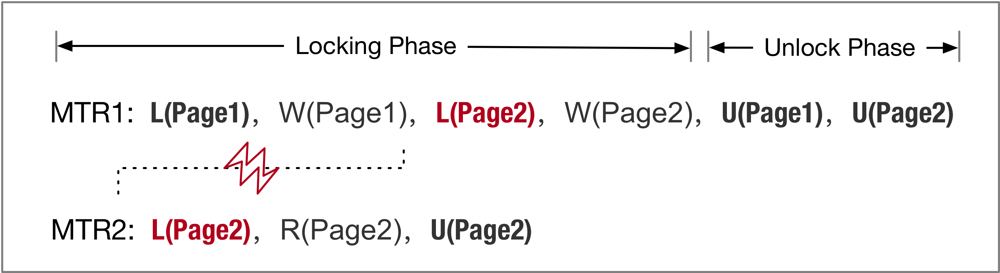
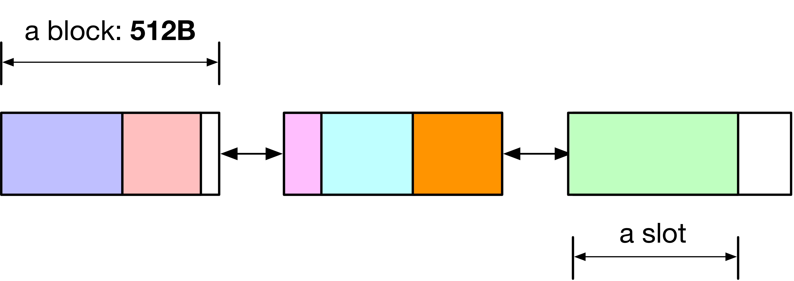

# [InnoDB（十四）：Mini Transaction]

广义上我们可以把数据库里的事务分为两类：

*   用户事务：保障用户指定的多个动作的执行符合事务的语义（ACID）
*   系统事务：保障系统指定的多个动作的执行符合事务的语义（ACID）

系统事务在InnoDB中称作Mini Transaction。这里的区别在于用户和系统的视角（User's / System's Point of View）能够指定的动作并不一样；**用户的动作操纵逻辑的对象（e.g. Table/Record）**，**系统的动作操纵物理的对象（e.g. Page）**

*   用户动作：对Table中对数据增 / 删 / 改 / 查，创建 / 删除Table ...
*   系统动作：修改Page的元数据（e.g. UNDO\_TRX\_STATE） / Record，将Page的一部分Record移动到另一个Page ...

## Mini Transaction的必要性

Mini Transaction（简称MTR）的意义是把多个系统动作的执行**作为一个事务**，主要保障这些动作的执行具有**原子性和隔离性（这些动作本来就具有持久性）**

举一个Update事务提交的例子来说明为什么需要Mini Transaction。事务提交时的部分流程（[MySQL · 引擎特性 · InnoDB mini transation](http://mysql.taobao.org/monthly/2017/10/03/)）：

```plain
trx_commit(mtr)
  |- trx_write_serialisation_history(mtr)
    // 给事务分配trx→no
    |- trx_serialisation_number_get
    //Step 1. 设置事务对应的Undo Log Header中的TRX_UNDO_STATE为"提交"
    // InnoDB的Redo日志中没有Commit Record，通过TRX_UNDO_STATE来标识事务真正的提交
    |- trx_undo_set_state_at_finish(mtr)
    // Step 2. 将Undo Log Header加入到所在的Undo Segment->History List上，并适当增加TRX_RSEG_HISTORY_SIZE的值
    |- trx_undo_update_cleanup(mtr)
    // Step 3. 设置在系统表空间中的两个域（该事务提交后，Binlog写到的位置）：TRX_SYS_MYSQL_LOG_NAME/
    //         TRX_SYS_MYSQL_LOG_OFFSET
    |- trx_sys_update_mysql_binlog_offset(mtr)
    |- ...
```

可以看到Setp 1/Step 2/Step 3的执行具有种种约束，因为需要原子性（全部成功或全部失败）和隔离性（其他MTR不能看到这些动作的中间结果）

其中之一的约束便是：

*   具有更小的trx→no的事务（Undo Log）在History List的更前面

因此这个MTR的作用是与**其余用户线程的事务提交做互斥**

MTR作为事务，主要保障**原子性**和**隔离性。**这里要注意区分，一个事务的所有操作要么全部执行要么全部不执行，这是原子性。在该事物执行期间，其他事务是否可以看到此事务执行的中间结果，这是隔离性。

（在一个MTR中也可能会有多个读操作，如dict\_stats\_update\_transient\_for\_index）

### MTR的原子性

MTR （物理事务，或者叫系统事务）原子性的保证方式与逻辑事务不同，逻辑事务是通过 undo 日志回滚的方式保证事务的原子性，究其原因是因为逻辑事务使用 [Steal / No-Force](https://courses.cs.washington.edu/courses/cse444/10au/lectures/lecture11-12.pdf) 策略。而 mtr 使用 No-Steal / No-Force 策略：

*   在事务的全部 redo 日志落盘前，事务产生的任何脏页不能落盘

实现的方式比较简单，在数据页的 FIL\_PAGE\_LSN 里记录的是与 mtr boundry 对齐的 LSN。同时在每个数据页准备落盘前，强制其日志落盘（log\_write\_up\_to 至 page LSN，注意 page LSN 是 mtr boundry）。在这样的策略下，crash recovery 时如果没有发现 MLOG\_MULTI\_END 则说明该 mtr 的日志没有全部落盘，那么需要 ignore 该 mtr 的全部日志。同时我们可以保证该 mtr 修改的任何脏页都没有落盘，因为无需像逻辑事务一样的回滚

### MTR的持久性

使用特殊的日志类型（e.g MLOG\_MULTI\_REC\_END）作为MTR的**第一个和最后一个**Record，当解析到第一个Record而未见到最后一个Record，在Crash Recovery时便不会回放此MTR的日志

### **MTR的隔离性**

用户事务的隔离性往往通过2PL（Serializable Isolation）或MVCC（Snapshot Isolation）来实现，那么对于系统事务（MTR）的隔离级别是怎样的呢？

*   **InnoDB MTR 只支持 Serializable 隔离级别（通过2PL，后面可以看到这是MTR的"Fix Rule"）**

用户事务的2PL获取的是Record Lock，系统事务的2PL获取的是Page Latch。我们通过一个例子来详细分析

（此处使用一些简写：R→ Read / W→ Write / L→ "Lock a Page's Latch" / U→ "Unlock a Page's Latch"）



在 MTR1 修改 Page2 之后、修改 Page3 之前，MTR2 是否可能读到 Page2 导致读到 "Patrial Transaction"？易知这并不可能，因为此时 MTR1 仍持有 Page2 Latch

**TODO：**

*   逻辑事务和物理事务的联系？比如逻辑事务的隔离级别是 RR，物理事务需要什么隔离级别？

### MTR的实现

```plain
struct mtr_t{
  // dyn_array_t是动态数组，可以简单的理解为"STL vector"，每一个元素称为一个slot
   
  // memo 保存的是修改的所有的Page：
  //   1) 当准备修改Page之前需要获得Page latch
  //   2) 调用mtr_memo_push(mtr, page, lock_type)将Page放入memo（动态数组）
  //      放入memo的是一个mtr_memo_slot_t*，保存着（buf_block_t*, lock_type）
  //   3) 当mtr commit时，调用mtr_memo_pop_all，遍历所有的slot，根据保存的不同的锁类型（lock_type）释放每个
  //      Page latch（详见mtr_memo_slot_release_func）
  dyn_array_t memo;
  // log 保存的是生成的所有redo log records，当mtr commit时将mtr的全部日志写入公共的Redo
  // buffer （log_sys->buf）中
  dyn_array_t log;
  ...
}
```

我们再多说说所谓的"动态数组"（dyn\_array\_t）

动态数组以 block 为单位组成双向链表，每个 block 是 512 字节，存放的是变长的元素（slot）。当最后一个 block 的剩余空间小于需保存的 slot 大小时，则分配新的 block（细节可见[mysql内核分析--innodb动态数组内部实现(下)(摘自老杨)](http://www.voidcn.com/article/p-fvltxija-cz.html)）



  


