# [InnoDB 锁管理]

## 锁的类型

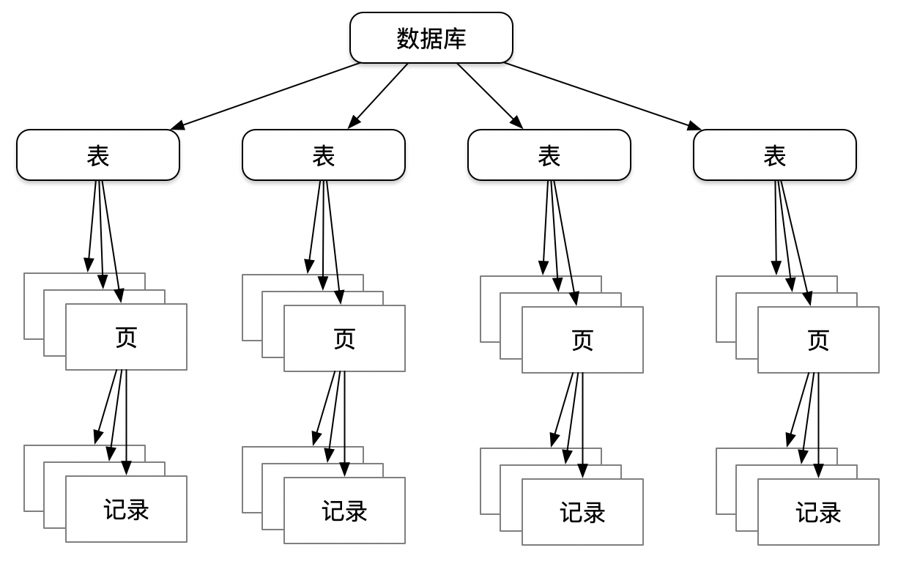

InnoDB存储引擎支持事务在行记录级及表级上加锁，记录加锁前需要首先对表加意向锁

<table class="fixed-table wrapped confluenceTable"><colgroup><col style="width: 54.0px;"><col style="width: 79.0px;"><col style="width: 202.0px;"><col style="width: 712.0px;"></colgroup><tbody><tr><td rowspan="6" class="confluenceTd">行锁</td><td rowspan="4" class="confluenceTd"><span style="color: rgb(0,0,0);">锁类型</span></td><td class="confluenceTd"><span style="color: rgb(0,0,0);">LOCK_REC_NOT_GAP</span></td><td class="confluenceTd"><span style="color: rgb(48,48,48);">只是单纯的锁在记录上，不会锁记录之前的 GAP</span></td></tr><tr><td class="confluenceTd"><span style="color: rgb(0,0,0);">LOCK_GAP</span></td><td class="confluenceTd"><span style="color: rgb(48,48,48);">表示只锁住一段范围，不锁记录本身，通常表示两个索引记录之间，或者索引上的第一条记录之前，或者最后一条记录之后的锁</span></td></tr><tr><td class="confluenceTd"><span style="color: rgb(0,0,0);">LOCK_ORDINARY</span></td><td class="confluenceTd"><span style="color: rgb(48,48,48);">也就是所谓的 NEXT-KEY 锁，包含记录本身及记录之前的GAP</span></td></tr><tr><td colspan="1" class="confluenceTd"><span style="color: rgb(0,0,0);">LOCK_INSERT_INTENTION</span></td><td colspan="1" class="confluenceTd"><span style="color: rgb(48,48,48);">INSERT INTENTION锁是GAP锁的一种，如果有多个session插入同一个GAP时，他们无需互相等待</span></td></tr><tr><td rowspan="2" class="confluenceTd"><span style="color: rgb(0,0,0);">锁模式</span></td><td colspan="1" class="confluenceTd"><span style="color: rgb(0,0,0);">LOCK_S</span></td><td colspan="1" class="confluenceTd"><span style="color: rgb(48,48,48);">事务中读取一条行记录后，不希望它被别的事务锁修改，但所有的读请求产生的LOCK_S锁是不冲突的</span></td></tr><tr><td colspan="1" class="confluenceTd"><span style="color: rgb(0,0,0);">LOCK_X</span></td><td colspan="1" class="confluenceTd"><span style="color: rgb(48,48,48);">避免对同一条记录的并发修改</span></td></tr><tr><td rowspan="5" class="confluenceTd">表锁</td><td rowspan="5" class="confluenceTd"><span style="color: rgb(48,48,48);">锁模式</span></td><td colspan="1" class="confluenceTd"><span style="color: rgb(48,48,48);">LOCK_IS</span></td><td colspan="1" class="confluenceTd"><span style="color: rgb(48,48,48);">IS表示未来可能需要在这个表的某些记录上加共享锁</span></td></tr><tr><td colspan="1" class="confluenceTd"><span style="color: rgb(48,48,48);">LOCK_IX</span></td><td colspan="1" class="confluenceTd"><span style="color: rgb(48,48,48);">未来可能需要在这个表的某些记录上加排他锁</span></td></tr><tr><td colspan="1" class="confluenceTd"><span style="color: rgb(48,48,48);">LOCK_X</span></td><td colspan="1" class="confluenceTd"><span style="color: rgb(48,48,48);"><span>当加了LOCK_X表级锁时，</span>所有其他的表级锁请求都需要等待</span></td></tr><tr><td colspan="1" class="confluenceTd"><span style="color: rgb(48,48,48);">LOCK_S</span></td><td colspan="1" class="confluenceTd">表级共享锁</td></tr><tr><td colspan="1" class="confluenceTd"><span style="color: rgb(48,48,48);">LOCK_AUTO_INC</span></td><td colspan="1" class="confluenceTd"><span style="color: rgb(48,48,48);">AUTO_INC锁加在表级别，和AUTO_INC、表级S锁以及X锁不相容。锁的范围为SQL级别，SQL结束后即释放</span></td></tr></tbody></table>

## 锁的结构

锁的模式和类型信息都存储在lock\_t→type\_mode中

lock->type\_mode & LOCK\_TYPE\_MASK获取锁类型

lock->type\_mode & LOCK\_MODE\_MASK获取锁模式

lock->type\_mode & LOCK\_WAIT为true表示锁请求

```cpp
struct lock_t { 
         trx_t*                   trx;         //持有该锁对象的事务
         UT_LIST_NODE_T(lock_t)   trx_locks;   //该事务锁链表
         ulint                    type_mode;   //锁类型
         hash_node_t              hash;        //全局锁哈希表
         dict_index_t*            index;       //锁对应的索引
         union { 
                lock_table_t      tab_lock;    //表锁
                lock_rec_t        rec_lock;    //记录锁
         } un_member; 
};
struct lock_table_t{
         dict_table_t*table;                  //table锁信息
         UT_LIST_NODE_T(lock_t)locks;         //同一table上的所有锁链表
};
struct lock_rec_t { 
         ulint space; 
         ulint page_no; 
         ulint n_bits;
};
```

从锁数据结构中可以看出：

*   表锁和行锁共用数据结构lock\_t
*   行锁是根据页的组织形式来进行管理的，若要知道某行是否有锁，首先定位到该页对应的lock\_rec\_t，再通过位图查询（见下图）
*   通过设置对应行的bit位表示该行是否有锁，同一page上的行可以共用一个lock\_t
*   申请lock\_t时，bit位个数设为page\_dir\_get\_n\_heap(page) + LOCK\_PAGE\_BITMAP\_MARGIN(64)，若该page中插入了更多的行导致bit位不够用则无法复用锁结构，需要重新申请更大的lock\_t

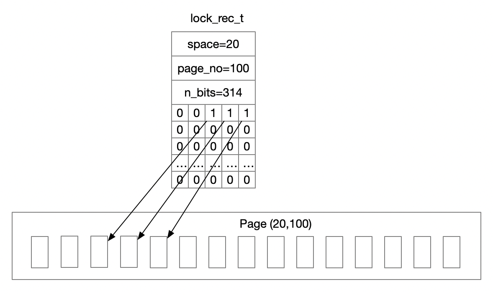

**为什么innodb采用页对行锁进行组织？**

*   根据页来进行对行锁的查询看似并不是一个高效的设计，因为不能直接得到想要查询的行记录的锁信息。但使用这种方式锁的开销非常小：某一事务对一个页中任意行的加锁开销都是一样的，即除了本身的开销之外不需要额外的开销
*   若根据每一行记录进行锁信息的管理，则事务进行全表加锁操作时，锁会占用太多的内存资源，在这种设计下，通常系统会设置一个阈值，当一个事务占用太多锁资源时进行锁升级，将行锁升级成更粗粒度的页锁或表锁
*   假设一张表又3,000,000个数据页，每个页大约又100条记录，那么总共有300,000,000个记录，如果一个事务执行全表更新，则需要对所有记录加x-lock，若根据每行记录产生锁对象进行加锁，并且每个锁占用10个字节，则仅对锁管理就需要3GB内存。而采用页管理行锁的位图方式，假设每个页上存储的锁信息占100字节，则锁对象仅需300MB内存

## 锁的索引方式

| 组织方式 | 组织形式 | 说明 | 锁类型 |
| --- | --- | --- | --- |
| 根据记录 | lock\_sys\_t::rec\_hash | 全局行锁哈希 | 行锁 |
| 根据表 | dict\_table\_t::locks | 该表上的表锁链表 | 表锁 |
| 根据事务 | trx\_t::trx\_lock\_t::trx\_locks | 事务的所有锁信息链表 | 表锁和行锁 |
| 根据事务 | trx\_t::trx\_lock\_t::table\_locks | 事务的所有表锁信息vector | 表锁 |
| 根据事务 | trx\_t::trx\_lock\_t::autoinc\_locks | 事务的所有自增锁信息vector | 表锁 |

  

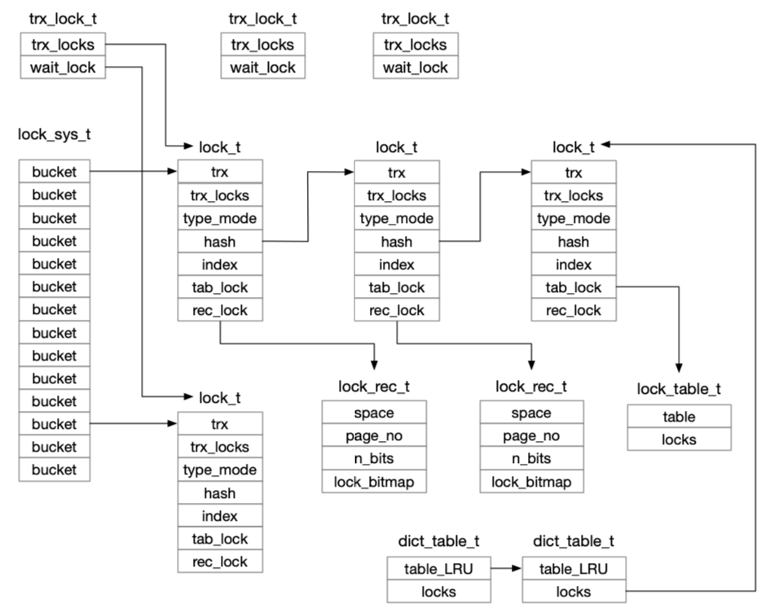

## 行锁加解锁

###行锁加锁（尽量复用lock\_t，快速加锁不进行死锁检测）；行锁复用条件：1、同一事务 2、锁模式相同 3、bitmap够用 
 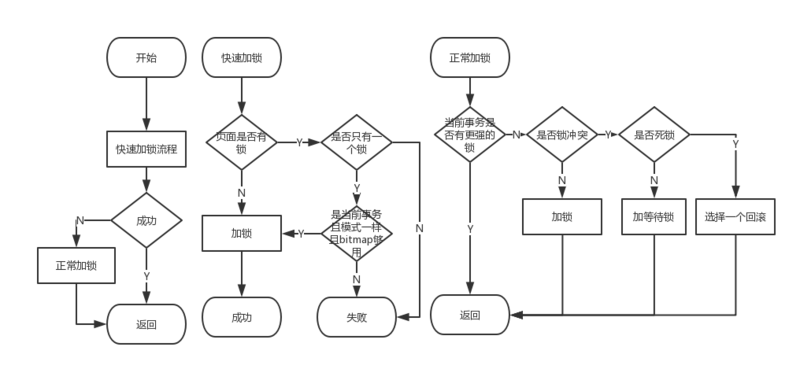 
 
###行锁解锁 
 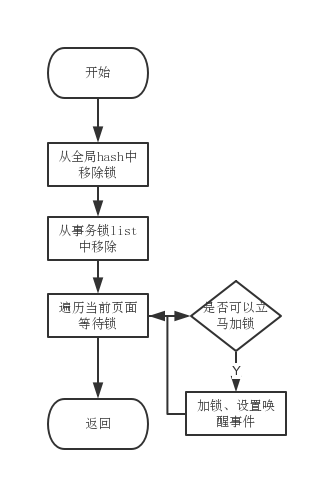 

## 表锁加解锁


###表锁加锁
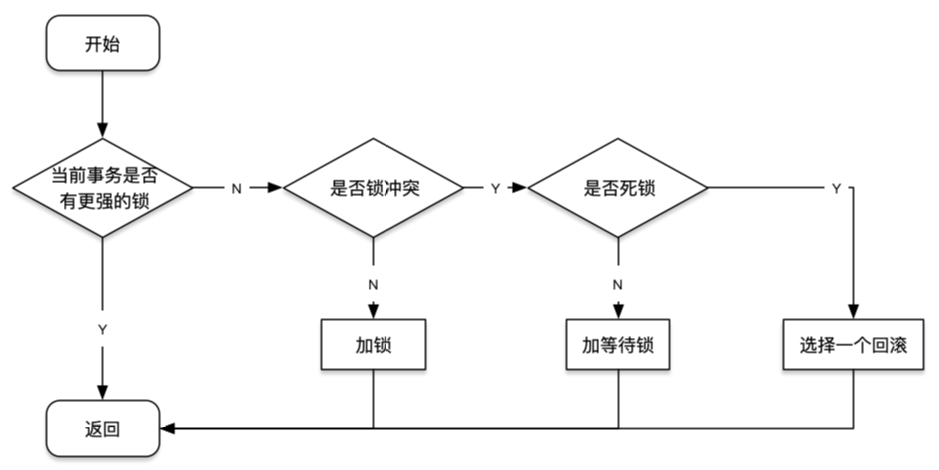


###表锁解锁

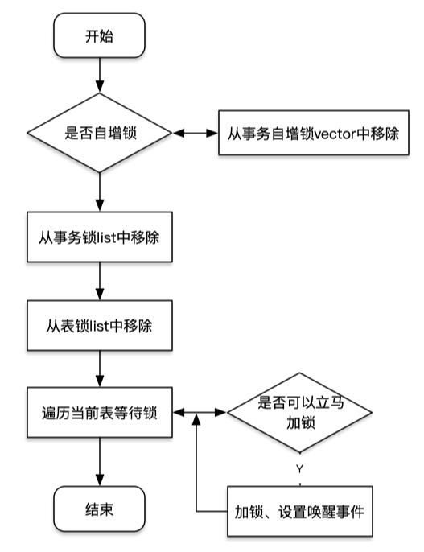


###加锁公共流程

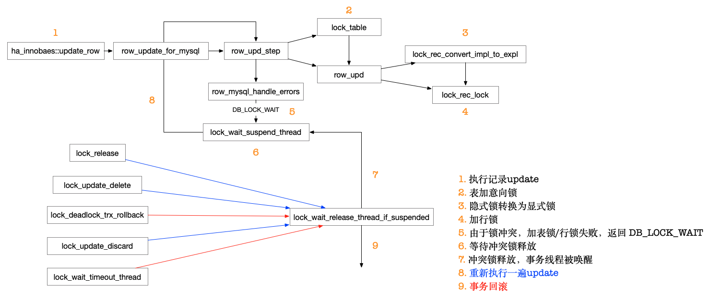

<table class="wrapped fixed-table confluenceTable"><colgroup><col style="width: 506.0px;"><col style="width: 524.0px;"></colgroup><tbody><tr><th colspan="2" class="confluenceTh"><p>锁被唤醒的五种情况</p></th></tr><tr><td class="confluenceTd"><div class="content-wrapper"><p><span class="confluence-embedded-file-wrapper confluence-embedded-manual-size">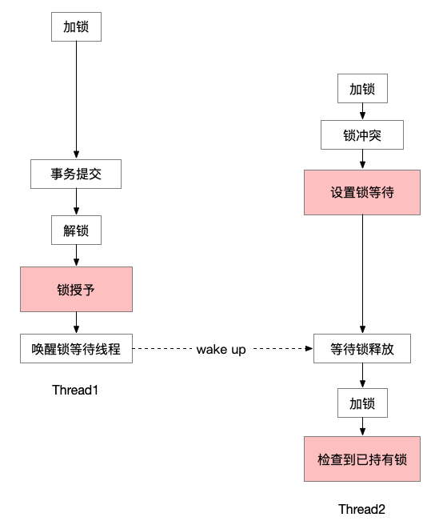</span></p></div></td><td class="confluenceTd"><div class="content-wrapper"><p><span class="confluence-embedded-file-wrapper confluence-embedded-manual-size">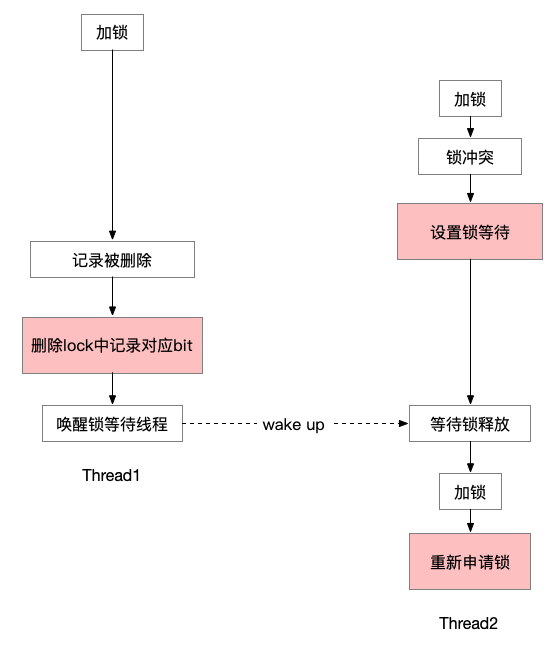</span></p></div></td></tr><tr><td class="confluenceTd"><div class="content-wrapper"><p>持有锁事务解锁后授予锁（清除wait标记），下次检查已经持有锁</p></div></td><td class="confluenceTd">等待加锁的记录被删除，执行<span><span style="color: rgb(255,0,0);">lock_rec_reset_and_release_wait</span>，</span>下次申请其他记录的锁</td></tr><tr><td class="confluenceTd"><div class="content-wrapper"><p><span class="confluence-embedded-file-wrapper confluence-embedded-manual-size">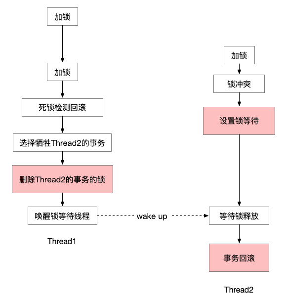</span></p></div></td><td class="confluenceTd"><div class="content-wrapper"><p><span class="confluence-embedded-file-wrapper confluence-embedded-manual-size">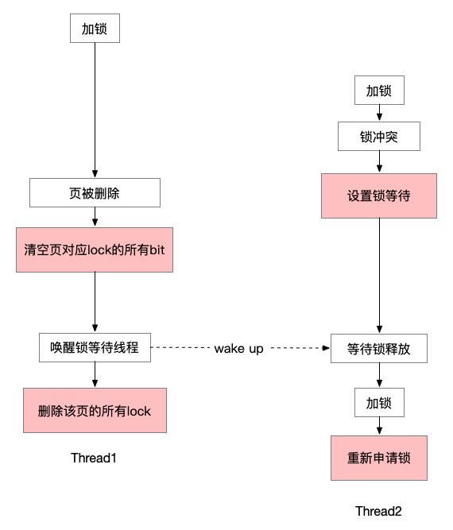</span></p></div></td></tr><tr><td colspan="1" class="confluenceTd">被死锁检测选中回滚，<span><span>执行</span></span><span style="color: rgb(255,0,0);">lock_cancel_waiting_and_release</span>，从哈希表/表锁链表及事务锁链表中删除锁</td><td colspan="1" class="confluenceTd">等待锁的页被删除（例如进行了merge），执行<span style="color: rgb(255,0,0);">lock_rec_reset_and_release_wait</span>下次申请其他页的锁</td></tr><tr><td colspan="1" class="confluenceTd"><div class="content-wrapper"><p><span class="confluence-embedded-file-wrapper confluence-embedded-manual-size">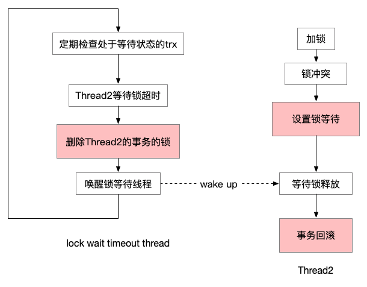</span></p></div></td><td colspan="1" class="confluenceTd"><br></td></tr><tr><td colspan="1" class="confluenceTd">加锁超时回滚，<span>执行</span><span><span style="color: rgb(255,0,0);">lock_cancel_waiting_and_release</span>，</span>从哈希表/表锁链表及事务锁链表中删除锁</td><td colspan="1" class="confluenceTd"><br></td></tr></tbody></table>

## 如何保证等待锁被唤醒？

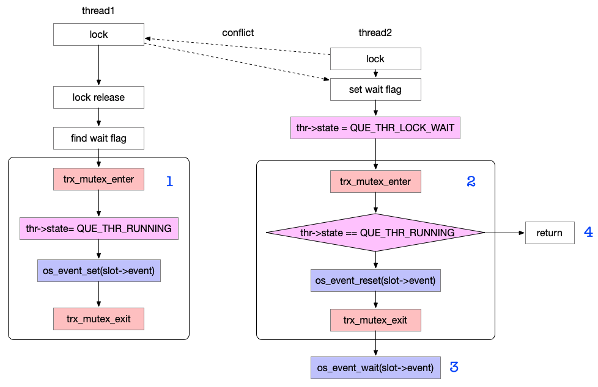

如图，线程1首先加锁，线程2之后加锁检测到冲突设置wait标记，此后线程1释放锁执行1流程，线程2继续执行2、3流程进入等待状态，根据并发关系可能有以下执行顺序

*   1→2→4：线程1首先释放锁，检查到线程2的锁不再有冲突，设置线程2状态为RUNNING，线程2准备进入wait之前检测到状态被修改为RUNNING，取消wait，重新加锁
*   2→1→3：线程2首先检查发现自己状态仍是LOCK\_WAIT，重置event，线程1设置event，线程2准备进入等待，发现event已被设置，直接被唤醒（reset之后被set的event无需wait）
*   2→3→1：同上一种情况，线程2可被唤醒

因此，只要线程2加等待锁时线程1未释放，线程2均可被唤醒

## 行锁的维护

加锁操作完成后锁对象lock\_t根据页的(space, page\_no)映射到对应哈希桶中，但是这种状态并不是稳定的，因为页不时地在发生着变化，如插入删除记录，B+树的分裂和合并都需要对已存在的锁对象进行维护

### 锁分裂

插入记录的间隙存在GAP锁，此时GAP需分裂为两个GAP

1、2、3、4、5、7、8

事务首先在记录7上持有（5，7）的GAP锁，插入记录6后，GAP锁分裂为（5，6）和（6，7）

### 锁继承

删除的记录若存在GAP锁，此GAP锁会继承到要删除记录的下一条记录上

### 锁迁移

锁迁移的原则是，B+树结构变化前后，锁住的范围保证不变。

*   节点分裂
    
    假设原节点A(infimum,1,3,supremum) 向右分裂为B(infimum,1,supremum), C(infimum,3,supremum)两个节点
    
    > infimum为节点中虚拟的最小记录，supremum为节点中虚拟的最大记录
    
    假设原节点A上锁为3上LOCK\_S|LOCK\_ORIDNARY，supremum为LOCK\_S|LOCK\_GAP,实际锁住了(1~) 锁迁移过程大致为：
    
    1.  将3上的gap锁迁移到C节点3上
    2.  将A上supremum迁移继承到C的supremum上
    3.  将C上最小记录3的锁迁移继承到B的supremum上
    
    迁移完成后锁的情况如下(lock\_update\_split\_right) B节点：suprmum LOCK\_S|LOCK\_GAP C节点：3 LOCK\_S|LOCK\_ORINARY, suprmum LOCK\_S|GAP
    
    迁移后仍然锁住了范围(1~)
    
    节点向左分裂情形类似
    

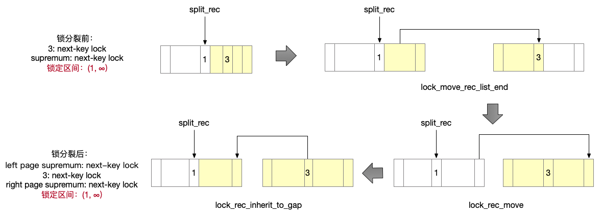

*   节点合并
    
    以上述节点分裂的逆操作来讲述合并过程 B(infimum,1,supremum), C(infimum,3,supremum)两个节点，向左合并为A节点(infimum,1,3,supremum) 其中B，C节点锁情况如下 B节点：suprmum LOCK\_S|LOCK\_GAP C节点：3 LOCK\_S|LOCK\_ORINARY, suprmum LOCK\_S|GAP
    
    迁移流程如下(lock\_update\_merge\_left)：
    
    1)将C节点锁记录3迁移到B节点
    
    2)将B节点supremum迁移继承到A的supremum上
    
    迁移后仍然锁住了范围(1~)
    
    节点向右合并情形类似
    

## 死锁检测

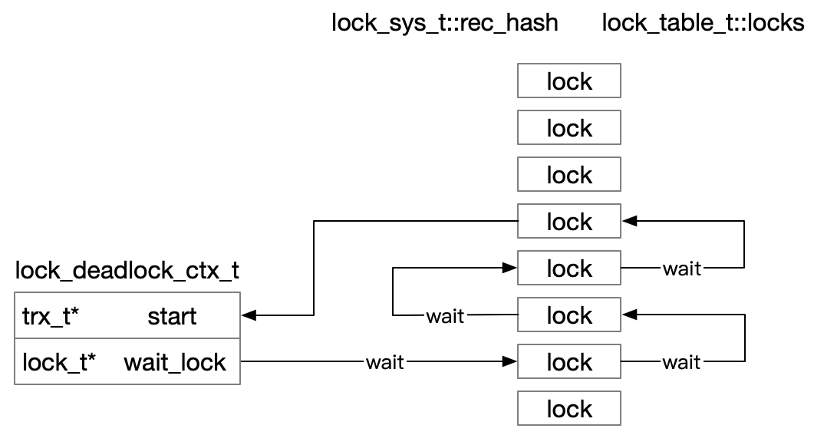

lock\_rec\_lock\_slow流程中创建锁结构，置type\_mode为LOCK\_WAIT，之后要进行死锁检测：

1、利用该事务及新创建的锁初始化lock\_deadlock\_ctx2的 start 和 wait\_lock

2、遍历对应哈希桶，找到与wait\_lock不兼容且处于wait状态的锁并入栈

2、从栈中依次取出锁并赋值给wait\_lock

3、遍历哈希桶找到与wait\_lock不兼容的锁，检查该锁对应的事务是否为start， 若是则检测到死锁，否则回到 2 继续循环

4、如果死锁检测的深度太深，需要回滚当前的事务

5、检测到死锁后，返回需要回滚的事务（比较start和wait\_lock->trx优先选择没有编辑过non-transactional tables的事务，若都编辑过或都没编辑过则选择（修改行数+加锁数）最少的）

Nontransactional Tables，非事务表，不支持事务的表，也就是使用MyISAM存储引擎的表。非事务表的特点是不支持回滚

## lock的申请和释放

系统启动时会初始化trx\_pools，包含MAX\_TRX\_BLOCK\_SIZE（1024 \* 1024 \* 4）个trx

每个trx初始化时会调用lock\_trx\_alloc\_locks创建8个rec\_lock\_cache和8个table\_lock\_cache分别放置在trx.lock.rec\_pool和trx.lock.table\_pool

trx进行过程中优先使用pool中的lock

```java
if (trx->lock.rec_cached >= trx->lock.rec_pool.size()
    || sizeof(lock_t) + n_bytes > REC_LOCK_SIZE) {
 
    lock = static_cast<lock_t*>(
        mem_heap_alloc(trx->lock.lock_heap,
        sizeof(lock_t) + n_bytes));
} else {
    lock = trx->lock.rec_pool[trx->lock.rec_cached++];
}
```

当pool中的lock用完时从trx→lock.lock\_heap中申请内存

trx→lock.lock\_heap申请的内存会在锁释放时释放（lock\_trx\_release\_locks）

rec\_pool和table\_pool中的lock会在trx释放时释放

## 优化方向分析

<table class="fixed-table wrapped confluenceTable"><colgroup><col style="width: 168.0px;"><col style="width: 1209.0px;"></colgroup><tbody><tr><td class="confluenceTd">lock批量申请释放</td><td class="confluenceTd">现有机制已经包含了lock的批量释放：每个trx初始化时即分配了8个record lock和table lock构成lock_pool，需要申请lock时优先使用lock_pool，lock_pool用完后从trx→lock.lock_heap中申请，heap本质上是一系列链接的内存块（其优点是可以一次性分配大块的内存，将多次的内存分配合并为单次进行），这些内存块又通过通用内存池申请。所有lock在trx释放时释放</td></tr><tr><td class="confluenceTd">异步死锁检测</td><td class="confluenceTd">mysql5.7增加了参数innodb_deadlock_detect可以对死锁检测进行开关，关闭死锁检测后<span style="color: rgb(68,68,68);">依赖innodb_lock_wait_timeout进行事务回滚，因此异步死锁检测理论上应该没有什么问题</span></td></tr><tr><td class="confluenceTd">拆分lock_sys-&gt;mutex锁</td><td class="confluenceTd"><p>需要加锁的代码块：加锁、解锁、锁迁移、锁分裂、锁遍历（加锁后死锁检测、解锁后锁唤醒）；lock_sys→mutex保证这些流程不会并发，对于行锁，每个锁都对应于一个page，即block，理论上只对该block对应的bucket加锁即可阻止并发，对于表锁，可对每个表加锁</p><p>问题1：对于锁分裂、迁移等可能涉及两个block的操作可能需要对两个block对应的bucket加锁，加锁顺序是否需要约束——约束加锁顺序按照哈希值大小从小到大顺序加锁</p><p>问题2：由于block通过哈希对应到桶，bucket锁与block可能是一对多的关系，是否可能锁分裂、迁移涉及的两个block对应同一桶锁——加锁前判断锁是否相同，避免重复加锁</p></td></tr></tbody></table>

## 参考

[http://mysql.taobao.org/monthly/2016/01/01/](http://mysql.taobao.org/monthly/2016/01/01/)

[http://mysql.taobao.org/monthly/2016/06/01/](http://mysql.taobao.org/monthly/2016/06/01/)

[https://blog.csdn.net/gao1738/article/details/42839337](https://blog.csdn.net/gao1738/article/details/42839337)

《MySQL内核InnoDB存储引擎》


