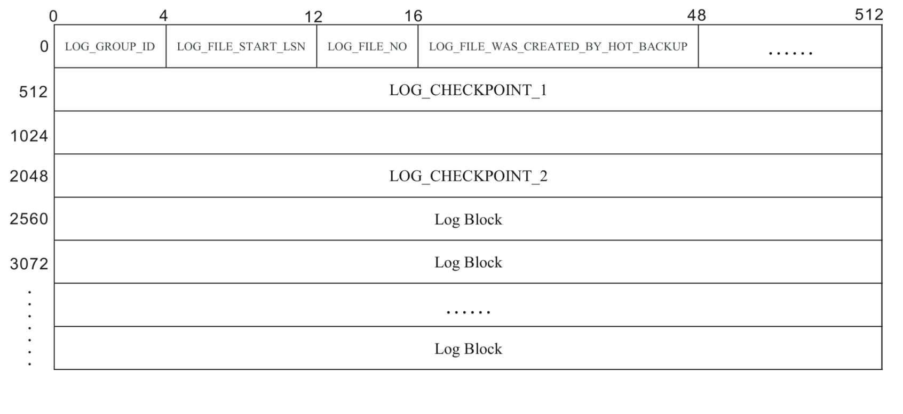
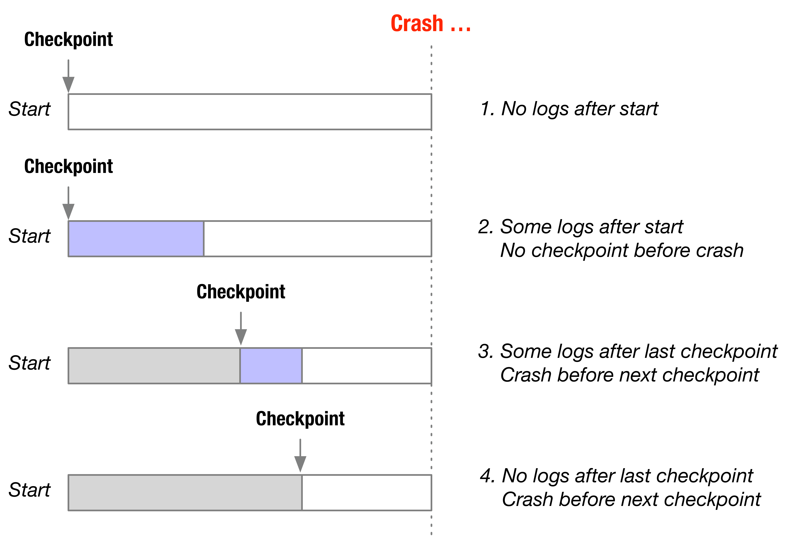
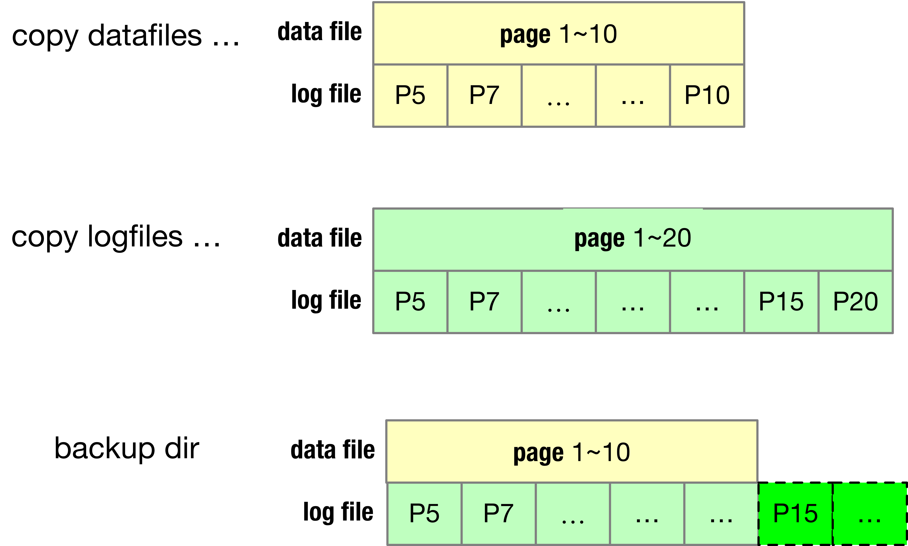
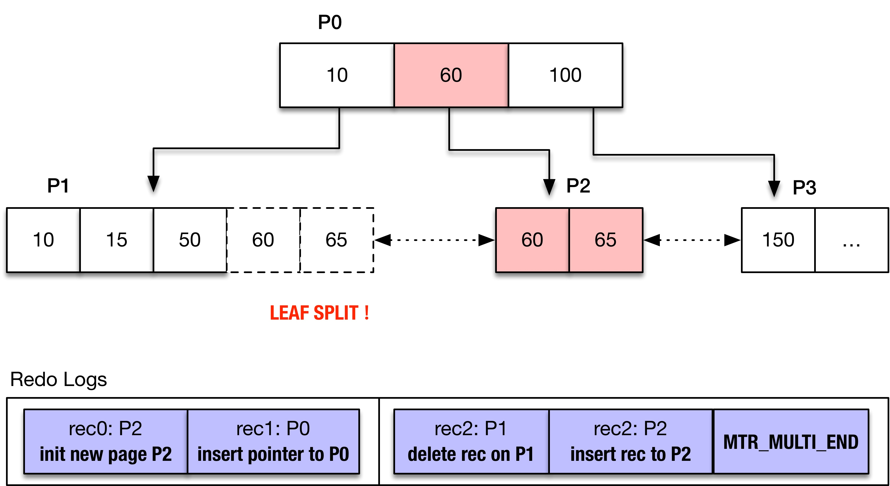

*   [F收藏](# "收藏 (f)")
*   [关注](# "关注(w)")
*   [S分享](# "Share this page with others (s或 k)")
*   [空间管理员](# "查看空间管理员")

1.  [页面](http://wiki.baidu.com/collector/pages.action?key=MySQLNotes&src=breadcrumbs-collector)
2.  [MySQL Notes](http://wiki.baidu.com/display/MySQLNotes/MySQL+Notes?src=breadcrumbs)
3.  [InnoDB](http://wiki.baidu.com/display/MySQLNotes/InnoDB?src=breadcrumbs-parent)

[跳到banner的尾部](#page-banner-end)

[回到标题开始](#page-banner-start)

# [InnoDB（三）：Crash Recovery](http://wiki.baidu.com/pages/viewpage.action?pageId=435201546)

[转至元数据结尾](#page-metadata-end)

*   由 [吴昊](http://wiki.baidu.com/display/~wuhao27)创建, 最后修改于[2020-04-04](http://wiki.baidu.com/pages/diffpagesbyversion.action?pageId=435201546&selectedPageVersions=118&selectedPageVersions=119 "查看变更")

[转至元数据起始](#page-metadata-start)

## 为什么需要Crash Recovery？

首先来看一下什么是合法事务？

### 合法事务

数据库有**显式约束**和**隐式约束**

*   **显示约束：**由数据库保障，包括主键约束/唯一键约束/外键约束等
*   **隐式约束：**由表和事务的设计者保障，比如元素A表示银行的贷款余额，元素B表示银行的总债务，那么A=B，任何事务执行完成都需要保障A=B

满足一个数据库显式约束和隐式约束的事务，是这个数据库的合法事务

保证数据库Crash时活跃事务依然遵守ACID原则：

#### 原子性

活跃事务要么提交，要么回滚，保证了活跃事物的**原子性**

#### 一致性

定义数据库D的状态S为时刻t，数据库中所有元素E1，E2，...，En的值的集合

S = {E1, E2, ... ,En}

在**合法事务**的作用下，用时间做参考系（自变量）的话，每个元素也是时间的因变量Ei(t)

因而S(t) = {E1(t), E2(t), ... ,En(t)}，

【数据库的一致性】

*   状态为空的数据库是一致的（空的数据库）
*   如果当前数据库是一致的，执行完成一个合法的事务（执行完成意味着事务的动作要么全部成功，要么全部失败），数据库的状态依然是一致的

【推论】

*   【推论1】如果数据库状态S是一致的，那么存在一个合法的事务序列T，使得数据库由状态空到达状态S
*   【推论2】如果一个数据库执行的事务都是合法的，并且都原子地执行，那么这个数据库的状态总是一致的

那么数据库Crash时因为活跃事务可能没有原子地执行，导致重启后的数据库状态可能是不一致的

#### 持久性

因为数据库采用的WAL（Write Ahead Log）方式，使得事务对数据库状态的变更可能有部分只记录在Redo日志里，而没有出现在数据文件里，为了维护“持久性”的要求，需要应用这部分的日志来使得变更也出现在数据文件里

### Crash Recovery的目的

*   **Crash时的活跃事务没有保障原子性（同时也没有保障一致性）**
*   **Redo日志里的部分事务没有保障持久性**

那么Crash Recovery的操作就是：

*   **原子性的处理Crash时的活跃事务（Undo日志回滚/提交活跃事务）**
*   **持久性的处理出现在Redo日志里，但没有出现在数据文件里的事务**（Redo日志前滚）****

## 什么时候做Crash Recovery？

InnoDB如何判断是否需要做Crash Recovery？（是否有日志需要重做？是否当前的数据文件不是Consistent？存在事务只有部分的操作持久化到了数据文件中？）

满足以下任意一个原则，InnoDB都会认为「上一次不是Normal Shutdown」：

*   **原则一**：checkpoint\_lsn != flushed\_lsn
*   **原则二**：在checkpoint\_lsn之后还有更多的日志

顺序上是先原则二、再原则一

### 原则一：checkpoint\_lsn != flushed\_lsn



重点关注LOG\_CHECKPOINT\_1和LOG\_CHECKPOINT\_2这两个域，这两个域的结构是一样的，都是：

```plain
/* Offsets for a checkpoint field */
#define LOG_CHECKPOINT_NO       0
#define LOG_CHECKPOINT_LSN      8
#define LOG_CHECKPOINT_OFFSET_LOW32 16
#define LOG_CHECKPOINT_LOG_BUF_SIZE 20
#define LOG_CHECKPOINT_ARCHIVED_LSN 24
#define LOG_CHECKPOINT_GROUP_ARRAY  32
```

InnoDB Checkpoint采用Round-Robin方式轮番写入这两个域，并增加LOG\_CHECKPOINT\_NO（LOG\_CHECKPOINT\_NO更大的域便是最近一次Checkpoint写入的域）

```plain
innobase_start_or_create_for_mysql
  // 读取存在于系统表空间第一页，偏移量为FIL_PAGE_FILE_FLUSH_LSN的LSN
  // 作为flushed_lsn
  |- open_or_create_data_files
  |- recv_recovery_from_checkpoint_start_func
    // 找到LOG_CHECKPOINT_1和LOG_CHECKPOINT_2中哪个是Shutdown前最后一次Checkpoint写入的域
    // 并读取其中的checkpoint_lsn。比较flushed_lsn和checkpoint_lsn：
    //     如果flushed_lsn != checkpoint_lsn，则说明上次InnoDB不是"Normal Shutdown"，需要Crash Recovery
    |- recv_find_max_checkpoint / log_group_read_checkpoint_info
```

InnoDB启动时，**如果ibdata1不存在**，则被认为是数据库的第一次启动。在错误日志中会看到如下信息：

```sql
InnoDB: The first specified data file ./ibdata1 did not exist:
InnoDB: a new database to be created!
```

否则，InnoDB在重新启动时都会去判断之前的Shutdown是“Normal Shutdown”还是“Crash”

因为在InnoDB “Normal Shutdown”时（即用户执行“Shutdown”命令，非MySQL/InnoDB意外地Crash），会执行一次**同步的**Checkpoint

我们知道InnoDB的每次Checkpoint都会将checkpoint\_lsn写入到：

*   LOG\_CHECKPOINT\_1或LOG\_CHECKPOINT\_2这两个域（ib\_logfile0的Header中）

但这次还会将checkpoint\_lsn写入到：

*   **FIL\_PAGE\_FILE\_FLUSH\_LSN**（系统表空间第一个页面，偏移为26），只在Normal Shutdown时才会写

```plain
logs_empty_and_mark_files_at_shutdown
  // 做一次同步的Checkpoint直至InnoDB的所有变更都写入磁盘（将BufferPool中的Flush-List脏页全部写入磁盘）
  // checkpoint_lsn为InnoDB的最大的Redo日志LSN（当前log_sys->lsn）
  // 并将checkpoint_lsn写入Redo日志的LOG_CHECKPOINT_1或LOG_CHECKPOINT_2处（详细见下文）
  |- log_make_checkpoint_at 
  // 将checkpoint_lsn写入系统表空间第一页，偏移量为FIL_PAGE_FILE_FLUSH_LSN的位置，称为"flushed_lsn"
  // 但注意，ibdata可以有多个（ibdata1、ibdata1、ibdata3 ...）
  |- fil_write_flushed_lsn_to_data_files
```

容易看到：

*   Normal Shutdown时，checkpoint\_lsn和flushed\_lsn一定相等
*   Crash时：checkpoint\_lsn和flushed\_lsn可能相等/可能不相等
    *   【例1】Normal Shutdown => 启动，做了一次Checkpoint然后Crash，那么checkpoint\_lsn != flushed\_lsn
    *   【例2】Normal Shutdown => 启动，写入了一些日志，但还尚未做Checkpoint然后Crash，那么checkpoint\_lsn == flushed\_lsn

```plain
if (checkpoint_lsn != max_flushed_lsn
            || checkpoint_lsn != min_flushed_lsn) {
    if (!srv_read_only_mode) {
        recv_init_crash_recovery();
    }
}
  
recv_init_crash_recovery
  |- buf_dblwr_process //从DoubldWrite Buffer中恢复可能损坏的数据页
  |- os_thread_create（recv_writer_thread）
```

在代码中，似乎只有checkpoint\_lsn != flushed\_lsn时，才会调用recv\_init\_crash\_recovery. 那么【例2】的情况怎么办？不需要从DoubldWrite Buffer中恢复数据页了？

这就是原则二

### 原则二：checkpoint\_lsn之后还有日志

考虑这个场景，在一次Normal Shutdown后启动InnoDB，还尚未做Checkpoint然后Crash；此时checkpoint\_lsn == flushed\_lsn

此时「原则一」会认为这是一次「Normal Shutdown」，但「原则二」会认为「不是Normal Shutdown」

### 总结

InnoDB检测是否需要Crash Recovery有两个判断原则（满足其一即可）：

*   原则一：checkpoint\_lsn != flushed\_lsn
*   原则二：checkpoint\_lsn之后还有日志

InnoDB的Crash有如下四种可能：

*   情况一：Start之后没有产生日志
*   情况二：Start之后产生一些日志，Crash之前没有做Checkpoint
*   情况三：上一次Checkpoint之后产生一些日志，再下一次Checkpoint之前Crash
*   情况四：上一次Checkpoint之后没有产生日志，Crash

其中：

*   情况一不需要进行Crash Recovery。
*   情况二，情况三由**原则二**检测到。需要Crash Recovery
*   情况四都由**原则一**检测到。不需要前滚，仅需要回滚  
    为何可能需要回滚？简单来讲，checkpoint lsn的前进是以record为单位，而非以事务未单位。所以checkpoint lsn可能位于某个活跃事务的中间



### 实现

```plain
// 以下的代码不是第一次启动数据库的情况（即不是代码中的create_new_db）
// 初始化Crash Recovery的控制结构体recv_sys，并建立红黑树方便在Crash Recovery过程中快速的插入Flush List
|- recv_sys_init
// 寻找系统表空间文件，并读取flushed_lsn（FIL_PAGE_FILE_FLUSH_LSN）
|- open_or_create_data_files
|- recv_recovery_from_checkpoint_start
    // 读取在ib_logfile0 header中的checkpoint_lsn
    |- recv_find_max_checkpoint
    // 从checkpoint_lsn所在的Block开始扫描日志文件，得到日志最后的LSN（group_scanned_lsn）
    |- recv_group_scan_log_recs
      // 每次读64KB（RECV_SCAN_SIZE）日志到log_sys->buf
      |- log_group_read_log_seg
      // 扫描该部分日志
      // 1）若发现某个Block未满512KB，或者出现block_no下降的情况，即说明日志已扫描完毕
      // 2）【原则二】：在扫描过程中会一直更新group_scanned_lsn，若发现group_scanned_lsn>checkpoint_lsn，
      //   即说明需要Crash Recovery，这时会看到一段熟悉的日志"Log scan progressed past the checkpoint lsn..."
      |- recv_scan_log_recs
        // 初始化Crash Recovery需要的环境
        // 1） 将表空间的元数据载入内存中。2）从DoubleWrite中恢复数据文件中的数据页。3）创建临时的刷脏页线程
        //     recv_writer_thread
        |- recv_init_crash_recovery
   |- if (checkpoint_lsn != flushed_lsn)
      // 【原则一】如果遇到情况四，同样需要初始化Crash Recovery需要的环境（因为需要回滚）
      |- recv_init_crash_recovery
```

**TODO** 为何此时的刷脏页使用recv\_writer\_thread线程而不是buf\_flush\_page\_cleaner\_thread？

## 怎么做Crash Recovery？  

#### MySQL Crash Recovery的流程

*   【Step 1】读取Checkpoint LSN
*   【Step 2】【Redo】从Checkpoint开始“前滚”Redo日志
*   【Step 3】【Undo】构造Crash时的活跃事务
    *   处于【Commit】 的事务：等待Purge线程回收
    *   处于【Prepare】的事务：由MySQL Server层决定回滚或者提交（e.g 根据Binlog）
    *   处于【Active   】的事务：回滚

根据[MySQL的事务模型](http://wiki.baidu.com/pages/viewpage.action?pageId=467667118)，来论证一下这个流程的正确性：

*   Checkpoint之前的事务对数据库的修改已持久化，因此只需要处理Checkpoint之后的事务
*   从Checkpoint开始“前滚”Redo日志：
    *   执行Checkponit之后的事务
    *   恢复Undo日志（因为对Undo日志的变更是需要记录Redo日志的，所以可以通过Redo日志来恢复Undo日志）
*   Undo日志恢复完成后，Undo日志上出现的事务就是Crash发生时的活跃事务
    *   如果事务状态是Active：表明Binlog里肯定没有事务的记录（如果Binlog里有事务的记录，事务状态为Prepare；但是事务状态为Prepare，Binlog里**不一定**有事务的记录），因此事务无法重新执行，例如：
        
        ```sql
        BEGIN;
        INSERT INTO t VALUES (1);
        --- Crash --- 
        // 后面的UPDATE语句，重启后的MySQL无法知晓，因此事务无法从Crash的位置继续向后执行，只能回滚
        UPDATE t SET a=2 WHERE a=1;
        COMMIT;
        ```
        
    *   如果事务状态是Prepare：表明Binlog里**可能**有这个事务的记录
        
        *   如果Binlog里有事务的完整记录（如何判断记录是否完整？校验Binlog，维护一个valid\_pos，valid\_pos之前的事务都是**合法而且完整记录**的），则继续执行事务
        *   如果Binlog里没有事务的完整记录（只有部分记录 / 没有记录），无论Redo日志里是否有事务的完整记录，回滚事务。类似于如下执行过程：
        
        ```sql
        BEGIN;
        INSERT INTO t VALUES (1);
        ROLLBACK;
        ```
        

## MySQL / InnoDB的实现

```plain
recv_recovery_from_checkpoint_start_func
  |- recv_group_scan_log_recs 
    // 每次读16KB*4的Redo日志到log_sys.buf
    |- log_group_read_log_seg
    // 将log_sys.buf中的日志按照类型分发（Parse）到哈希表中
    // 如果哈希表溢出（日志可能填多轮的满哈希表），将整个哈希表的日志应用（Apply）于对应的Page并清空
    |- recv_scan_log_recs
      // 将log_sys.buf中日志的Body（每个Block都去掉Header / Tailer）加入到recv_sys.buf（Parsing Buffer）中
      |- recv_sys_add_to_parsing_buf
      // Parsing：遍历recv_sys.buf中的Record，分发到哈希表中；方式为：
      //          1）游标指向recv_sys.buf的第一个Record
      //          2）Record的第一个字节是"日志类型"，得到此类型日志的长度（recv_parse_or_apply_log_rec_body）
      //          3）游标跨过当前日志的长度，指向第二个日志...
      |- recv_parse_log_recs / recv_parse_log_rec
        |- recv_parse_or_apply_log_rec_body
      // 如果哈希表溢出，将整个哈希表的日志应用（Apply）于对应的Page
      |- recv_apply_hashed_log_recs
recv_recovery_from_checkpoint_finish
  // 将最后一轮（未溢出）的哈希表的日志应用（Apply）于对应的Page
  |- recv_apply_hashed_log_recs
```

*   【0】**日志的完整性检查**：如果 ib\_logfile0 存在但 ib\_logfile1 不存在，则 InnoDB 启动失败（InnoDB 最少两个日志文件）。这也是为什么会先创建 ib\_logfile101 的原因，就是为了防止ib\_logfile0 存在但 ib\_logfile1 不存在的情况
*   【1】**发现Checkpoint LSN：**Checkpoint LSN之前的记录表明已经应用过了，Checkpoint LSN之后可能存在某些记录没有应用过
*   【2】**分发Redo日志记录（Parse）：**从Checkpoint LSN开始，将每条记录按照（space\_id，page\_no）组织成哈希表，哈希表的每一个“桶”都是作用于同一个数据页的记录
*   【3】**应用Redo日志记录（Apply）**：遍历哈希表的“桶”，“桶”中每一条的记录，如果记录LSN > Page LSN（FIL\_PAGE\_LSN，修改过这个页面的最新（大）的LSN），则应用这个记录到相应的数据页
*   【4】**恢复事务系统**：通过Undo日志恢复InnoDB事务系统
*   【5】**MySQL Binlog辅助InnoDB崩溃恢复**

_Crash Revovery更详细的流程请参考附录_

### **发现Checkpoint LSN**

```plain
/********************************************************//**
Recovers from a checkpoint. When this function returns, the database is able
to start processing of new user transactions, but the function
recv_recovery_from_checkpoint_finish should be called later to complete
the recovery and free the resources used in it.
@return error code or DB_SUCCESS */
UNIV_INTERN
dberr_t
recv_recovery_from_checkpoint_start_func(
/*=====================================*/
#ifdef UNIV_LOG_ARCHIVE
    ulint   type,       /*!< in: LOG_CHECKPOINT or LOG_ARCHIVE */
    lsn_t   limit_lsn,  /*!< in: recover up to this lsn if possible */
#endif /* UNIV_LOG_ARCHIVE */
    lsn_t   min_flushed_lsn,/*!< in: min flushed lsn from data files */
    lsn_t   max_flushed_lsn)/*!< in: max flushed lsn from data files */
{
    /* Look for the latest checkpoint from any of the log groups */
    // 从所有Log Groups中获取最近一次的Checkpoint（具有最大Checkpoint NO.）
    // 因为Checkpoint是采用两个偏移量处轮流写入的方式：
    //    1. 奇数次的Checkpoint写到LOG_CHECKPOINT_1（OS_FILE_LOG_BLOCK_SIZE，512）偏移处
    //    2. 偶数次的Checkpoint写到LOG_CHECKPOINT_2（3*OS_FILE_LOG_BLOCK_SIZE，3*512）偏移处
    // 读取两个偏移处的Checkpoint信息，checkpoint_no更大的便是最近一次的Checkpoint
    err = recv_find_max_checkpoint(&max_cp_group, &max_cp_field);
     
    // 从contiguous_lsn开始
    while (group) {
        recv_group_scan_log_recs(group, &contiguous_lsn,
                     &group_scanned_lsn);
        group->scanned_lsn = group_scanned_lsn;
    }
}
```

### **分发Redo日志记录**

分发日志记录由三步实现：

*   从Redo日志文件块读取Redo日志到log\_sys->buffer（公共Redo日志Buffer）：recv\_group\_scan\_log\_recs
*   从log\_sys->buffer读取Redo日志到recv\_sys\->buf（Parsing Buffer）：recv\_scan\_log\_recs
*   从recv\_sys\->buf读取Redo日志记录，并分发到哈希表中：recv\_parse\_log\_recs

```plain
/*******************************************************//**
Scans log from a buffer and stores new log data to the parsing buffer. Parses
and hashes the log records if new data found. */
static
void
recv_group_scan_log_recs(
/*=====================*/
    log_group_t*    group,      /*!< in: log group */
    lsn_t*      contiguous_lsn, /*!< in/out: it is known that all log
                    groups contain contiguous log data up
                    to this lsn */
    lsn_t*      group_scanned_lsn)/*!< out: scanning succeeded up to
                    this lsn */
{
    while (!finished) {
        // 从 contiguous_lsn（checkpoint_lsn）开始，每次读取 RECV_SCAN_SIZE（4 * 16KB）页面到 log_sys->buf
        //（Redo日志的公共Buffer，默认值8MB）
        // 因为lsn代表的是写入的日志量，因此（猜测）可以在O(1)时间复杂度获取到LSN为contiguous_lsn的记录
        end_lsn = start_lsn + RECV_SCAN_SIZE;
 
        log_group_read_log_seg(LOG_RECOVER, log_sys->buf,
                       group, start_lsn, end_lsn);
        // 从log_sys->buf读取日志记录，将校验成功的记录至recv_sys->buf
        // 解析生成出记录的格式，包括type/space_id/page_no等，生成新的记录格式（recv_t：
        // type/len/data/start_lsn/end_lsn）
        // 并根据（space_id，page_no）做映射存储到哈希表中，这里面有一个很关键的问题是如果获取记录的
        // start_lsn/end_lsn
        finished = recv_scan_log_recs(
            (buf_pool_get_n_pages()
            - (recv_n_pool_free_frames * srv_buf_pool_instances))
            * UNIV_PAGE_SIZE,
            TRUE, log_sys->buf, RECV_SCAN_SIZE,
            start_lsn, contiguous_lsn, group_scanned_lsn);
    }
}
```

【问题】如何确定每个记录的LSN？

Redo日志的记录里是没有显式地记录LSN的，而是在Crash Recovery时计算出来：

*   首先根据Checkpoint LSN定位到记录：  
    每个Log Group内都会记录一个映射<lsn，lsn\_offset>（**log\_group\_t->lsn，log\_group\_t->lsn\_offset**），因此可以由此计算出Checkpoint LSN的checkpoint\_offset = lsn\_offset + (checkpoint\_lsn - lsn)
    *   Page NO. = checkpoint\_offset  / UNIV\_PAGE\_SIZE
    *   Page offset = checkpoint\_offset  % UNIV\_PAGE\_SIZE

*   因为LSN表示的是该条Redo记录之前写入的字节总量，因此在顺序读取记录时，可以计算得到记录的LSN：Record 2的LSN = checkpoint\_lsn + 10（Record 1的长度）

#### 哈希表

在 MySQL 8.0.18 中有两个哈希表：

*   recv\_sys\_t 中的 space id → struct Space
*   struct Space 中的 page no → log record

### **回放 Redo日志记录**

从哈希表中读取Redo日志记录，并应用合法的记录：recv\_apply\_hashed\_log\_recs / recv\_recover\_page\_func / recv\_parse\_or\_apply\_log\_rec\_body（Redo日志记录头部没有保存长度信息，这个函数可以根据不同的日志类型对Redo日志的Body做解析）

```plain
recv_scan_log_recs
  // 哈希表存在于BufferPool中，最大占用内存为BufferPool Size-512*Page，目前的策略是：
  // 1. 扫描Redo日志并分发到哈希表
  // 2. 若哈希表超出最大占用内存，则应用哈希表中的Redo日志记录
  // 3. 清空哈希表，继续扫描Redo日志
  // 函数返回时，哈希表中会留下一批占用空间未超限的Redo日志
  |- recv_apply_hashed_log_recs
    |- recv_recover_page_func
      |- recv_parse_or_apply_log_rec_body
```

具体应用Redo日志到Page页面时，会判断该Redo日志记录是否应用过（根据FIL\_PAGE\_LSN）；若已应用过，则跳过。以此来保证Redo日志回放具有**幂等性**（有一种特殊情况，即非针对Page的日志，在下文细说）

```plain
/************************************************************************//**
Applies the hashed log records to the page, if the page lsn is less than the
lsn of a log record. This can be called when a buffer page has just been
read in, or also for a page already in the buffer pool. */
UNIV_INTERN
void
recv_recover_page_func(
/*===================*/
#ifndef UNIV_HOTBACKUP
    ibool       just_read_in,
                /*!< in: TRUE if the i/o handler calls
                this for a freshly read page */
#endif /* !UNIV_HOTBACKUP */
    buf_block_t*    block)  /*!< in/out: buffer block */
{
    /* Read the newest modification lsn from the page */
    // 在InnoDB每个数据页头部的16字节开始，共8个字节，存储的是修改这个数据页的最近（大）的LSN，page_lsn
    // 如果这个数据页是脏页，可能在内存中已经被拥有更大LSN的记录修改，因此同时获取Buffer Pool中数据页的
    // newest_modification_lsn，page_lsn = max(page_lsn, newest_modification_lsn)
    page_lsn = mach_read_from_8(page + FIL_PAGE_LSN);
 
    /* It may be that the page has been modified in the buffer
    pool: read the newest modification lsn there */
    page_newest_lsn = buf_page_get_newest_modification(&block->page);
    if (page_newest_lsn) {
        page_lsn = page_newest_lsn;
    }
    ...
    // 只有Record的LSN大于page_lsn，表明这个LSN的记录没有被应用到这个数据页上，执行这个“合法的”记录
    if (recv->start_lsn >= page_lsn) {
        // then apply the record to this page
        ...
    }
}
```

#### 不是针对Page的日志记录是否回放？如何保证幂等性？

我们需要注意，并非所有的日志类型都是针对Page（MLOG\_FILE\_CREATE / MLOG\_FILE\_RENAME / MLOG\_FILE\_DELETE ...），**这些针对文件的日志类型在Crash Recovery时并不会回放**

```plain
recv_parse_log_recs
{
  if (type == MLOG_FILE_CREATE
   || type == MLOG_FILE_CREATE2
   || type == MLOG_FILE_RENAME
   || type == MLOG_FILE_DELETE) {
     ut_a(space);
    // 只有UNIV_HOTBACKUP被定义（Hot Backup）才会执行下述的代码
#ifdef UNIV_HOTBACKUP
    // re-create tablespace or something else if necessary
    ...
#endif
}
```

InnoDB除了对文件的有创建/删除/重命名等操作外，还有一种自动扩展（fsp\_try\_extend\_data\_file）的操作（比如在B+ Tree分裂时Tablespace空间不足），为何没有关于自动扩展的日志类型？因为在Hot Backup模式下，即使回放“多余的”Redo日志（图中深绿色部分），会发现Tablespace空间不足，会自动扩展文件使得Page 10~20被扩展出来

  

      

  

但在MySQL/InnoDB 8.0，行为有所变化：

*   **特定的日志类型**：删除 表空间文件 时，写 _MLOG\_FILE\_DELETE_ 日志
*   **扫描目录**：Crash Recoery 时，扫描目录下的所有文件（**fil\_scan\_for\_tablespaces**），从文件的第一个 Page读到该 tablespace 的 space\_id（**Fil\_system::get\_tablespace\_id**），建立<space\_id, filename>的映射 m\_ibd\_paths/m\_undo\_paths（Tablespace\_dirs::duplicate\_check）
*   **维护集合**：前滚日志时，维护两个集合
    *   **deleted**：在 checkpoint 之后被删除的表空间，通过 _MLOG\_FILE\_DELETE_ 判断 
    *   **missing\_ids** ：在前滚过程之中，若发现在在日志里存在的 space\_id，但在目录下（即 m\_ibd\_paths）里没有，**不回放该日志**，将其 space\_id 加入到集合missing\_ids（fil\_tablespace\_lookup\_for\_recovery）
*   **判断文件是否异常丢失**：missing\_ids 中存在，而 deleted 没有的 space\_id，则会出现 _Warnings_，说明表空间丢失。

#### 如果发现一个 multi-record MTR 的日志不完整（没有 **MLOG\_MULTI\_REC\_END**）如何处理？

可能有人会好奇怎么才能发生这样的情形，例如在 B-tree 分裂的过程中涉及到多个 Page 的修改（multi-record MTR 的日志不完整），而可能又横跨多个 redo log block，crash 时就可能会出现 multi-record MTR 的日志不完整

                              

  

比如第一个 log block 落盘（rec0 / rec1 落盘），而第二个 log block 尚未落盘数据库 crash。Crash Recovery 时便会发现 multi-record MTR 日志不完整

```plain
// 将日志粉碎成 record，并存入到 hash table
recv_parse_log_recs
  |- recv_single_rec
  // 如果发现某一个 record 无 MLOG_SINGLE_REC_FLAG 标记说明其是 multi-record MTR 的起点
  // 一直寻找其终点（MLOG_MULTI_REC_END），如果在发现 MLOG_MULTI_REC_END 前得到了具有 MLOG_SINGLE_REC_FLAG
  // 的 record，说明 log corrupt，但目前的处理方式是，将这段不完整的 multi-record MTR日志丢弃（不加入
  // 到 hash table），继续解析。但同时会提示用户运行 CHECK TABLE（ER_IB_MSG_698），在上图中可能出现
  // B-tree 分裂不完整
  |- recv_multi_rec
```

### **恢复事务系统**

【注意】此处容易产生一个错误观点：此时已通过InnoDB的Redo日志来“前滚”至系统崩溃前“最后一刻”Undo日志，可以通过Undo日志来知道系统崩溃前“最后一刻”的**活跃事务**

此时，哈希表中还剩下一批未被应用的Redo日志，Undo日志尚未完全恢复到最新状态

但是目前的回滚段全部处于磁盘中，当读取回滚段的Page加载到Buffer Pool中时，调用过程为：

```plain
buf_read_page
  |- buf_read_page_low
    // 当是Crash Revovery时（recv_recovery_is_on），会在哈希表中取出对应于这个Page的Redo日志
    // 应用Redo日志之后（保证了Page是最新的状态）再返回Page
    |- buf_page_io_complete
      |- recv_recover_page_func
```

事务在内存中（trx\_t结构体的对象）的状态是：TRX\_STATE\_NOT\_STARTED / TRX\_STATE\_ACTIVE / TRX\_STATE\_PREPARED / TRX\_STATE\_COMMITTED\_IN\_MEMORY

事务在磁盘上（Undo日志中）的状态是：TRX\_UNDO\_ACTIVE / TRX\_UNDO\_PREPARED / TRX\_UNDO\_CACHED / TRX\_UNDO\_TO\_FREE / TRX\_UNDO\_TO\_PURGE

对应关系为：

*   TRX\_STATE\_ACTIVE 等价于 TRX\_UNDO\_ACTIVE  
    
*   TRX\_STATE\_PREPARED 等价于 TRX\_UNDO\_PREPARED
*   TRX\_STATE\_COMMITTED\_IN\_MEMORY 等价于 TRX\_UNDO\_CACHED / TRX\_UNDO\_TO\_FREE / TRX\_UNDO\_TO\_PURGE  
    

```plain
trx_sys_init_at_db_start
  |- ib_bh_create // 建立最小堆，供Purge线程使用
  // 1. 依次读取磁盘上的所有回滚段，依次构建回滚段的内存结构
  // 2. 依次遍历每个回滚段的所有Slots
  // 3. 根据每个Slot指向的Undo日志，构建事务：trx_resurrect_insert / trx_resurrect_update
  |- trx_rseg_array_init
    // 遍历每一个回滚段
    |- trx_rseg_mem_create
      // 遍历每一个Undo slot
      |- trx_undo_lists_init
  // 根据每个回滚段内存结构的rseg->insert_undo_list/rseg->update_undo_list
  // 构建活跃事务列表trx_sys->rw_trx_list
  |- trx_lists_init_at_db_start
recv_recovery_from_checkpoint_finish
  //等待Crash Recovery时，Buffer Pool刷脏页线程（recv_writer_thread）结束
  |- buf_flush_wait_LRU_batch_end / recv_writer_thread_active 
  // 1. COMMITTED：清理已提交的事务
  // 2. ACTIVE：回滚DDL（trx->dict_operation = TRX_DICT_OP_TABLE/TRX_DICT_OP_INDEX，
  //    即对表结构或者索引结构产生修改）产生的ACTIVE状态的事务
  |- trx_rollback_or_clean_recovered 
    // 对于COMMITTED事务：
    |- TRX_STATE_COMMITTED_IN_MEMORY：
      |- trx_cleanup_at_db_startup // 1. 清理insert_undo（如果有）2. 从活跃事务列表里移除
      |- trx_free_for_background   // 释放事务的内存结构所占用的空间
    |- DDL事务 && TRX_STATE_ACTIVE
      |- trx_rollback_active
      |- trx_free_for_background
// 创建独立的线程，回滚DML产生的ACTIVE状态的事务
recv_recovery_rollback_active 
  |- os_thread_create(trx_rollback_or_clean_all_recovered, 0, 0)
```

### 活跃事务的回滚

#### Change Buffer

考虑这个场景：

1.  事务T：UPDATE name='Pater' where id = 1; （1，'Mary'）
2.  在聚簇索引中已完成修改
3.  （二级索引页不在Buffer Pool中），写入iBuf entry
4.  Crash ... （事务未提交）
5.  Restart ...
6.  事务T在聚簇索引中完成回滚（'Peter'  → 'Mary'）
7.  事务T无法在二级索引中回滚（iBuf entry尚未Merge）

因此，**首先需要保证在活跃事务回滚之前，完成Change Buffer Merge**

在每一次Apply Logs后（recv\_apply\_hashed\_log\_recs）会调用buf\_pool\_invalidate，导致其后再次Apply Logs时需要重新从磁盘上读数据页。此时不允许在buf\_page\_io\_complete中进行Change Buffer Merge。只有在最后一次Apply Logs时，会进行Change Buffer Merge

```plain
/********************************************************//**
Completes recovery from a checkpoint. */
UNIV_INTERN
void
recv_recovery_from_checkpoint_finish(void)
/*======================================*/
{
    /* Apply the hashed log records to the respective file pages */
 
    if (srv_force_recovery < SRV_FORCE_NO_LOG_REDO) {
        // TRUE，表明允许Change Buffer Merge，注意：此时所有的数据页已被buf_pool_invalidate
        recv_apply_hashed_log_recs(TRUE);
    }
    ...
}
```

#### 隐式锁

对trx\_sys->rw\_trx\_list中处于ACTIVE状态的事务（不包括数据词典操作产生的事务）的回滚是通过创建独立的线程（trx\_rollback\_or\_clean\_all\_recovered）执行的，因此可能在InnoDB启动后，仍在执行中。

```plain
UNIV_INTERN
void
trx_lists_init_at_db_start(void)
/*============================*/
{
    /* Resurrect transactions that were doing inserts. */
    for (undo = UT_LIST_GET_FIRST(rseg->insert_undo_list);
         undo != NULL;
         undo = UT_LIST_GET_NEXT(undo_list, undo)) {
         trx_t*  trx;
 
         trx = trx_resurrect_insert(undo, rseg);
 
         trx_list_rw_insert_ordered(trx);
         // 从Undo日志重新构建出Pending事务之后，同时恢复事务作用的表加IX意向锁
         // 保证在独立线程（trx_rollback_or_clean_all_recovered）异步回滚事务时的正确性
         trx_resurrect_table_locks(trx, undo);
    }
    ...
}
```

对于ACTIVE事务回滚时需要修改的记录行，_**我们只持有该记录行所在表的表锁（IX意向锁），却未持有该记录行的行锁？**_

考虑如下场景：

Session 1

1.  CREATE TABLE t (a int) engine=INNODB;
2.  INSERT INTO t VALUES (1);
3.  ... Crash ...

Session 2:

1.  Before thread trx\_rollback\_or\_clean\_all\_recovered work ...
2.  UPDATE t SET a=2 WHERE a=1;

会发现Session 2当前事务被阻塞住了，为什么？这是InnoDB的**隐式锁**机制：

1.  聚簇索引记录的“系统列”中有DATA\_TRX\_ID
2.  Session 2查询到了这条记录，判断该记录的DATA\_TRX\_ID是**活跃事务**
3.  为这个事务创建一个行锁（LOCK\_REC | LOCK\_X | LOCK\_REC\_NOT\_GAP），然后将自己置于等待队列中（函数lock\_rec\_convert\_impl\_to\_expl）

【优势】基于大多数情况下新插入的记录不会立刻被别的线程并发修改，延迟记录锁的创建

### MySQL Binlog辅助InnoDB恢复

详细参考[物理复制（八）：GaiaDB的崩溃恢复](http://wiki.baidu.com/pages/viewpage.action?pageId=485716353)。这里要说明一个关键问题

根据[MySQL 5.6：事务模型](http://wiki.baidu.com/pages/viewpage.action?pageId=467667118)，InnoDB的事务提交步骤如下（函数trx\_commit）：

1.  清理insert\_undo日志
2.  将update\_undo日志加入回滚段的History-List（Purge线程定期清理）
3.  释放事务持有的所有锁（比如，修改同一行记录的事务需要有互斥锁）
4.  清理（如果有的话）Savepoint列表
5.  内存中事务结构体的状态置为**COMMITTED（准确的是TRX\_STATE\_COMMITTED\_IN\_MEMORY****）**
6.  Undo日志中事务的状态TRX\_UNDO\_CACHED / TRX\_UNDO\_TO\_FREE / TRX\_UNDO\_TO\_PURGE（在Crash Recovery时，读到这三种状态都会将事务内存结构置为**TRX\_STATE\_COMMITTED\_IN\_MEMORY**）

TRX\_STATE\_PREPARED的事务在Crash前可能已经完成了多个步骤，为何在Crash Recovery中还可以调用trx\_commit函数重头开始？重复执行「已经执行过的步骤」有无问题？

以上所有动作产生的Redo日志在**一个MTR内**，MTR能保证（_IMPORTANT！_）：

*   **其包含的所有日志如果只有部分落盘，****在Crash Recovery时会被丢弃**  
    

因此，TRX\_STATE\_PREPARED的事务在Crash时可能已经完成了多个步骤，但**在一个MTR内**，Crash Recovery时发现此MTR的日志不完整全部丢弃，不会回放。所以依然可以调用trx\_commit重新执行

## 参考

1.  [MySQL · 引擎特性 · InnoDB 崩溃恢复过程](http://mysql.taobao.org/monthly/2015/06/01/)
2.  [MySQL · 引擎特性 · InnoDB崩溃恢复](http://mysql.taobao.org/monthly/2017/07/01/)
3.  [MySQL · 源码分析 · Innodb 引擎Redo日志存储格式简介](http://mysql.taobao.org/monthly/2017/09/07/)
4.  [数据库内核分享(第二期)—— InnoDB 日志 回滚段 & 崩溃恢复 实现详解](http://hedengcheng.com/?p=489)
5.  [MySQL · 引擎特性 · InnoDB 事务子系统介绍](http://mysql.taobao.org/monthly/2015/12/01/)
6.  [深入浅出InnoDB MLOG CHECKPOINT](https://cloud.tencent.com/developer/article/1506059)
    
7.  [WL#7142: InnoDB: Simplify tablespace discovery during crash recovery](https://dev.mysql.com/worklog/task/?id=7142)
    

## 附录

1. InnoDB UPDATE操作将隐式锁转换为显示锁的调用栈

```plain
#0  lock_rec_create (type_mode=1059, block=0x7f8ff56bc000, heap_no=16, index=index@entry=0x4b9bd18, trx=0x4b922d8, 
    caller_owns_trx_mutex=caller_owns_trx_mutex@entry=0)
    at /home/wuhao27/workspace/baidu/dba/mysql-5623-trunk/storage/innobase/lock/lock0lock.cc:1793
#1  0x0000000000951f28 in lock_rec_add_to_queue (type_mode=<optimized out>, type_mode@entry=1059, block=block@entry=0x7f8ff56bc000, 
    heap_no=heap_no@entry=16, index=index@entry=0x4b9bd18, trx=trx@entry=0x4b922d8, caller_owns_trx_mutex=0)
    at /home/wuhao27/workspace/baidu/dba/mysql-5623-trunk/storage/innobase/lock/lock0lock.cc:2102
#2  0x000000000095281f in lock_rec_convert_impl_to_expl (block=block@entry=0x7f8ff56bc000, rec=<optimized out>, index=index@entry=0x4b9bd18, 
    offsets=<optimized out>) at /home/wuhao27/workspace/baidu/dba/mysql-5623-trunk/storage/innobase/lock/lock0lock.cc:6101
#3  0x0000000000959259 in lock_clust_rec_read_check_and_lock (flags=flags@entry=0, block=0x7f8ff56bc000, rec=<optimized out>, 
    index=index@entry=0x4b9bd18, offsets=<optimized out>, mode=LOCK_X, gap_mode=<optimized out>, thr=<optimized out>, 
    thr@entry=0x7f8fa000eb38) at /home/wuhao27/workspace/baidu/dba/mysql-5623-trunk/storage/innobase/lock/lock0lock.cc:6378
#4  0x000000000057d59b in sel_set_rec_lock (block=<optimized out>, rec=<optimized out>, index=0x4b9bd18, offsets=<optimized out>, 
    mode=<optimized out>, type=<optimized out>, thr=0x7f8fa000eb38)
    at /home/wuhao27/workspace/baidu/dba/mysql-5623-trunk/storage/innobase/row/row0sel.cc:1011
#5  0x00000000009c6a01 in row_search_for_mysql (buf=buf@entry=0x7f8fa000e258 "\375\310", mode=1, mode@entry=0, prebuilt=0x7f8fa000e4e8, 
    match_mode=match_mode@entry=0, direction=direction@entry=1)
    at /home/wuhao27/workspace/baidu/dba/mysql-5623-trunk/storage/innobase/row/row0sel.cc:4499
#6  0x000000000092734e in general_fetch (match_mode=0, direction=1, buf=0x7f8fa000e258 "\375\310", this=0x7f8fa000df90)
    at /home/wuhao27/workspace/baidu/dba/mysql-5623-trunk/storage/innobase/handler/ha_innodb.cc:7818
#7  ha_innobase::rnd_next (this=0x7f8fa000df90, buf=0x7f8fa000e258 "\375\310")
    at /home/wuhao27/workspace/baidu/dba/mysql-5623-trunk/storage/innobase/handler/ha_innodb.cc:8034
#8  0x00000000005ad5d5 in handler::ha_rnd_next (this=0x7f8fa000df90, buf=0x7f8fa000e258 "\375\310")
    at /home/wuhao27/workspace/baidu/dba/mysql-5623-trunk/sql/handler.cc:2688
#9  0x000000000082a830 in rr_sequential (info=0x7f909dd6b6c0) at /home/wuhao27/workspace/baidu/dba/mysql-5623-trunk/sql/records.cc:478
#10 0x000000000076607a in mysql_update (thd=thd@entry=0x4c18260, table_list=<optimized out>, fields=..., values=..., conds=0x7f8fa0005e08, 
    order_num=<optimized out>, order=<optimized out>, limit=18446744073709551615, handle_duplicates=DUP_ERROR, ignore=false, 
    found_return=found_return@entry=0x7f909dd6bab0, updated_return=updated_return@entry=0x7f909dd6c010)
    at /home/wuhao27/workspace/baidu/dba/mysql-5623-trunk/sql/sql_update.cc:742
#11 0x00000000006f80fc in mysql_execute_command (thd=thd@entry=0x4c18260)
    at /home/wuhao27/workspace/baidu/dba/mysql-5623-trunk/sql/sql_parse.cc:3323
#12 0x00000000006fbec8 in mysql_parse (thd=thd@entry=0x4c18260, rawbuf=<optimized out>, length=<optimized out>, 
    parser_state=parser_state@entry=0x7f909dd6c750) at /home/wuhao27/workspace/baidu/dba/mysql-5623-trunk/sql/sql_parse.cc:6373
#13 0x00000000006fd447 in dispatch_command (command=COM_QUERY, thd=0x4c18260, packet=<optimized out>, packet_length=<optimized out>)
    at /home/wuhao27/workspace/baidu/dba/mysql-5623-trunk/sql/sql_parse.cc:1332
#14 0x00000000006ff0c4 in do_command (thd=<optimized out>) at /home/wuhao27/workspace/baidu/dba/mysql-5623-trunk/sql/sql_parse.cc:1034
```

2\. Crash Recovery详细的流程

```plain
innobase_init()
 |-innobase_start_or_create_for_mysql()
   |
   |-recv_sys_create()   创建崩溃恢复所需要的内存对象
   |-recv_sys_init()
   | |-hash_create()
   |
   |-srv_sys_space.check_file_spce()                检查系统表空间是否正常
   |-srv_sys_space.open_or_create()              1. 打开系统表空间，并获取flushed_lsn
   | |-read_lsn_and_check_flags()
   |   |-open_or_create()
   |   |-read_first_page()
   |   |-buf_dblwr_init_or_load_pages()             将双写缓存加载到内存中，如果ibdata日志损坏，则通过dblwr恢复
   |   |-validate_first_page()                      校验第一个页是否正常，并读取flushed_lsn
   |   | |-mach_read_from_8()                       读取LSN，偏移为FIL_PAGE_FILE_FLUSH_LSN
   |   |-restore_from_doublewrite()                 如果有异常，则从dblwr恢复
   |
   |-log_group_init()                               redo log的结构初始化
   |-srv_undo_tablespaces_init()                    对于undo log表空间恢复结构初始化
   |
   |-recv_recovery_from_checkpoint_start()       2. 从redo-log的checkpoint开始恢复；注意，正常启动也会调用
   | |-buf_flush_init_flush_rbt()                   创建一个红黑树，用于加速插入flush list
   | |                                              通过force_recovery判断是否大于SRV_FORCE_NO_LOG_REDO
   | |-recv_find_max_checkpoint()                   查找最新的checkpoint点，在此会校验redo log的头部信息
   | | |-log_group_header_read()                    读取512字节的头部信息
   | | |-mach_read_from_4()                         读取redo log的版本号LOG_HEADER_FORMAT
   | | |-recv_check_log_header_checksum()           版本1则校验页的完整性
   | | | |-log_block_get_checksum()                 获取页中的checksum，也就是页中的最后四个字节
   | | | |-log_block_calc_checksum_crc32()          并与计算后的checksum比较
   | | |-recv_find_max_checkpoint_0()
   | |   |-log_group_header_read()
   | |
   | |-recv_group_scan_log_recs()                3. 从checkpoint-lsn处开始查找MLOG_CHECKPOINT
   | | |-log_group_read_log_seg()                   从文件中读取64K日志，并未校验
   | | |-recv_scan_log_recs()
   | |   |-log_block_get_hdr_no()
   | |   |-log_block_convert_lsn_to_no()
   | |   |-log_block_checksum_is_ok()               校验页是否正常
   | |   |-recv_parse_log_recs()                    解析redo-log，并添加到hash表中
   | |     |-recv_add_to_hash_table()
   | |       |-recv_hash()
   | |
   | |-recv_group_scan_log_recs()
   | |                                              ##如果flushed_lsn和checkponit lsn不同则恢复
   | |-recv_init_crash_recovery()
   | |-recv_init_crash_recovery_spaces()
   | |
   | |-recv_group_scan_log_recs()
   |
   |-trx_sys_init_at_db_start()                  4. 通过undo-log恢复InnoDB的事务系统，构造崩溃前的活跃事务列表                        
   |
   |-recv_apply_hashed_log_recs()                    当页LSN小于log-record中的LSN时，应用redo日志
   | |-recv_recover_page()                           实际调用recv_recover_page_func()
   |   |-recv_parse_or_apply_log_rec_body()
   |
   |-recv_recovery_from_checkpoint_finish()          完成崩溃恢复
```

赞成为第一个赞同者

*   无标签
*   [编辑标签](# "编辑标签 (l)")

[](http://wiki.baidu.com/users/profile/editmyprofilepicture.action)

编写评论...

---------------------------------------------------


原网址: [访问](http://wiki.baidu.com/pages/viewpage.action?pageId=435201546)

创建于: 2020-05-30 20:16:56

目录: default

标签: `wiki.baidu.com`

