[

# 数据库内核月报 － 2018 / 06

](http://mysql.taobao.org/monthly/2018/06)

[›](http://mysql.taobao.org/monthly/2018/06/02/)

*   [当期文章](#)

## MySQL · 特性分析 · 8.0 对WAL的设计修改

> 这篇文章翻译自[MySQL 8.0: New Lock free, scalable WAL design](https://mysqlserverteam.com/mysql-8-0-new-lock-free-scalable-wal-design/)  
> 介绍了8.0在预写式日志上引入的一些新修改设计和理论正确性的证明:  
> 无锁: 实现上去掉了写负载高时的两个热点锁: `log_sys_t::mutex` 和 `log_sys_t::flush_order_mutex`  
> 以及一些内部数据结构的分片化设计  
> 以及新增一些后台线程的工作原理.  
> 对应的官方提交: 6be2fa0bdbbadc52cc8478b52b69db02b0eaff40 和worklog:WL#10310: Redo log optimization: dedicated threads and concurrent log buffer  
> 对照着看很方便理解  
> 很有趣. 所以先翻译了一版 XD  

日志先行(WAL, Write Ahead Log)是数据库系统的重要组件之一. 保证在持久化数据文件的物理更改之前, 日志(redo log)要先写到磁盘. 在保护不丢数据的前提下, 可以后推脏页刷盘的时机

在大写入负载下, 由于涉及到大量用户线程写redo log以及线程之间同步, 可以观测到性能瓶颈. 尤其是硬件比较好(多核CPU, 现代SSD), 性能退化会更加明显一些 .

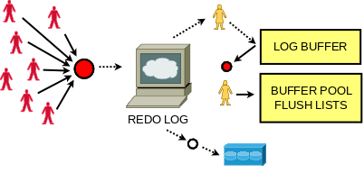

原有的WAL设计在针对这类场景上有一些缺陷, 因此我们需要此基础上做了改进设计. 改进后的方案需要满足一定的灵活性: 方便扩展sharding 和适配并发写入的需求. 同时, 这些改动也需要保证向前兼容已有的API, 还不能影响已有的InnoDB内部相关模块正常工作. 这个工作极具挑战性, 因此, 接下来我们会用较大篇幅阐述方案设计和相关的背景.

首先, 我们可以把Redo Log 本身抽象为一个持久化到磁盘的生产者/消费者(队列)模型. 生产者是负责写入更新的用户线程, 消费者是崩溃恢复时需要读取redo log的系统线程. 同时, InnoDB在预期内正常工作时不需要读取Redo log.

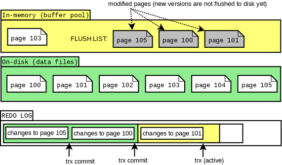

多个生产者模型下写日志可扩展性是一个我们要考虑的问题. 考虑InnoDB实现细节给方案设计带来的约束, 我们面临的第一个问题是: buffer pool中flush list上的脏页要满足按照LSN递增排布. 首先, 一个buffer pool实例维护一个flush list, 由mtr(mini transaction)负责原子的应用对物理页的修改, 因此, mtr是InnoDB对物理文件操作的最小事务单元. redo log由mtr产生, 通常先写在mtr的cache里, 在mtr提交时, 将cache中的redo log刷入log buffer(公共buffer), 同时递增全局维护的日志编号(LSN, Log Sequence Number). 随后Mtr负责将修改的脏页(或一列表脏页)加入到flush list上, 且满足flush list上的脏页是按照LSN递增排序的. 在8.0之前的实现中, 我们通过加内部锁`log_sys_t::mutex` 和 `log_sys_t::flush_order_mutex` 来保证flush list上页按照写log buffer 拿到的LSN有序.

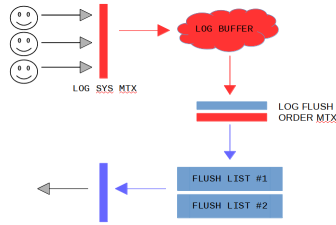

因此, 8.0前的工作方式如下: 某个mtr将脏页输入flush list时, 会持有锁`flush_order_mutex`, 这时, 即便另外一个线程A需要添加脏页到其他bp(buffer pool)的flush list, 也必须陷入等待. 这种情况下, 这个线A程通过持有log\_sys\_t::mutex, 阻塞其他线程写log buffer. 单纯移除这两个锁结构, 会使得flush list中LSN递增的约束不工作

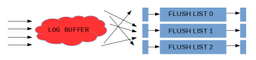

我们还面临的第二个问题是, 由于各个事务可以交叉拷贝redolog 到 log buffer中, log buffer上的LSN可能存在空洞(如下图所示), 所以log buffer是不可以一口气flush full log buffer.

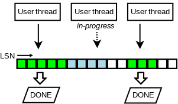

我们通过跟踪已经完成的写log buffer操作(如下图所示的)来解决第二个问题. 在设计上我们引入一个新的无锁数据结构(元素排列与原先log buffer对应关系如下图).

数据结构如下图所示. 首先这是一个定长数组, 并且保证数组元素(slot)更新是原子的, 以环形形式复用已经释放的空间(所以是个环形数组啊哈). 并启用单独的线程负责数组的遍历和空间回收, 线程在遇到空元素(empty slot)时暂停. 因此这个thread中还维护了这个数据结构中的最大可达LSN, 我们假设值为M

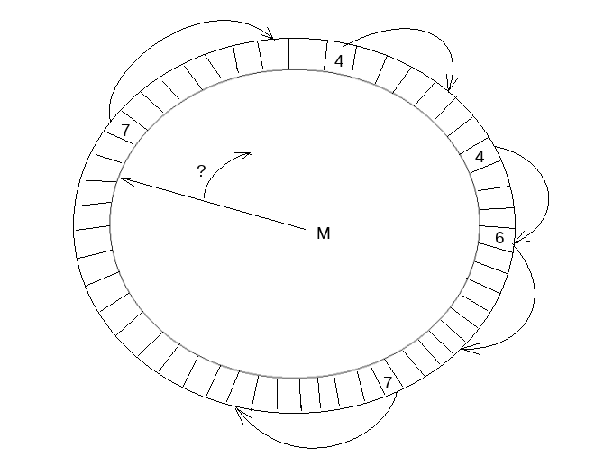

我们引入了这个数据结构的两个变量: `recent_written` 和 `recent_closed`. `recent_written` 维护写log buffer的完成状态, `recent_written`中维护的最大LSN, M表示, 所有小于这个M的LSN都已经将它的redo log写入log buffer. 而这个M也是(如果这下crash, 可能会触发的)崩溃恢复的截止位点, 同时也是下一个写log buffer操作的开始位点. 刷log buffer到磁盘和遍历`recent_written`是交由一个线程完成, 因此对log buffer的内存读写操作通过`recent_written`上顺序访问元素(slots)形成的屏障保证.

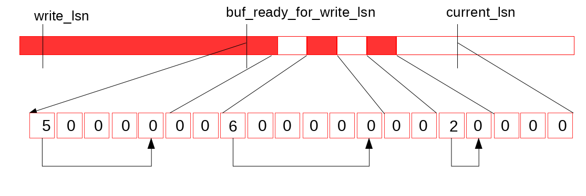

假设当前log buffer和`recent_written`状态如上图所示, 然后完成了一次buffer log 写, 使得log buffer状态如下图所示.

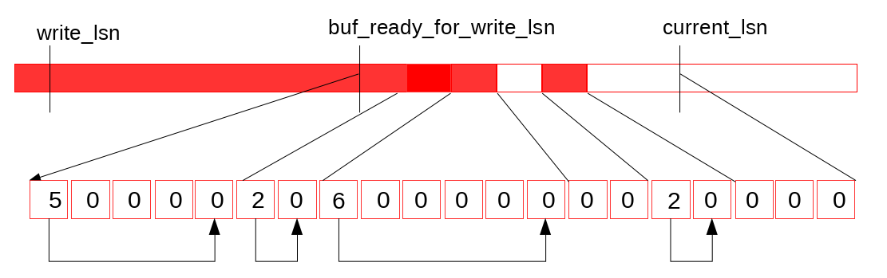

log buffer状态更新触发特定线程(log\_writter)向后扫描`recent_written`, (如下图)

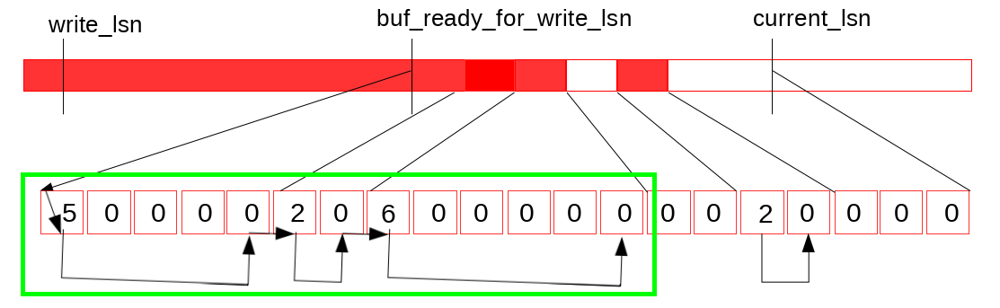

然后更新它维护的最大可达LSN值(可以保证无空洞的), 写入到变量`buf_ready_for_write_lsn` (这个变量顾名思义 XD)

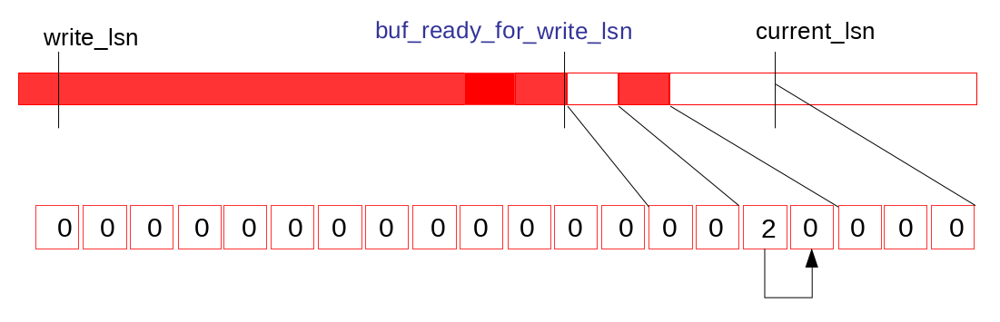

我们还引入另一个无锁结构体的变量`recent_closed`, 用来完成原先`log_sys_t::flush_order_mutex`锁所作的工作, 用来维护flush list的LSN递增性质. 在介绍实现细节前, 我们还需要解释一些细节来, 才能清晰的阐释图和使用无锁结构维护(flush list/bp)整体的LSN单调.

那么首先, 每个bp中的flush list有专门的内部锁保护. 但是我们已经移除了了锁结构`log_sys_t::flush_order_mutex`, 这就使得并发写flush list的LSN递增性质保证不了. 虽然如此, flush list正确工作仍然必须满足以下两个原生约束:

1.  Checkpoint - 对于检查点推进的约束: 假设存在脏页P1, LSN = L1, 脏页P2, LSN = L2, 如果L2 > L1, 且P1脏页未落盘, 不允许刷新L2对应的脏页到磁盘.
2.  FLushing - flush list 上刷脏策略约束: 每次flush必须从oldest page(即, page对应的LSN最小)开始. 这个操作保证最早被修改的也最先从flush list更新到磁盘, 同时还向后推进`checkpoint_lsn`.

新引入的无锁结构`recent_closed`, 用来跟踪并发写flush list的状态, 同时也维护一个最大LSN, 我们标记为M, 满足, 小于当前LSN的脏页都已经加入到flush list中. 只有在M值与当前线程不那么远的时候, 才能将它的脏页刷flush list. 在线程将脏页写入flush list后, 更新`recent_closed`中的状态信息.

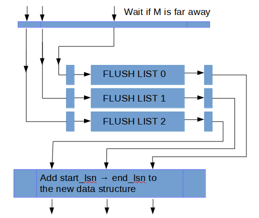

这样讲比较抽象, 我们用一个例子说明一下. 假设某个mtr提交, 这时它先拷贝了所有的redo 日志到log buffer, 这批redo log的LSN范围我们假设是\[start\_lsn, end\_lsn\]. 到这一步, 根据WAL定义, 当前lsn对应的redo已经写盘. 这里我们引入一个常数L, 用来量化flush list中lsn的可能的无序度, 然后, 当一个mtr的start\_lsn - M < L不满足时, 就阻塞当前mtr 写flush list. 等待上述条件满足后, mtr将它修改的所有脏页加入某个bp实例的flush list中. 接下来我们考察flush list的状态, 我们用`last_lsn`表示当前flush list中维护的版本最早的脏页. 在8.0之前, 当前list中所有脏页的更改时刻`oldest_modification`, 都满足`oldest_modification` >= `last_lsn`. 而8.0后重新设计过的结构下, 理论上约束变更为: `oldest_modification` >= `last_lsn` – L. 这一点通过前续中M, L的约束保证.

但是我们需要证明这样做的正确性. 假设存在两个页: P1, LSN = L1和P2, LSN = L2, P1先加入flush list, 且L2 < L1 - L. 在P1落flush list前, 我们能保证L1 - M < L, 又因为L2未插入flush list, 所以有约束M <= L2, 也就是说M不能推进到L2. 因此有不等式关系, L > L1 - M >= L1 - L2, 得到L2 > L1 - L, 与前提条件足L2 < L1 - L产生矛盾. 所以这个设计可以保证当前刷flush list的lsn前推L意外的LSN都在flush list里 (如下图new design表所示).

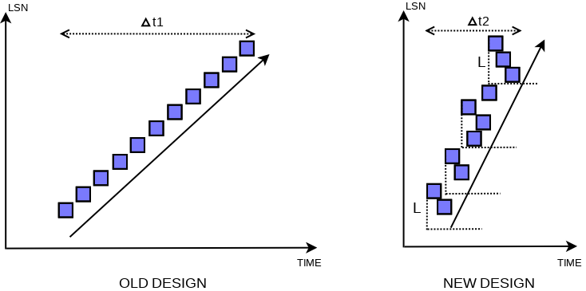

 实际这里的放宽了之前对于flush list中对于LSN全局有序的限制到, L范围内的有序. 实际flush list本地的脏页LSN非严格递增, 而是在一个窗口L下的递增. 这实际上不违反前面提到的约#束2. 然后我们使用last\_lsn - L也纳入检查点推进, 就也可以满足约束#1.

这个改动会对崩溃恢复有影响. 恢复逻辑可能从一些mtr的中间LSN位点开始恢复, 但是实际上需要通过parsing拿到起始mtr的位点. 还回到上面的例子. 当脏页全部刷进flush list后, 会返回start\_lsn, end\_lsn位点给`recent_close`. 那么工作在`recent_close`上的线程 `log_closer`遍历成功添加到flush list的LSN信息, 并更新最大LSN到end\_lsn(即, M = end\_lsn).

在引入无锁写log buffer, 和弱化flush list有序限制后, 降低了事务提交, 或者说mtr的并发操作之间的同步引入的性能损耗.

上面讨论更新操作写redo log buffer和脏页加入buffer pool的flush list的细节, 下面我们讨论log buffer刷盘的一些细节.

我们引入一些额外的后台线程(`log_writer`/ `log_flusher`, `log_flush_notifier`, `log_checkpointer`, …, 下文展开介绍这些线程的具体工作)负责写log buffer中的redo log到磁盘, 这个工作不在需要由用户线程来完成或触发. 用户线程只需要在自己的redo log 没落盘时陷入等待.

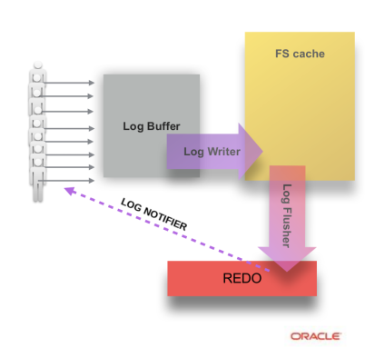

后台线程`log_writer`负责以整块(full block)为单位刷新log buffer到操作系统的Page Cache, 这也可以避免后续可能会产生覆盖部分写的数据块这种情况. 一旦数据写入log buffer, 后台线程就开始工作. 8.0以前的规则是, log buffer落盘是由写数据触发(日志先行嘛~)的全量log buffer写盘. 8.0下由`log_writer`线程触发. 这使得我们可以提前log buffer落盘的时间点, 而且因为不是以正规log buffer为单位刷盘, 粒度更细的推进式写法下, 我们可以比较灵活的做一些刷盘策略上的改进(比如, 跳过不完整的数据块). 并且`log_writer`线程负责推进最近一次写入到文件的LSN: write\_lsn.

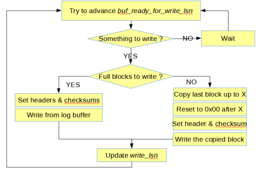

而后台线程`log_flusher`在读取到write\_lsn更新后, 调用一次`fsync()`, 然后更新最近一次fsync到文件的LSN: `flushed_to_disk_lsn`, 所以刷OS cache和调用`fsync()`交由两个后台线程并行工作完成的, 这两个线程之间的同步是由OS/文件系统的内部机制完成的(变量`write_lsn`的原子读写除外)

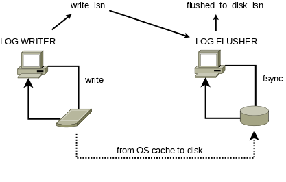

事务提交前, 执行当前线程中中后一个mtr, 且要等待redo log刷盘到这个mtr的`end_lsn`. 在8.0之前, 由用户线程触发fsync或者等先提交的线程的触发的fsync完成(还可能触发重试).

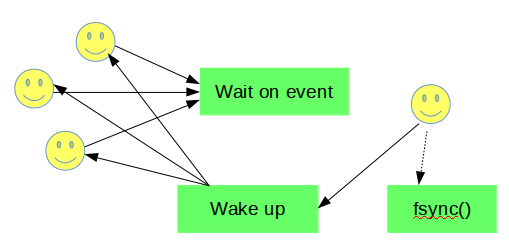

8.0下用户线程只需要等待`flushed_to_disk_lsn`被后台线程`log_flusher`调用fsync推进到足够大即可. 并且8.0中消息通知队列是分片实现的(如下图).连续的redo块也连续分布在分片上. 比如说一个线程提交阻塞在等待满足条件`flushed_to_disk_lsn >= X`, 消息就加入X所属的分片. 分片操作主要为了降低消息同步的信息损耗. 不过最重要的是, 分片本身减少消息同步需要通知的目的线程数目.

在变量在`flushed_to_disk_lsn`推进后, 后台线程`log_flush_notifier`通知等待这个LSN满足的线程. 这三个线程协同工作如下图所示:

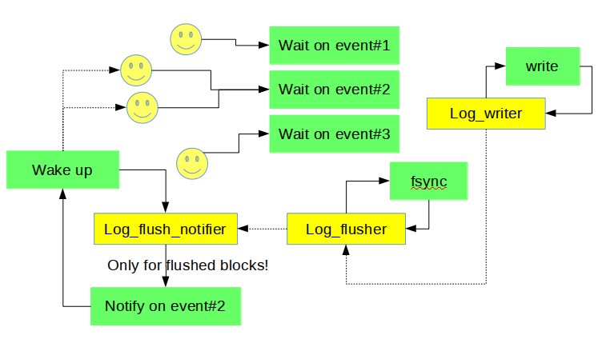

`innodb_flush_log_at_trx_commit =2`的配置下, 这个设计结构没啥变动, 当然, 因为这时用户并不关心是否fsync到磁盘, 所以通知线程`log_flush_notifier`主要等待刷OS Cache线程`log_writer`更新状态变量`write_lsn`, 然后发起消息通知.

因为如果线程立刻陷入等待状态, 然后等消息通知的做法可能增加延迟(rt), 所以我们可以选择在陷入等待前做一个自旋等. 当然, 这只能在我们CPU有富余的时候这么做. 我们对外开放两个Dynamic Variable: `innodb_log_spin_cpu_abs_lwm`和`innodb_log_spin_cpu_pct_hwm`, 可以用来配置自旋等待的高低水位

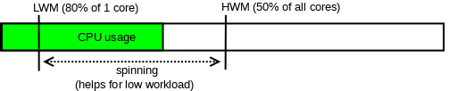

接下来讨论Checkpoint. 如前文所述, redo log(file)可以被看做生产者消费者队列. InnoDB依赖模糊的CP点(fuzzy checkpoint, 还记得前面那个无序LSN常数: L么?)开始做崩溃恢复. InnoDB通过刷脏页推进checkpoint位点, 不仅可以释放redo log file空间还能加快崩溃恢复的速度.

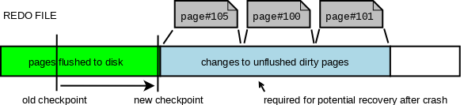

8.0之前Checkpoint, 可以通过用户线程竞争选举出负责推进CP. 现在我们通过后台线程`log_checkpointer`负责监控flush list里最老的页, 来推进Checkpoint(有很多策略, 由实际情况决定). 所以我们也不需要master thread来后台多定期刷checkpoint. 然后因为引入无锁的设计, 刷脏时间理论上从7s降低到1s. 所以处理事务速度更快(然后因为写数据更快了, 崩溃恢复时工作量减小, 消耗时间也降低).

WAL上的设计变动提高了数据更新的并发度, 只引入一个相对较小的用户线程间的同步损耗.

这里我们用sysbench做了一个测试(oltp update\_nokey, 8 tables, 10M rows/table, innodb\_flush\_log\_at\_trx\_commit = 1), 对别这个改进前后的性能数据, 如下所示.

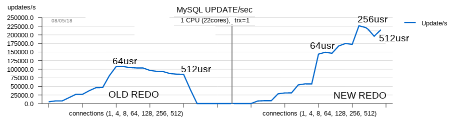

更多测试细节可以见[MySQL Performance : 8.0 and Sysbench OLTP\_RW / Update-NoKEY](http://dimitrik.free.fr/blog/archives/2018/05/mysql-performance-80-and-sysbench-oltp_rw-updatenokey.html)

Thank you for using MySQL !

(玩儿得开心喔~ ╰(_°▽°_)╯

[阿里云RDS-数据库内核组](http://mysql.taobao.org/)  
[欢迎在github上star AliSQL](https://github.com/alibaba/AliSQL)  
阅读： -  
  
本作品采用[知识共享署名-非商业性使用-相同方式共享 3.0 未本地化版本许可协议](http://creativecommons.org/licenses/by-nc-sa/3.0/)进行许可。

---------------------------------------------------

原网址: [访问](http://mysql.taobao.org/monthly/2018/06/01/)

创建于: 2020-10-02 20:42:40

目录: default

标签: `mysql.taobao.org`

