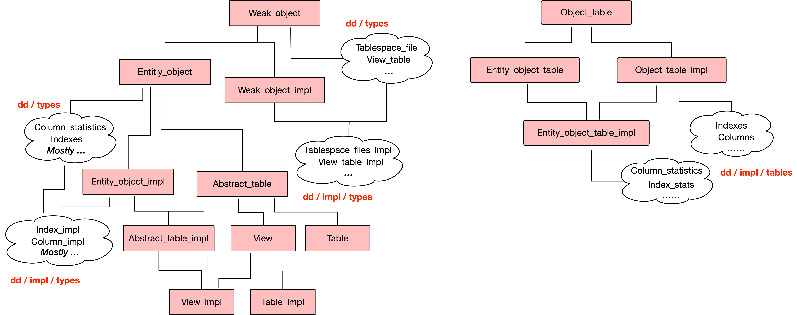

# [InnoDB（18）：Data Dictionary]

## 概念介绍

### MySQL system tables

MySQL data dictionary （简称 DD）是一些列表的统称，是 MySQL system tables 的一部分。data dictionary 包含的是 SQL 执行需要的 metadata，而其他 system table 多种多样，见 [5.3 The mysql System Schema](https://dev.mysql.com/doc/refman/8.0/en/system-schema.html#system-schema-data-dictionary-tables)

 展开源码

The mysql System Schema 的表可以分成如下种类：

1.  Data Dictionary Tables：data dictionary 里的表默认是**隐藏的**，未在上图出现。查看方法在 [14.1 Data Dictionary Schema](https://dev.mysql.com/doc/refman/8.0/en/data-dictionary-schema.html)
    
2.  Grant System Tables：权限表
    
3.  Object Information System Tables：component / func / plugin
    
4.  Log System Tables：general\_log / slow\_log
    
5.  Server-Side Help System Tables
    
6.  Time Zone System Tables
    
7.  Replication System Tables
    
8.  Optimizer System Tables：innodb\_index\_stats / innodb\_table\_stats
    
9.  Miscellaneous System Tables
    

### DDSE：事务型引擎

data dictionary 使用事务型存储引擎来存储（Data Dictionary Storage Engine，简称 DDSE），当前只有 InnoDB。data dictionary 的表位于一个独立的 InnoDB tablespace，是 mysql.ibd（名字不能被修改或作他用）

### Dictionary Object Cache

因为 data dictionary 主要是用于支持 Server 层 SQL 执行，因此在 Server 层通过维护 **cache** 来降低访问的开销（Dictionary Object Cache，简称 DOC）。DOC 由 cache partitions 组成，每个 partition 包含不同的 object 类型，例如 tablespace definition cache partition / schema definition cache partition ...

## Data Dictionary

### Data Dictionary Tables

data dictionary tables 是 mysql system tables 中的一部分，默认是隐藏的，查看方法是 [Viewing Data Dictionary Tables Using a Debug Build of MySQL](https://dev.mysql.com/doc/refman/8.0/en/data-dictionary-schema.html)

 展开源码

在具体的实现中，data dictionary 的目录结构如下。对于每个表都对应着在 types 和 impl/types 和 impl/tables 三个目录下的文件，例如 indexes 表

```plain
sql/dd
 |- cache
 |- types index.h
 |- impl
  |- types index_impl.h index_impl.cc // 表的功能实现
  |- tables indexes.h indexes.cc // 表的定义
```

data dictionary 是由类之间的继承关系组成，十分复杂

  



  

我们逐个分析。首先每个类都存在其对应的以 **\_impl** 结尾的子类，如 Weak\_object / Weak\_object\_impl。大体上，原类负责表的定义，子类负责对表的操作的实现（e.g. 增删改查）

Weak\_object 是所有 data dictionary object 的基类，不包含任何成员。

Entity\_object 是 data dictionary object 中，primary key 是单一的整数列的 object 的基类

**TODO：**为何 sync\_meta\_data 里使用的是 dd:Table 类型，dd::Table 类型与具体的表类型（如 Indexes）是什么关系

在 [The mysql System Schema](https://dev.mysql.com/doc/refman/8.0/en/system-schema.html#system-schema-data-dictionary-tables) 里可以看到 DD 里所有的表（e.g indexes / collations ...），我们以 indexes 举例来说明 DD 的实现，indexes 表的定义在 dd / impl / tables / indexes.h 中

 展开源码

indexes 表中每一行从磁盘存储格式 / 内存存储格式的持久化功能在 dd / impl / types / indexes\_impl.h 中

```plain
bool Index_impl::store_attributes(Raw_record *r)
bool Index_impl::restore_attributes(const Raw_record &r)
```

### Dictionary Client

dictionary client 是 SQL 层和引擎层访问 data dictionary 的统一入口。提供两种最基本的 API：acquire（读）/ store（写）

#### Acquire

通过调用 acquire 来查询有三个步骤：

1.  现在本地的缓存（object registry，由成员 **m\_registry\_committed** 实现）查询
2.  再到公共缓存（doc，dictionary object cache）查询
3.  最后存储引擎（ddse）查询

#### Store

通过调用 store 来存储有三个步骤：

1.  当事务执行时，先存储在本地缓存（object registry，由成员 **m\_registry\_uncommitted** 实现），表示未提交的修改（无法通过 doc 查询）
2.  当事务提交时，更新 doc 中的 object（commit\_modified\_objects）

### Storage Adapter

storage adapter 是与 ddse 打交道的入口，会直接调用 handler 接口来直接读写存储引擎。core storage 是专门存储 种类为 core 的 MySQL system tables

**TODO**

1.  什么是 storage adapter 的 core storage？只是一个本地缓存？，和 doc（Dictionary Object Cache）有什么关系？
2.  dc（datationary client）的 m\_registry\_committed 是什么？只是一个本地缓存？

### 初始化流程

```plain
#0  dd::Dictionary_impl::init (dd_init=dd::enum_dd_init_type::DD_RESTART_OR_UPGRADE)
    at /home/wuhao27/workspace/mysql-8018-trunk/sql/dd/impl/dictionary_impl.cc:101
#1  0x000000000424d35f in dd::init (dd_init=dd::enum_dd_init_type::DD_RESTART_OR_UPGRADE) at /home/wuhao27/workspace/mysql-8018-trunk/sql/dd/impl/dd.cc:65
#2  0x0000000002e97e88 in init_server_components () at /home/wuhao27/workspace/mysql-8018-trunk/sql/mysqld.cc:5518
#3  0x0000000002e9c006 in mysqld_main (argc=80, argv=0x7a72da0) at /home/wuhao27/workspace/mysql-8018-trunk/sql/mysqld.cc:6538
#4  0x0000000002e8ab45 in main (argc=2, argv=0x7fffffffe1c8) at /home/wuhao27/workspace/mysql-8018-trunk/sql/main.cc:25
```

最开始的调用栈如上，在 dd::Dictionary\_impl::init 中就会根据 enum\_dd\_init\_type 来决定接下来调用的函数

*   DD\_INITIALIZE：当以 --initialize-secure 或 --initialize-insecure 方式启动 MySQL 时，调用 bootstrap::initialize
    
*   DD\_RESTART\_OR\_UPGRADE：MySQL 重启，调用 upgrade\_57::do\_pre\_checks\_and\_initialize\_dd
*   DD\_INITIALIZE\_SYSTEM\_VIEWS
    
*   DD\_POPULATE\_UPGRADE
    
*   DD\_DELETE
    
*   DD\_UPDATE\_I\_S\_METADATA
    

注意这里会开启一个线程 key\_thread\_bootstrap 来执行 bootstrap::initialize 或 upgrade\_57::do\_pre\_checks\_and\_initialize\_dd 等等，并且同步的等待该线程执行完。在数据库第一次初始化时的流程为

```plain
bootstrap::initialize
 |- DDSE_dict_init
 |- initialize_dictionary
  |- store_predefined_tablespace_metadata
  |- create_dd_schema
  |- initialize_dd_properties
  |- create_tables
  |- ...
```

### 重启动流程

Data Dictionary 重启过程有三个阶段

**1. Preparation phase**

**2. Scaffolding phase**

函数 create\_dd\_schema / create\_tables 完成。只是把相应的 dd:Schema 和 dd:Table 对象存储到 storage adapter 的 core storage 里（一个缓存）。这里的目的是使用这些 fake metadata 来打开磁盘上真正的 data dictionary 表，打开的过程需要这些初级的 metadata。fake metadata 生成的方式是执行 SQL，例如 

```sql
CREATE TABLE innodb_ddl_log(\n  id BIGINT UNSIGNED NOT NULL AUTO_INCREMENT,\n  
thread_id BIGINT UNSIGNED NOT NULL,\n  type INT UNSIGNED NOT NULL,\n  space_id INT UNSIGNED,
\n  page_no INT UNSIGNED,\n  index_"...}
```

这是完整的调用栈

 展开源码

**3. Synchronization phase**

函数 sync\_meta\_data 完成。使用第2步里 fake metadata，来打开 data dictionary 表。调用栈是

 展开源码

在 open\_table\_def 里会使用 dd:Table 对象填充 TABLE\_SHARE 对象。在 MySQL 5.6 中，TABLE\_SHARE 对象里的信息是通过打开 frm 文件中的内容来填充的。并且注意，在第3步里从磁盘上生成真正的 data dictionary 中每张表的 dd:Table 对象时使用的是 dd::cache::Storage\_adapter::instance()→get，并且设置 bypass\_core\_registry 为 true。意味着会调用 DDSE（InnoDB）handler 接口真正的从磁盘上读出。

我们来分析重启的代码，从 upgrade\_57::do\_pre\_checks\_and\_initialize\_dd 开始

```plain
upgrade_57::do_pre_checks_and_initialize_dd
 |- DDSE_dict_init
 |- restart_dictionary
  |- bootstrap::restart
    |- store_predefined_tablespace_metadata
    |- create_dd_schema
    |- initialize_dd_properties
    |- create_tables
    |- sync_meta_data
    |- DDSE_dict_recover
    |- ...
```
