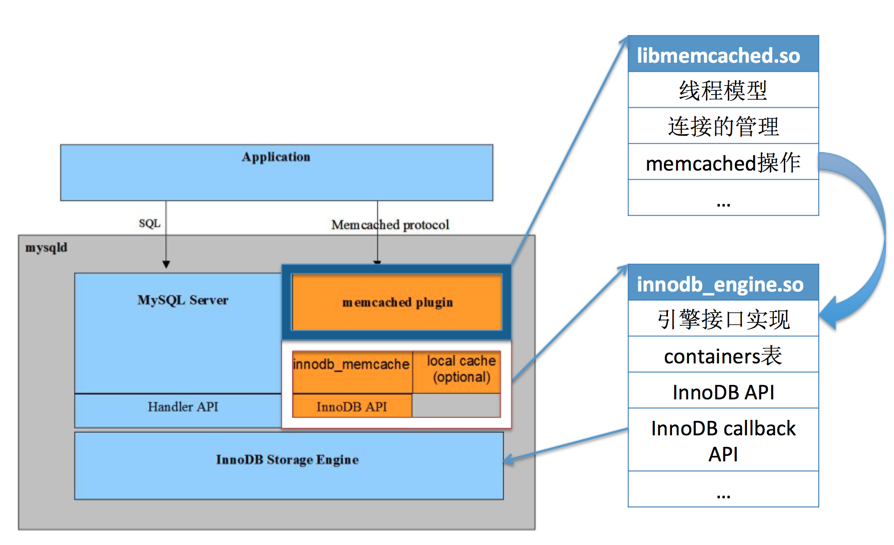
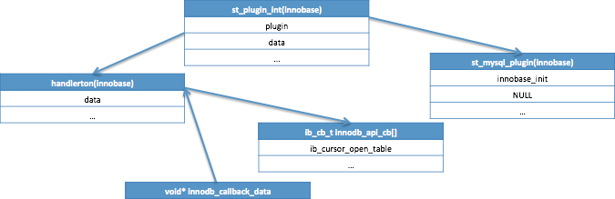
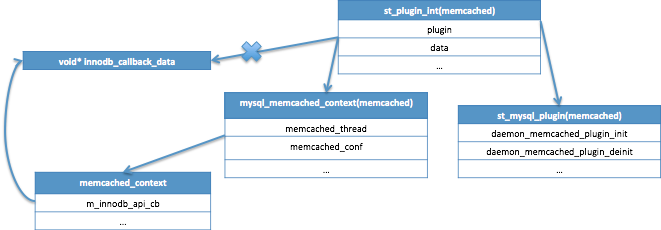
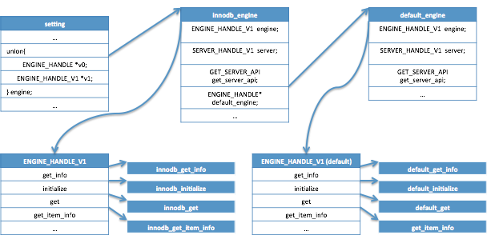
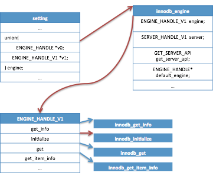
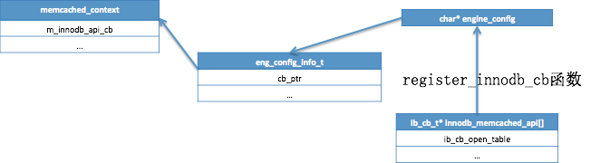
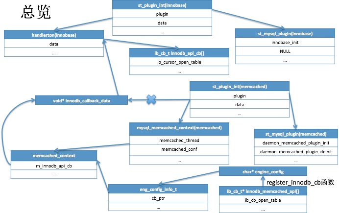

# 从源码角度看MySQL memcached plugin——1. 系统结构和引擎初始化 - ohmhong - 博客园

本章尝试回答两个问题：  
一、memcached plugin与MySQL的关系；  
二、MySQL系统如何启动memcached plugin。

## 1\. memcached plugin与MySQL的关系



该图是从MySQL官方文档里对memcached的介绍图片。从图中可以看出，memcached的结构是由三个部份组成：memcached plugin、innodb_memcached和Innodb API。

在源码中，memcached plugin部份的代码会被编译成libmemcached.so；innodb\_memcache和InnoDB API会被编译成innodb\_engine.so。

memcached plugin层通过一组回调函数调用libmemcached.so提供的接口实现为App服务。

InnoDB API层同样也是通过一组回调函数调用InnoDB层的接口实现，功能类似于图中左侧的Handler API。而innodb_memcache通过包装这组回调函数为memcached plugin提供接口实现。

## 2\. MySQL系统如何启动memcached plugin

在MySQL中，InnoDB存储引擎和memcached都是以插件的形式实现。memcached最底层的回调函数是由InnoDB存储引擎提供，于是在插件初始化的顺序上是InnoDB插件先于memcached插件。

InnoDB存储引擎插件调用plugin\_initialize函数初始化时将一组回调函数数组的地址传给全局指针变量innodb\_callback\_data。memcached引擎插件调用plugin\_initialize函数初始化时将innodb\_callback\_data作为自己的参数传入。

插件初始化使用的函数plugin\_initialize的函数原型是int plugin\_initialize(st\_plugin\_int *plugin);  
参数类型为st\_plugin\_int的结构体。MySQL使用该结构体描述一个插件。其中有两个变量，data和plugin。plugin变量存放了插件的init和deinit回调函数，这是插件初始化时真实调用的函数；data作为plugin中的回调函数的参数存在。

```plain
int plugin_initialize(st_plugin_int *plugin);

/* A handle of a plugin */
struct st_plugin_int
{
  ...
  st_mysql_plugin *plugin;
  void *data;                   /* plugin type specific, e.g. handlerton */
  ...
};

struct st_mysql_plugin
{
  ...
  int (*init)(MYSQL_PLUGIN);  /* the function to invoke when plugin is loaded */
  int (*deinit)(MYSQL_PLUGIN);/* the function to invoke when plugin is unloaded */
  ...
};
```

### 3.1 InnoDB如何将回调函数传给全局变量innodb\_callback\_data

InnoDB层提供的回调函数是个数组，数组名为innodb\_api\_cb。

```plain
ib_cb_t innodb_api_cb[] = {
	(ib_cb_t) ib_cursor_open_table,
	...
};
```



在plugin\_initialize函数里，调用plugin->plugin->init函数(innobase\_init函数)。如上图：

1.  将innodb\_api\_cb数组的地址赋值到在plugin->data->data中。
2.  将plugin->data->data赋值到innodb\_callback\_data。

到此可以看到innodb\_callback\_data已经指向了一个回调函数数组的地址。

### 3.2 memcached如何将innodb\_callback\_data赋值给innodb_engine.so中的回调函数

初始化memcached插件同样调用的是plugin\_initialize函数，将innodb\_callback\_data赋值给plugin->data之后，调用plugin->plugin->init函数(daemon\_memcached\_plugin\_init函数)。

完成了插件初始化的基本操作之后，开启一个新的线程daemon\_memcached\_main，这个线程是memcached插件系统的daemon线程。

```plain
void daemon_memcached_main(memcached_context_t* p);

struct memcached_context
{
	char*		m_engine_library;
	char*		m_mem_option;
	void*		m_innodb_api_cb;
	unsigned int	m_r_batch_size;
	unsigned int	m_w_batch_size;
	bool		m_enable_binlog;
};
```



在开启线程daemon\_memcached\_main之前，会将plugin->data(innodb\_callback\_data)赋值给p->m\_innodb\_api_cb。

daemon\_memcached\_main在进入守护状态之前，还有两个重要的操作要做，分别是load engine和init engine函数。而这两个函数分别做了什么？

1.  load engine: 连接libmemcached.so的回调函数与innodb_engine.so的实现。
2.  init engine: 连接innodb\_engine.so的innodb\_callback_API的回调函数与InnoDB层的实现。

#### 3.2.1 load engine

```css
load_engine(engine, get_server_api,settings.extensions.logger,
 &engine_handle);
```

load\_engine的函数原型如上。在这个过程中，会load两个引擎。一个innodb\_engine，一个是default_engine。  
过程如下：

1.  调用dlopen打开innodb_engine.so。
2.  调用dlsym函数获得create_instance函数的地址。
3.  调用create\_instance，malloc一个struct innodb\_engine的结构体innodb\_engine，为innodb\_engine回调函数赋值。
4.  调用create\_instance|create\_my\_default\_instance为默认引擎的回调函数赋值。

load engine之后，lib\_memcached.so中的回调函数会被赋值，实现是在innodb\_engine.so中。



InnoDB Engine与Default Engine是否启用？是否同时启用？

```plain
/** Cache options, tells if we will used Memcached default engine or InnoDB
Memcached engine to handle the request */
typedef enum meta_cache_opt {
	META_CACHE_OPT_INNODB = 1,	/*!< Use InnoDB Memcached Engine only */
	META_CACHE_OPT_DEFAULT,		/*!< Use Default Memcached Engine only */
	META_CACHE_OPT_MIX,		/*!< Use both, first use default memcached engine */
	META_CACHE_OPT_DISABLE,		/*!< This operation is disabled */
	META_CACHE_NUM_OPT		/*!< Number of options */
} meta_cache_opt_t;

```

默认的参数值为META\_CACHE\_OPT\_INNODB，仅仅启用InnoDB Engine，数据通过InnoDB引擎提供的Callback方法操作；若同时启用了Memcached Default Engine(META\_CACHE\_OPT\_MIX)，那么数据读取时，首先从Default Engine中读取；记录删除时，也需要先删除Default Engine中的记录。

#### 3.3.2 init engine

init engine调用的函数是

```plain
innodb_eng->engine.v1->initialize
```

实际上调用的是实现在在innodb\_engine.so的innodb\_initialize函数。



在这个innodb\_initialize函数中调用register\_innodb\_cb函数为innodb\_memcached_api数组赋值。两个数组的指针顺序要一一对应。

innnodb\_memcached\_api数组是innodb_engine.so中调用innodb层操作的回调函数数组。



以下这图是这个过程中innodb的函数指针一路传递到memcached的innodb_engine.so中的函数指针的过程。



---------------------------------------------------


原网址: [访问](https://www.cnblogs.com/ohmhong/p/6886150.html)

创建于: 2020-05-19 18:31:10

目录: default

标签: `www.cnblogs.com`

