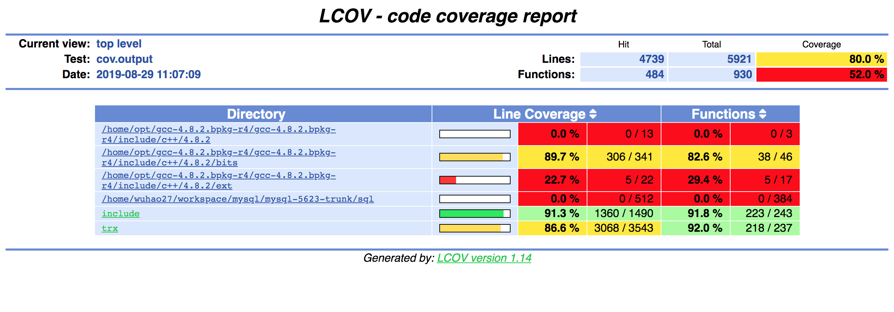

# [MySQL Test Framework]

## MySQL Test Facility

MySQL Server提供了一系列方便测试的工具型代码实现，主要介绍

*   DEBUG SYNC：构造线程间的同步执行关系
*   Test Fault Macros：对某个函数进行错误注入

注意：DEBUG SYNC / Test Fault Macros 等功能对于后台线程（客户端无法直接控制的线程， e.g InnoDB purge thread）失效，其根本原因在设计上，在于代码内埋伏的同步点的激活需要通过客户端（SET DEBUG\_SYNC语句）

### DEBUG SYNC的使用

```plain
1. MySQL编译时（cmake）-DWITH_DEBUG=1
2. mysqld --debug (some other options)
```

常用的使用方式如下，表示到达指定同步点<sync point name>时，发射信号<signal 1>，并等待信号<signal 2>

```plain
SET DEBUG_SYNC="<sync point name> SIGNAL <signal 1> WAIT FOR <signal 2>"
```

#### 一个例子

我们通过一个例子来学习DEBUG SYNC的使用

| 
Session 1

 | 

Session 2

 |
| --- | --- |
| 

```plain
// 重置所有的同步点
```

```plain
SET DEBUG_SYNC= 'RESET';
```


 | 

```plain
// "now"是特殊的信号名称。等待信号opened，否则一直阻塞
```

```plain
SET DEBUG_SYNC= 'now WAIT_FOR opened';
```


 |
| 

```plain
// 到达同步点before_lock_tables_takes_lock后，发射"opened"信号，等待"flushed"信号
```

```plain
SET DEBUG_SYNC= 'before_lock_tables_takes_lock SIGNAL opened WAIT_FOR flushed';
```


 |   
 |
| 

```plain
// 阻塞在DEBUG_SYNC(thd, "before_lock_tables_takes_lock");
```

```plain
INSERT INTO t VALUES (1); 
```


 |   
 |
|   
 | 

```plain
SET DEBUG_SYNC= 'after_flush_unlock SIGNAL flushed';
```


 |
|   
 | 

```plain
// 到达同步点after_flush_unlock后，发射"flushed"信号
```

```plain
FLUSH TABLE t1;
```


 |
| 

```plain
INSERT INTO t VALUES (1); 执行完毕
```


 |   
 |

#### 典型的设计

这种一种得到两个线程执行执行序列的典型设计

1）在代码中设置同步点

| 
Thread 1

 | 

Thread 2

 |
| --- | --- |
| Part A1 | Part A2 |
| **DEBUG\_SYNC(“after\_A1”)** | **DEBUG\_SYNC(“after\_A2”)** |
| Part B1 | Part B2 |
| **DEBUG\_SYNC(“after\_B1”)** |   
 |

2）执行

如下的设置能保证执行顺序是A1 - A2 - B1 - B2

| 
Session 1

 | 

Session 2

 |
| --- | --- |
| 

set debug\_sync="after\_A1 **SIGNAL** _stepA1_ **WAIT\_FOR** _stepA2_";

set debug\_sync=”after\_B1 **SIGNAL** _stepB1_”;

 | 

set debug\_sync = "now **WAIT\_FOR** _stepA1_ ";

 |
| Some SQL ... |   
 |
|   
 | 

set debug\_sync = "after\_A2 **SIGNAL** _stepA2_ **WAIT\_FOR** _stepB1_";

 |
|   
 | Some SQL ... |

### Test Fault Macros

这里可以方便的进行错误场景的测试

```plain
void function(void) 
{
  DBUG_CRASH_ENTER("function");
  if (DBUG_EVALUATE_IF("process_if", 1, 0))
  {
    DBUG_EXECUTE_IF("process_code", {
      const char *old_proc_info= thd->proc_info;
      thd->proc_info= "DBUG sleep";
      my_sleep(6000000);
      thd->proc_info= old_proc_info;});
  }
  DBUG_CRASH_VOID_RETURN;
}
```

使用方式如下：

*   SET SESSION debug="+d,function\_crash\_enter"：在进入函数时Crash
*   SET SESSION debug="+d,function\_crash\_return"：在返回函数时Crash  
    
*   SET SESSION debug="+d,process\_if"：在函数中执行if中的代码部分  
    
*   SET SESSION debug="+d,process\_code"：执行"process\_code"中的代码部分，就是sleep(6000000) ...

## MySQL Test Framwork

MySQL Test Framework的核心是MySQL Test Language，由mysqltest（语言解释器）实现，全部的文档在[The MySQL Test Framework](https://dev.mysql.com/doc/dev/mysql-server/latest/PAGE_MYSQL_TEST_RUN.html)

主要的组件是：

*   **mysql-test-run.pl（Perl）**：执行MySQL Test的应用程序，它会对每一个测试用例（.test文件）调用mysqltest，并与预期结果（.result文件）对比来决定测试是否成功
*   **mysqltest（C++）**：MySQL自定义测试语言的语法解析器
*   **mysql-stress-test.pl（Perl）**：MySQL Server的压力测试程序
*   **mysql\_client\_test（C）**：MySQL Client（API）的测试

执行方式及结果如下：

```plain
<path-to-mysql>/mysql-test$ ./mysql-test-run --nowarnings flush_read_lock_kill
 
Logging: ./mysql-test-run  --nowarnings flush_read_lock_kill
2019-03-21 16:40:13 46990 [Warning] Using pre 5.5 semantics to load error messages from /home/wuhao27/projects/mysql-5623-standard/share/mysql/.
2019-03-21 16:40:13 46990 [Warning] If this is not intended, refer to the documentation for valid usage of --lc-messages-dir and --language parameters.
2019-03-21 16:40:13 46990 [Note] Plugin 'FEDERATED' is disabled.
2019-03-21 16:40:13 46990 [Note] Binlog end
2019-03-21 16:40:13 46990 [Note] Shutting down plugin 'CSV'
2019-03-21 16:40:13 46990 [Note] Shutting down plugin 'MyISAM'
MySQL Version 5.6.23
Checking supported features...
 - SSL connections supported
 - binaries are debug compiled
Collecting tests...
Checking leftover processes...
Removing old var directory...
Creating var directory '/home/wuhao27/projects/mysql-5623-standard/mysql-test/var'...
Installing system database...
 
==============================================================================
 
TEST                                      RESULT   TIME (ms) or COMMENT
--------------------------------------------------------------------------
 
worker[1] Using MTR_BUILD_THREAD 300, with reserved ports 13000..13009
main.flush_read_lock_kill                [ pass ]    731
--------------------------------------------------------------------------
The servers were restarted 0 times
Spent 0.731 of 18 seconds executing testcases
 
Completed: All 1 tests were successful.
```

### 一个Test Case的分析

以flush\_read\_lock\_kill.test为例，来稍微详细的分析这个Test Case；这个用例主要来测试在FTWRL在等待活跃事务提交时是否可以被Kill，每一个测试用例文件都包含两种语言：控制语言（自定义测试语言）与SQL

```sql
# 头文件，即把常用的测试代码集成到一个文件中，方便多个测试用例的调用
--source include/not_embedded.inc
--source include/have_debug.inc
 
# 对一个实例建立两个连接，命名为con1 / con2
connect (con1,localhost,root,,);
connect (con2,localhost,root,,);
 
# 切换到第一个连接
connection con1;
SET DEBUG_SYNC= 'RESET';
CREATE TABLE t1 (kill_id INT) engine = InnoDB;
INSERT INTO t1 VALUES(connection_id());
 
# 切换到默认的（mysqltest建立的）连接，在文档中有如下描述：
# connection [connection_name]:
#     Select connection_name as the current connection. To select the connection that mysqltest opens 
#     when it starts, use the name default.
# 激活同步点"ha_commit_trans_after_acquire_commit_lock"，该同步点位于两阶段提交之前，获取MDL_key::COMMIT之后
connection default;
BEGIN;
INSERT INTO t1 VALUES(connection_id());
SET DEBUG_SYNC='ha_commit_trans_after_acquire_commit_lock SIGNAL acquired WAIT_FOR go';
--send COMMIT
 
# 切换到第一个连接，执行FTWRL; send的本意是执行语句但不等待结果返回（由reap查看）
connection con1;
SET DEBUG_SYNC='now WAIT_FOR acquired';
send FLUSH TABLES WITH READ LOCK;
 
# 切换到第二个连接，并等待直到"Waiting for commit lock"
connection con2;
SELECT ((@id := kill_id) - kill_id) FROM t1 LIMIT 1;
 
let $wait_condition=
  select count(*) = 1 from information_schema.processlist
  where state = "Waiting for commit lock"
  and info = "flush tables with read lock";
--source include/wait_condition.inc
 
# Kill 第一个连接
KILL CONNECTION @id;
 
# 切换到第一个连接，发现出现error 1317 / error 2013，即为测试结果正确
# 在.result文件中会出现"Got one of the listed errors"
# reap是（异步地）读取之前send的语句的执行结果
connection con1;
--echo # Try to reap FLUSH TABLES WITH READ LOCK, 
--echo # it fail due to killed statement and connection.
--error 1317,2013
reap;
 
# 切换到第二个连接，为何需要再次切换到第二个连接？上文的KILL CONNECTION是由哪个连接执行的？
connection con2;
SET DEBUG_SYNC='now SIGNAL go';
 
# 切换到默认的连接，断开第二个连接
connection default;
disconnect con2;
DROP TABLE t1;
SET DEBUG_SYNC= 'RESET';
```

测试用例的执行过程是：

| 
Default

 | 

Connection 1

 | 

Connection 2

 |
| --- | --- | --- |
| 

```plain
SET DEBUG_SYNC='ha_commit_trans_after_acquire_commit_lock 
```

```plain
SIGNAL acquired WAIT_FOR go';
```


 | 

```plain
SET DEBUG_SYNC='now WAIT_FOR acquired';
```


 | 

  


 |
| 

```plain
BEGIN;
```

```plain
INSERT INTO t1 VALUES(connection_id());
```

```plain
COMMIT; // 阻塞 ...
```


 | 

```plain
send FLUSH TABLES WITH READ LOCK;
```

// 阻塞在获取MDL\_key::COMMIT时

 |   
 |
|   
 |   
 | 

```plain
// 等待Connection阻塞在获取
获取MDL_key::COMMIT时
```

```plain
KILL CONNECTION @id;
```


 |
|   
 |   
 | 

```plain
SET DEBUG_SYNC='now SIGNAL go';
```


 |
| 

```plain
// 被第二个连接唤醒，继续执行
```

```plain
disconnect con2;
DROP TABLE t1;
SET DEBUG_SYNC= 'RESET';
```


 |   
 |   
 |

## MySQL执行单元测试与覆盖率统计

使用的开源工具是：

*   GCOV 4.8.2
*   LCOV 1.14

这里用<mysql-source-dir>表示MySQL的源代码目录，<mysql-install-dir>表示MySQL的安装目录

1\. CMake时打开以下选项

```plain
-DENABLE_GCOV=1
-DWITH_DEBUG=1（或者-DCMAKE_BUILD_TYPE='Debug'）
```

2\. 在安装目录下执行mysql-test目录下的测试用例

```plain
$ cd <mysql-install-dir>/mysql-test
# 只执行innodb/innodb_fts/innodb_zip三个suite
$ ./mysql-test-run.pl --nowarning --force --big-test --suite=innodb,innodb_fts,innodb_zip
```

3\. 在源代码目录下得到文件的覆盖率统计

比如想要得到<mysql-source-dir>/storage/innobase/trx文件夹下各个文件的覆盖率统计

```plain
$ cd <mysql-install-dir>/storage/innobase/trx
# 如果看到类似报错version '408*', prefer '404R'，加上--gcov-tool /opt/compiler/gcc-4.8.2/bin/gcov选项
$ lcov -c -o cov.output -d .
$ genhtml -o cov_output_dir cov.output
# 生成cov_output_dir文件夹
$ ls cov_output_dir
amber.png    gcov.css   home     index.html         index-sort-l.html  snow.png  storage
emerald.png  glass.png  include  index-sort-f.html  ruby.png           sql       updown.png
```

4\. 图形化展示文件的覆盖率

```plain
使用浏览器打开cov_output_dir下的index.html文件
```



## 参考

*   [The MySQL Test Framework](https://dev.mysql.com/doc/dev/mysql-server/latest/PAGE_MYSQL_TEST_RUN.html)

  


