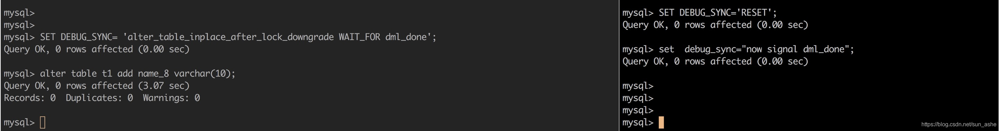

# MySQL Debug sync功能使用简介

  

[sunashe](https://me.csdn.net/sun_ashe) 2020-02-07 09:36:01  245  收藏 

分类专栏： [MySQL](https://blog.csdn.net/sun_ashe/category_2917347.html)

版权

[


MySQL-源码研究

MySQL内核的研究记录

sunashe


](https://blog.csdn.net/sun_ashe/category_9598377.html)

¥9.90

订阅博主

debug sync是MySQL提供的一种代码调试，问题分析工具， 它集成在MySQL的内部。具体作用是：

*   让代码执行到某个特殊的位置(同步点)时触发暂停，等待指定的某个或者多个signal
*   在激活同步点，并且被触发时，可以向别的线程发送signal，唤醒其他线程
*   在激活同步点，并且被触发时，可以被别的线程通过signal唤醒继续执行
*   可以设置同步点的等待超时时间

要求：只能在debug版本中使用。

特殊的位置指的是，代码放置的同步点，通过宏定义DEBUG\_SYNC来放置。

```
 DEBUG_SYNC(thd, "alter_table_inplace_after_lock_downgrade");
```

语法规则如下：

*   触发某个同步点时暂停，并且等待signal dml\_done.

```
SET DEBUG_SYNC= 'alter_table_inplace_after_lock_downgrade WAIT_FOR dml_done';
```

signal可以随意命名

*   触发某个同步点时暂停，并且发送一个signal，等待另外一个signal触发

```
SET DEBUG_SYNC= 'alter_table_inplace_after_lock_downgrade SIGNAL downgraded WAIT_FOR dml_done';
```

如上所示就是让当前线程执行到代码`DEBUG_SYNC(thd, "alter_table_inplace_after_lock_downgrade");`时，发送downgraded，并且等待dml\_done

*   通过另外一个线程发送signal dml\_done，来唤醒在同步点等待的线程。

```
SET DEBUG_SYNC= 'now SIGNAL dml_done';
```

*   等待超时是通过mysqld启动参数–debug-sync-timeout 来设置。超时的示例如下：

```
mysql> SET DEBUG_SYNC= 'alter_table_inplace_after_lock_downgrade WAIT_FOR dml_done';
Query OK, 0 rows affected (0.00 sec)

mysql> alter table t1 add name_5 varchar(10);
Query OK, 0 rows affected, 1 warning (10.05 sec)
Records: 0  Duplicates: 0  Warnings: 1

mysql> show warnings;
+---------+------+---------------------------------+
| Level   | Code | Message                         |
+---------+------+---------------------------------+
| Warning | 1639 | debug sync point wait timed out |
+---------+------+---------------------------------+
1 row in set (0.00 sec)
```

被signal唤醒后，则没有warning信息,如下：  


---------------------------------------------------


原网址: [访问](https://blog.csdn.net/sun_ashe/article/details/104206105)

创建于: 2020-08-12 15:55:22

目录: default

标签: `blog.csdn.net`

