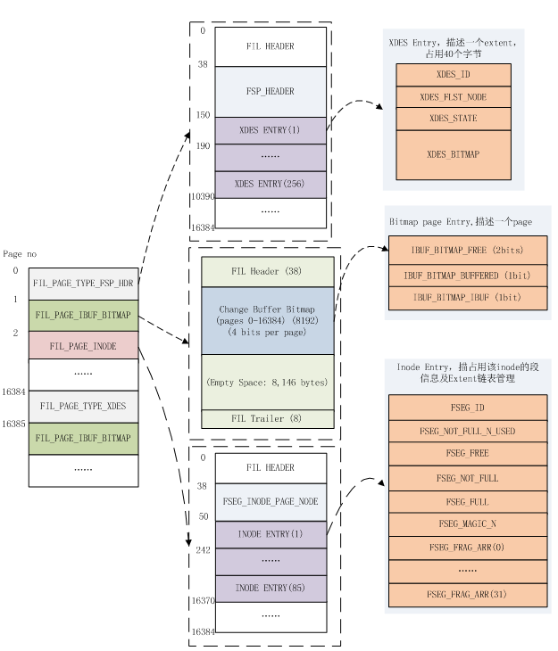

# 零、基本概念

# 一、btr
## 1.btr\_defragment\_add_index

	btr_defragment_add_index
	--btr_pcur_create_for_mysql
	--os_event_create
	--btr_pcur_open_at_index_side
	----btr_pcur_init
	----btr_cur_open_at_index_side_func
	------mtr_set_savepoint
	--btr_pcur_move_to_next
	----btr_pcur_move_to_next_on_page
	------page_cur_move_to_next
	--------page_rec_get_next
	----------page_rec_get_next_low
	------------rec_get_next_offs//?????
	--btr_pcur_store_position
	----dict_index_copy_rec_order_prefix//???????

caller:

	* -btr_gen_defragment_item_for_table
	* -ha_innobase::defragment_table
	* -test_btr_gen_defragment_item_for_table

## 2.btr-defragment-remove-table

## 3.btr-defragment-remove-index

## 4.btr-defragment-remove-item

## 5.btr-defragment-save-defrag-stats-if-needed

	btr_defragment_save_defrag_stats_if_needed
	--dict_stats_defrag_pool_add
	----os_event_set(dict_stats_event)
	------os_cond_broadcast
	
	DECLARE_THREAD(dict_stats_thread) is waiting for the dict_stats_event, learn how to use event.
	        os_event_wait_time(
	            dict_stats_event, MIN_RECALC_INTERVAL * 1000000);  
            
## 6.btr-defragment-calc-n-recs-for-size

	btr_defragment_calc_n_recs_for_size
	--page_cur_set_before_first
	--page_cur_move_to_next
	--page_cur_get_rec
	--rec_get_offsets

caller:

	-btr_defragment_merge_pages

## 7.btr-defragment-merge-pages

	caller:
	btr_defragment_n_pages
	
	btr_defragment_merge_pages
	--page_get_n_recs
	--page_get_data_size//new_data_size -- to_page中占用空间大小（PAGE_HEAP_TOP - PAGE_GARBAGE）
	--page_get_max_insert_size(to_page, n_recs);
	--//max_ins_size, to_page剩余的空间。只计算了dir_slot，最小空间。没有减去PAGE_GARBAGE，因此会稍小一些
	----page_dir_get_n_heap
	----page_dir_calc_reserved_space
	--page_get_max_insert_size_after_reorganize//max_ins_size_reorg, free_space - data_size + n*slot
	--max_ins_size_to_use = max_ins_size_reorg - reserved_space//减去预留空间
	--btr_defragment_calc_n_recs_for_size(from_block, index, max_ins_size_to_use, &move_size)
	--btr_page_reorganize_block
	----btr_page_reorganize_low
	--page_rec_get_nth
	----page_rec_get_nth_const
	------page_dir_get_nth_slot
	------page_dir_slot_get_n_owned
	--------page_dir_slot_get_rec
	--------rec_get_n_owned_new
	--------page_rec_get_next_low
	--page_copy_rec_list_start
	----rec_get_offsets_func
	------rec_offs_set_n_fields
	------rec_init_offsets
	--------rec_init_offsets_comp_ordinary
	----page_cur_insert_rec_low//!!!!!!!!!!!!!!! TBD !!!!!!!!!!!!!!!!!!!!
	------rec_offs_size
	--------rec_offs_data_size 
	--------rec_offs_extra_size
	------page_header_get_ptr
	

	
	
	
	
	

# 二、purge出core的stack

	0-  pthread_kill 
	1-  handle_fatal_signal 
	2-  <signal handler called>
	3-  mach_read_from_2 
	4-  page_dir_slot_get_rec 
	5-  page_cur_search_with_match ()
	6-  btr_cur_search_to_nth_level 
	7-  btr_pcur_open_with_no_init_func
	8-  btr_pcur_restore_position_func 
	9-  row_purge_reposition_pcur
	10- row_purge_remove_clust_if_poss_low 
	11- row_purge_remove_clust_if_poss 
	12- row_purge_del_mark 
	13- row_purge_record_func
	14- row_purge 
	15- row_purge_step
	16- que_thr_step 
	17- que_run_threads_low
	18- que_run_threads
	19- srv_task_execute 
	20- srv_worker_thread 
	21- start_thread 
	22-clone () 
	(gdb)

## 2.1. row_purge_step
	que_thr_step
	--row_purge_step
	----row_purge
	------row_purge_record
	------row_purge_record_func
	--------row_purge_del_mark
	----------row_purge_remove_sec_if_poss//remove sec index first.
	----------row_purge_remove_clust_if_poss
	------------row_purge_remove_clust_if_poss_low
	--------------row_purge_reposition_pcur
	----------------btr_pcur_restore_position_func
	------------------btr_pcur_open_with_no_init_func
	--------------------btr_cur_search_to_nth_level
	----------------------page_cur_search_with_match

