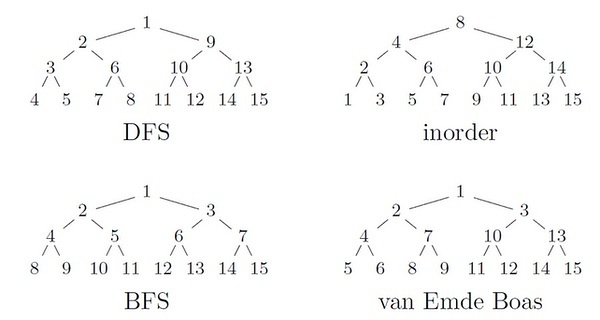

#
OMT：Order Maintenance Tree

#1.OMT概念

OMT：Order Maintenance Tree元素用数组表示，具有父子关系的元素尽量相邻存储，cpu cache line（如果一个节点的周边节点能在文件中紧邻的被存储，当读取其中一个的时候，其他节点被prefetching出来，io数则可以减少。这就是vEB layout）

Fractal-Tree（Buffer-Tree的变种）buffered(4,16)-tree，OMT结构维护结点数据，大小4MB，nonleaf节点OMT结构，leaf节点多个OMT（4MB/64KB)

源码: [https://github.com/shuttler/omt](https://github.com/shuttler/omt)  
  
由tokudb的人提出，全称是Order Maintenance Tree，它有着较好的cpu cache-efficiency，“平衡”性更随意和可控。它的性能也很出色，已超过我以前写的skiplist，且它操作起来很方便，除了支持普通的insert/find/delete外，还支find\_next/find\_previous/range操作,在范围最值查询上很有用途。  
类似Cartesian tree: [http://en.wikipedia.org/wiki/Cartesian_tree](http://en.wikipedia.org/wiki/Cartesian_tree)  
  
整个tree的元素用一个数组表示，使具有父子关系的元素，在数组里尽量相邻存储，尽可能发挥cpu cache line的优势，也就是vEB layout，美帝叫这个为cache oblivious。（其实io-bound的优化也是基于这个小理论)。  

<table><tbody><tr><td></td></tr><tr><td align="center" class="wr pl"></td></tr></tbody></table>

---------------------------------------------------
