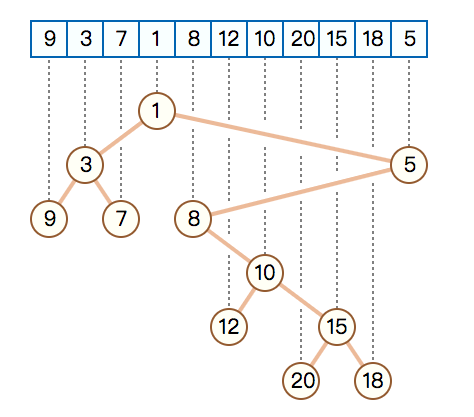

#<center>OMT：Order Maintenance Tree</center>

#1.OMT概念

OMT：Order Maintenance Tree元素用数组表示，具有父子关系的元素尽量相邻存储，cpu cache line（如果一个节点的周边节点能在文件中紧邻的被存储，当读取其中一个的时候，其他节点被prefetching出来，io数则可以减少。这就是vEB layout）

Fractal-Tree（Buffer-Tree的变种）buffered(4,16)-tree，OMT结构维护结点数据，大小4MB，nonleaf节点OMT结构，leaf节点多个OMT（4MB/64KB)

源码: [https://github.com/shuttler/omt](https://github.com/shuttler/omt)  
  
由tokudb的人提出，全称是Order Maintenance Tree，它有着较好的cpu cache-efficiency，“平衡”性更随意和可控。它的性能也很出色，已超过我以前写的skiplist，且它操作起来很方便，除了支持普通的insert/find/delete外，还支find\_next/find\_previous/range操作,在范围最值查询上很有用途。  
类似Cartesian tree: [http://en.wikipedia.org/wiki/Cartesian_tree](http://en.wikipedia.org/wiki/Cartesian_tree)  
  
整个tree的元素用一个数组表示，使具有父子关系的元素，在数组里尽量相邻存储，尽可能发挥cpu cache line的优势，也就是vEB layout，美帝叫这个为cache oblivious。（其实io-bound的优化也是基于这个小理论)。  

<table><tbody><tr><td></td></tr><tr><td align="center" class="wr pl"></td></tr></tbody></table>

---------------------------------------------------
#2. README in github

```cpp
OMT is short for Order Maintenance Tree, which is dreamed up by Tokutek, and used in TokuDB.
It's a weight balanced binary tree, each node maintains the weights of its left and right subtrees.
OMT having better CPU cache efficiency than skiplist (it's very cool as you improve it to vEB layout).

For more details, please see Cartesian Tree: http://en.wikipedia.org/wiki/Cartesian_tree

Insertion as follows:

1) insert 'key-1'

    /*
     *            (key-1)
     */

2) insert 'key-4'

    /*
     *            (key-1)
     *                    \
     *                  (key-4)
     */

3) insert 'key-7'

    /*
     *            (key-1)
     *                    \
     *                  (key-4)
     *                          \
     *                        (key-7)
     */


4) insert 'key-5'

    /*
     *            (key-1)
     *                    \
     *                  (key-4)
     *                          \
     *                        (key-7)
     *                      /
     *                  (key-5)
     */

5) insert 'key-6', the tree need to be rebalanced:

    /*
     *            (key-1)
     *                    \
     *                  (key-4)
     *                          \
     *                        (key-7)
     *                      /
     *                  (key-5)
     *                        \
     *                        (key-6)
     */

After rebalance:
    /*
     *
     *               (key-5)
     *              /       \
     *         (key-4)      (key-7)
     *        /             /     \
     *    (key-1)       (key-6)   (key-71)
     *
     */

6) and we insert 'key-72', 'key-75', it cause a balance:

    /*
     *
     *               (key-5)
     *              /       \
     *         (key-4)      (key-7)
     *        /             /     \
     *    (key-1)       (key-6)   (key-71)
     *                                  \
     *                                  (key-72)
     *                                          \
     *                                          (key-75)
     *
     */

    /***************** after rebalance *********************/

    /*
     *
     *               (key-7)
     *              /       \
     *        (key-5)        (key-72)
     *        /   \          /       \
     *  (key-4)  (key-6)  (key-71)    (key-75)
     *   /
     *(key-1)
     *
     */


By BohuTANG @2013/9/19
```

#3.笛卡尔树（Cartesian Tree）

笛卡尔树是一棵二叉树，树的每个节点有两个值，一个为index，一个为value。光看index的话，笛卡尔树是一棵二叉搜索树，每个节点的左子树的index都比它小，右子树都比它大；光看value的话，笛卡尔树有点类似堆，根节点的value是最小（或者最大）的，每个节点的value都比它的子树要小（或者大）。
　　它可以处理范围最值查询、范围top k查询（range top k queries）等问题。
　　
　　如图就是一棵笛卡尔树（上方表格中每个数的编号为index，数值为value，下方是根据数据生成的笛卡尔树）：
　　
　　直接构造的方法是排序以后再插入，这样就需要O(nlog2n)～O(n2)O(nlog2n)～O(n2)的时间复杂度，而这花费的时间太多，因此我们要寻找一种更加便捷的方式处理：
　　我们注意到这个树C的右链，即根结点、根结点的右儿子、根结点的右儿子的右儿子……组成的链，它们的index和value都是递增的，所以如果插入一个新的数a[i]，比a[i]大的数都不会在右链中，在新树中会出现在a[i]的左子树里。根据这个原理，我们就可以设计一个栈来储存右链，每增加一个数从顶部处理一次即可。


#4.class omt
```cpp
template<typename omtdata_t,
         typename omtdataout_t=omtdata_t,
         bool supports_marks=false>
class omt {
```